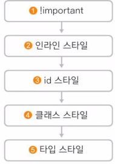
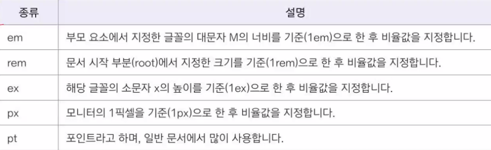

# CSS (Cascading Style Sheet)  
CSS 에서 C는 Cascading.  
스타일 시트에서는, 우선 순위가 위에서 아래로, 즉 계단식으로 적용됨.  

CSS에서는 웹 요소에 둘 이상의 스타일을 적용할 때, 충돌하지 않고 우선순위에 따라 적용할 스타일이 결정됨.  

### 스타일 적용 우선 순위  

ㅤ`사용자 스타일`  
ㅤㅤㅤㅤ↓  
ㅤ`제작자 스타일`  
ㅤㅤㅤㅤ↓  
`브라우저 기본 스타일`  

### 적용 범위에 따른 우선 순위  
적용 우선순위가 같으면, 적용 범위로 따짐.  

  

스타일 적용 범위가 좁을 수록 우선 순위가 높아짐.  
단, `!important`가 가장 높음.  

### 스타일 상속  
포함하는 태그가 부모 요소, 포함된 태그가 자식 요소.  
부모 요소에 스타일을 적용 시키면, 자식 요소에도 동일한 스타일이 적용됨.  
단, `배경색`과 `배경 이미지`는 상속되지 않음.  


# css 스타일의 형식  
기본형  
```
선택자{ 속성1: 속성값1; 속성2: 속성값2;}
```

예시 (`<p>`태그에 스타일 적용하기)  
```
p {
    text-align : center;  /* 주석 */
    color : blue;   /* 주석 */
}
```

https://cssminifier.com -> css 소스 경량화 툴  

스타일 시트 -> 브라우저 기본 스타일   
ㅤㅤㅤㅤㅤㅤ-> 사용자 스타일 ㅤㅤ-> 인라인 스타일  
ㅤㅤㅤㅤㅤㅤㅤㅤㅤㅤㅤㅤㅤㅤㅤㅤㅤ-> 내부 스타일 시트  
ㅤㅤㅤㅤㅤㅤㅤㅤㅤㅤㅤㅤㅤㅤㅤㅤㅤ-> 외부 스타일 시트  

### 인라인 스타일  
style 속성을 태그 내에 넣어 스타일을 적용하는 방식.  

<span style="color:blue">예시</span>
```
<span style="color:blue">예시</span>
```

### 내부 스타일 시트  
html 내에 있는 스타일 시트  
먼저 적용되어야 하기 때문에 `<style>` 태그를 `head`에 적음.  
```
<head>
...
<style>
    *{margin:0;}    /* 여백 없앰 */
    h1{padding:10px; color:#fff;}
</style>
...
```

### 외부 스타일 시트  
별도 css 파일에 있는 스타일 시트  
html에서 link 태그를 통해 css파일을 불러와서 사용함.  
```
<head>
...
<link rel="stylesheet" href="css 파일 경로">
...
</head>
```

---

#### 태그와 요소의 차이점?  
태그(tag)는 <> 태그 자체를 가리킴.  
요소(element)는 태그 포함, 태그를 적용한 것을 가리킴.  

### 선택자  
어느 부분에 스타일을 적용할지 알려주는 것.  

- `전체 선택자` : html 문서 내 모든 요소에 스타일을 적용함.  
    ` * `
- `타입 선택자` : (태그 선택자) 해당 태그를 사용하는 모든 요소에 스타일을 적용함.  
    ```
    예) p, h1, table 등  
    ```
- `클래스 선택자` : 클래스 이름을 통해 특정 부분에만 스타일을 적용함.  
    클래스는 카테고리, 분류 느낌  
    적용하고 싶은 태그 안에 class명을 지정해줌.  
    한 요소에 여러 클래스 스타일을 적용할 수 있음.  
    ```
    .클래스명 { 스타일 규칙 }
    <p class="클래스명"></p>
    ```
- `아이디 선택자` : 아이디를 통해 특정 부분에만 스타일을 적용함.  
    `.` 대신 `#`를 사용한다는 점, 문서에서 `한 번만` 적용할 수 있다는 점 말고는 클래스 선택자와 같음.  
    주로 레이아웃 관련 스타일을 지정하거나, 자바스크립트에서 요소를 구별할 때 사용함.  
    클래스보다 우선 순위가 높음.  
    ```
    #아이디명 { 스타일 규칙 }
    ```
    예시)  
```
    ...
    #container {
        width: 500px;   /* 너비 */
        margin: 10px auto; /* 중앙 배치*/
        border: 1px solid #000; /* 테두리 굵기와 색깔*/
        padding: 10px;  /* 테두리와 내용 사이 여백*/
    }
    ...
    <div id="container">
    ...
    </div>
```

- `그룹 선택자` (`,`)  
여러 선택자에 스타일을 적용할 때 사용  
`,`로 선택자들을 묶어줌.  

---

## 글꼴 관련 스타일  

### `font-family`  
웹 문서에서 사용할 글꼴을 지정하는 속성.  
body 태그를 비롯해 hn, p 태그에 주로 사용.  
원하는 글꼴이 없을 경우를 대비해서 여러 글꼴을 사용하기도 함.  
```
font-family:<글꼴 이름> | [<글꼴이름>, <글꼴이름>]
```

### `font-size`  
글꼴 크기 지정.  
```
font-size: <절대크기> | <상대크기> | <크기> | <백분율>
```
절대크기: 브라우저에서 지정한 크기  
상대크기 : `부모 요소의 글자 크기를 기준`으로 상대적인 글자 크기를 지정  
크기 : 직접 크기를 지정  
백분율 : 부모 요소 글자 크기를 기준으로 백분율로 표시  

- 단위 종류  
  

1em은 16px, 12pt와 같음.  
백분율로 계산하려면, 부모 요소 글꼴 크기가 px로 지정되어 있어야 함.  

### `font-style`  
글자를 `italic`, `oblique`으로 표시할 때 사용하는 속성.  
```
font-style: normal | italic | oblique
```
italic은 글꼴이 처음부터 기울어지게 디자인 되어있음. (주로 사용)  
oblique은 원래 글꼴을 기울어지게 표시함.  

### `font-weight`  
글자 굵기를 지정하는 속성  
```
font-weight : normal | bold | bolder | lighter | 100 | 200 | ... | 800 | 900
```
100 가장 가늘게, 900 가장 굵게  

---

### 웹 폰트  
웹에서 사용하는 폰트.  
웹 문서를 서버에 올릴 때, 웹 폰트 파일을 함께 업로드함.  
사용자가 사이트에 접속하면, 웹 문서와 웹 폰트 파일을 같이 다운로드 되어  
사용자 시스템에 없는 글꼴이더라도 웹 제작자의 의도대로 텍스트가 표시 됨.  

컴퓨터에서는 TTF 사용.  
그러나 TTF는 용량이 커서, 웹에서는 사용하기 적합한 EOT, WOFF같은 파일을 사용함.  

### `@font-face`  
웹 폰트를 `정의`<sup>(지정이 아님)</sup>하는 속성.  
```
@font-face {
    font-family: <글꼴 이름>;
    src: <글꼴 파일> [<글꼴 파일>, <글꼴 파일>, ...];
}
```
```
    @font-face {
      font-family: 'Ostrich';                                       /* 폰트 이름 */
      src: local('Ostrich Sans'),                                   /* 사용자 시스템이 있을 시 다운로드하지 않고 사용 */
            url('fonts/ostrich-sans-bold.woff') format('woff'),     /* 다운로드 */
            url('fonts/ostrich-sans-bold.ttf') format('truetype'),  /* 실패 시 다운로드 */
            url('fonts/ostrich-sans-bold.svg') format('svg');       /* 실패 시 다운로드 */
    }
    #wfont{
        font-family: 'Ostrich`,sans-serif;                          /* 모두 실패 시, sans-serif 글꼴 사용 */
    }
```

### 구글 폰트를 사용하는 방법  
내 서버를 통해 글꼴을 다운로드하도록 하면, 서버에 부하가 올 수 있음.  
구글 링크를 통해 연결하면 이를 해결할 수 있음.  

```
<style>
    @import url('https://fonts.googleapis.com/css2?family=Nanum+Pen+Script&display=swap');

    .nanum-pen-script-regular {
      font-family: "Nanum Pen Script", cursive;
      font-weight: 400;
      font-style: normal;
    }

    h1 {
      font-family: "Nanum Pen Script", cursive;
    }
</style>

...

<h1 class="nanum-pen-script-regular"><h1>
...
```
---

## 텍스트 관련 스타일  

### color 속성  
<span style="color:red">텍스트의</span> <span style="color:green">색상을</span> <span style="color:yellow">바꿈.</span>  
```
color:"색상"

color : #0000ff;         /* 16진수 표기법 */  
color: hsl(0, 100%, 50%);/* hsl 표기법 */  
color : rgba(255, 255, 255, 0.5) /* rgba 표기법 */
color: green;            /* 색상 이름 */  
```
- 16진수로 지정 : #ffffff (RRGGBB 각각 2자리씩)  
    두자리씩 중복이면 한 자리로 줄여서 표기. (#fff)  

- hsl과 hsla로 지정 :  
    `hue(색상)`, `saturation(채도)`, `lightness(명도)`의 줄임말.  
    hsla는 `alpha(불투명도)`를 추가한 것.  

- rgb, rgba로 지정  :
    16진수와 똑같음.  
    a는 불투명도 값을 나타냄. (0~1)  

- 색상 이름으로 지정  

---

### text-align  
문단의 텍스트 정렬 방법을 지정하는 속성  
```
text-align: start | end | left | right | center | justify | match-parent
```

