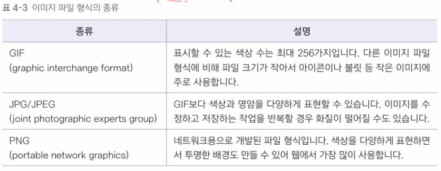
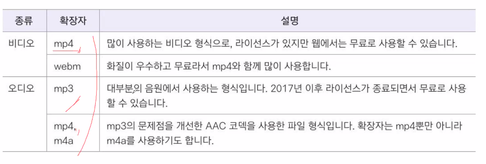

`!` 자동완성 단축키  

---

# `<h1>~<h6>`  
헤드 태그  
큰 글자  

---

# `
`  
문장 적는 태그  
` `로 줄바꿈  
`<b>`로 굵은 글씨 (bold)  
`<i>`로 기울인 글씨 (Italian)  

---

# `<ol>, <li>`  
순서있는 목록(ordered list)  
`<ol></ol>` 안에 `<li>` 태그가 들어감  

`<ol type="I">`  type으로 글머리 기호를 바꿀 수 있음.  
타입 종류 : 1(기본값), I, i, A, a  
start로 글머리 기호 시작값을 정할 수 있음.  

---

# `<ul>`  
순서 없는 목록  
마찬가지로 `<ul>` 안에 `<li>` 태그를 작성  

---

# `<dl>, <dt>, <dd>`  
설명 목록  
`<dl>`(description list) 태그 안에  
`<dt>` 제목, `<dd>` 설명 기입  

---

# `<table> <tr> <td>`  
 표 그리기 태그  
가로 -> 세로 순  
- `<tr>` : 행  
- `<td>` : 셀을 만듦  
- `<th>` : bold 셀 만듦  
- `<caption>` 표 맨 위에 설명  
- `<thead>` `<tbody>` `<tfoot>` 으로 구분 가능  

- `<rowspan>` : 행 합치기. 매개변수 = 합칠 칸 수  
- `<colspan>` : 열 합치기. 매개변수 = 합칠 칸 수  
    둘 다 `<td>` 속성으로 넣음  

- `<col>` `<colgroup>` : 열을 묶어줌.  
    열마다 스타일을 적용할 때 쓰임.  
    colgroup 안에 col이 들어감.
    반드시 `<caption>` 다음에 써야 함.  
    `<col>` 태그는 닫는 태그가 없음.  

---

# ``  
이미지 삽입 태그  
``  
#### 속성
- alt : alternative의 약자. 화면낭독기가 이미지 대신 읽어줄 수 있음.  
- src : 이미지 파일 경로를 기입  
- width, height : 이미지의 크기를 설정.  
    `%`로 비율, `px`로 픽셀로 크기를 설정할 수 있음.  
    둘 중 하나만 설정해도 자동으로 비율을 설정해 줌.  

#### 이미지 파일 종류  
  

---  

# `<object>`  
다양한 멀티미디어 파일을 삽입할 때 사용  
(오디오, 비디오, 자바 애플릿, pdf)  
`<object width="너비" height="높이" data="데이터 팡리 이름"></object>`

# `embed`  
object 태그를 지원하지 않는 브라우저라면 대신 사용하는 태그.  
`<embed src="파일 경로" width="너비" height="높이">`  

#### 지원가능 미디어 파일  
  
webm은 안 되는 브라우저들이 몇개 있음.  

---

# `<audio>, <video>`  
오디오나 비디오를 컨트롤바와 함께 표시.  
`<audio src="오디오 파일 경로" controls width="너비" height="높이"></audio>`  
`<video src="오디오 파일 경로" controls width="너비" height="높이"></video>` 

- 내부 속성 :  
    `controls`, `autoplay`, `muted`, `loop`   
    `preload` : 페이지를 불러올 때 파일을 어떻게 로딩할 것인지 지정.  
        auto, none
    `poster="파일 이름"` : 비디오 썸네일 지정
    controls 적지 않으면 컨트롤바는 표시되지 않음.  