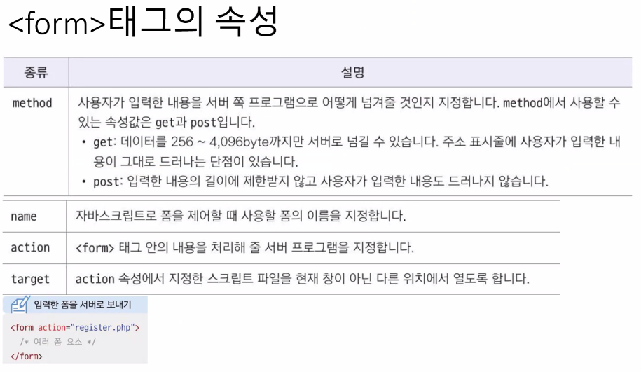
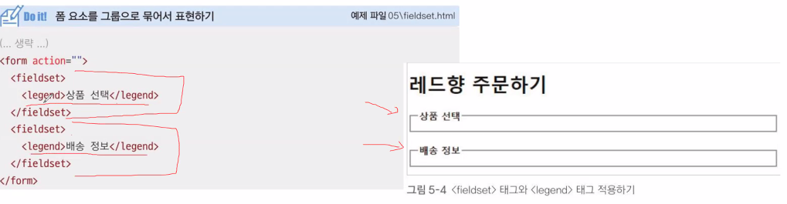
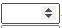
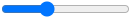
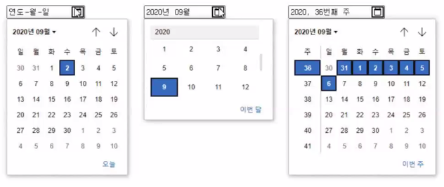
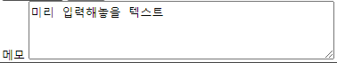
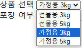
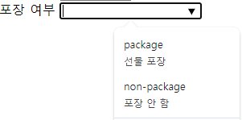
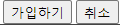

`!` 자동완성 단축키  

---

# `<h1>~<h6>`  
헤드 태그  
큰 글자  

---

# `<p>`  
문장 적는 태그  
`<br>`로 줄바꿈  
`<b>`로 굵은 글씨 (bold) 음성강조`<strong>`  
`<i>`로 기울인 글씨 (Italian) 음성강조`<em>`  

---

# `<ol>, <li>`  
순서있는 목록(ordered list)  
`<ol></ol>` 안에 `<li>` 태그가 들어감  

`<ol type="I">`  type으로 글머리 기호를 바꿀 수 있음.  
타입 종류 : 1(기본값), I, i, A, a  
start로 글머리 기호 시작값을 정할 수 있음.  

---

# `<ul>`  
순서 없는 목록  
마찬가지로 `<ul>` 안에 `<li>` 태그를 작성  

---

# `<dl>, <dt>, <dd>`  
설명 목록  
`<dl>`(description list) 태그 안에  
`<dt>` 제목, `<dd>` 설명 기입  

---

# `<table>`  
 표 그리기 태그  
가로 -> 세로 순  
- `<tr>` : 행  
- `<td>` : 셀을 만듦  
- `<th>` : bold 셀 만듦  
- `<caption>` 표 맨 위에 설명  
- `<thead>` `<tbody>` `<tfoot>` 으로 구분 가능  

- `<rowspan>` : 행 합치기. 매개변수 = 합칠 칸 수  
- `<colspan>` : 열 합치기. 매개변수 = 합칠 칸 수  
    둘 다 `<td>` 속성으로 넣음  

- `<col>` `<colgroup>` : 열을 묶어줌.  
    열마다 스타일을 적용할 때 쓰임.  
    colgroup 안에 col이 들어감.
    반드시 `<caption>` 다음에 써야 함.  
    `<col>` 태그는 닫는 태그가 없음.  

---

# ``  
이미지 삽입 태그  
``  
#### 속성
- alt : alternative의 약자. 화면낭독기가 이미지 대신 읽어줄 수 있음.  
- src : 이미지 파일 경로를 기입  
- width, height : 이미지의 크기를 설정.  
    `%`로 비율, `px`로 픽셀로 크기를 설정할 수 있음.  
    둘 중 하나만 설정해도 자동으로 비율을 설정해 줌.  

#### 이미지 파일 종류  
  

---  

# `<object>`  
다양한 멀티미디어 파일을 삽입할 때 사용  
(오디오, 비디오, 자바 애플릿, pdf)  
`<object width="너비" height="높이" data="데이터 팡리 이름"></object>`

# `embed`  
object 태그를 지원하지 않는 브라우저라면 대신 사용하는 태그.  
`<embed src="파일 경로" width="너비" height="높이">`  

#### 지원가능 미디어 파일  
  
webm은 안 되는 브라우저들이 몇개 있음.  

---

# `<audio>, <video>`  
오디오나 비디오를 컨트롤바와 함께 표시.  
`<audio src="오디오 파일 경로" controls width="너비" height="높이"></audio>`  
`<video src="오디오 파일 경로" controls width="너비" height="높이"></video>` 

- 내부 속성 :  
    `controls` : 재생 컨트롤 바 표시  
    `autoplay`, `muted`, `loop`  
    `preload` : 페이지를 불러올 때 파일을 같이 로드할 것인지 지정.  
        auto(로딩 시 전체 파일 로드), metadata(메타데이터만 로드),  none(로드하지 않음)  
    `poster="파일 이름"` : 비디오 썸네일 지정  
    controls 적지 않으면 컨트롤바는 표시되지 않음.  

# `<a>`  
텍스트나 이미지에 링크를 추가하는 태그(하이퍼링크)  
`<a href="링크 주소">텍스트 or 이미지</a>`  
href에는 연결할 문서, a태그 사이에는 텍스트를 입력  
- 속성 :  
    `target` : 링크를 새 탭에서 열리도록 함.  
    _blank, _parent, _self(default), _top  

# `<form>`  
사용자의 입력을 받는 요소들  
`버튼`, `체크박스`, `입력창`, `drop down 메뉴` 등  

`<form [속성="속성값"]> 여러 폼 요소</form>`  

### 동작방식  
페이지에서 `입력한 정보들`을 `웹서버 데이터베이스`에 일괄적으로 전달.  
`서버`에서 정보들을 확인 후, 결과를 웹 브라우저에 전송.  

속성을 통해, 입력 자료를 `어떤 방식`으로 서버에 넘기고,  
서버에서 `어떤 프로그램`을 통해 `처리`할 지 지정함.

### 속성  
- `method` : 입력값을 서버로 어떻게 넘겨줄 것인지 지정  

    - 속성값 :  
                `get` : 입력 내용이 그대로 드러남. 256 ~ 4,096 byte. 전송 시간이 빠름. (검색내용 등)  
                `post` : 입력 내용이 드러나지 않음. 길이 제한 X. get보다 전송 시간이 느림 (비밀번호, ID 등)  

- `name` : 폼의 이름을 지정.  

- `action` : 내용을 어디로 전송할 지 지정 (내용을 처리해 줄 서버 프로그램 지정).  

- `target` : a의 target처럼, 지정 파일이 어느 위치에서 열릴지 지정.  

- `autocomplete` : 자동완성 기능을 위한 속성. (default : on) 개인정보 입력 칸에는 off로 하는 것이 좋음.  
                

  
  

## `<fieldset>`  
하나의 폼 안에서 여러 구역을 나누어 표시할 때 사용  

### `<legend>`  
fieldset 안에 들어감.  
fieldset으로 묶은 그룹에 제목을 붙일 수 있음.  
구역칸 위에 텍스트가 들어감.  

  

## `<lable>`  
`<input>`태그와 함께, 폼 요소에 레이블(설명)을 넣을 때 사용함.  
입력란 앞에 아이디, 비밀먼호 같이 써 있는게 레이블임.  

- 속성 :  
    `for` : input 태그와 개념적으로 연결해줌.  
    input 태그가 lable 태그 안에 없어도, lable 속성이 적용되도록 함.  
    lable의 `for값`과, input의 `id값`이 같으면 연결 됨.  

## `<input>`  
사용자로부터 입력받을 수 있는 요소를 추가.  
#### 속성 :  
- `type="text"` : 텍스트 입력칸을 추가.  
    `type="password"` : 입력 내용 가려짐.  
    `type="search"` : 오른쪽에 내용을 지우는 X 버튼이 생김.  
    `type="url"` : 웹 주소를 입력하는 필드. 웹 브라우저가 입력값을 url로 인식.  
    `type="email"` : 이메일을 입력하는 필드. 웹 브라우저가 입력값을 이메일로 인식.  
    `type="tel"` : 전화번호를 입력하는 필드. (모바일 페이지에선 이 값을 통해 바로 전화를 걸 수 있음)  

    - `size` : 텍스트 필드의 길이를 지정. (화면에 몇글자가 보이도록 할 건지 지정)  
    - `value` : 텍스트 필드가 어떻게 표시될지 지정.  
    - `maxlength` : 입력할 수 있는 텍스트 필드의 최대 길이 지정.  
    - `placeholder` : 입력칸에 흐린 글씨로 텍스트 표시.  

    ---

- `type="submit"` : 제출 버튼을 추가.  
    `type="reset"` : 입력된 값들 모두 초기화.  
    `type="button"` : 기능 없는 버튼. `onClick 메서드`를 통해 기능 추가.  
    - `value` : 버튼 내에 보여줄 텍스트를 추가.  

    form 태그의 action 속성에서 지정한 프로그램으로 결과 전달.  
    `<button>` 태그로도 가능.  

    ---

- `type="checkbox"` : 두개 이상 선택할 수 있는 버튼  
    `type="radiobox"` : 한 개만 선택할 수 있는 버튼  
    - `value` : 필수. 속성값:영문or숫자. 서버에 전달될 값을 지정.  
    - `checked` : 기본으로 체크해둘 박스를 지정.  
    - `name` : 이름 부여. 폼 요소를 제어할 때 사용.  
    하나의 버튼만 선택할 수 있게 하려면 모든 라디오 버튼이 같은 name을 사용해야 함.  

    ---

- `type="number"` : 숫자를 선택할 수 있는 스핀 박스 생성  
    `type="range"` : 숫자를 선택할 수 있는 슬라이드 막대 생성  
    - `min`, `max` : 최소, 최대값 지정  
    - `step` : 숫자 간격 지정. (기본값 : 1)  
    - `value` : 초기값 지정  

     : number  
     : range  

    ---

- `type="date | month | week"` : 달력을 삽입할 때 사용  
    - `min`, `max` : 날짜나 시간의 최소, 최대값 지정  
    - `step` : 숫자 간격 지정.  
    - `value` : 초기값 지정  
  

---

- `type="time | datetime | datetime-local"` : 시간을 지정할 때 사용  
    time : 시간 지정  
    datetime | datetime-local : 시간 + 날짜 지정  

---

- `type="image" src="파일 경로" alt="대체 텍스트"` : 이미지 파일로 버튼 생성  

- `type="file"` : 파일 등록 버튼 생성  

- `type="hidden" name="이름" value="서버로 넘길 값"` : 화면에서 보이지 않는 폼.  
    사용자가 입력을 마치고 정보를 전송할 때, 같이 전송됨.  
    관리자가 알아야 하는 정보가 입력됨.  

---

input 태그의 주요 속성  

`autofocus` : 페이지를 불러오자마자, 폼에 바로 입력할 수 있도록 포인터 표시.  
`placeholder` : 텍스트 필드에 힌트를 표시.  
`readonly` : 사용자가 입력하지는 못 하는, 읽기 전용 필드 표시.  
`required` : 입력하지 않고 submit 요청 시, 전송을 막고 경고 메세지를 표시. (이 입력란을 작성하세요)  

---

# `<textarea>`  
여러 줄을 입력하는 텍스트 영역 태그  

```
<label for="memo">메모</label>
<textarea id="memo" cols="40" rows="4">미리 입력해놓을 텍스트</textarea>
```
  


#### 속성 :  
- `cols` : 텍스트 영역의 가로 너비를 `문자` 단위로 지정  
- `rows` : 텍스트 영역의 세로 너비를 `줄` 단위로 지정 (지정 숫자보다 줄 개수가 많아지면 스크롤 막대가 생김)  

# `<select>`, `<option>`  
드랍다운 목록 태그  
select 태그로 감싸고, 목록 내용을 option 태그로 작성함  
```
<select>
    <option value="서버에 전달되는 값">표시할 내용</option>
</select>
```
  
#### 속성 :  
- select 속성
    - `size` : 화면에 표시할 드롭다운 항목 개수 지정  
    - `multiple` : 다중 선택 가능 on  
- option 속성  
    - `value` : 항목 선택 시 ,서버로 넘겨줄 값을 지정  
    - `selected` : 기본적으로 선택해서 보여주도록 지정  

---

# `<datalist>`  
드롭다운 텍스트 필드 생성  
값을 직접 입력하지 않고, 미리 만들어놓은 값 중에서 선택할 수 있는 텍스트 필드.  
(email 뒷주소 선택 창 같은 거)  
```
<input type="text" list="데이터 목록 id">
<datalist id="데이터 목록 id">
    <option value="package">선물 포장</option>
    <option value="no_package>포장 안 함</option>
</datalist>
```
  

# `<button>`  
input 태그의 버튼과 비슷함.  
폼을 서버로 전송하거나 리셋하는 버튼을 삽입할 수 있음.  
화면 낭독기로 웹 문서를 읽어줄 때, button이 있다는 것을 알고 정확히 낭독해줌.  
```
<button type="submit">가입하기</button>
<button type="reset">취소</button>
```
  

#### type 속성  
`submit` : 폼을 전송.  
`reset` : 폼에 입력한 내용 초기화.  
`button` : 기능없는 버튼 생성.  

# `<span>`  
아무런 기능도 없는 태그.  
안에 여러 속성을 추가할 수 있음.  
class를 넣어 스타일을 부분적으로 적용할 때 사용.  

# `<sup>`  
글자 위에 작게 주석을 다는 태그  
쓰면<sup>(이렇게)</sup> 됨.  