## 객체의 구성 요소  

### 객체 = 속성(변수) + 기능(메서드) 
- 속성 - 크기, 길이, 높이 색상, 볼륨, 채널 등  
- 기능 - 켜기, 끄기, 볼륨 높이기, 볼륨 낮추기, 채널 변경하기 등  

`객체` - 모든 인스턴스를 대표하는 일반적 용어  
`인스턴스` - 특정 클래스로부터 생성된 객체  

`설계도`-------------------------＞ `제품`  
클래스를 인스턴스화 한 것이 객체(인스턴스)  

클래스가 왜 필요한가? - 객체를 생성하기 위해.  

객체가 왜 필요한가? - 객체를 사용하기 위해.  

객체를 사용한다는 것은? - 객체가 가진 속성과 기능을 사용하려고. (변수와 메서드) 

### 객체의 선언  

클래스명 변수명; // 참조변수 선언  

변수명 = new 클래스명(); // 클래스 객체 생성 수, 주소를 참조변수에 저장  

한 파일에 여러 클래스를 작성할 수 있음  
단, main 메서드가 들어가 있는 클래스가 파일 명으로 되어있어야 실행이 가능함.

예) ExTv.java
```java
class ExTv{ 
    public static void main(String arge[]){
Tv t; // Tv클래스 타입의 참조변수 t 선언
t = new Tv(); // Tv인스턴스 생성 후, Tv의 주소를 t에 저장
    }
}

class Tv {
    //Tv의 속성
    String color; // 색상
    boolean power; // 전원
    int channel; // 채널

    //Tv의 기능(메서드)
    void power() {power = !power;}
    void channelup() {++channel;}
    void channeldown() {--channel;}
}
```
## 객체 배열  
객체배열 == 참조변수 배열  

Tv tv1, tv2, tv3; → Tv[] tvArr = new Tv[3];  

Tv[] tvArr = new Tv[3]; // 길이가 3인 Tv타입의 참조변수 배열 생성  

// 객체를 생성해서 배열에 각 요소 저장  
tvArr[0] = new Tv();


## 선언 위치에 따른 객체 종류

```java
class Card{
    // 클래스 구간
    int iv;
    static int cv;

    void main (String[] args){
    // 메서드 구간
        int lv;
    }
}
```
`iv, cv`는 해당 클래스 내에서만 활성화  
`lv` (local variable) = 메서드 내에서만 사용  

`iv` (Instance Variable) = 클래스의 개별 속성에 사용  
`cv` (Class Variable) = 클래스의 공통 속성에 사용  

// <span style = "color:yellow">  따로 사용하는 이유 </span> :   
공통 속성을 하나 만들어서 그것만 사용하면, 불필요한 메모리를 사용하지 않을 수 있음.   
하나만 수정하면 모든 공통 속성이 수정되기 때문에 수정하기 편함.

```java
class Card {
    //인스턴스 변수
    String kind;
    int number;
    //클래스 변수
    static int width = 100;
    static int height = 250;
}


Card c1 = new Card();
c1.kind = "HEART";
c1.number = 5;

//c1.width = 200;
//c1.height = 300; == 권장하지 않음. iv로 오해할 수 있음.

Card.width = 200;
Card.height = 300; // == 앞에 클래스 이름을 붙임


Card c2 = new Card();
c2.kind = "CLOVER";
c2.number = 7;
// 위에서 너비, 높이를 변경했기 때문에 100,250이 아닌 200,300이 들어가게 됨.
// 
// (위에서 c1.width를 쓰던 Card.width를 쓰던 결과는 같음)
```

## 메서드  
- 문장들을 `작업단위`로 묶어놓은 것.  
(코드중복을 제거할 수 있음)  
- 클래스 안에 있어야 함.  
(함수는 클래스에 독립적)  
- 하나의 메서드는 하나의 기능만 하도록 작성.


#### 메서드 = 선언부 + 구현부  
```
선언부 : 반환타입 메서드이름 (타입 변수명, 타입변수명, ...) 0개~n개  
```
```
구현부 : 메서드 호출 시 수행될 코드  
```
메서드의 출력값은 0개~ 1개  
여러 개의 값을 출력하려면 `배열` 또는 `객체`를 사용하여 출력.  
반환할 것이 없을 때는 반환 타입에 `void`.  

지역변수 (lv) 는 `다른 메서드 내에 변수`와 <span style = "color:pink">같은</span> 이름을 사용해도 겹치지 않음.  
적용 범위가 <span style = "color:lightgreen">해당 메서드 영역</span>까지이기 때문.  

### 메서드의 호출   

    메서드이름 (값1, 값2, ...);
#### ex)
#### print99danAll();    // void print99danALl()을 호출  
#### int result = add(3,5);  // int add(int x, int y)를 호출하고, 결과를 result에 저장  

- 클래스와 메서드 메모리 구조  

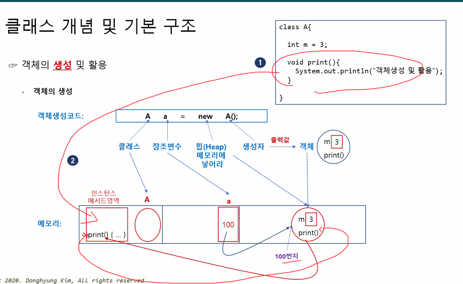

---
### return문, 반환값  

`메서드의 끝`에는 항상 return문이 존재해야 함  
(반환값이 없는 void 타입일 경우엔 없어도 됨)  


>모든 경우에 return이 있어야 함.  


    if (a>b){
    return a;
    }
a<b 일 경우엔 return문이 없으므로 에러 발생  

---

### 호출 스택 (call stack)  
Heap 메모리    
- 스택 : LIFO  

호출스택이란 스택에 호출하여 작업하는 공간 (메모리)

---
# 매개변수  
- 메서드나 함수를 정의할 때, 괄호 안에 위치하는 것.  

매서드나 함수에 전달되는 값을 저장하는 변수를 말함.  

```java
public class Calculator {
    ///int a, int b가 "매개변수"이다.
    public static int add(int a, int b) {
        return a + b;
    }

    public static void main(String[] args) {
        int result = add(5, 3); // 메서드 호출 시 5와 3을 매개변수로 전달
        System.out.println(result); // 출력 결과: 8
    }
}
``` 
C언어에서는 `인자`라고 함.  
```C
#include <stdio.h>
/// int a, int b가 "인자"이다.
int add(int a, int b) {
    return a + b;
}

int main() {
    int result = add(5, 3); // 함수 호출 시 5와 3을 인자로 전달
    printf("%d\n", result); // 출력 결과: 8

    return 0;
}
```
---

### `기본형 매개변수`  
읽기만 가능. 수정 불가.  
단순한 값을 전달하는 데에 사용.  
값 자체를 복사하기 때문에  
크기가 큰 데이터 구조의 경우엔 비효율적.  
- 예시

  
```java
public class ExamplePrimitive {
    public static void main(String[] args) {
        int number = 10;
        System.out.println("Before: " + number);
        change(number);
        System.out.println("After: " + number);
    }
                            // int x가 기본형 매개변수
    public static void change(int x) {
        x = 1000;
        System.out.println("Inside method: " + x);
    }
}

```
    출력 결과 :  
    Before: 10  
    Inside method: 1000  
    After: 10
```
change 메서드 내 지역변수 x의 값을 1000으로 바꾸었음.  
그러나 원래 number 값(10)이 바뀌진 않음.
change 메서드가 끝나고 호출스택에서 사라지고, 지역변수 x (1000)도 같이 사라짐   
```
---
### `참조형 매개변수  `
읽기, 수정 가능.  
객체의 주소를 전달하는 데에 사용.  
메모리 효율 향상  

예시  

```java
import java.util.Arrays;

public class ExampleReference {
    public static void main(String[] args) {
        int[] array = {1, 2, 3};
        System.out.println("Before: " + Arrays.toString(array));
        change(array);
        System.out.println("After: " + Arrays.toString(array));
    }
                            // 'int[] arr' 이 참조형 매개변수
    public static void change(int[] arr) {
        for (int i = 0; i < arr.length; i++) {
            arr[i] = arr[i] * 2;
        }
        System.out.println("Inside method: " + Arrays.toString(arr));
    }
}
```  
출력값  

    Before: [1, 2, 3]
    Inside method: [2, 4, 6]
    After: [2, 4, 6]

    참조형 매개변수 `arr`에 array의 주소를 저장.  
    (값을 복사해오는 것이 아님)  
    같은 곳 ([1, 2, 3]) 을 가리키고 있으므로  
    수정을 할 경우 내용이 반영 됨.  

## 가변 길이 매개변수  
`...`  
개수와 상관없이 입력받은 매개변수 개수만큼 배열을 생성하여 사용함.  
```
type methodName (type...var){//method;}
```

- ex)  
```java
public static void method (int... value){
    System.out.println("매개변수 길이: " + value.length);
		/*
		 * 배열 출력 방법 1 
		 * for(int i=0; i<values.length;i++) {
		 * 	System.out.print(values[i]);
		 * }
		 */
		// 배열 출력 방법 2
		for(String k: values) {
			System.out.print(k + " ");
		}
		/* 배열 출력 방법 3
		System.out.print(Arrays.toString(values));
		*/
}
```

## 참조형 반환타입  

반환타입이 참조형일 경우에는,  
값을 반환하지 않고 `주소`를 반환한다.  

```java
import java.util.Arrays;

public class Exreturn {
    public static void main(String[] args) {
        int[] array = {1, 2, 3};
        int[] array2 = new int[3];
        System.out.println("array: " + Arrays.toString(array));
        array2 = copy(array);
        System.out.println("array2: " + Arrays.toString(array));
    }

            //int[]가 참조형 반환타입. 'int[] arr' 이 참조형 매개변수.
    public static int[] copy(int[] arr) {
        int [] tmp = new int[arr.length];
        for(int i = 0; i < arr.length; i++){
            tmp[i] = arr[i];
        }
        System.out.println("tmp: " + Arrays.toString(tmp));
        return tmp;
    }
}
```  
출력값:  

    array: [1, 2, 3]
    tmp: [1, 2, 3]
    array2: [1, 2 ,3]

copy 메서드의 매개변수인 `arr`에 `array`를 대입.  
tmp의 주소를 반환.  
그 주소를 array2에 대입.  

---

# 인스턴스 메서드와 static 메서드  

`인스턴스 멤버` = `iv`(인스턴스 변수), `im`(인스턴스 메서드)  
`객체` = 인스턴스 변수들의 묶음  
`메서드` = 명령문들의 묶음


#### 인스턴스 메서드  
iv(인스턴스 변수) 사용.  
객체가 선언되어야 사용할 수 있음.  
인스턴스, static 변수/메서드 사용 가능.


#### static 메서드  
iv(인스턴스 변수)를 호출할 수 없음.  
언제나 사용 가능.  
인스턴스 멤버 사용 불가.  
`↑ why? static 메서드에 인스턴트 변수가 없을 수도 있기 때문.`  
(static 메서드는 객체가 없어도 사용 가능.)  

디자인 패턴 중 하나인 `싱글톤 패턴`과 관련됨.  


#### static 사용 시기  
static 변수 - 객체의 `공통 속성`을 선언할 때.  
static 메서드 - 인스턴스 변수를 `사용하지 않는` 명령문을 작성할 때.  


# 오버로딩  
> 매개변수를 달리 하여 `같은 이름의 메서드`에 `다른 기능`을 하게 하는 것. (new)  


- 오버로딩의 조건  

    1. 메서드의 이름이 같아야 한다.  
    2. 매개변수의 개수 또는 타입이 달라야 한다.  
    3. 반환타입은 관계 없다.  

조건이 맞지 않을 경우엔,  오버로딩이 아니게 되거나
중복선언이 되어 에러가 뜸.  

매개변수를 두 메서드에 사용가능할 경우, ambiguous 에러가 뜸.  (모호한)  
컴퓨터가 어떤 메서드를 사용해야 할지 판단할 수 없기 때문.  

컴파일러는 `메서드 시그니처`를 통해 메서드를 구분함.  
`메서드 시그니처` - `메서드 명`, `매개변수`의 `타입`과 `개수`  
메서드 명이 같아도 매개변수가 다르면 `다른 메서드`로 인식함.  

※ 내부적으론 별개의 메서드임!!

- 오버로딩의 대표적인 예) println  
  
매개변수에 따라 다른 기능을 함.  
(문자 출력, 문자열 출력, int 출력...)  

---

# 오버라이딩  
> 부모 클래스로부터 상속받은 `인스턴스 메서드`를 자녀 클래스에서 재정의하는 것. (change)  

- 오버라이딩의 조건  
    1. 메서드의 선언부가 같아야 한다. (이름, 매개변수, 반환타입)  
    2. 부모의 메서드보다 더 좁은 접근제어자로 바꿀 수 없다.  // (접근제어자: public, private, protected, default)  
    3. 예외의 갯수가 부모 클래스의 메서드에 선언된 예외보다 많을 수 없다.  

필드, static 멤버(필드/메서드)는 override 되지 않음.  
각자 갖게 됨!!
 
 ```java
 class Parent {
    int x, y;
    void add (){
        return "x =" + x + ", y = " + y;
    }
    class Child extends Parent {
        int z;
        @Override
        void add(){             // 오버라이딩.
        return "x =" + x + ", y = " + y + ", z = " + z;
        }
    }
    Child c = new Child(3, 4, 5);
    System.out.println(c);
 }
 
 ```
 
- 부모 타입 참조변수를 자녀 타입 클래스로 다운캐스팅하면  
`필드`는 <span style = "color:lightblue">부모 타입 클래스의 필드</span>가 호출되지만  
`오버라이드 된 메서드`는 <span style = "color:red">오버라이드 된 자녀 메서드</span>가 호출됨.  
메서드는 `Heap 메모리`가 아닌 `instance 영역`에 있는데, 메서드가 덮어씌워져 있기 때문.  

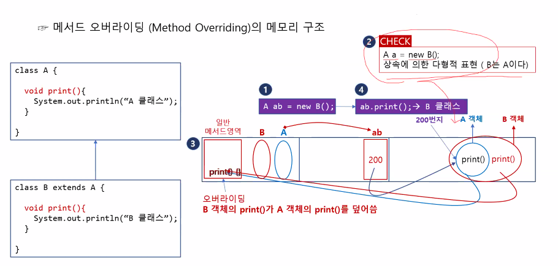  

```java
package MethodOverriding_1;

class A {
	void print() {
		System.out.println("A 클래스");
	}
}
class B extends A {
	@Override
	void print() {
		System.out.println("B 클래스");
	}
}
public class MethodOverriding_1 {
	public static void main(String[] args) {
		// A타입 / A 생성자
		A aa = new A();
		aa.print();     // → "A 클래스"
		
		// B 타입 / B 생성자
		B bb = new B();
		bb.print();     // → "B 클래스"
		
		// A 타입 / B 생성자
		A ab = new B();
		ab.print();     // → "B 클래스"
	}

}
```
- 객체 배열
```java
class Animal {
	void cry() {}
}
class Bird extends Animal {
	@Override
	void cry() {
		System.out.println("짹짹");
	}
}
class Cat extends Animal{
	@Override
	void cry() {
		System.out.println("야옹");
	}
}
class Dog extends Animal {
	@Override
	void cry() {
		System.out.println("멍멍");
	}
}
public class MethodOverriding_2 {
	public static void main(String[] args) {
		// 배열로 관리
		Animal[] animals = {new Bird(), new Cat(), new Dog()};
		for(Animal a : animals) a.cry();
	}
}
/* → 짹짹
     야옹
     멍멍
*/
```
```java
for(int i=0; i<group.length();i++){
    group[i].메서드();  //해당 위치 객체의 메서드를 실행
}
```

# 생성자(constructor)  

>인스턴스가 생성될 때마다 `인스턴스 변수`를 `초기화`해주는 `메서드`  
즉, 생성자의 `주요 역할`은 `객체 생성` 및 `필드 초기화`.  

- 모든 클래스는 <span style = "color:red">반드시</span> 생성자를 가져야 함.
- 생성자의 이름은 클래스 이름과 <span style = "color:lightblue">동일</span>해야 함.  
- 리턴값이 <span style = "color:red">없음</span>.(void 붙이지 않음)  

>
    클래스 이름(타입 변수명, 타입 변수명, ...) {
        // 인스턴스 생성시 수행할 문장  
        // 주로 인스턴스 변수(iv) 초기화 문장을 적음.
    }

---
### 기본 생성자(default constructor)
> 매개변수가 없는 생성자  

- `생성자가 하나도 없을 때만` 컴파일러가 자동으로 추가해줌.  
기본 생성자가 없으면 <span style = "color:red">컴파일 에러</span>  

웬만하면 클래스에 기본 생성자를 넣는 습관을 들이는게 좋음.  


>
    클래스 이름() {} // 기본 생성자

    Point() {} // Point클래스의 기본 생성자

---

### 매개변수가 있는 생성자  

사용하는 이유 :  
> 다른 사람이 내 코드를 사용할 때, 사용하기 간편하게 하기 위해.  
미리 초기화를 시켜두어 객체 생성이 간편함.  

```java
class Human{
    int age;    //나이
    String id;  //아이디
    long weight;//몸무게

    Human() {}  // 기본 생성자
    Human(String i, int a, long w){ // 매개변수가 있는 생성자
        id = i;
        age = a;
        weight = w;
    }
}
Human hoyoung = new Human ("youngpanda", 25, 74);

// 매개변수가 있는 생성자를 사용하지 않을 경우

// Human hoyoung = new Human(); //Human 타입 hoyoung 객체를 생성
// hoyoung.age = 25;            // hoyoung의 age 변수를 초기화
// hoyoung.id = "youngpanda";   // id 변수 초기화
// hoyoung.weight = 74;         // weight 변수 초기화
```

## 생성자 `this()`와 참조변수 `this`  
### 생성자 this()  
> `생성자`에서 같은 클래스 내 있는 다른 생성자를 `호출`할 때 사용  

같은 작업을 여러번 쓰는 것보다 서로 호출하는 것이 효율적임.  
`매개변수가 있는 생성자`이지만, 이름이 `this`임.  
다른 생성자 호출 시 `첫 줄`에서만 사용 가능.  

```java
class Human{
    int age;    //나이
    String id;  //아이디
    long weight;//몸무게

    Human() {}  // 기본 생성자

    Human() {
        this(25, "youngpanda", 74); //생성자 this()로 아래에 있는 생성자를 호출.
    }

    Human(String id, int age, long weight){ // 매개변수가 있는 생성자.
        this.age = age;     //참조변수 this로 "iv인 this.id"와 "lv인 id"를 구별해줌.
        this.id = id;
        this.weight = weight;
    }
}
```


---
### 참조변수 this  
> 인스턴스 자신을 가리키는 참조변수  
인스턴스 메서드 속에 지역변수로 숨겨져 있음.(웬만한 변수 앞에 숨겨져 있음 `this.변수`)  

iv(인스턴스 변수)와 lv(지역 변수)를 구분하기 위해 사용함.  
인스턴스 메서드, 생성자에 사용 가능.  
static 메서드에 사용 불가. (객체가 없어도 되기 때문)  


# 변수의 초기화  

iv, cv는 자동 초기화 (0, null, false 등등)  
lv는 수동으로 초기화. (메서드는 호출stack, 메모리에 상주하는 시간이 짧기 때문에  
일일이 0으로 자동 초기화 시켜주기엔 성능 저하 문제가 있음.)  

`자동 초기화`  
>변수가 선언됨과 동시에 자동으로 초기화 됨.  
0, null, false  

`명시적 초기화`(간단 초기화)  
> = 대입 연산자를 통해 값을 초기화.  

iv의 초기화 : int a = 10;  
cv의 초기화 : Human hoyoung = new Human();  
참조변수 hoyoung에 객체 주소를 넣어 초기화.  

`복잡 초기화`  
> `초기화 블럭` or `생성자`를 통해 초기화.  

초기화 블럭 :  
iv : { }            // 잘 사용하지 않음  
cv : static { }  

주로 iv는 생성자로, cv는 초기화 블럭 (static{}) 으로 초기화 한다.  

#### 초기화 순서  
1. cv → lv  
2. `자동 초기화`(0,null) → `명시적 초기화`(=) → `복잡 초기화`(생성자 or 초기화블럭)  


# 상속  
### 기존의 클래스를 이용해 새로운 클래스를 만드는 것  
> 두 클래스를 부모와 자녀 관계로 맺어줌  

    class 자녀 extends 부모{ }

```java
class Parent{ 
    int HairLoss;
}
class Child extends Parent{
    // int HairLoss; 를 상속받음.
}
```
- `자녀`는 `조상`(최상위 부모)의 모든 `멤버`를 상속받음.  
(조상의 `생성자`,`초기화 블럭`은 상속받지 않음.)  

- `자녀`의 변경은 `조상`에게 영향을 주지 않음.  
반대로 `조상`의 변경은 `자녀`에게 영향을 줌.  

- `자녀`의 멤버 수는 `조상`보다 적을 수 없음. (많거나 같음) (상속을 받기 때문)  

- 메모리 구조  

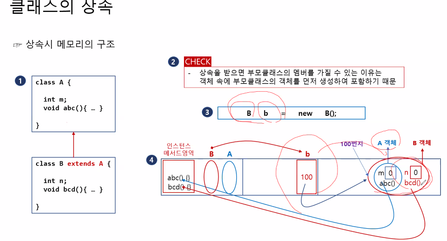  

- `생성자`가 `상속`이 된다면??  
만약 된다 하더라도 `부모의 생성자 이름`과 `자녀의 생성자 이름`이 달라 오류 발생.  
그러나 `super()`로 부모 생성자 호출 가능.  

- 다형적 표현  

  

### instanceof 함수  
(boolean) `참조변수` `instanceof` `type` : 대상이 해당 type에 속해 있는지 확인 후 true or false 반환.  

instanceof를 통해 다운캐스팅 가능 여부를 확인함.  
-> 예외발생 예방.  

```java
A a = new B();
if(a instanceof B){ // true
    B b = (B)a;
} else {System.out.println("a cannot be converted to B.")}

A a = new (A);
if(a instanceof B){ // false
    B b = (B)a;
}else{System.out.println("a cannot be converted to B.")}
```


# 포함  

### 클래스 내에 다른 클래스를 `넣어` 포함시키는 것.  

`클래스` 내에 `다른 클래스 타입의 객체`를 선언해 포함시킨다.

```java
class Point {  //포함되는 클래스
    int x;
    int y;
}

class Circle {
    Point p = new Point();  // Point 타입의 p 객체를 생성함.
    int r;
}

```
> Circle 클래스 안에 Point를 포함시킴.  

---   

## 단일 상속  
> 하나의 조상만을 상속할 수 있음.  

Java는 단일상속만 허용. C++은 다중상속 허용.  
다중상속은 충돌이 일어날 수 있음.(동일한 멤버가 있을 시에 어떤 클래스에서 정할 수 없어서 충돌이 일어남)  

Java에서 다중상속 효과를 내는 법!  
`Interface` 사용 또는  
비중이 높은 클래스를 상속시키고, 다른 클래스는 포함시키는 것.  

---

# Object 클래스  
> 모든 클래스의 조상  
 부모가 없는 클래스는 자동으로 Object 클래스를 상속받음.  

extends Object  

11개의 메서드로 이루어짐.  toString(), equals(Object obj), hashCode(), ...  

- `.println()` : toString 메서드를 호출하고 출력.  
객체를 호출하면 `package명.class명.hashcode(16진수)`로 출력됨.  

- `.hashCode()` : 객체의 hashcode를 10진수로 반환.  

- `.toString()` - 자신을 String타입으로 반환.  
보통 객체 내 필드를 출력하는 메서드로 `Override`하여 씀.  

- boolean `.equals` - `==`와 같음. stack에 있는 데이터(번지수)를 비교.  
객체 내 필드값이 같으면 true를 반환하도록 `Override` 하기도 함.  

```java
// toString Override
package ObjectMethod_toString;
class A{	// extends Object (컴파일러가 자동으로 추가)
	int a = 3;
	int b = 4;
}
class B {
	int a = 3;
	int b= 4;
	@Override
	public String toString() {
		return "필드값(a,b) = " + this.a + " " + this.b;
	}
}
public class ObjectMethod_toString {
	public static void main(String[] args) {
		A a = new A();
		B b = new B();
		
		System.out.printf("%x\n", a.hashCode());	// hashcode를 16진수로 출력
		System.out.println(a.toString());		// toString()생략 시 자동으로 추가
		System.out.println(a);		//a.toString() 이 자동실행
		System.out.println(b);		//b.toString() 이 자동실행
	}
}
```
```java
// equals Override
package ObjectMethod_equals;

class A{
	String name;
	A(){}
	A(String name){
		this.name = name;
	}
}
class B {
	String name;
	B(){}
	B(String name){
		this.name = name;
	}
	@Override
	public boolean equals(Object obj) {
		if(this.name == ((B)obj).name) {    // obj를 B로 하위형변환 (downcasting)
			return true;
		}else return false;
	}
}
public class ObjectMethod_equals {
	public static void main(String[] args) {
		A a1 = new A("안녕");
		A a2 = new A("안녕");
		System.out.println(a1 == a2);	    //false
		System.out.println(a1.equals(a2));  //false
		
		B b1 = new B("안녕");
		B b2 = new B("안녕");
		System.out.println(b1.equals(b2));  //true 
        //Overridden
		System.out.println(b1==b2);         //false
	}
}
/*
@Override
public boolean equals(Object o) 
{
    if (o instanceof Person) 
    {
      Person c = (Person) o;
      if ( this.FIELD.equals(c.FIELD) ) //whatever here
         return true;
    }
    return false;
}
public boolean equals(Object o){
    (o instanceof A) ? return this.data == ((A)obj).data;
}
*/
```


# 참조변수 super  
> 부모 객체를 가리키는 참조 변수.  
자식 클래스 내에서 `조상멤버`와 `자식멤버`를 구별하는 데에 사용.  

this와 비슷함  
객체가 없으면 사용할 수 없음.

조상멤버 : super.x  
자식멤버 : this.x  

# 생성자 super()  
> 자식 클래스 내에서 `조상의 생성자`를 호출하여 `조상의 멤버`를 초기화 함.  

반드시 자식 클래스의 <span style = "color:yellow">생성자 첫 줄에 호출해야 함!!</span>  
호출하지 않으면 컴파일러가 자동으로 첫 줄에 추가함.  
자녀 클래스의 `모든 생성자`에 추가됨.

```java
 class Parent { // extends Object
    int x, y;
    Parent(){                       // 기본 생성자
        // super();                 //Object의 멤버를 초기화 (자동추가)
        }                  
        Parent(int x, int y){       // 생성자
            // super();             //Object의 멤버를 초기화 (자동추가)
        this.x = x;
        this.y = y;
    }
 }
    class Child extends Parent {
        int z;
        Child(){
            //super();              // 컴파일러가 자동으로 추가
        }                           // 기본 생성자
        Child(int x, int y, int z){ // 생성자
            //super();              // 컴파일러가 자동으로 추가
            super(x, y);            // Parent의 생성자를 호출
            this.z = z;
        }
    }
```

# 패키지 (Package)  
> 클래스가 속한 폴더  

상위폴더.하위폴더.클래스

    패키지 dog 폴더
            ↓
          poodle 폴더
            ↓
            Haroo 클래스
            // dog.poodle.Haroo

# Import문  
> 클래스를 사용할 때, 패키지 이름을 생략할 수 있게 해줌  

```java
class Test{     //import 하기 전
    dog.poodle.Haroo myDog = new dog.poodle.Haroo();
}

import dog.poodle.Haroo;    // import문
class Test{                 
    Haroo myDog = new Haroo();  // 패키지를 적지 않아도 됨.
}
```

- java.lang 패키지는 import하지 않아도 사용가능.  

`*` : 패키지 내 모든 클래스 적용  

선언 위치: 패키지 문 아래, 클래스 위에 선언.  

import문은 컴파일 시에 처리되므로 성능에 거의 영향을 미치지 않음.  

`다른 패키지`, `같은 이름인 클래스`는 `패키지명`을 적어야 구별가능!!`  

# static import문  

> static 멤버 사용 시 "클래스 이름"을 생략할 수 있게 해줌.  
(코드를 간략하게!)  

    import java.lang.Integer.*;     //Integer 클래스의 모든 static 메서드를 import.
    import java.lang.Math.random;   //Math.random 클래스를 import. () 안 붙임!!
    import java.lang.System.out;    //System.out을 out 만으로 참조가능.


```java
import java.lang.Math.*;
import java.lang.System.out; 
class Test {
    public static void main(Strings[] args) {
        //System.out.println(Math.random());
        out.println(random());

        //System.out.println("Math.PI :" + Math.PI);
        out.println("Math.PI :" + PI);
    }
}
```


# 제어자 (Modifier)  
> 클래스, 클래스 멤버에 부가적인 의미를 부여.  (형용사 느낌)  
하나의 대상에 여러 제어자 사용 가능. (접근 제어자는 하나만)

- 종류  
`접근 제어자` : private, public, (default), protected  
`그 외`: `static, final, abstract`, native, transient, synchronized, volatile, strictfp  

---

### `접근 제어자`  
- `private`: 같은 `클래스` 내에서만 접근가능.
- `(default)`: 같은 `패키지` 내에서만 접근가능.  
- `protected`: 같은 `패키지`, 다른 클래스의 `자녀` 클래스에서 접근 가능.  
- `public`: 접근제한 X.  

`클래스` : `public`, `(default)`만 사용 가능.  
`멤버` : `모두 사용 가능`.

private < default < protected < public  

---

### `static` (고정된, 클래스의, 공통적인)  

- 멤버변수, 메서드에 사용 가능.  

---

### `final` (마지막의, 변경될 수 없는)  


- `클래스` : `변경`, `확장(extend)`될 수 없는 클래스가 된다.  (부모가 될 수 없음)  
- `메서드` : `변경`될 수없는 메서드가 된다. `오버라이딩 불가능`  
- `멤버변수, 지역변수`: 값을 변경할 수 없는 `상수`가 된다. 

한 번 변경된 값이 최종 값이 됨.  
선언과 동시에 초기화 해도 되고,  
선언만 한 뒤에 생성자에서 초기화 해도 됨.  

- 메모리 구조 : 객체 생성 시에 class 메모리의 상수(final)영역에 복사됨.  
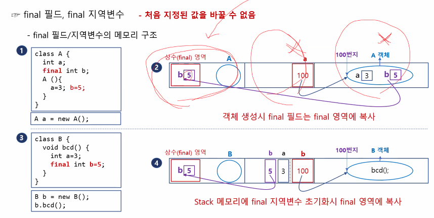
---

### `abstract` (추상의, 미완성의)  
- `클래스` : 클래스 내에 추상 메서드가 있음을 알림. (`추상 클래스, 미완성 클래스`)  
- `메서드` : 구현부가 없는 메서드. `선언부 O, 구현부 X.` (`추상 메서드, 미완성 메서드`)  
  
  
추상 클래스는 `객체 생성 불가`.  

상속을 통해 완성을 해야 객체를 생성할 수 있음.  

>추상 클래스(미완성) ↔ 구상 클래스(완성)  

- 여러 클래스를 만들 때  
추상 클래스에 공통 부분을 작성하여  
코드를 간결하게 할 수 있음  

- 추상 클래스 타입 배열에 여러 (자손) 객체를  넣을 수 있음  

- 추상 메서드는 중괄호 {}가 없음. 그래서 세미콜론;을 써줘야함.  
```java
abstract class Animal {
    abstract void cry();
}
class Cat extends Animal{
    void cry(){System.out.println("야옹");}
}
```

---

# 캡슐화  

> 외부로부터의 접근을 제한하기 위해 `접근 제어자`를 사용하는 것.  

 보호해야하는 데이터는 `메서드`를 통해 간접적으로만 접근할 수 있도록 함.  

 내부적으로만 사용되는 부분을 감추는 용도로도 사용함.  


 # 다형성  

 > `조상 타입` 참조변수로 `자손 타입` 객체를 다루는 것.  

<span style = "color:yellow"> 타입 불일치 허용</span>   

    자손 참조변수 → 자손 객체
    //모든 기능 사용 가능

    조상 참조변수 → 자손 객체
    //조상 클래스 내 기능만 사용 가능

    자손 참조변수 → 조상 객체
    //사용 불가. 
    //존재하지 않는 기능을 호출하게 되기 때문에 오류 발생.
 

조상 타입 참조변수로 자손 타입 클래스를 가리킬 수 있음 (다형성)  

```java
class A {
	void print() {
		System.out.println("A 클래스");
	}
}
class B extends A {
	@Override
	void print() {
		System.out.println("B 클래스");
	}
}
public class MethodOverriding_1 {
	public static void main(String[] args) {
		// A타입 / A 생성자
		A aa = new A();
		aa.print();     // → "A 클래스"
		
		// B 타입 / B 생성자
		B bb = new B();
		bb.print();     // → "B 클래스"
		
		// A 타입 / B 생성자
		A ab = new B();
		ab.print();     // → "B 클래스"
	}

}
```
- iv는 타입을 따라감.  
- im은 생성자를 따라감.  
- static 멤버(필드, 메서드)는 타입을 따라감.  

## Interface
> 추상 메서드의 집합  

- Interface 내에 있는 <span style = "color:yellow">메서드</span>는 모두 `public abstract`.   
생략 시 자동으로 추가.  
(`디폴트 메서드`는 `public default` 으로 정의)  

- Interface 내에 있는 <span style = "color:yellow">필드</span>는 `public static final`로 정의.  
생략 시 자동으로 추가.


- `Interface의 조상`은 <span style = "color:yellow">Interface</span> 만 가능함. `Object`는 조상이 될 수 없음.  

- `다중 상속 가능`. 이유: 추상 메서드는 몸통이 없기 때문에 충돌하지 않음.  

- Interface의 구현(상속)은 `implements`를 사용.  
<span style = "color:red">정의된 모든 추상 메서드를 구현해야 함.</span>  
추상 클래스 구현과 똑같음.  
일부만 구현할 경우에는 클래스 앞에 `abstract`를 붙임.  

- 상속과 구현 같이 가능.  
그러나 반드시 `extends` 다음에 `implements`를 해야 함.  

- Interface 내에 있는 메서드만 사용 가능.  
Interface 메서드의 인자(매개변수)가 참조변수인 경우엔, Interface를 구현한 클래스의 인스턴스만 사용 가능.  


- Interface의 메서드 반환 타입이 interface인 경우: Interface를 구현한 클래스의 인스턴스`(Interface 완성한 놈)`를 반환.  

- `Interface의 장점` :  
    1. `코드 변경이 쉬움` : A 클래스가 B 클래스에 의존하는 경우, B 클래스가 아닌 다른 클래스를 사용하려 한다면 A 클래스의 내용도 바뀌어야 함.
    하지만 Interface를 사용한다면 다른 클래스를 사용하게 되더라도 A 클래스의 내용을 바꾸지 않아도 됨.  

    2. `개발 시간이 단축 됨` : A를 만들으려면 B가 완성되기 전까지 기다려야 하지만, Interface를 사용한다면 껍데기(Interface)를 사용해 A를 먼저 만들 수 있음.  

    3. `관계없는 클래스들을 묶을 수 있음` : 같은 하나의 Interface를 구현하게 하여 공통점을 만들 수 있음.  

    4. `프로그램 설계 및 병행 작업 시에 오류를 줄일 수 있음.` : 팀장이 interface를 만들어 지시를 내리면, 메서드 명이 정해져 있기 때문에 팀원들은 이를 통해 실수를 줄일 수 있음.  

- 인터페이스를 사용하지 않는 경우  
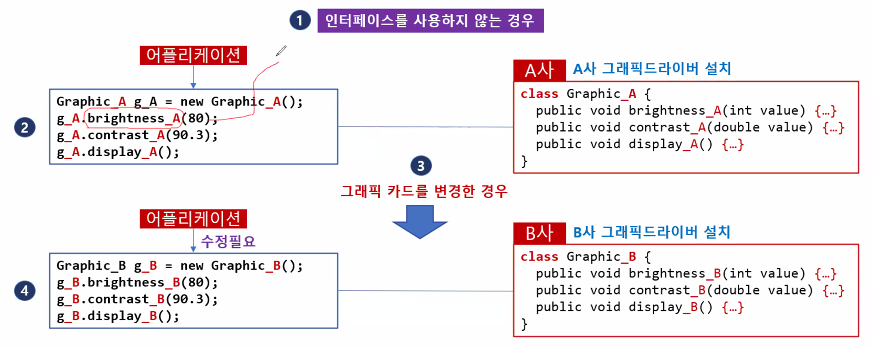  
- 인터페이스를 사용하는경우  
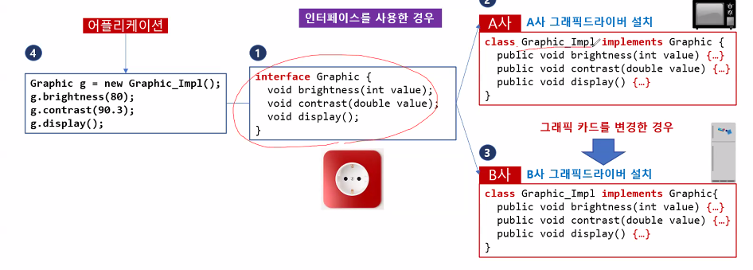  

```
    InterfaceA extends InterfaceB   // 가능
    InterfaceA implements Class     // 둘 다 불가능
               extends
```

### default 메서드  
> 인터페이스 내부의 완성된 메서드  

    public default (return type) (name)() {}  

이미 완성된 메서드이기 때문에 완성시킬 필요 X.  
오버라이드 가능.  

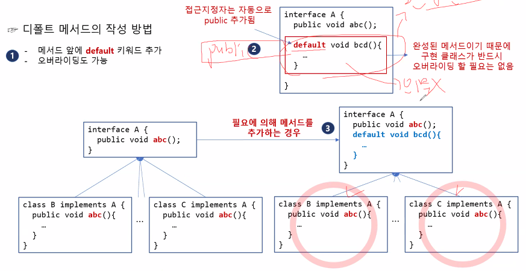

새 매서드를 추가해야 할 때, interface 내에 default method를 넣기만 하면 됨.  
그렇지 않으면 interface에 미완성 메서드를 넣고  
다른 모든 클래스들이 완성시켜야 함.  

interface의 default 메서드를 호출하려면  
interface명.super.메서드명(); 로 호출함.  
static 메서드는 그냥 interfase명.메서드명  
```
    A.super.abc();
    A.staticabc();
```

## 내부 클래스 (Inner Class)  
> 클래스 내부에 구현된 또 다른 클래스  
- 종류 :  
    instance inner class  
    static inner class  
    local inner class  
- 특징 : 외부 클래스의 모든 범위(private protected etc..) 멤버 접근 가능.  

- 파일명(클래스명) : 외부클래스.class  
                    외부클래스$내부클래스.class  
```
ex) Outer.class, Outer$Inner.class  
```
---
#### instance inner class  

- 인스턴스 내부 객체 생성 방법  
순서 : `외부클래스 객체 생성` → `내부클래스 객체 생성`  
```
ex) Outer a = new Outer();
    Outer.Inner b = a.new Inner();
    b.bcd();
```

- 내부 클래스에서 `외부 클래스의 필드`, `메서드 호출` 방법  
```
Outer.this.FIELD;  
Outer.this.METHOD;  
```
---
#### static inner class
- 정적 내부 객체 생성 방법  :  
    내부클래스 생성자로 직접 객체 생성  
```
Outer.Inner a = new Outer.Inner();
```

- static (정적) 내부클래스는 <span style = "color:yellow">외부 클래스의 static 멤버</span>만 사용할 수 있음.  
- 외부 클래스의 static 메서드는 당연히 바로 호출할 수 있음.  
```java
package CreateObjectAndAccessMember_2;

class A{
	int a= 3;
	static int b = 4;
	void method1() {
		System.out.println("instance method");
	}
	static void method2() {
		System.out.println("static method");
	}
	static class B{
		static void bcd() {
//			System.out.println(a);	정적 이너 클래스는 아우터 클래스의 정적 멤버만 사용 가능
			System.out.println(b);
//			method1();
			method2();
			
		}
	}
}

public class CreateObjectAndAccessMember_2 {
	public static void main(String[] args) {
//		A.B b = new A.B();
//		b.bcd();
		A.B.bcd();
	}

}
---
```
#### local inner class  
> 외부 클래스의 메서드 내에 선언된 클래스  
(사용 빈도가 많지는 않음.)  
- 마찬가지로 외부 클래스 모든 멤버 접근 가능.  
- 클래스명(파일명) :  
Outer.class, Outer$1Inner.class Outer$2Inner.class ...  
```
Outer$`num`Inner.class  
동일한 클래스명이 있으면 num 상승
```
메서드 내에 선언되는 클래스이기 때문에 서로 다른 메서드 내에서 이름 중복 가능.  

만일 `메서드 지역변수`의 값이 변경되지 않는다면, 컴파일러가 자동으로 앞에 `final`을 붙임.  
그러나 값이 변경된다면, 붙지 않음.(←지역 내부 클래스에서 접근 불가.)  


---


#### Anonymous Inner Class (익명 내부 클래스)  

상속을 통해 완성하는 것이 아닌  
`이름이 없는` 내부 클래스를 통해 추상 메서드를 완성.  

생성자 뒤에 {}; 안에다가 메서드를 구현.  

    A a = new A() {//메서드 구현};  

만약 클래스가 자주 사용되지 않거나 한 번만 사용되는 경우,  
굳이 이름을 부여하지 않아도 되고 만들기 편하다는 장점이 있음.  
그러나 재활용이 불가능함.  

```java
// 추상 클래스 완성

abstract class A{
	abstract void abc();
}

class B extends A{
	void abc() {
		System.out.println("방법 1. 자식 클래스 생성을 통한 추상 메서드 구현");
	}
}
public class AbstractClass_1 {
	public static void main(String[] args) {
		A b1 = new B();
		b1.abc();

		A a = new A() {
			void abc() {
				System.out.println("방법 2. 익명 이너클래스를 통한 추상 메서드 구현");
			}
		};
		a.abc();
	}
}
```
- 메서드 `매개변수`가 `interface` 타입인 경우  
  
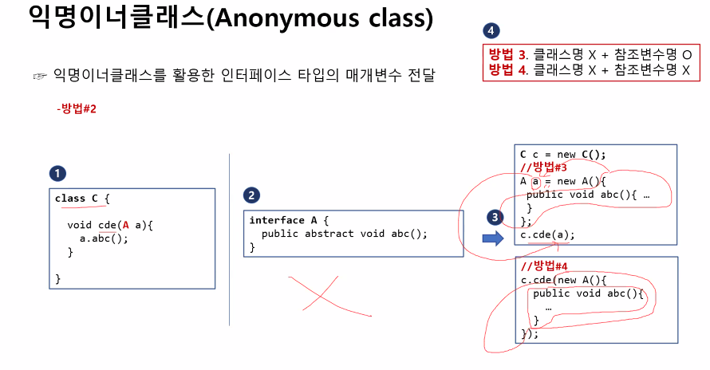  

```java
// 익명 이너클래스를 활용한 interface 타입 매개변수 전달
interface A{
	public abstract void abc();
}
// 자식 클래스 직접 생성
class B implements A{
	public void abc() {
		System.out.println("입력매개변수 전달");
	}
}
class C {
    // interface 타입을 매개변수로 받는 메서드
	void cde(A a) {
		a.abc();
	}
}

public class AnonymousClass_3 {
	public static void main(String[] args) {
		C c = new C();
		
		
		// 방법 1. 클래스명 O + 참조변수명 O
		A a = new B();
		c.cde(a);	// 매개변수로 B클래스 객체 a를 받음
		
		
		//방법 2. 클래스명 O + 참조변수명 X
		c.cde(new B());	// 매개변수 칸에 참조변수명이 없는 객체를 만듦
		
		
		//방법 3. 클래스명X + 참조변수명 O
		// B클래스를 만들지 않고 익명이너클래스를 통해 a4라는 객체를 생성하여 매개변수 전달
		A a4 = new A() {
			public void abc() {
				System.out.println("방법3 입력매개변수 전달");
			}
		};
		c.cde(a4);
		
		
		//방법 4. 클래스명X + 참조변수명 X
		// cde메서드 매개변수 칸 내에 익명이너클래스를 통해 이를 매개변수로 전달
		c.cde(new A() {
			public void abc() {
				System.out.println("방법4 입력매개변수 전달");
			}
		});
	}
}
// 방법 4에 익숙해지는 것을 권장한다고 함.
```

### 내부 인터페이스 (Nested Interface)  
> 클래스 내에 있는 인터페이스  
자동으로 static이 붙음  

- UI의 이벤트 처리에 가장 많이 사용됨. (클릭 터치 등)  

원래는 interface 앞에 static을 붙일 수 없음.  

(아마 static으로 만들어 객체 생성 없이 불러와 사용하기 편해서 이렇게 쓰는 듯함.)  

- 객체 생성 방법
```java
class A{
	interface B{	// 자동으로 static 지정됨.
		public abstract void bcd();
	}
}
class C implements A.B{
	public void bcd() {
		System.out.println("이너 인터페이스 구현");
	}
}
public class CreateObjectOfInnerInterface {
	public static void main(String[] args) {
		// 객체 생성 방법 1(자식 클래스 직접 생성)
		C c = new C();
		c.bcd();
		// 객체 생성 방법 2(익명 이너 클래스 생성)	C를 만들지 않는 방법.
		A.B b = new A.B() {
			public void bcd() {
				System.out.println("익명 이너 클래스로 객체 생성");
			}
		};
		b.bcd();
	}

}
```
- 이벤트 사용 방법  
(내부 익명 클래스 활용)
```java
package ButtonAPIExample;

class Button{
	OnClickListener ocl;
	void setOnClickListener (OnClickListener ocl) {	// 내부 인터페이스 객체를 매개변수로 받는 메서드.
		this.ocl = ocl;		// 내부 인터페이스(내가 구현할 것)를 Button의 ocl에 대입.
	}
	interface OnClickListener{	// 내부 인터페이스
		public abstract void onClick();	// 내가 이 메서드를 override하여 구현
	}
	void onClick() {	//Button 클래스의 메서드
		ocl.onClick();	//override한 메서드 호출
	}
}
public class ButtonAPIExample {
	public static void main(String[] args) {
		
		Button btn1 = new Button();	// 객체 생성
		// ↓ btn1의 ocl에 아래 구현한 인터페이스 OnClickListener를 대입하는 메서드.
		btn1.setOnClickListener(new Button.OnClickListener() {	// 익명내부클래스
			@Override
			public void onClick() {	// 인터페이스 OnClickLister 내 메서드 완성
				System.out.println("개발자 1 : 음악 재생");
			}
		});
		btn1.onClick();	// ocl에 대입된 ↑익명내부클래스의 메서드 onClick()이 실행됨.
		
		Button btn2 = new Button();
		btn2.setOnClickListener(new Button.OnClickListener() {
			@Override
			public void onClick() {
				System.out.println("개발자 2 : 네이버 접속");
			}
		});
		btn2.onClick();
	}
}

```

## Hashcode  
> 양방향이 아닌 복호화 불가능한 암호화 코드  

>원본의 무결성을 확인하는 데에 유용함.  
input값의 hashcode와 원본 hashcode를 대조하는 방식.  

MD5 hash 코드라고 치면 암호화 하는 사이트 나옴.   

- `입력값` -> `암호화` -> `256~512bit code`  

- 객체 자체를 출력하면 나오는  
ObjectMethod_equals.`B@515f550a` ← 이 부분이 16진수로 표현된 hash코드임.  

- `HashMap`에서 `비교`할 때 사용할 수 있음.  
`hashCode()`와 `equals()` 메서드를 `Override`하여  
객체로 이루어진 HashMap에서  
객체 이름과 내용을 대조하여 중복인지 아닌지 알아낼 수 있음. 
 
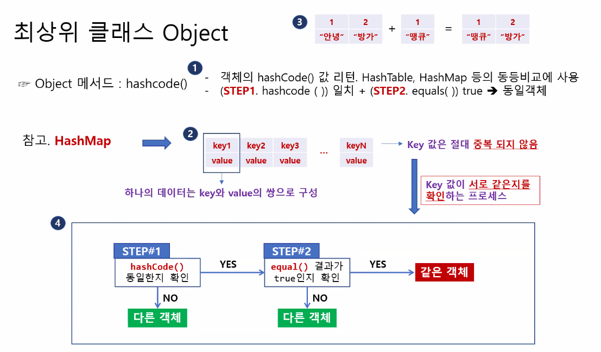  

# 예외 (Exception)  
> `에러(Error)`와 달리, 실행 전까지는 알 수 없는 오류.  
- 예외 발생 시, 즉시 프로그램이 종료됨.  
- 예외처리를 통해 개발자가 처리할 수 있는 오류.  
- 일반예외(checked exception)와 실행예외(unchecked == runtime)로 나뉨.  
    일반예외는 컴파일 전 체크, 실행예외는 실행 시 체크됨.  

- 일반 예외 예시  
```java
package Exception_1;

import java.io.FileInputStream;
import java.io.IOException;
import java.io.InputStreamReader;

class A implements Cloneable {
	protected Object clone() throws CloneNotSupportedException{
		return super.clone();
	}
}
public class Exception_1 {
	public static void main(String[] args) {
		// 일반 예외
		
		//1. InterruptedException
		Thread.sleep(1000);
		
		//2. ClassNotFoundException
		Class cls = Class.forName("java.lang.Object");
		
		//3. IOException
		InputStreamReader in = new InputStreamReader(System.in);
		in.read();
		
		//4. FileNotFoundException
		FileInputStream fis = new FileInputStream("text.txt");
		
		//5. CloneNotSupportedException
		A a1 = new A();
		A a2 = (A)a1.clone();
	}
}

```
- 실행 예외 예시  
```java
package UncheckedException;
class A {}
class B extends A {}
public class UncheckedException {
	public static void main(String[] args) {
		
		// UncheckedException = RuntimeException (실행 예외)
		
		// 1. ArithmeticException	산수 예외
		System.out.println(3/0);
		
		// 2. ClassCastException	
		A a = new A();
		B b = (B)a;
		
		// 3. ArrayIndexOutOfBoundException
		int[] array = {1, 2, 3};
		System.out.println(array[3]);
		
		// 4. NumberFormatException		
		int num = Integer.parseInt("10!");
		
		// 5. NullPointerException
		String str = null;
		System.out.println(str.charAt(2));
	}
}
```
## try - catch (예외처리)  
> 예외 발생 시 바로 프로그램이 종료되는 것을 막고, 대신 수행할 문장으로 예외를 처리함.  

- try문 안에서 예외 발생 시, 해당 구문 아래 코드들은 실행되지 않음!!  

- 문법  
```java
try{
    // 예외처리 대상
}catch(ArithmeticException | ClassCastException e){    // 예외클래스명, 참조변수명
// 예외처리 내용이 같다면, |(OR)로 여러 예외 삽입 가능.
    // 예외 발생 시 수행할 블록
}finally{   // finally는 생략가능
    // 예외 발생 상관없이 수행할 블록
}
```
- Exception은 맨 앞에 두면 그 아래 catch문들은 도달할 수 없어서 `Unreachable code Error` 발생.  
맨 마지막 catch 문에 넣어야함.  
if문에서 else{}느낌.  
elif 앞에 else를 쓰면 안 되는 것과 같음.
```java
public class MultiCatch_2 {
	public static void main(String[] args) {
		 // catch 블록의 순서가 잘못됐을 때
		  try{
			  System.out.println(3/1);
			  int num = Integer.parseInt("10A");
		  }
		 catch (Exception e) {
			 System.out.println("숫자는 0으로 나눌 수 없습니다.");
		 }
		 catch (NumberFormatException e) {
			 System.out.println("숫자로 바꿀 수 없습니다.");	//unreachable code 오류 발생
		 }
		 finally {
			 System.out.println("프로그램 종료");
		 }
```
## 예외 전가 (throws)  
> `throws` 키워드를 통해 예외 처리를 호출자인 상위 메서드에 전가함.  

- 예외를 throws하면 예외 발생 구문을 직접 try-catch문으로 처리하는 것이 아니라,  
 `해당 구문을 호출한 메서드`(상위 메서드)가 처리해야 함.  

```java
package ThrowsException_1;

// 1. 하위 메서드에 직접 예외를 처리할 때
class A {
	void abc() {
		bcd();
	}
	void bcd() {
		try {
			Thread.sleep(1000);	//일반 예외 InterruptedException
		}
		catch(InterruptedException e) {
			// 예외 처리 구문
		}
	}
}

// 2. 예외를 호출 메서드로 전가 throw 할 때
class B {
	void abc() {	// 상위 메서드에서 처리
		try {
			bcd();	//일반 예외 : InterruptedException
		}
		catch (InterruptedException e) {
			// 예외 처리 구문
		}
	}
	void bcd() throws InterruptedException {	// 예외를 상위 메서드로 전가
		Thread.sleep(1000);
	}
}
public class ThrowsException_1 {
	public static void main(String[] args) {
		
	}
}
```
그러면 `main 함수`마저 `전가` (throws) 해버리면 어떻게 되냐??  
`JVM`에 전가가 되는데, 이렇게 되면 처리할 수가 없어서 `프로그램이 종료`되어버림.  


---
### try-catch문을 이용한 리소스 close  
- finally문에는 보통 리소스 닫는 구문을 넣음. (close)  
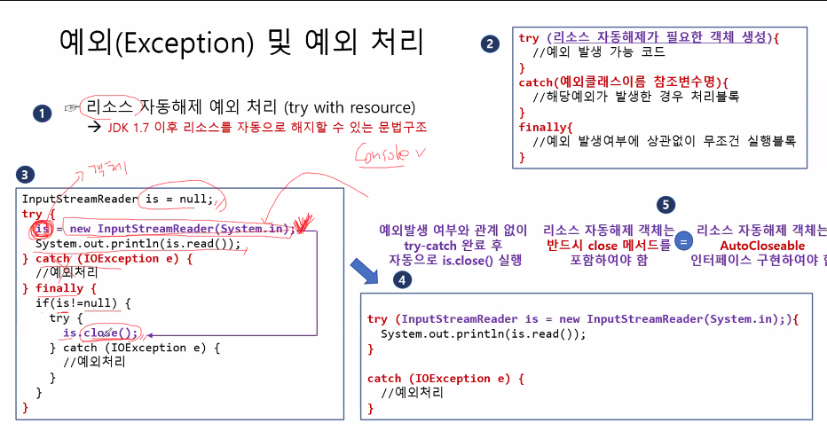  

- try-catch문 프로세스  
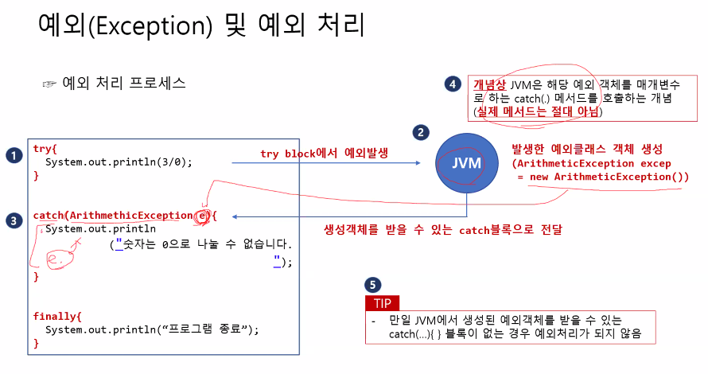  

```java
// 리소스 자동 해제와 수동 해제

import java.io.IOException;
import java.io.InputStreamReader;

public class TryWithResource_1 {
	public static void main(String[] args) {
		System.out.println("문자를 입력하세요!");
		
		// System.in 리소스를 해제하면 더 이상 콘솔 입력 불가
		// 1. 리소스 자동 해제
		try (InputStreamReader isr1 = new InputStreamReader(System.in);){   // try문이 끝나면 자동으로 리소스 해제
			char input = (char)isr1.read();
			System.out.println("입력 글자 = " + input);
		}
		catch(IOException e) {
			e.printStackTrace();
		}
		
		// 2. 리소스 수동 해제
		InputStreamReader isr2 = null;
		try {
			isr2 = new InputStreamReader(System.in);
			char input = (char)isr2.read();
			System.out.println("입력 글자 = " + input);
		}
		catch(IOException e) {
			e.printStackTrace();
		}
		finally {
			//리소스 해제 구문
			if(isr2!=null) {
				try {	// 리소스 해제
					isr2.close();
				} catch (IOException e) {
					e.printStackTrace();
				}
			}
		}
	}
}
```
- 또는 AutoCloseable(인터페이스)를 implements하고 close()를 Override하여 사용할 수도 있음.  
```java
// AutoCloseable을 구현하여 close()로 리소스 수동 해제

/* 인터페이스 AutoCloseable의 본 모습
 * public interface AutoCloseable{
 * 		void close() throws Exception;
 * }
 */

class A implements AutoCloseable {
    // 굳이 AutoCloseable를 implements하지 않고 그냥 클래스를 만들어 써도 됨.
    // 단, 그렇게 할 경우에는 try with resource를 이용한 자동 해제를 할 수 없음.
	String resource;
	A(String resource) {
		this.resource = resource;
	}
	@Override
	public void close() throws Exception {
		if(resource!=null) {
			resource = null;
			System.out.println("리소스가 해제되었습니다.");
		}
	}
}

public class TrywithResource_2 {
	public static void main(String[] args) {
		
		// 1. 리소스를 사용하고 finally에서 리소스 수동 해제하기
		A a1 = null;
		try {
			a1 = new A("특정 파일");
		}catch (Exception e) {
			System.out.println("예외 처리");
		}finally {
			// 리소스 수동 해제
			if(a1.resource!=null) {
				try {
					a1.close();
				}catch(Exception e) {}
			}
		}
```

## 사용자 정의 예외 클래스 (UserException)  
> 원하는 조건을 예외로 발생시킬 수 있음.  

- `일반 예외`는 `Exception`을, `실행 예외`는 `RuntimeException`을 상속받아 클래스 작성.  
- 문법  
	```java 
	class MyException extends Exception {
		MyException(){super();}	// 기본생성자
		MyException(String message){super(message);} // message를 받아 출력하는 생성자
	}
	```  
	조상의 생성자 두개를 작성.  
- 일반 예외 작성 시, 예외처리를 하지 않을 경우에 컴파일러가 알려주지만, 실행 예외 작성 시에는 알려주지 않음.  

- <span style = "color:green">예외 직접 처리와 예외 전가 예시</span> 
	```java
	package CreateUserException;

	// 1. 사용자 일반 예외
	class MyException extends Exception{
		public MyException() {
			super();
		}
		public MyException(String message) {
			super(message);
		}
	}

	// 2. 사용자 실행 예외
	class MyRTException extends RuntimeException{
		public MyRTException() {
			super();
		}
		public MyRTException(String message) {
			super(message);
		}
	}

	class A {
		// 3. 사용자 정의 예외 객체 생성
		MyException me1 = new MyException();
		MyException me2 = new MyException("예외 메세지 : MyException");	

		MyRTException mre1 = new MyRTException();
		MyRTException mre2 = new MyRTException("예외 메세지 : MyRTException");	

		// 4. 예외 던지기(throw) : 던진 시점에서 예외 발생
		// 방법 ① abc_1가 예외를 직접 처리
		void abc_1(int num) {
			try {
				if(num > 70)
					System.out.println("정상 작동");
				else
					throw me1;	// 예외를 던진 시점에 예외 발생
			} catch(MyException e) {
				System.out.println("예외 처리 1");
			}
		}
		void bcd_1() {
			abc_1(65);
		}
		
		// 방법 ② bcd_2에 예외 전가
		void abc_2(int num) throws MyException{
			if(num>70)
				System.out.println("정상 작동");
			else
				throw me1;	// 예외를 던진 시점에서 예외 발생
		}
		void bcd_2() {
			try {
				abc_2(65);
			}catch (MyException e) {
				System.out.println("예외 처리 2");
			}
		}
	}
	public class CreateUserException {
		public static void main(String[] args) {
			A a = new A();
			a.bcd_1();
			a.bcd_2();
		}

	}
	````
- <span style = "color:green">사용자 정의 예외 클래스 사용 예시</span>  
	```java
	package CreateUserException_2;
	class A {
		// score을 매개변수로 받아 확인하는 메서드
		void checkScore(int score) throws MinusException, OverException {
			if(score<0) {
				// 예외 발생시키기. 원하는 메세지를 매개변수로 객체 생성
				throw new MinusException("예외: 음수값 입력");
			}
			else if(score>100) {
				throw new OverException("예외 : 100점 초과");
			}
			else {
				System.out.println("정상적인 값입니다.");
			}
		}
	}
	// 사용자 정의 예외 클래스 MinusException
	class MinusException extends Exception{
		// 기본 생성자
		MinusException(){super();}
		// msg를 매개변수로 받는 생성자
		MinusException(String msg){super(msg);}
	}
	// 사용자 정의 예외 클래스 OverException
	class OverException extends Exception{
		OverException(){super();}
		OverException(String msg){super(msg);}
	}
	public class CreateUserException_2 {
		public static void main(String[] args) {
			A a = new A();
			try {a.checkScore(-1);}
			catch(MinusException | OverException msg){System.out.println(msg.getMessage());}
			try {a.checkScore(111);}
			catch(MinusException | OverException msg){System.out.println(msg.getMessage());}
			try {a.checkScore(100);}
			catch(MinusException | OverException msg){System.out.println(msg.getMessage());}
		}

	}
	```
	```
	- 사용자 예외 클래스 객체 생성, 예외 발생시키기

	throw new UserException("원하는 메세지");
	```
	```
	- main에서 처리

	try{예외 문장;}
	catch{UserException msg}{수행 문장;}
	```
- `.getMessage()` : 예외 객체에 전달된 `메세지 반환.`  
	객체 생성 시 입력한 메세지를 반환함.

- `.printStackTrace()` : 예외 발생이 이루어지는 `경로`를 `추적`하고 `출력`함.  

> instanceof 함수를 이용해 예외 종류별로 처리 가능.  

```java
...
catch(IndexOutOfBoundsException | ClassCastException e)
if(e instanceof IndexOutOfBoundsException){}
else if(e instanceof ClassCastException){}
```