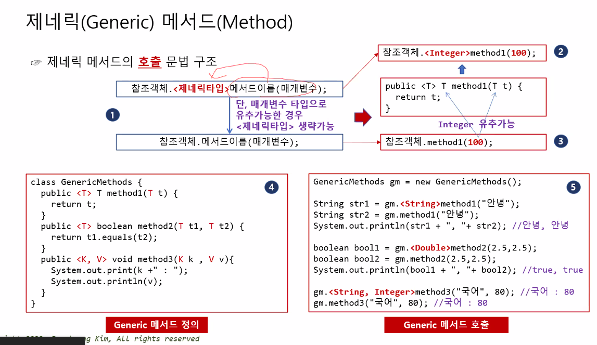
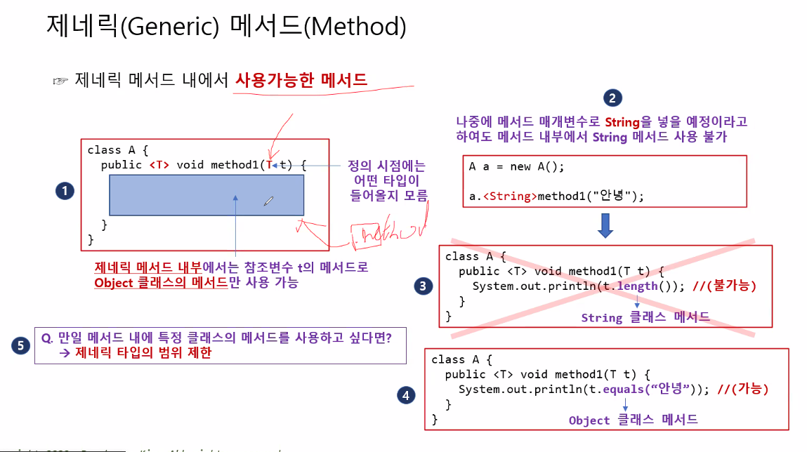

# Generic  
### Generic Class
Generic(일반적인)  
> 자료형에 얽메이지 않는 코드 작성 가능.  

Generic 미사용시, 클래스들을 관리하는 클래스를 만들 때  
클래스마다 따로 따로 만들어줘야함.  

상품마다 클래스를 생성해야 하는 문제점에 대한 해결책.  

클래스 이름 뒤에 <> 안에 타입변수를 써줌.  

### 타입변수  
<table border="2">
<tr>
<td>T</td>
<td>Type</td>
</tr>
<tr>
<td>K</td>
<td>Key</td>
</tr>
<tr>
<td>V</td>
<td>Value</td>
</tr>
<tr>
<td>N</td>
<td>Number</td>
</tr>
<tr>
<td>E</td>
<td>Element</td>
</tr>
</table>  

타입변수 명은 아무거나 써도 됨.  
부모의 타입변수와 자녀의 타입변수의 이름이 달라도 상관 없음.  

```java
public class ClassName<T>{}
public class Class_Name<K, V>{} 

ClassName<Type> mc = new ClassName<Type>(); // 뒤쪽 <>는 비워도 됨.
Class_Name<String, Integer> mc = new Class_Name<String, Integer>();
// 쓰고 싶지 않은 타입변수에는 Void를 적음.
```  

타입변수에 어떤 자료형이 들어가도 상관 없음.  
<>에 입력하는 자료형이 타입변수에 들어간다고 생각하면 됨.  

---
예시)
- `Generic 미사용`  
    ```java
    package ProblemBeforeGeneric;
    // Apple 클래스와 클래스를 담을 수 있는 Goods1  클래스
    class Apple {}
    class Goods1 {
        private Apple apple = new Apple();
        public Apple getApple() {
            return apple;
        }
        public void setApple(Apple apple) {
            this.apple = apple;
        }
    }
    // Pencil 클래스와 담을 수 있는 Good2 클래스
    class Pencil{}
    class Goods2{
        private Pencil pencil = new Pencil();
        public Pencil getPencil() {
            return pencil;
        }
        public void setPencil(Pencil pencil) {
            this.pencil = pencil;
        }
    }
    public class ProblemBeforeGeneric {
        public static void main(String[] args) {
            // Good1를 이용해 Apple 객체를 추가하거나 가져오기
            Goods1 goods1 = new Goods1();
            goods1.setApple(new Apple());	// Apple 타입만 입력 가능
            Apple apple = goods1.getApple();	// Apple 타입 리턴
            // Goods2 를 이용해 Pencil 객체 추가, 가져오기
            Goods2 goods2 = new Goods2();
            goods2.setPencil(new Pencil());	// Pencil 타입만 입력 가능
            Pencil pencil = goods2.getPencil();	// Pencil 타입 리턴
        }
    }
    ```
`Object` 클래스로 해결할 수도 있음.  
그러나 `get`할 때 실수로 타입이 달라 `ClassCastException`이 발생하여 프로그램이 종료될 위험이 있음.  

- `Object 사용`  
    ```java
    class Apple {}
    class Pencil{}
    class Goods {
        private Object obj = new Object();
        public Object getObject() {
            return obj;
        }
        public void setObject(Object obj) {
            this.obj = obj;
        }
    }
    public class ProblemBeforeGeneric_2 {
        public static void main(String[] args) {
            Goods goods = new Goods();
            goods.setObject(new Apple());
            Apple apple = (Apple)goods.getObject();
            
            Goods goods2 = new Goods();
            goods2.setObject(new Pencil());	// Pencil 타입만 입력 가능
            Pencil pencil = (Pencil)goods2.getObject();	// Pencil 타입 리턴
            
            Goods goods3 = new Goods();
            goods3.setObject(new Apple());	// Apple 객체 저장
            Pencil pencil2 = (Pencil)goods3.getObject();	// Apple 객체를 pencil2에 저장
            // 타입이 달라 예외 발생
            // 컴파일러가 미리 잡아낼 수 없음
        }
    }
    ```

- `Generic 사용`  
    ```java
    class Apple {}
    class Pencil{}
    class Goods<T> {
        private T t;
        public T get() {
            return t;
        }
        public void set(T t) {
            this.t = t;
        }
    }
    public class ApplePencil {
        public static void main(String[] args) {
            Goods<Apple> goods = new Goods<Apple>();
            goods.set(new Apple());
            Apple apple = goods.get();
            
            Goods<Pencil> goods2 = new Goods<Pencil>();
            goods2.set(new Pencil());
            Pencil pencil = goods2.get();	
            
            //Goods<Apple> goods3 = new Goods<Apple>();
            //goods3.set(new Apple());
            //Pencil pencil2 = goods3.get();    // 강한 타입 체크로 오류 발생
        }
    }
    ```
    객체 생성시 <>를 생략하게 되면, 참조 객체에 Object 클래스가 들어가게 됨.  
```java
A a = new A();  // 참조객체 : Object
```

### Generic Method  

>일반 클래스 내, 특정 메서드에 Generic 선언 가능.  

- 타입변수 정해지는 타이밍 :  
`제네릭 클래스` - `객체 생성` 시  
`제네릭 메서드` - `호출` 시  

```java
public Class{
public <T> method(T t){}
...
}

class.<Type>method(value);
class.method(value);
// 호출 시 참조객체 생략 가능
```
  

Generic 메서드로 어떤 타입이 들어올지 모르기 때문에, 특정 타입의 메서드를 사용할 수 없다. (ex String의 .length())  
Object 메서드는 사용할 수 있다.  

특정 타입의 메서드를 사용하고 싶다면  
참조객체의 범위를 제한해야 함.  

### 범위 제한 (Bound)  
>참조객체의 범위를 제한.  

특정 타입의 메서드를 쓰고 싶다면  
특정 클래스의 하위 클래스들만 올 수 있도록 한정하고 싶다면 제한함.  

제한하는 방법은 3가지가 있음.  

---

### 1. 제네릭 클래스의 타입제한  
문법 :
```java
class A <T extends Class>{}
```
객체 생성시 <>를 생략하게 되면, 
제한하지 않았을 때와 달리  
참조 객체에 제한 기준인 `상위 클래스`가 들어가게 됨.  
```java
A<Class> a = new A<Class>();  // 참조객체 : Class
A a = new A();  // 참조객체 : Class
```

예시 :  
```java
package BoundedTypeOfGenericClass;

class A {}
class B extends A {}
class C extends B {}

class D <T extends B>{	//B와 B의 하위클래스인 C만 올 수 있음
	private T t;
	public T get() {
		return t;
	}
	public void set(T t) {
		this.t = t;
	}
}
public class BoundedTypeOfGenericClass {
	public static void main(String[] args) {
		// D<A> d1 = new D<>(); 불가능
		D<B> d2 = new D<>();	// 참조객체 -> B
		D<C> d3 = new D<>();	// 참조객체 -> C
		D d4 = new D();	// == D<B> d4 = new D<>();
		
		d2.set(new B());
		d2.set(new C());
		
	//	d3.set(new B());	// d3 객체는 객체를 생설할 때 제네릭 타입으로 C를 지정하므로 B 객체는 입력불가.
		d3.set(new C());
		
		d4.set(new B());
		d4.set(new C());
	}
}
```
---

### 2. 제네릭 메서드의 타입제한  
문법 : 
```java
class A {
    public <T extends Class> void method(T t){}
}
```

예시 : 
```java
package BoundedTypeOfGenericMethod;

class A{
	public <T extends Number> void method1(T t) {
		System.out.println(t.intValue());	// Number로 Bound해서 intValue() 메서드 사용 가능.
	}
}
interface MyInterface{
	public abstract void print();
}
class B{
	public <T extends MyInterface> void method1(T t) {
		t.print();	// MyInterface로 범위를 제한해서 print() 메서드를 사용할 수 있음.
	}
}	
public class BoundedTypeOfGenericMethod {
	public static void main(String[] args) {
		A a = new A();
		a.method1(5.8);		// == a.<Double>method1(5.8);
		
		B b = new B();
		b.method1(new MyInterface() {
			@Override
			public void print() {System.out.println("print() 구현");} });
	}
}
```

---

### 3.일반 메서드 매개변수로서의 제네릭 클래스 타입제한  
> 일반 메서드가 받는 매개변수를 제한함.  

```java
    class A{}
    class B extends A{}
    ...
    ...
    // void method(Class g) {} 원래 모양
	void method1(Class<A> g) {}	//case1     A만 가능
	void method2(Class<?> g) {}	//case2     모두 허용
	void method3(Class<? extends B> g) {}	//case3     B를 상속하는, B를 포함한 B의 하위 클래스들만 허용
	void method4(Class<? super B> g) {}	//case4     B가 상속받는, B를 포함한 B의 상위 클래스들만 허용
```
- 예시: 
    ```java
    package BoundedTypeOfInputArguments;
    class A{}
    class B extends A{}
    class C extends B{}
    class D extends C{}

    class Goods<T>{
        private T t;
        public T get() {
            return t;
        }
        public void set(T t) {
            this.t = t;
        }
    }
    class Test{
        void method1(Goods<A> g) {}	//case1	
        void method2(Goods<?> g) {}	//case2
        void method3(Goods<? extends B> g) {}	//case3
        void method4(Goods<? super B> g) {}	//case4
    }
    public class BoundedTypeOfInputArguments {
        public static void main(String[] args) {
            Test t = new Test();
            
            //case1		범위를 A로 한정
            t.method1(new Goods<A>());
    //		t.method1(new Goods<B>());
    //		t.method1(new Goods<C>());
    //		t.method1(new Goods<D>());
            
            //case2		범위 한정 X
            t.method2(new Goods<A>());
            t.method2(new Goods<B>());
            t.method2(new Goods<C>());
            t.method2(new Goods<D>());
            
            //case3		범위를 B의 하위 클래스로 한정
    //		t.method3(new Goods<A>());
            t.method3(new Goods<B>());
            t.method3(new Goods<C>());
            t.method3(new Goods<D>());
            
            //case 4	범위를 B의 상위클래스로 한정
            t.method4(new Goods<A>());
            t.method4(new Goods<B>());
    //		t.method4(new Goods<C>());
    //		t.method4(new Goods<D>());
        }
    }
    ```

---

### Generic의 상속  

#### 제네릭 클래스 상속 

부모클래스가 `제네릭`인 경우, 자식클래스 또한 `제네릭`.  
부모의 타입변수를 그대로 물려받음.  
자식의 타입변수 개수는, 부모와 같거나 클 수 있다.  

```java
class Parent<K>{}
class Child<K> extends Parent<K>{}
class Child<K,V> extends Parent<K>{}
```

- 예시 :  
    ```java
    package InheritanceGenericClass;
    class Parent<T>{
        private T t;
        public T getT() {
            return t;
        }
        public void setT(T t) {
            this.t = t;
        }
    }
    class Child1<T> extends Parent<T>{}
    class Child2<T,V> extends Parent<T>{
        V v;
        public V getV() {
            return v;
        }
        public void setV(V v) {
            this.v = v;
        }
    }
    public class InheritanceGenericClass {
        public static void main(String[] args) {
            //부모 제네릭 클래스
            Parent<String> p = new Parent<>();
            p.setT("부모 제네릭 클래스");
            System.out.println(p.getT());	
            
            // 자식 클래스1
            Child1<String> c1 = new Child1<>();
            c1.setT("자식 1 제네릭 클래스");
            System.out.println(c1.getT());

            // 자식 클래스2
            Child2<String, Integer> c2 = new Child2<>();
            c2.setT("자식 2 제네릭 클래스");
            c2.setV(100);
            System.out.println(c2.getT());
            System.out.println(c2.getV());
        }
    }
    ```
---
#### 제네릭 메서드를 가진 일반 클래스의 상속  
부모 클래스가 `제네릭 메서드`를 가진 경우,  
자식 클래스 또한 `제네릭 메서드`를 그대로 물려받음.  

- 예시 :  
    ```java
    package InheritanceGenericMethod;

    class Parent {
        public <T extends Number> void print(T t) {	// Number를 상속받는 클래스만 받음
            System.out.println(t);
        }
    }
    class Child extends Parent{}

    public class InheritanceGenericMethod {
        public static void main(String[] args) {
            // 부모 클래스에서 제네릭 메서드 이용
            Parent p = new Parent();
            p.<Integer>print(10);
            p.print(10);
            
            // 자식 클래스에서 제네릭 메서드 이용
            Child c = new Child();
            c.<Double>print(5.8);
            c.print(5.8);
        }
    }
    ```
