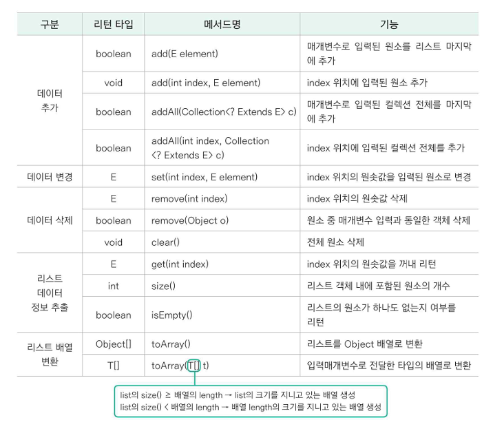
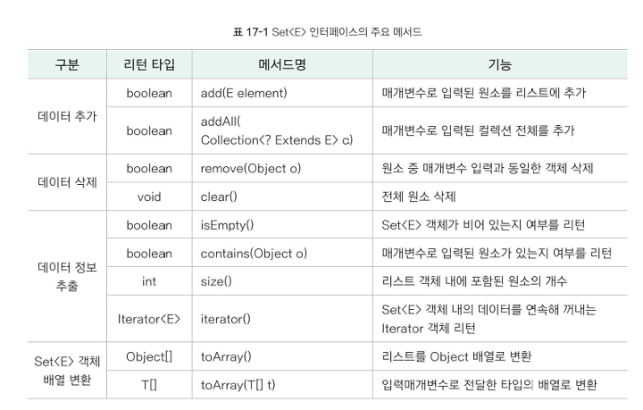
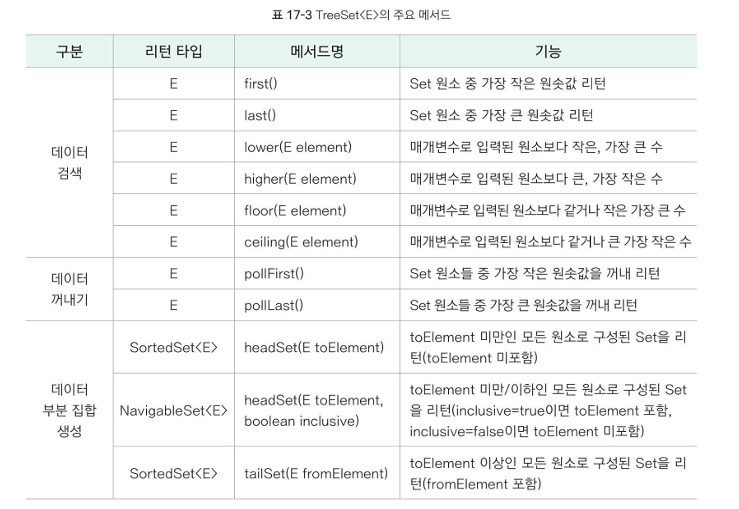
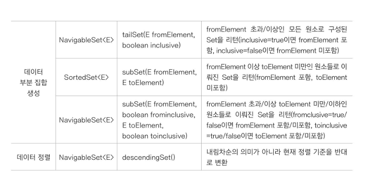
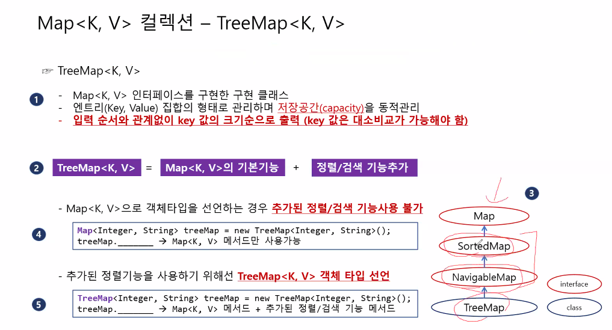
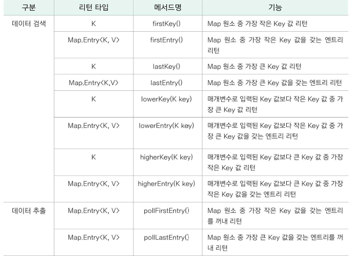
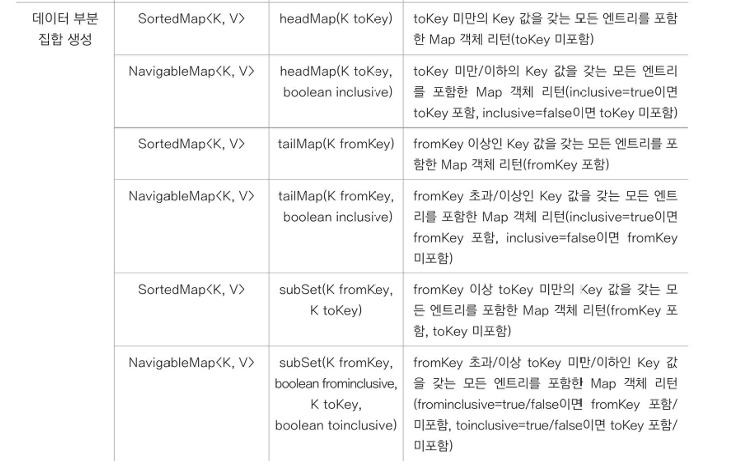
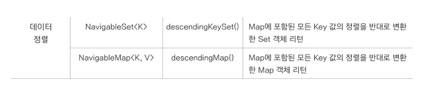
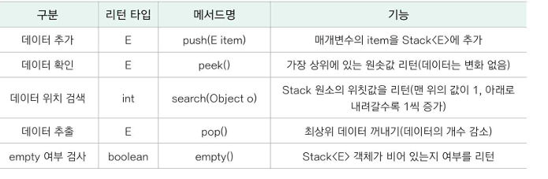
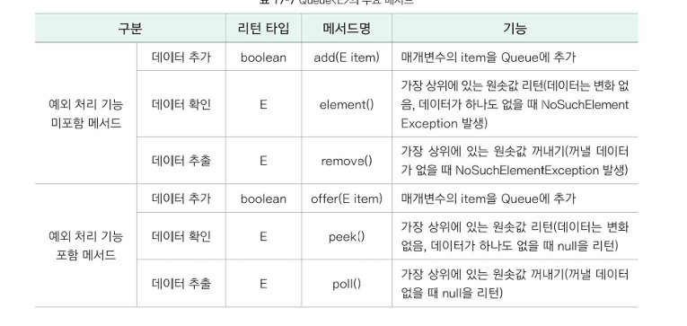

# Collection Framework  
리스트, 스택, 큐, 트리 등 `자료 구조`에  
정렬, 탐색 등의 `알고리즘을 구조화` 해 놓은 프레임워크.  
java.io  

  

### Framework  
클래스와 인터페이스의 모임 (라이브러리) + 원칙, 구조(정렬, 탐색)  

### Collection  
- `동일한 타입`을 묶어서 관리  
- 저장 공간의 크기를 `동적`으로 관리  

## List  
> 순서 O, 중복 O  

List : 저장 공간 동적변환.  
배열 : 저장 공간이 고정됨.  

```
List의 하위 클래스  
ArrayList, LinkedList, Vector
```

- 자료가 추가되거나, 제거되면 그에 따라 List의 크기도 바뀜.  
- 선언문 :
    ```java
    List<Type> list = new ArrayList<>();  
    ```
생성자 매개변수에 숫자를 넣어 capacity 지정 가능.  
지정하지 않으면 10.
그러나 LinkedList는 불가능.  

- ArrayList(동기화 X) == Vector(동기화 O)  
    데이터 조회에 효율적.  
- LinkedList  
    데이터 삽입, 삭제에 효율적.  

#### 메서드  

- `.add(value)` : List에 value를 추가.  
- `.remove(value)` : List에서 value를 제거  
- `.size()` : List의 크기 반환  
- `.set(index, value)` : 해당 index 위치의 값을 value로 변경함.  

---
  
List<Type> list = Arrays.`asList(value1, value2, value3...)`  
`asList()`를 통해 배열을 리스트로 만들면,  
##### 정적 리스트가 되어 크기를 `변경할 수 없음`.  
(add or remove 할 수 없음. `예외` 발생.)  
값 변경은 `.set()`로 함.  

---  

## Set  
> 순서 X, 중복 X  
집합  

#### 메서드  
  

#### TreeSet  
#### 메서드  
  
  


---  

## Map  
> 순서 X, 중복 Key만 X  
Key와 Value로 이루어짐.  
한 쌍을 `Entry`라고 부름.  

### TreeMap  
  

Integer 타입은 정렬되지만,  
객체, String는 어떻게 정렬할까요?  

Comparable 인터페이스의 compareTo 메서드를 Override함.  
```java
class MyData implements Comparable<MyData>{
    String str;
    public MyData(String str){
        this.str = str;
    }
@Override
public int compareTo(MyData o){
    if (this.str.length() > o.str.length()){return 1;}
    else if(this.str==o.str){return 0;}
    else return -1;
}
}
/*--------------------------------------------------------*/
TreeMap<MyClass, String> treeMap5 = new TreeMap<MyClass, String>(new Comparator<MyClass>() {
		@Override
		public int compare(MyClass o1, MyClass o2) {
			if(o1.data1 < o2.data1) return -1;
			else if(o1.data1 == o2.data1) return 0;
			else return 1;
		}
	});
```

#### 메서드  
  
  
  

---  

## Stack  
> LIFO  
굉장히 효율적임
#### 메서드  


---  

## Queue  
> FIFO  
#### 메서드
