# 파일  
> File을 다루는 Class를 이용해 관리.  


메서드
---
- `File(String pathname)` : pathname 위치를 가리키는 파일 객체 생성  
- `File(File/String parent, String Child)` : parent 폴더에 child 파일을 가리키는 파일 객체 생성  
- `File(URI uri)` : uri 위치를 가리키는 파일 객체 생성  
ㅤ
---
- boolean `exists()` : 파일 또는 폴더의 존재여부 확인  
- boolean `createNewFile()` : 경로 위치에 파일 생성(해당 경로가 없으면 예외 발생)  
- boolean `mkdir()` : 경로 위치에 폴더 생성  (객체 생성시 true, 생성할 수 없거나 이미 있는 폴더면 false)
ㅤ  
mkdir와 mkdirs의 차이 : mkdir은 존재하지 않는 경로 하나만 생성 가능.  
mkdirs는 존재하지 않는 모든 경로 생성 가능.  

경로를 여러 개 생성해야 할 경우엔 mkdirs를 사용!!
mkdir로 여러 경로를 생성하려 하면 false가 반환되고 생성되지 않음.  

---

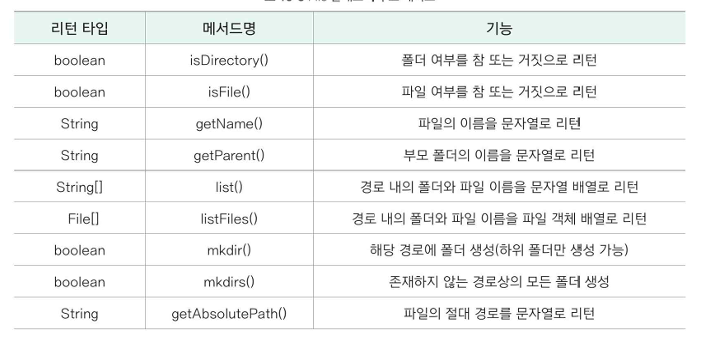  

---
※ C:\ 에는 권한 문제로 생성, 수정할 수 없음.  
보통 C:\temp 폴더를 만들어 사용.  
ㅤ  

※ URI(Uniform Resource Identifier) : 통합 자원 식별자  
주소에서 / 뒤에 오는 것.  
www.google.com/`URI`  
ㅤ  

---
ㅤ  
### File 경로 표시  

- File의 구분자(Separator)  
File.separator

Windows : 역 슬래시 `\`  (단, 문자열 "" 안에 사용 시에는 `\\`와 같이 표기)  
Mac : 슬래시 `/`  

- 공통적으로 사용 가능하게 하려면 :  
    ```
    String path = "C:" + File.separator + "temp"
    ```  

- `절대 경로` (Absolute Path) : 드라이브 명부터 `모든 경로`를 표시.  
    ```
    "C:\abc\bcd\newFile.txt"
    ```
-  `상대 경로` (Relative Path) : `현재 위치를 기준`으로 경로 표시.  
    ```
    현재 위치 : abc
    "bcd\newFile.txt"
    ```
---
ㅤ
- String `getAbsolutePath()` : 파일의 절대 경로 반환.  
- String `System.getProperty("user.dir")` : 현재 경로 반환.  

- 예시 :  
    ```java
    import java.io.File;
    import java.io.IOException;

    public class CreateFileObject {
        public static void main(String[] args) {

            // 1-1. C 드라이브 내에 temp 폴더가 없으면 생성
            File tempDir = new File("C:/temp");
            if(!tempDir.exists())	
                tempDir.mkdir();
            System.out.println(tempDir.exists());       // true
            
            // 1-2. 파일 객체 생성(실제 파일 생성)
            File newFile = new File("C:/temp/newFile.txt");
            if(!newFile.exists())
                try {newFile.createNewFile();} catch (IOException e) {}	// temp 폴더가 없을 때 예외 발생
            System.out.println(newFile.exists());       //true
            
            // 2. 파일 구분자
            File newFile2 = new File("C:\\temp\\newFile.txt");
            File newFile3 = new File("C:/temp/newFile.txt");
            File newFile4 = new File("C:" + File.separator + "temp" + File.separator + 
                    "newFile.txt");
            System.out.println(newFile2.exists());  //true
            System.out.println(newFile3.exists());  //true
            System.out.println(newFile4.exists());  //true
            
            // 3-1 절대 경로
            File newFile5 = new File("C:/abc/newFile.txt");     // File 객체 생성
            File newFile6 = new File("C:/abc/bcd/newFile.txt");
            System.out.println(newFile5.getAbsolutePath());     // C:/abc/newFile.txt
            System.out.println(newFile6.getAbsolutePath());     // C:/abc/bcd/newFile.txt
            
            // 3-2 상대 경로
            // 현재 위치
            System.out.println(System.getProperty("user.dir"));	// 현재 java 파일 위치
            File newFile7 = new File("newFile1.txt");
            File newFile8 = new File("bcd/newFile2.txt");
            System.out.println(newFile7.getAbsolutePath());     // ...현재위치/newFile1.txt
            System.out.println(newFile8.getAbsolutePath());     // ...현재위치/bcd/newFile2.txt
        }
    }
    ```

# 문자셋(Charset)  
여기는 그냥 훑고 넘어가도록 하자  
이클립스 문자셋 설정  
Windows - Preference - General - Workspace  

인코딩 별 한글 byte 수 :  
utf8 3바이트  
ms949 cp949 2바이트  
euc-kr 2바이트  
8859_1 1바이트  
ksc 5601 2바이트  

- ASCII  

- Unicode  

    `UTF-16` : 고정 길이 문자 인코딩 방식(2 Byte)  
    세상에 존재하는 모든 문자를 2byte로 저장해둔 것.  
    자바에서 char 자료형 저장을 위해  사용되는 방식.  
    앞에 00을 사용.  

    `UTF-8` : 가변 길이 문자 인코딩 방식(1~4 Byte)  
    웹서버, 데이터베이스, 리눅수, Mac 시스템의 기본 인코딩 방식.  가장 많이 사용됨.  
    앞에 00을 사용하지 않음.  

Charset 객체 생성  
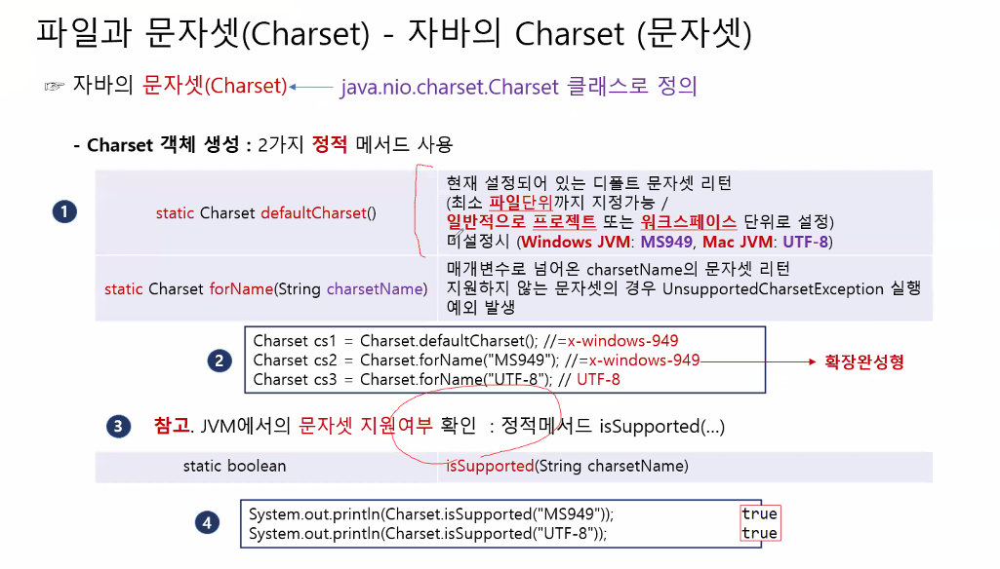  

문자열 -> byte[]  
byte[] getBytes() : 문자열을 문자셋을 이용하여 byte[]로 변환  
매개변수 : Charset charset 특정 문자셋을 이용하여 변환  
            String charsetName  
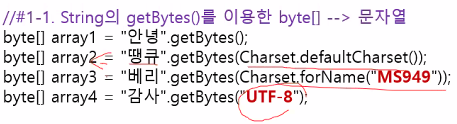  

# JAVA IO  

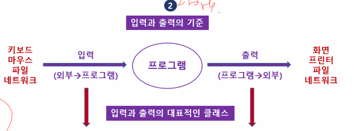
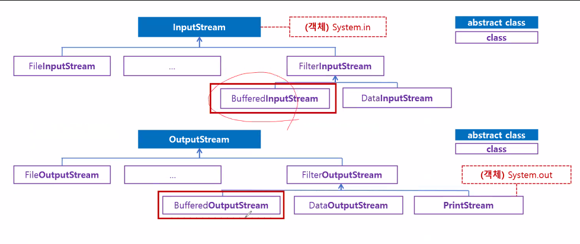  
### 입출력의 대표적인 클래스  

byte 단위의 입력 InputStream  
byte 단위의 출력 OutputStream  

---
char 단위의 입력 Reader  
char 단위의 출력 Writer  

### InputStream  
> byte 단위 입력을 수행하는 `추상클래스`  
#### 주요 메서드  
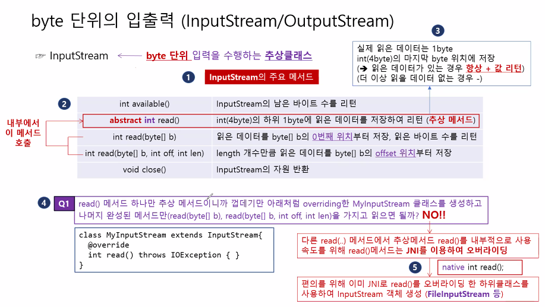  
- int `available()` : InputStream의 남은 byte 수 반환.  
- abstract int `read()` : int의 하위 1byte에 `읽은 데이터`를 저장하여 반환.  
항상 +(0~255) 값 리턴.  
더 이상 읽을 데이터가 없는 경우, -1을 반환.  
    
    ---
    매개변수 :  
    `(byte[] b)` : 읽은 데이터를 byte[] b의 `0번째 위치`부터 저장, `읽은 바이트 수`를 반환.  
    `(byte[] b, int off, int len)` : len 개수만큼 읽은 데이터를 byte[] b의 `offset 위치`부터 저장  
    
    ---
    매개변수가 있는 read가 read()를 호출하기 때문에, implements 할 때 무조건 read()의 내부를 구현해야 함.  

- void `close()` : InputStream의 자원 반환.  

### OutputStream
> byte 단위 출력을 수행하는 `추상클래스`  

#### 주요 메서드  
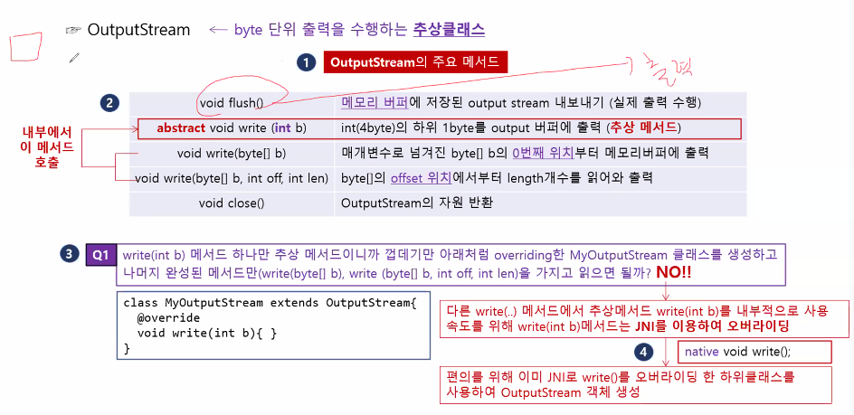  

- void `flush` : 메모리 버퍼에 저장된 output stream 내보내기 (실제 출력 수행)  

---
- abstract void `write (int b)` : int(4byte)의 하위 1byte를 output 버퍼에 출력  
    `매개변수` :  
    `(byte[] b)` : 매개변수로 넘겨진 byte[] b의 0번째 위치부터 메모리버퍼에 출력  
    `(byte[] b, int off, int len)` : byte[]의 offset 위치에서부터 len 개수를 읽어와 출력  
덜 썼음  

---

### FileInputStream  
> InputStream 인터페이스를 구현한 클래스  
read() 메서드가 구현되어 있음.  

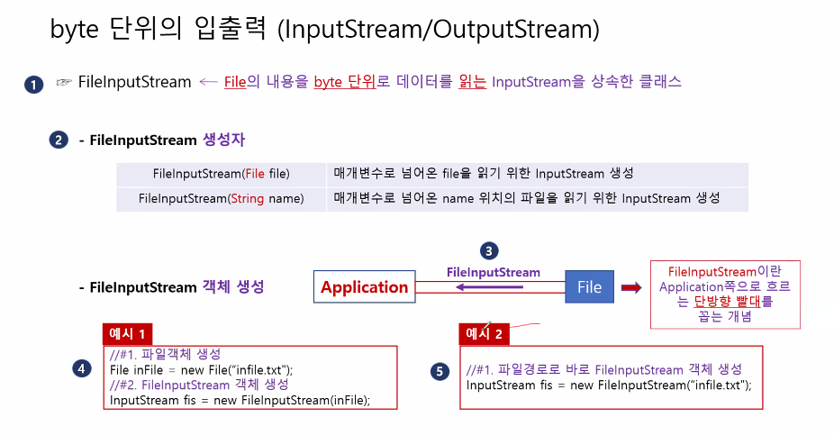  
---

- 메서드 :  

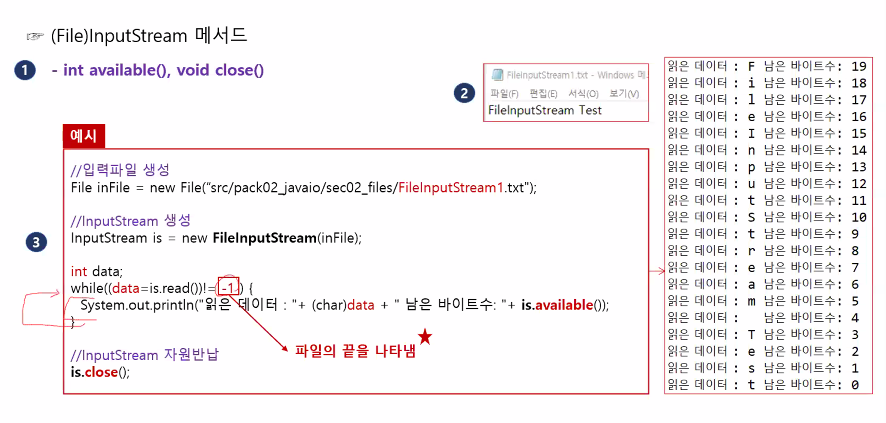  

#### 영어 읽기 예시
```
txt파일 내용 : 
FileInputStream Test
```
```java
import java.io.File;
import java.io.FileInputStream;
import java.io.IOException;
import java.io.InputStream;

public class FileInputStream_2 {
	public static void main(String[] args) throws IOException {
		// 입력 파일 생성
		File inFile = new File("src/FileInputStream1.txt");
		// 1. 1-byte 단위 읽기
		InputStream is1 = new FileInputStream(inFile);
		int data;
		while ((data=is1.read()) != -1) {
			System.out.println((char)data);     // FileInputStream Test 전부 출력
		}
		is1.close();
		System.out.println();
		System.out.println("---------------");
		// 2. n - byte 단위 읽기 (byte[]의 처음 위치에서부터 읽은 데이터 저장)
		InputStream is2 = new FileInputStream(inFile);
		byte[] byteArray1 = new byte[9];
		int count1;
		while ((count1 = is2.read(byteArray1)) != -1) {	// count1 = 9,9,2,-1 (9칸 배열에 9칸씩 끊어서 저장)
			for(int i=0; i<count1; i++) {
				System.out.println((char)byteArray1[i]);
			}
			System.out.println(": count1 = " + count1);     // 9글자씩 출력 후, 9, 9, 2 출력
		}
		is2.close();
		System.out.println();
		System.out.println("-------------");
		// 3. n-byte 단위읽기 (앞에서 length만큼 읽어 byte[] offset 위치에서부터 입력)
		InputStream is3 = new FileInputStream(inFile);
		byte[] byteArray2 = new byte[9];	// 최소 offset + length
		int offset = 3;
		int length = 6;
		int count2 = is3.read(byteArray2, offset, length);	// 9칸 배열의 offset(3번째 칸)부터 length(6)만큼 저장
		for(int i=0; i<offset + count2; i++) {
			System.out.println((char)byteArray2[i]);        // 공백 3개랑 F, i, l, e, I, n 출력
		}
		is3.close();
	}
}
```

한글 읽기는 read() 로는 불가능!!  
그냥 read()로 하면 1바이트 단위로 읽기 때문에 깨져서 보임  

한글은 `3byte` 단위로 읽음.  
그래서 `배열 크기`를 3의 배수로 해야 함.  

한글 읽기 예시 :  
```java
import java.io.File;
import java.io.FileInputStream;
import java.io.IOException;
import java.io.InputStream;
import java.nio.charset.Charset;

public class FileInputStream_3 {
	public static void main(String[] args) throws IOException {
		// 1. 입력 파일 생성
		File inFile = new File("src/FileInputStream2.txt");
		// 2. n-byte 단위 읽기(byte[] 의 처음 위치에서부터 읽은 데이터 저장
		InputStream is2 = new FileInputStream(inFile);
		byte[] byteArray1 = new byte[9];
		int count1;
		while((count1 = is2.read(byteArray1)) != -1) {
			String str = new String(byteArray1, 0, count1, Charset.forName("UTF-8"));   // "UTF-8"로 써도 됨. 

            			  // String(byte[] bytes, int offset, int length, Charset charset)
			System.out.print(str);
			System.out.println(": count = " + count1);  // 9바이트씩 끊어서 입력 후 출력하고, byte수 출력.
		}
		is2.close();
		System.out.println();
		System.out.println("----------------");
		// 3. n-byte 단위 읽기(앞에서 length 만큼 읽거 byte[] offset 위치에 넣기
		InputStream is3 = new FileInputStream(inFile);
		byte[] byteArray2 = new byte[9];	// 최소 offset + length
		int offset = 3;
		int length = 6;
		int count2 = is3.read(byteArray2, offset, length);
		String str = new String(byteArray2, 0, offset + count2, Charset.defaultCharset());
//		String str = new String(byteArray2, offset + count2, Charset.defaultCharset());
		System.out.println(str);    // 9칸짜리 배열의 offset(3)번째 칸부터, length(6)byte 만큼 입력 후 출력
		is3.close();
	}
}
```
ㅤ  
- 결과 : 
    ```
    안녕하: count = 9
    세요: count = 6

    ----------------
       안녕
    ```
ㅤ  
---

### FileOutputStream  
> OutputStream 인터페이스를 구현한 클래스
write() 메서드가 구현되어 있음.  

- 생성 :  
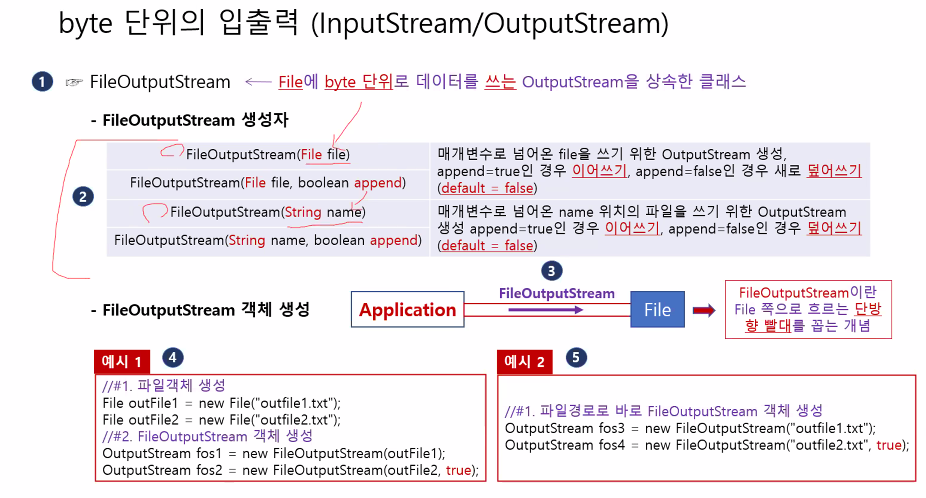  
ㅤ  
---  
ㅤ  
- 메서드 :  
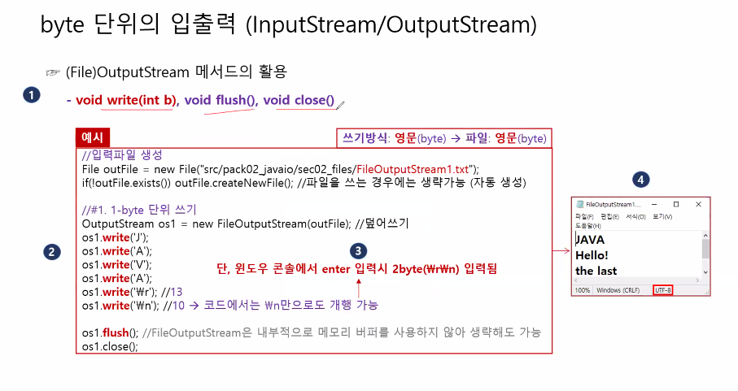
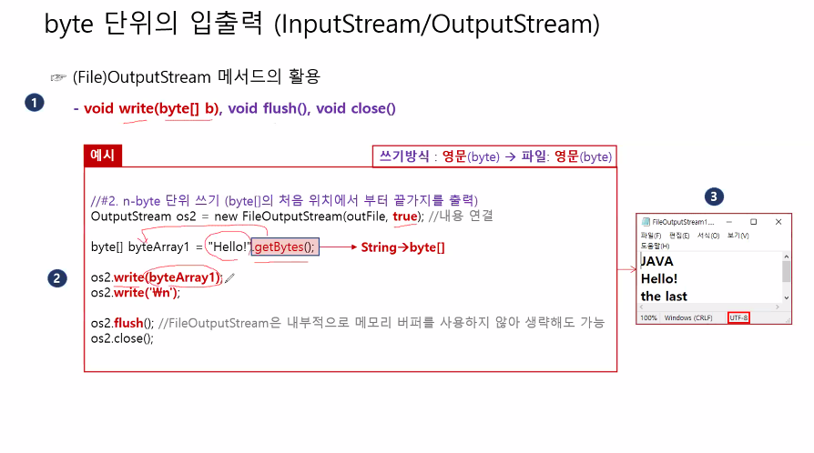
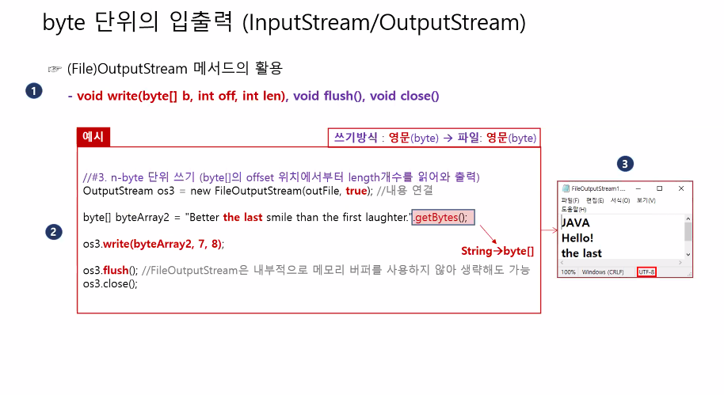  

!! 생성자에 매개변수 append를 주지 않으면, 기존에 있는 파일 내용을 덮어써버림 !!  

append = true 값을 주면, 이어쓰기 가능.  
`write`로 char, int들을 메모리 버퍼에 넣고,  
`flush`로 메모리 버퍼에 있는 자료들을 한 번에 출력.  

- read의 offset은, `배열`의 offset을 가리킴.  
write의 offset은, `파일 내용`의 offset을 가리킴.  

- 영어 쓰기 예시 :  
    ```java
    import java.io.File;
    import java.io.FileOutputStream;
    import java.io.IOException;
    import java.io.OutputStream;

    public class FileOutputStream_1 {
        public static void main(String[] args) throws IOException{
            // 입력 파일 생성
            File outFile = new File("src/FileOutputStream1.txt");
            
            // 1. 1-byte 단위 쓰기
            OutputStream os1 = new FileOutputStream(outFile);
            os1.write('J');
            os1.write('A');
            os1.write('V');
            os1.write('A');
            os1.write('\r');
            os1.write('\n');
            os1.flush();
            os1.close();
            // 2. n-byte 단위 쓰기(byte[]의 처음부터 끝까지 데이터 쓰기)
            OutputStream os2 = new FileOutputStream(outFile, true); // 내용 연결
            byte[] byteArray1 = "Hello".getBytes();     // Hello의 byte값들을 가져와 배열 byteArray1에 저장
            os2.write(byteArray1);
            os2.write('\n');
            os2.flush();
            os2.close();
            // 3. n-byte 단위 쓰기(byte[]의 offset부터 length개의 byte 데이터 쓰기)
            OutputStream os3 = new FileOutputStream(outFile, true);	//내용 연결
            byte[] byteArray2 = "Better the last smile than the first laughter".getBytes();
            os3.write(byteArray2, 7, 8);    // byteArray2의 7번부터 8만큼 쓰기
            os3.flush();
            os3.close();
        }
    }
    ```
- 결과:  
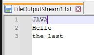  
---

#### 한글 쓰기도 읽기와 마찬가지로 3bytes 단위로 끊음.  

- 한글 쓰기 예시  
    ```java
    import java.io.File;
    import java.io.FileOutputStream;
    import java.io.IOException;
    import java.io.OutputStream;
    import java.nio.charset.Charset;

    public class FileOutputStream_2 {
        public static void main(String[] args) throws IOException {
            // 1. 입력  파일 생성
            File outFile = new File("src/FileOutputStream2.txt");
            // 2. n-byte 단위 쓰기(byte[]의 처음부터 끝까지 데이터 쓰기)
            OutputStream os2 = new FileOutputStream(outFile, true);	// 내용 연결
            byte[] byteArray1 = "안녕하세요".getBytes(Charset.forName("UTF-8"));
            os2.write(byteArray1);
            os2.write('\n');
            os2.flush();
            os2.close();
            // 3. n-byte 단위 쓰기(byte[]의 offset부터 length개의 byte 데이터 쓰기)
            OutputStream os3 = new FileOutputStream(outFile, true);	// 내용 연결
            byte[] byteArray2 = "반갑습니다".getBytes(Charset.defaultCharset());
            os3.write(byteArray2, 6, 6);    // Offset = (3+3) 두번째. length = (3+3) 2개
            os3.flush();
            os3.close();
        }
    }
    ```
- 결과 :  
    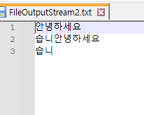  

## System.in 객체 사용  
`System.in` :  
자바 API에서 제공하는, `콘솔 입력`을 위한 InputStream 정적 객체.  

`특징`: 한 줄 단위로만 입력 처리.  
값 입력 시점 -> Enter 입력.  

```java
InputStream is = new FileInputStream(FileDescriptor.in);
// 콘솔로 입력
InputStream os = new FileOutputStream(FileDescriptor.out);
// 콘솔로 출력
```

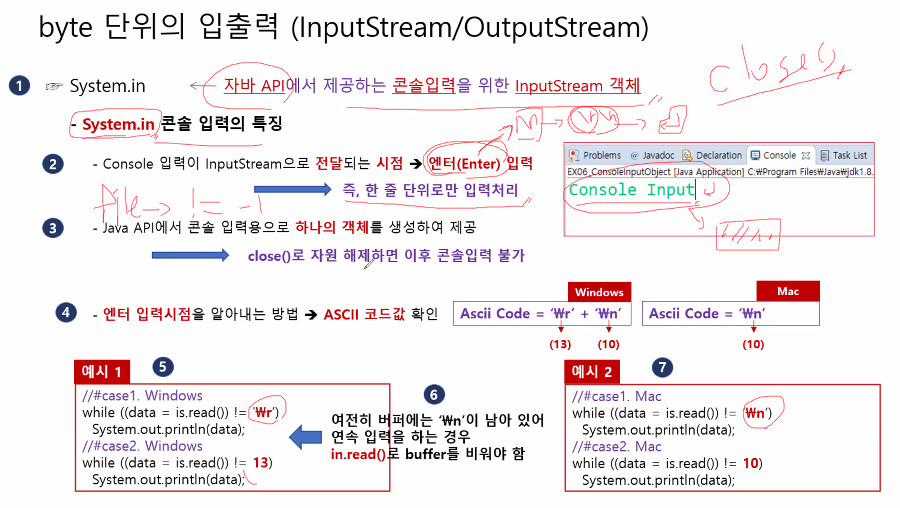  

콘솔로 입력 받은 값을 버퍼에 저장할 때,  연속으로 입력할 경우, 버퍼에 `\n`이 남아 있어 `in.read()`로 버퍼를 비워줘야 함.  

- 영어 `byte` 단위, `byte 배열` 단위 입력 예시 :  

```java
import java.io.IOException;
import java.io.InputStream;

public class ConsoleInputObject_2 {
	public static void main(String[] args) throws IOException {
		InputStream is = System.in;
		// 1. 1-byte 단위 읽기
		int data;
		while((data = is.read()) != '\r') {
			System.out.print((char)data);
		}
		is.read();	// \n(10)
		System.out.println();
		System.out.println();
		
		// 2. n-byte 단위 읽기(byte[]의 처음 위치에서부터 읽은 데이터 저장)
		byte[] byteArray1 = new byte[100];
		int count1 = is.read(byteArray1);
		for(int i=0;i<count1;i++)
			System.out.print((char)byteArray1[i]);
		System.out.println(": count = " + count1);
		System.out.println();
		
		// 3. n-byte 단위 읽기(앞에서 length만큼 읽어 byte[] offset 위치에 넣음)
		byte[] byteArray2 = new byte[8]; // offset + length
		int offset = 3;
		int length = 5;
		int count2 = is.read(byteArray2, offset, length);
		for(int i=0; i<offset + count2; i++) {
			System.out.print((char)byteArray2[i]);
		}
		System.out.println(": count = " + count2);
	}
}
```
- 결과 :  
    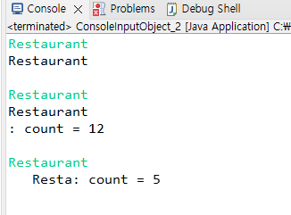

- 한글 입력 예시 :  
```java
import java.io.IOException;
import java.io.InputStream;
import java.nio.charset.Charset;

public class ConsoleInputObject_3 {
	public static void main(String[] args) throws IOException {
		InputStream is = System.in;
		// n-byte 단위 읽기(byte[]의 처음 위치에서부터 읽은 데이터를 저장)
		byte[] byteArray1 = new byte[100];
		int count1 = is.read(byteArray1);
		String str1 = new String(byteArray1, 0, count1, Charset.forName("UTF-8"));
		System.out.println(str1);
		// n-byte 단위 읽기 (앞에서 length만큼 읽어 byte[] 의 offset 위치에 넣기
		byte[] byteArray2 = new byte[9];	//offset + length
		int offset = 3;
		int length = 6;
		int count2 = is.read(byteArray2, offset, length);
		String str2 = new String(byteArray2, 0, offset + count2, Charset.defaultCharset());
		System.out.println(str2);
		is.close();
	}
}
```
ㅤ  
ㅤ  
## System.out 객체 사용  

자바 API에서 제공하는 콘솔 출력을 위한 OutputStream(PrintStream) static 객체  

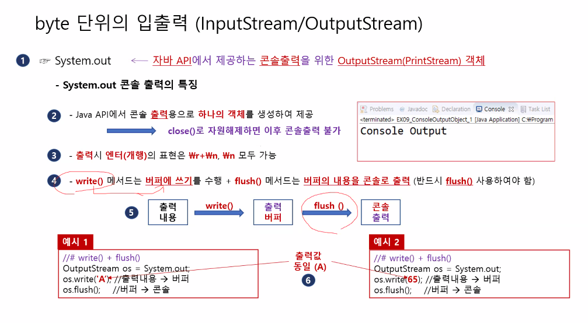
close()로 자원 해제하면 이후 콘솔 출력 불가.  

출력시 엔터(개행) 표현은 `\r`+`\n`, `\n` 둘 다 가능.  

`write()`로 버퍼에 쓰기, `flush()`로 버퍼 내용을 콘솔로 출력.  

---

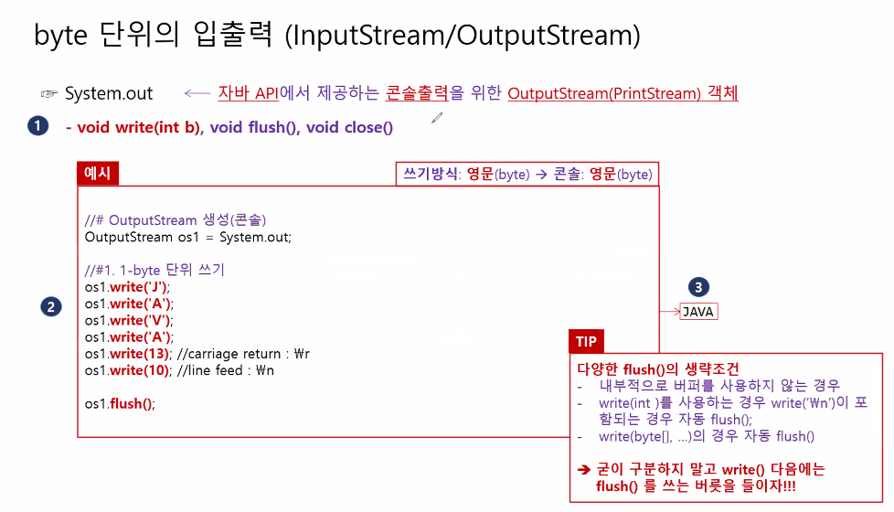  
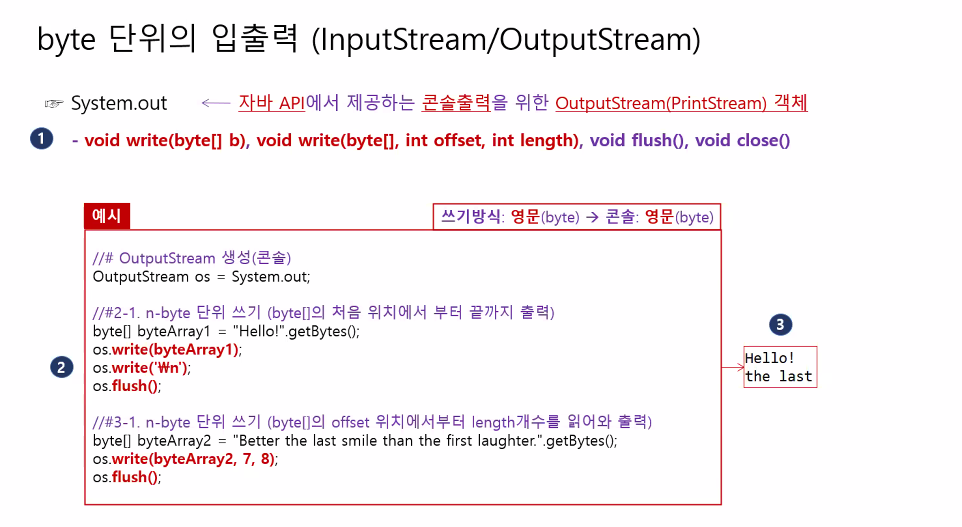  

ㅤ  
ㅤ  

## 입출력의 Filtering (FilterInput/OutputStream)  

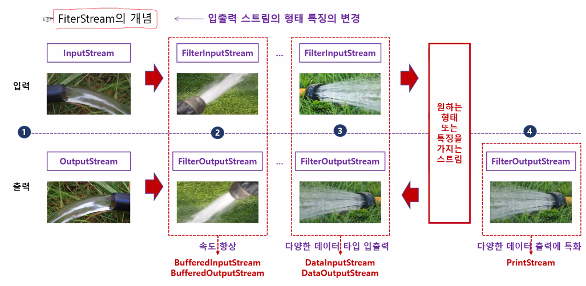  

Buffered 빠른 속도  
Data 다양한 데이터 다룰 수 있음  

---
ㅤ  
ㅤ  
### Buffered Input/OutputStream  

> 입출력 과정에서 메모리 버퍼를 사용하여 `속도 향상`  

1. BufferedInput/OutputStream`(InputStream in)`  
    기본 크기 사용  
2. BufferedInput/OutputStream`(InputStream in, int size)`  
    직접 Buffer size 지정  

- BufferedStream 객체 생성 방법 :  
      
    ```java
    File f = new File("scr/abc/bcd/text.txt");  // File 객체 생성
    InputStream is = new FileInputStream(f);    // FileInputStream 객체 생성
    BufferedInputStream bis = new BufferedInputStream(is);  //BufferedInputStream 객체 생성
    ```

- 파일 복사 예시 :    

```java
import java.io.BufferedInputStream;
import java.io.BufferedOutputStream;
import java.io.File;
import java.io.FileInputStream;
import java.io.FileOutputStream;
import java.io.IOException;
import java.io.InputStream;
import java.io.OutputStream;

public class BufferedInputOutputStream {
	public static void main(String[] args) {
		// 파일 생성
		File orgfile = new File("src/mycat_origin.jpg");
		File copyfile1 = new File("src/mycat_copy1.jpg");
		File copyfile2 = new File("src/mycat_copy2.jpg");
		long start, end, time1, time2;
		// 1. BufferedInputStream, BufferedOutputStream 사용 X
		start = System.nanoTime();
		try(InputStream is = new FileInputStream(orgfile);
			OutputStream os = new FileOutputStream(copyfile1);){
			// 복사하는 코드
			int data;
			while((data = is.read()) != -1) {
				os.write(data);
			}
		} catch(IOException e) {e.printStackTrace();}
		end = System.nanoTime();
		time1 = end - start;
		System.out.println("Without BufferedXXXStream: " + time1);
		
		// 2. BufferedInputStream, BufferedOutputStream 사용
		start = System.nanoTime();
		try(InputStream is = new FileInputStream(orgfile);
			BufferedInputStream bis = new BufferedInputStream(is);
			OutputStream os = new FileOutputStream(copyfile2);
			BufferedOutputStream bos = new BufferedOutputStream(os);){
			// 복사하는 코드
			int data;
			while((data = bis.read()) != -1) {
				 bos.write(data);
			}
		}catch(IOException e) {e.printStackTrace();}
		end = System.nanoTime();
		time2 = end - start;
		System.out.println("With BufferedXXXStream: " + time2);
		// 비교 
		System.out.println("Ratio of with and without: " + time1/time2);
	}
}
```
결과 :  
```
Without BufferedXXXStream: 163896000
With BufferedXXXStream: 2815900
Ratio of with and without: 58
```
ㅤ  
ㅤ  

## DataInput/OutputStream  
byte[] 배열로 다양한 데이터를 다룰 수는 있지만,  
타입별로 다루는 로직을 작성해야 하는 번거로움이 있음.  
DataInput/OutputStream은 이를 해결할 수 있음.  


#### DataInput/OutputStream 객체 생성 방법 :  
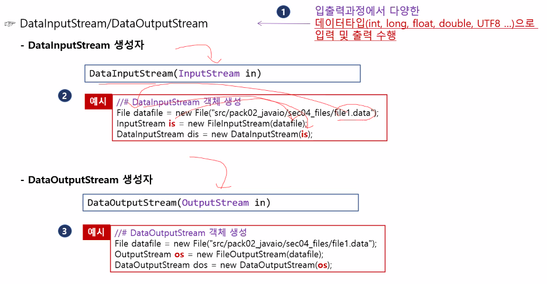  
File 객체 생성 -> FileInput/OutputStream 객체 생성 ->  
DataInput/OutputStream 객체 생성  

```java
File f = new File("scr/abc/bcd/text.txt");  // File 객체 생성
InputStream is = new FileInputStream(f);    // FileInputStream 객체 생성
DataInputStream bis = new DataInputStream(is);  //DataInputStream 객체 생성
```

#### 메서드 :  
  

데이터 쓰고 읽기 예시 :  
```java
import java.io.DataInputStream;
import java.io.DataOutputStream;
import java.io.File;
import java.io.FileInputStream;
import java.io.FileOutputStream;
import java.io.IOException;
import java.io.InputStream;
import java.io.OutputStream;

public class DataInputOutputStream {
	public static void main(String[] args) throws IOException {
		// 파일 생성
		File dataFile = new File("src/file1.data");
		// 데이터 쓰기(DataOutputStream)
		try(OutputStream os = new FileOutputStream(dataFile);
			DataOutputStream dos = new DataOutputStream(os);){
			dos.writeInt(35);		// 4byte
			dos.writeDouble(5.8);	// 8byte
			dos.writeChar('A');		// 2byte
			dos.writeUTF("안녕하세요");	//3*5byte
									// \r\n 1 + 1 byte
			dos.flush();
		}
		// 데이터 읽기 (DataInputStream)
		try(InputStream is = new FileInputStream(dataFile);
			DataInputStream dis = new DataInputStream(is);){
			System.out.println(dis.readInt());
			System.out.println(dis.readDouble());
			System.out.println(dis.readChar());
			System.out.println(dis.readUTF());
			// 입력한 순서대로 읽어야 제대로 읽어옴.
		}
	}
}
```

- 결과 :  

file1.data 내용 :  
 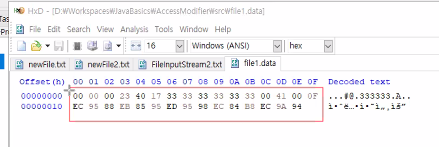
```
35
5.8
A
안녕하세요
```


ㅤ  
ㅤ  
## CombinedFilter  

Data와 Buffered를 합칠 수 있음.  
향상된 속도로 다양한 데이터 입출력 가능.  

객체 생성 방법 :  
File 객체 생성 -> FileInput/OutputStream 객체 생성 -> BufferedInput/OutputStream 객체 생성 -> DataInput/OutputStream 객체 생성  

FileInput/OutputStream 이후로는  
둘 다 자녀 클래스라서 생성하는 순서는 아무렇게나 해도 문법적으로 상관 없긴 함.  
그러나 DataIOStream을 BufferedIOStream으로 감싸지 않으면, 즉 DataIOStream을 마지막으로 하지 않으면, `DataIOStream의 메서드`를 사용할 수 없게 됨.  

위의 파일 쓰고 읽기 예시에 CombinedFilter을 적용한 예시 :  

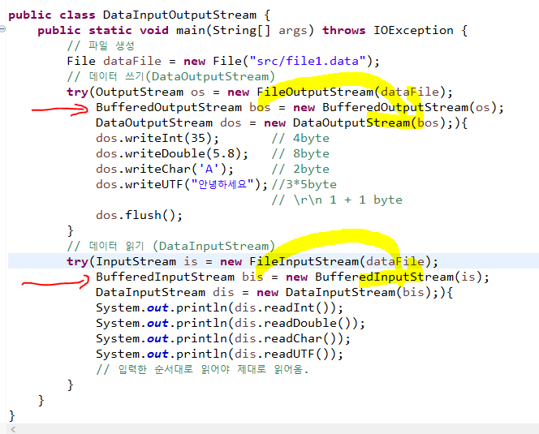  
ㅤ  
ㅤ  

## PrintStream  
#### 다양한 출력에 특화 됨. 내부적으로 flush가 자동으로 일어남.  

생성자 :  
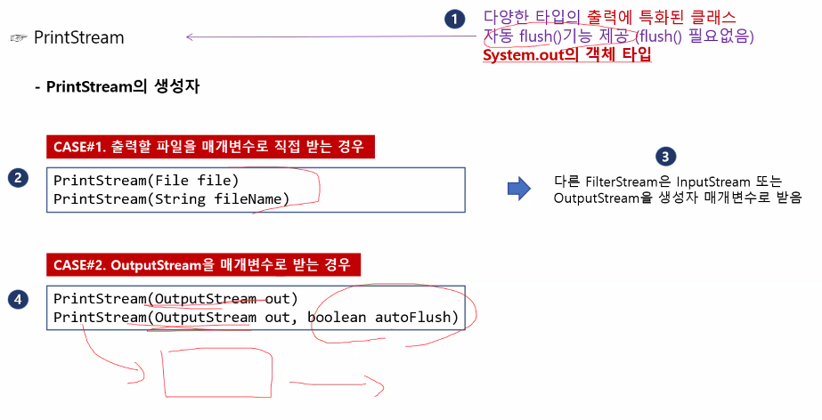  

메서드 :  
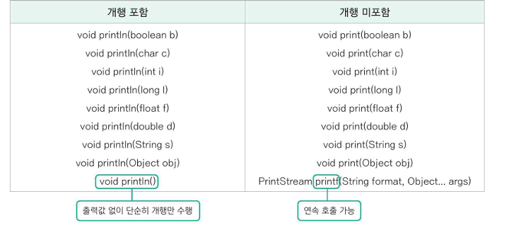  

.printf().printf() 이런 식으로 연달아 호출하는 방식을 체인 메서드라고 함. 자바 스크립트에서 자주 사용.  

파일 입출력 예시 :  
```java
package PrintStreamEx;

import java.io.File;
import java.io.FileNotFoundException;
import java.io.FileOutputStream;
import java.io.IOException;
import java.io.OutputStream;
import java.io.PrintStream;

public class PrintStreamEx {
	public static void main(String[] args) throws FileNotFoundException, IOException{
		// File 객체 생성
		File outFile1 = new File("src/Print-Stream1.txt");
		File outFile2 = new File("src/Print-Stream2.txt");
		// 1. PrintStream(FileOutputStream(File))
		try(OutputStream os1 = new FileOutputStream(outFile1);
			PrintStream ps = new PrintStream(os1);){
			ps.println(5.8);
			ps.print(3 + " 안녕 " + 12345 + "\n");
			ps.printf("%d", 7).printf("%s %f", "안녕", 5.8);
			ps.println();
		} catch(IOException e) {}
		// 2. PrintStream(File)
		try(PrintStream ps = new PrintStream(outFile2);){
			ps.println(5.8);
			ps.print(3 + " 안녕 " + 12345 + "\n");
			ps.printf("%d", 7).printf("%s %f", "안녕", 5.8);
			ps.println();
		} catch(IOException e) {}
		// 3. PrintStream ps = System.out
		try(OutputStream os2 = System.out;
			PrintStream ps = new PrintStream(os2)){
			ps.println(5.8);
			ps.print(3+ " 안녕 " + 12345 + "\n");
			ps.printf("%d", 7).printf("%s %f", "안녕", 5.8);
			ps.println();
			} catch(IOException e) {}
	}
}
```
결과 :  
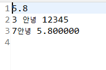
ㅤ  
ㅤ  

---

# char 단위 입출력 (Reader/Writer)  

InputStream -> Reader  
OutputStream -> Writer  

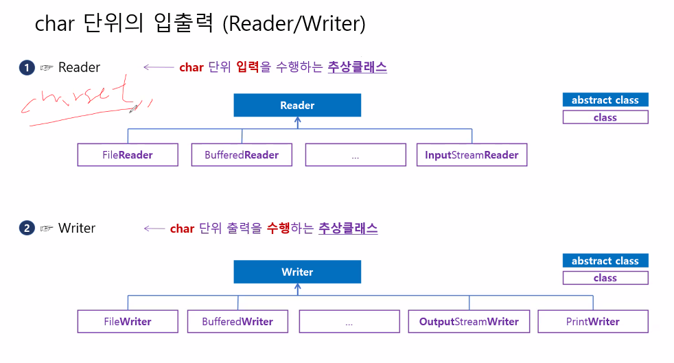  

## Reader  
> char 단위 입력을 수행하는 추상 클래스  
- 메서드 :  
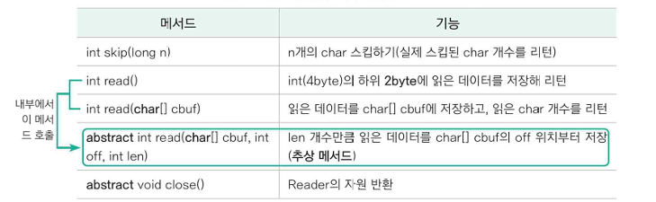  
byte[] 대신 `char[]` 받음.  
---

## Writer  

- 메서드 :  
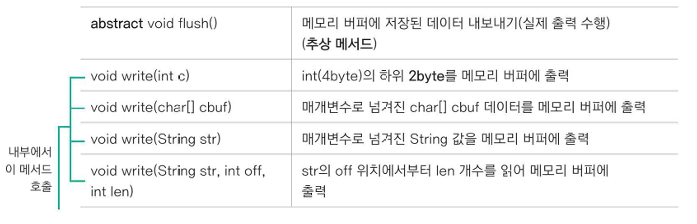  
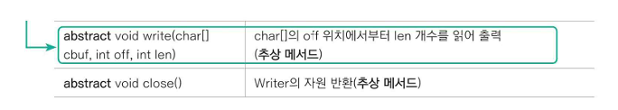  

매개변수로 넘겨진 문자열을 byte처리 하지 않고 `그대로` 출력.  

---  

### Reader, Writer 생성자  
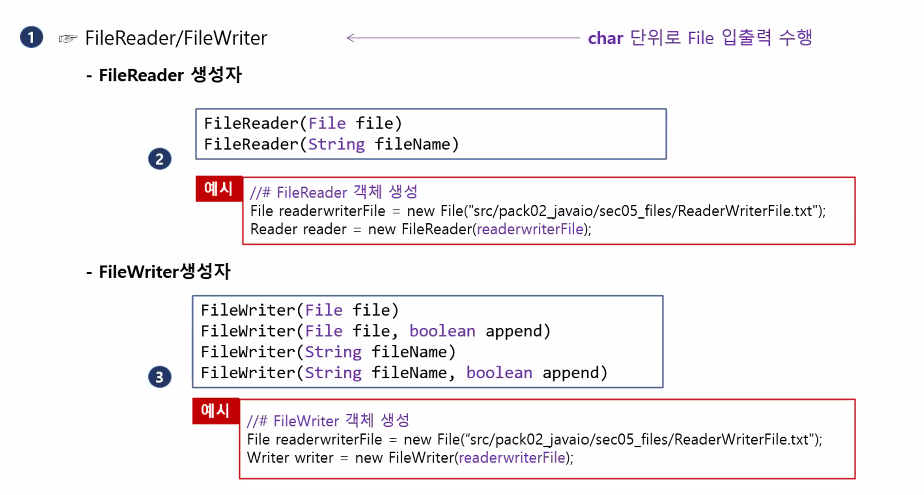  

파일 쓰고 읽기 예시 :  
```java
package FileReaderWriter;

import java.io.File;
import java.io.FileReader;
import java.io.FileWriter;
import java.io.IOException;
import java.io.Reader;
import java.io.Writer;

public class FileReaderWriter {
	public static void main(String[] args) {
		// 파일 객체 생성
		File rwf = new File("src/Reader-WriterFile.txt");
		// 1. FileWriter를 이용한 파일 쓰기(UTF-8모드)
		try(Writer w = new FileWriter(rwf)){
			w.write("안녕하세요\n".toCharArray());
            // char[] c = ("안녕하세요\n".toCharArray())
            //w.write(c);
			w.write("Hello");
			w.write('\r');
			w.write('\n');
			w.write("반갑습니다.", 2, 3);
			w.flush();
		} catch(IOException e) {}
		// 2. FileReader를 이용한 파일 읽기 (UTF-8 모드)
		try(Reader r = new FileReader(rwf)){
			int data;
			while((data = r.read()) != -1) {
				System.out.println((char)data);
			}
		}catch(IOException e) {}
	}
}
```  


## BufferedReader/Writer  
BufferedWriter == BufferedOutputStream  
BufferedReader는 BufferedInputStream이랑 똑같은데, `메서드 하나`가 추가 됨.  

  

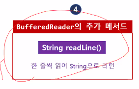  

### read()와 readLine()
```java
// 1. read()를 이용한 파일 읽기
try(Reader r = new FileReader(rwf)){
	int data;
	while((data = r.read()) != -1) {
		System.out.println((char)data);
	}

// 2. readLine()을 이용한 파일 읽기
try(Reader r = new FileReader(rwf);
	BufferedReader br = new BufferedReader(r);){
	String data;
	while((data=br.readLine()) != null) {
		System.out.println(data);
	}
} catch(IOException e) {}
```  

---

### InputStreamReader, OutputStreamWriter  

>InputStream을 Reader로 변환 또는  
OutputStream을 Writer로 변환할 때 사용.  

그냥 읽어오면 파일이 깨짐.  
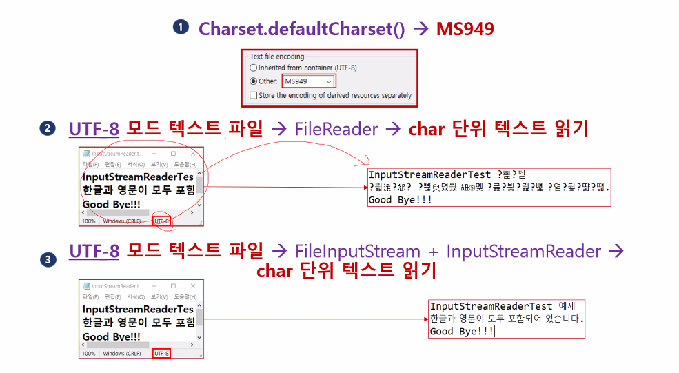


- 생성자 :  

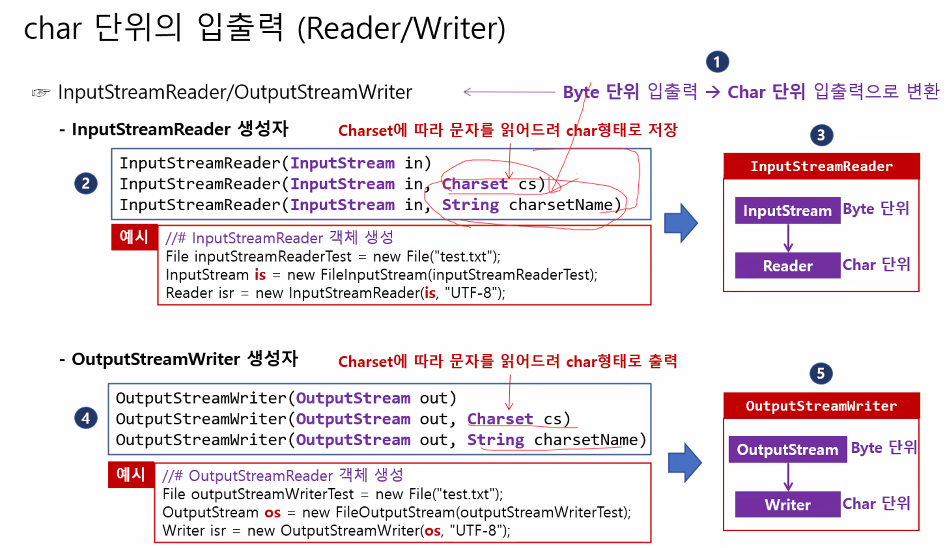  

---

### InputStreamReader로 파일 읽기 예시 :  
```java
public class InputStreamReader_1 {
	public static void main(String[] args) {
		// 파일 객체 생성
		File inputStreamReader = new File("src/Input-StreamReader.txt");
        //FileInputStream + InputStreamReader를 이용한 파일 읽기
		try(InputStream is = new FileInputStream(inputStreamReader);
			InputStreamReader isr = new InputStreamReader(is,"MS949");){
			int data;
			while((data = isr.read()) != -1) {
				System.out.print((char)data);
			}
			System.out.println("\n" + isr.getEncoding());	// MS949
		} catch(IOException e) {}
	}
}
```
- 결과 :  
```
파일 내용 출력, 인코딩 타입 출력.  
```

---

### 콘솔(System.in)로 읽기 예시 :  
```java
package InputStreamReader_2;

import java.io.IOException;
import java.io.InputStreamReader;

public class InputStreamReader_2 {
	public static void main(String[] args) {
		// 콘솔로 입력(UTF-8)
		try {
			InputStreamReader isr = new InputStreamReader(System.in, "UTF-8");
			int data;
			while((data = isr.read()) != '\r') {
				System.out.print((char)data);
			}
			System.out.println("\n" + isr.getEncoding());
		} catch(IOException e) {}
		// 콘솔로 입력(MS949)
		try {
			InputStreamReader isr = new InputStreamReader(System.in, "MS949");
			int data;
			while((data = isr.read()) != '\r') {
				System.out.print((char)data);
			}
			System.out.println("\n" + isr.getEncoding());
		} catch(IOException e) {}
	}
}
```
- 결과 :  
```
입력한 내용 출력, 인코딩 타입 출력.  
```

---

### OutputStreamWriter로 쓰기 예시 :  
```java
import java.io.File;
import java.io.FileOutputStream;
import java.io.FileWriter;
import java.io.IOException;
import java.io.OutputStream;
import java.io.OutputStreamWriter;
import java.io.Writer;

public class OutputStreamWriter_1 {
	public static void main(String[] args) {
		// 1. FileWriter를 이용해 데이터 쓰기
		File file = new File("src/OutputStreamWriter1.txt");
		try(Writer w = new FileWriter(file1);){
			w.write("OutputStreamWriter1 예제파일입니다.\n".toCharArray());
			w.write("한글과 영문이 모두 포함돼 있습니다.");
			w.write('\n');
			w.write("Good Bye!!!\n\n");
			w.flush();
		} catch(IOException e) {}
		// 2. FileWriter 이용해 데이터 쓰기(기본값인 UTF-8 -> MS949파일 생성)
		File file2 = new File("src/Output-StreamWriter2.txt");
		try(OutputStream os = new FileOutputStream(file2, false);
			OutputStreamWriter osw = new OutputStreamWriter(os, "MS949");){
			osw.write("OutputStreamWriter1 예제파일입니다.\n".toCharArray());
			osw.write("한글과 영문이 모두 포함돼 있습니다.");
			osw.write('\n');
			osw.write("Good Bye!!!\n\n");
			osw.flush();
			System.out.println(osw.getEncoding());	//MS949
		} catch(IOException e) {}
	}
}
```
- 결과 :  
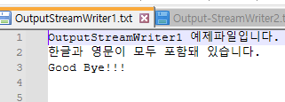  
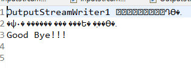  

```
MS949
```

---

### 콘솔(System.Out)으로 출력 예시 :  

```java
package OutputStreamWriter_2;

import java.io.IOException;
import java.io.OutputStreamWriter;

public class OutputStreamWriter_2 {
	public static void main(String[] args) {
		// 1. 콘솔 출력1(기본값: UTF-8 -> UTF-8)
		try {
			OutputStreamWriter osw = new OutputStreamWriter(System.out, "UTF-8");
			osw.write("OutputStreamWriter를 이용한\n".toCharArray());
			osw.write("콘솔 출력 예제입니다. \n 한글과 영문이 모두 포함돼 있습니다.");
			osw.write("\n");
			osw.write("Good Bye!!!\n");
			osw.flush();
			System.out.println(osw.getEncoding());
		} catch(IOException e) {}
		System.out.println();
		// 2. 콘솔 출력 2(기본값: UTF-8 -> MS949)
		try {
			OutputStreamWriter osw = new OutputStreamWriter(System.out,"MS949");
			osw.write("OutputStreamWriter를 이용한\n".toCharArray());
			osw.write("콘솔 출력 예제입니다. \n 한글과 영문이 모두 포함돼 있습니다.");
			osw.write("\n");
			osw.write("Good Bye!!!\n");
			osw.flush();
			osw.flush();
			System.out.println(osw.getEncoding());
		} catch(IOException e) {}
		System.out.println();
	}
}
```
- 결과 :  
    ```
    OutputStreamWriter를 이용한
    콘솔 출력 예제입니다. 
    한글과 영문이 모두 포함돼 있습니다.
    Good Bye!!!
    UTF8

    OutputStreamWriter�� �̿���
    �ܼ� ��� �����Դϴ�. 
    �ѱ۰� ������ ��� ���Ե� �ֽ��ϴ�.
    Good Bye!!!
    MS949

    ```
---

### InputStream / OutputStream 은 byte[] 단위 입출력.  
### Reader / Writer은 char[] 단위 입출력. (<- 이게 더 쓰기 편함)  
### 근데 byte[] 단위로 되어있는 데이터를 Reader / Writer로 사용하고 싶으면, InputStreamReader / OutputStreamWriter을 사용함.  

---

### PrintWriter  
PrintStream이랑 같음. 자동 flush()  
autoFlush 기본값 false. 사용하려면 true로 바꿔줌.  
#### 생성자 : (매개변수 : File, OutputStream, Writer, System.out)
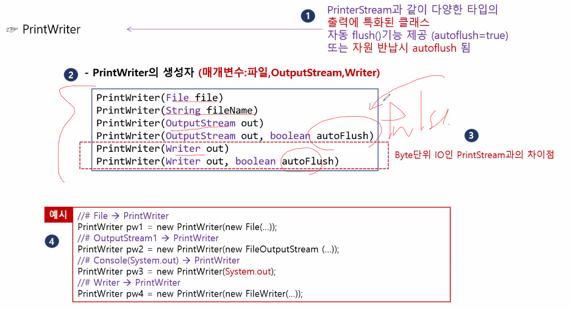  

```java
		// 1. PrintWriter(File file) 생성자
		try(PrintWriter pw = new PrintWriter(file1);){
			pw.println("PrintWriter 예제#1");
		}catch(IOException e) {}
		// 2. PrintWriter(OutputStream out) 생성자
		try(PrintWriter pw = new PrintWriter(new FileOutputStream(file2));){
			pw.println("PrintWriter 예제#2");
		} catch(IOException e) {}
		// 3. PrintWriter(Writer out) 생성자
		try(PrintWriter pw = new PrintWriter(new FileWriter(file3));){
			pw.println("PrintWriter 예제#3");
		} catch(IOException e) {}
		// 4. PrintWriter(System.out) 생성자
		PrintWriter pw = new PrintWriter(System.out, true);	//자동 flush 설정
		pw.println("PrintWriter 예제#4");
```

#### 메서드 :  
  

