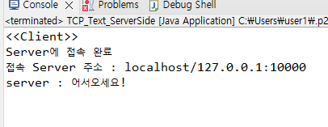

## cmd 명령어  
- netstat -ano : 실행중인 프로세스 목록 표시  
- taskkill /pid 프로세스번호 /F : /F는 강제. 해당 프로세스 종료  


## IP 주소 (Internet Protocol Address)  
인터넷 상 장치간 통신을 위한 장치 식별 주소  
IPv4, IPv6로 나뉨.  


### IPv4  
32bit(4byte) 체계  
1byte씩 4칸 점(.)으로 분리하여 표기
```
0~255. 0~255. 0~255. 0~255
부호 없는 정수
```  
loop back 주소  
127.0.0.1 : 이 주소로 데이터를 보내면 다시 돌아옴.  

### IPv6  
IOT 개념이 생기면서 서서히 도입됨.  
주소의 개수 부족에 대한 해결방안.  
128bit(16byte) 체계  
2byte씩 콜론(:)으로 분리하여 표기  
```
[0000-FFFF]:[0000-FFFF]:[0000-FFFF]:[0000-FFFF]:[0000-FFFF]:[0000-FFFF]:[0000-FFFF]:[0000-FFFF]
16진수

(0000 이면 콜론 두 개(::)로 생략하여 표현함.)
```

## IP 주소의 분류  
네트워크 ID, 호스트 ID  

C 클래스 기준,  
IP 주소와 서브넷 마스크를 AND 연산하여 나온 값 중  
`네트워크 ID` : 앞 3칸  
`호스트 ID` : 마지막 1칸  

  

`클래스 별로 Host 주소 범위가 다름.`  
실질적으로 사용되는 클래스 : A B C  

#### Host 주소 범위보다, 할당 가능 호스트 수가 2개 적은 이유?  
000은 네트워크 이름으로 사용하고, 255는 브로드캐스트 전용으로 사용하기 때문에 할당할 수 없음.  

## 서브넷 마스크(subnet mask)  
IP 주소를 더 쪼개서, 네트워크 ID로 사용할 수 있도록 함.  
할당 가능한 호스트 수가 너무 많이 남아 낭비될 수 있는 상황을 해결할 수 있음.  

예시)  
서브넷 마스크가 255.255.0.0인 경우,  
IP 주소와 AND 연산을 거치면, IP주소 앞부분.. .0.0이 된다.  
이를 네트워크 ID로 사용한다.  
  


## 사설, 공인 IP (8 page)  
공인IP :  
외부에서 바라보는 IP.  
inconfig.kr 에서 나오는 IP가 공인 IP.  

사설 IP :  
내부에서 바라보는 IP.  
내부에서만 사용하는 IP이기 때문에, 다른 네트워크마다 같은 IP 사용 가능.  
cmd - ipconfig 하면 나오는 IP가 사설 IP.  

공유기 사용자는, `하나의 공인 IP`를 사용.  
공유기 내에서 여러 사람들이 사설 IP를 나눠서 사용.  

Router : 공인 IP 주소를 설정해줌.  

## 포트 (Port)  
프로세스에 대한 정보.  
IP주소가 집 주소라면, Port는 방 번호라고 생각하면 됨  
Port의 범위는 0 ~ 65,535  
Well-known-Port : 0 ~ 1023  

## TCP, UDP  

#### TCP  
패킷 전송시에 오류가 발생하면 재전송.  
연결성 프로토콜로, 연결을 유지해 놓아야 하기 때문에 시스템 부하가 높아지고, 속도가 느림.  
(수신 순서, 전송 순서 같음.)
대신 신뢰성이 높음.  

파일 전송같은 데이터의 신뢰성이 필요한 서비스에 사용.  

전송 데이터 크기 제한 없음.  

서비스 이용 시, 서버와 클라이언트의 포트는 같을 필요 없음. (같지도 않음)  
(나가는 문은 랜덤)  

---
#### UDP  
전송 데이터에 오류가 발생하면 데이터 삭제, 재전송하지 않음.  
비연결성 프로토콜로, 각각의 데이터그램은 다른 경로를 통해 도착할 수 있음.  
(수신 순서, 전송 순서가 다를 수 있음.)
신뢰성이 낮지만 데이터 전달 속도가 빠름.  

생방송 같이 실시간성이 중요한 서비스에 주로 사용됨.  

전송 데이터 크기가 제한되어 있음.  
(헤더 포함 65,535bit)  

데이터그램이라는 패킷으로 포장하여 전송.  

수신 여부 확인도 하지 않음.  

  


### 유니캐스팅, 멀티캐스팅, 브로드캐스팅  

- 유니 캐스팅  
하나의 특정 목적지  

- 멀티 캐스팅  
다중 특정 목적지  

- 브로드 캐스팅  
모든 목적지  

# InetAddress, InetSocketAddress  
주소를 저장하는 대표적인 클래스  

### InetAddress 클래스 객체 생성  
>IP 주소와 호스트 이름을 저장, 관리하는 클래스.  
(Port 번호 저장 X)  

>public 생성자를 제공하지 않음.  
`static 메서드를 통해` 생성자를 호출하여 `객체 생성`.  

  
  

---

### Inet Address의 메서드  

  

※ InetAddress.toString() 메서드는 ‘호스트 이름/IP 주소’를 문자열로 리턴하도록
오버로딩되어 있어 System.out.println(InetAddress 객체)를 통해 호스트, IP 정보
확인 가능.  

#### ping이란?  
해당 단말기가 켜져 있는지 확인하는데에 사용되는 명령  
패킷 전송 후, 호스트가 응답을 보내면 이를 분석해서 네트워크 상태를 진단함.  

공격하는 데에 사용될 수 있어서 요즘은 대부분 막아놓았기 때문에 신뢰성이 떨어짐.  

---

#### InetAddress 객체 생성 및 메서드 사용 예시  
```java
import java.io.IOException;
import java.net.InetAddress;
import java.util.Arrays;

public class InetAddressObjectAndMethod {
	public static void main(String[] args) throws IOException {
		// 1. InetAddress 객체 생성
		// 1-1. 원격지 IP 객체 생성
		InetAddress ia1 = InetAddress.getByName("www.google.com");
		InetAddress ia2 = InetAddress.getByAddress(new byte[] {(byte)172, (byte)217, (byte)161,36});
		InetAddress ia3 = InetAddress.getByAddress("www.google.com", new byte[] {(byte)172, (byte)217, (byte)161,36});
		System.out.println(ia1);
		System.out.println(ia2);
		System.out.println(ia3);
		System.out.println();
		
		// 1-2. 로컬/로프백 IP
		InetAddress ia4 = InetAddress.getLocalHost();   // 장치이름 + 내부IP
		InetAddress ia5 = InetAddress.getLoopbackAddress();
		System.out.println("LocalHost: " + ia4);
		System.out.println("LoopbackAddress : " + ia5);
		System.out.println();
		
		// 1-3. 하나의 호스트가 여려 개의 IP를 가지고 있는 경우
		InetAddress[] ia6 = InetAddress.getAllByName("www.naver.com");
		System.out.println(Arrays.toString(ia6));
		System.out.println();
		
		// 2. InetAddress 메서드
		byte[] address = ia1.getAddress();				// ia1의 주소를 byte[] 배열에 저장
		System.out.println(Arrays.toString(address));	// address를 문자열로 출력
		System.out.println(ia1.getHostAddress());		// ia1의 주소 출력
		System.out.println(ia1.getHostName());			// ia1의 호스트명 출력
		System.out.println();							
		System.out.println(ia1.isReachable(1000));		// ia1 핑으로 서버 켜져있는지 확인
		System.out.println(ia1.isLoopbackAddress());	// ia1이 Lookback 주소인지?
		System.out.println(ia1.isMulticastAddress());	// ia1이 멀티캐스트 주소인지?
		System.out.println();
		System.out.println(InetAddress.getByAddress(new byte[] {127,0,0,1}).isLoopbackAddress());	// 127.0.0.1이 Lookback 주소인지?
		System.out.println(InetAddress.getByAddress(new byte[] {127,0,0,1}).isMulticastAddress());	// 127.0.0.1이 멀티캐스트 주소인지?
	}
}
```

## InetSocketAddress  
>IP주소와 `port` 번호를 함께 저장하는 `추상 클래스`  

InetAddress에 port 번호를 관리하는 기능을 추가한 클래스.  
#### 생성자 :  
  
호스트명 대신 `IP주소`를 매개변수로 넘겨주고 싶으면, InetAddress 객체 생성 후, `객체를 매개변수`로 넘겨줘야 함.  

#### 메서드 :  
  

#### InetSocketAddress 생성 및 메서드 예시 :  
```java
import java.io.IOException;
import java.net.InetAddress;
import java.net.InetSocketAddress;

public class SocketAddressObjectAndMethod {
	public static void main(String[] args) throws IOException{
		// 1. SockerAddress 객체 생성 (InetSockerAddress 생성자 사용)
		InetAddress ia = InetAddress.getByName("www.google.com");
		int port = 10000;
		InetSocketAddress isa1 = new InetSocketAddress(port);   // Port만 지정
		InetSocketAddress isa2 = new InetSocketAddress("www.google.com", port);     // Port, IP주소 모두 지정
		InetSocketAddress isa3 = new InetSocketAddress(ia, port);   // 변수로 Port, IP주소 모두 지정
		System.out.println(isa1);   // IP는 전부 0, Port 출력
		System.out.println(isa2);   // IP, Port 모두 출력
		System.out.println(isa3);   // IP, Port 모두 출력
		System.out.println();
		
		// 2. SocketAddress의 메서드
		System.out.println(isa2.getAddress());  // isa2를 InetAddress 타입 (Host명, IP, Port)으로 출력
		System.out.println(isa2.getHostName()); // isa2의 Host명 출력
		System.out.println(isa2.getPort());     // isa2의 Port 출력
	}
}
```

# TCP 통신
클라이언트와 서버 간의 1:1 통신  

#### TCP 통신 메커니즘  
  
1. 클라이언트의 Socket으로 서버의 ServerSocket 접속  
2. 서버에서 ServerSocket이, 클라이언트와 통신할 수 있는 Socket 생성  
3. 서버와 클라이언트의 Socket끼리 통신  

통신을 종료할 때까지 연결 유지  
두 클라이언트끼리 통신하려면?  
서버를 공유. 클라이언트 - 서버 - 클라이언트로 통신.  
서버가 전달자 역할.  


## Socket(소켓)  
> TCP 통신에서 장치간 실제 데이터의 송수신 기능을 담당하는 클래스  
두 호스트간의 입출력 스트림을 제공함.  

#### Socket 생성자 :  

  

기본 생성자 제외, 모두 생성과 동시에 연결.  
기본 생성자는 연결하려면, 이후에 연결 정보를 추가하여 connect() 메서드로 연결 요청 해야 함.  

호스트 부분 매개변수로 도메인, InetAddress, IP주소 모두 가능.  

Socket 연결 시 원격지 주소가 없으면 예외(UnknownHostException과 IOException)가 발생하기 때문에 예외 처리를 해줘야 함.  


#### Socket 메서드 :  
  

timeout 0으로 하면 무한. 리소스를 많이 잡아먹음.  
timeout 설정 시간동안 연결되지 않을 시, 예외 발생.  

자바 입출력에서 사용하는 Stream과 Socket의 Stream과 사용법이 같음.  

버퍼 사이즈 default 값 : 65536 byte  

같은 포트번호를 중복해서 사용할(바인딩할) 경우, 예외 발생.  
이미 해당 포트로 나가서 Remote Host와 연결(바인딩)되어 있기 때문.  

---

### ServerSocket(서버 소켓)  
> 서버에서, 클라이언트 소켓 연결 요청이 올 때까지 대기(Listen)하고  
연결 요청 시 Socket 객체를 생성하는 클래스  


#### ServerSocket 생성자 :  

  
  

- Binding(바인딩)이란?  데이터를 지정한 `Port와 연결`하는 것.  

	기본 생성자는 Binding이 일어나지 않음.  
	이후에 Port를 지정하여 Binding을 따로 해줘야 함.  

	Bound가 되었다고 해도, `accept()`를 해주지 않으면 연결대기 상태가 되지 않음.  


#### ServerSocket 메서드 :  

  

accept() 메서드 실행하는 순간, 해당 port가 listen 상태로 되는 것.  

accept() 메서드는 연결 요청이 들어올 때까지는  
설정된 시간(timeout)동안 블로킹(blocking) 되기 때문에  
연결 수락은 별도의 쓰레드로 작성하는 것이 좋다.  

ServerSocket의 `bind()` : 서버에 연결 요청이 들어온 경우 해당 데이터를 전달할 연결 포트(프로세스)를 지정하는 메서드.  
Socket의 `connect()` : 원격지 특정 주소로의 연결을 수행하는
역할을 하는 메서드.  

#### ServerSocket 생성 및 메서드 사용 예시 :  

```java
import java.io.IOException;
import java.net.InetAddress;
import java.net.InetSocketAddress;
import java.net.ServerSocket;
import java.net.Socket;

public class ServerSocketObject {
	public static void main(String[] args) throws IOException {
		// 1. ServerSocket 객체 생성
		ServerSocket serverSocket1 = new ServerSocket();	// binding X
		ServerSocket serverSocket2 = new ServerSocket(20000);	// binding O
		
		// 2. ServerSocket 메서드
		// bind
		System.out.println(serverSocket1.isBound());	// false
		System.out.println(serverSocket2.isBound());	// true
		System.out.println();
		// serverSocket1.bind(new InetSocketAddress("127.0.0.1", 10000));
		serverSocket1.bind(new InetSocketAddress(InetAddress.getLocalHost(), 10000));
		System.out.println(serverSocket1.isBound());	// true
		System.out.println(serverSocket2.isBound());	// true
		System.out.println();
		
		// 사용 중인 TCP 포트 확인하기
		for(int i=0;i<65536;i++) {
			try {ServerSocket serverSocket = new ServerSocket(i);}
			catch(IOException e) {System.out.println(i+"번째 포트 사용 중 ...");}
		}
		System.out.println();
		// accept() 일반적으로는 별도의 쓰레드에서 실행
		// setSoTimeout() : accept() 대기 시간
		serverSocket1.setSoTimeout(2000);
		try {Socket socket = serverSocket1.accept();}   // Thread blocking & Process listening
		catch(IOException e) {
			System.out.println(serverSocket1.getSoTimeout() + "ms 시간이 지나 접속대기를 종료합니다."); // 2000동안 연결이 없을 경우 메세지 출력
		}
	}
}
```

---

### TCP 통신을 이용한 텍스트 전송 예시  

  

#### ServerSide
```java
public class TCP_Text_ServerSide {
	public static void main(String[] args) {
		System.out.println("<<Server>>");
		ServerSocket serverSocket = null;
		try {serverSocket = new ServerSocket(10000);}
		catch(IOException e) {
			System.out.println("해당 포트를 열 수 없습니다.");
			System.exit(0);		// 프로그램 종료
		}
		System.out.println(" - Client 접속 대기...");
		try {
			Socket socket = serverSocket.accept();
			System.out.println("Client 연결 수락");
			System.out.println("접속 client 주소:" + socket.getInetAddress() + ":" + 
			socket.getPort());
			DataInputStream dis = new DataInputStream(new BufferedInputStream(socket.getInputStream()));
			DataOutputStream dos = new DataOutputStream(new BufferedOutputStream(socket.getOutputStream()));
			String str = dis.readUTF();
			System.out.println("client: "+str);
			dos.writeUTF("어서오세요!");
			dos.flush();
		} catch(IOException e) {}
	}
}
```
#### ClientSide
```java
public class TCP_Text_ClientSide {
	public static void main(String[] args) {
		System.out.println("<<Client>>");
		try {
			Socket socket = new Socket(InetAddress.getByName("localhost"), 10000);
			System.out.println("Server에 접속 완료");
			System.out.println("접속 Server 주소 : " + socket.getInetAddress()+":"+socket.getPort());
			DataInputStream dis = new DataInputStream(new BufferedInputStream(socket.getInputStream()));
			DataOutputStream dos = new DataOutputStream(new BufferedOutputStream(socket.getOutputStream()));
			dos.writeUTF("안녕하세요");
			dos.flush();
			String str = dis.readUTF();     // dis로 서버로부터 받은 데이터를 읽어 str에 저장
			System.out.println("server : "+str);
		}
		catch(UnknownHostException e) {}
		catch(IOException e) {e.printStackTrace();}
	}
}
```
#### 결과 :  
  
  

# UDP 통신  
> 비연결 지향 통신  

### DatagramPacket  

#### DatagramPacket 생성자 :  
  
  

### DatagramPacket 메서드 :  
  
  

#### DatagramPacket 생성자 및 메서드 사용 예시 :  
```java
package DatagramPacketObject;

import java.net.DatagramPacket;
import java.net.InetAddress;
import java.net.InetSocketAddress;
import java.net.UnknownHostException;

public class DatagramPacketObject {
	public static void main(String[] args) {
		// 1. 데이터 생성
		// byte[] : 65536 bytes(64Kbytes) - 20byte(IP 헤더) -8(UDP 헤더) = 65508byte
		byte[] buf = "UDP-데이터그램패킷".getBytes();
		// 2. DatagramPacket 객체 생성
		// 2-1. 수신지 주소 미포함 패킷
		DatagramPacket dp1 = new DatagramPacket(buf, buf.length);	// 데이터를 상자에 담는 부분
		DatagramPacket dp2 = new DatagramPacket(buf, 4, buf.length-4);
		// 2-2. 수신지 정보(IP,Port) 포함 패킷
		DatagramPacket dp3 = null;
		DatagramPacket dp4 = null;
		try {
			dp3 = new DatagramPacket(buf, buf.length, 
					InetAddress.getByName("localhost"),10000);
			dp4 = new DatagramPacket(buf, 4, buf.length-4, 
					InetAddress.getByName("localhost"),10000);
		} catch (UnknownHostException e) {e.printStackTrace();}
		// 2-3. 수신지 정보(IP,Port)포함 패킷
		DatagramPacket dp5 = new DatagramPacket(buf, buf.length, 
				new InetSocketAddress("localhost", 10000));
		DatagramPacket dp6 = new DatagramPacket(buf, 4, buf.length-4, 
				new InetSocketAddress("localhost", 10000));
		// 3. DatagramPacket method
		System.out.println("원격지 IP: " + dp1.getAddress());	//null
		System.out.println("원격지 Port: " + dp1.getPort());	//-1
		//System.out.println(dp1.getSocketAddress());
		//IllegalArgumentException 예외
		System.out.println("원격지 IP: " + dp3.getAddress());
		//	localhost/127.0.0.1
		System.out.println("원격지 Port: " + dp3.getPort());	// 10000
		System.out.println("원격지 IP: " + dp3.getSocketAddress());
		// localhost/127.0.0.1:10000
		System.out.println();
		System.out.println("포함 데이터: " + new String(dp1.getData()));
		// UDP-데이터그램패킷
		System.out.println("포함 데이터: " + new String(dp2.getData()));
		// UDP-데이터그램패킷
		System.out.println("포함 데이터: " + new String(dp2.getData(), dp2.getOffset(), dp2.getLength()));
		// 데이터그램패킷
		dp1.setData("안녕하세요".getBytes());	// setData로 데이터 덮어쓰기
		System.out.println("포함데이터 : " + new String(dp1.getData()));
		// 안녕하세요
	}
}
```

### DatagramSocket  

#### DatagramSocket 생성자 :  
  

기본 생성자 사용 시, os가 열려있는 Port 중 임의로 지정하여 열어 줌.  
Multicasting을 위한 주소가 들어갈 수도 있음.  
SocketException 예외 처리 필요.  


#### DatagramSocket 메서드 :  
  
  

#### DatagramSocket 생성자 및 메서드 사용 예시 :  

```java
package DatagramSocketObject;

import java.io.IOException;
import java.net.DatagramPacket;
import java.net.DatagramSocket;
import java.net.InetAddress;
import java.net.InetSocketAddress;
import java.net.SocketException;
import java.net.UnknownHostException;

public class DatagramSocketObject {
	public static void main(String[] args) {
		// 1. DatagramSocket 객체 생성
		// (모든 DatagramSocket은 바인딩 되어있어야 함.)
		DatagramSocket ds1 = null;
		DatagramSocket ds2 = null;
		DatagramSocket ds3 = null;
		DatagramSocket ds4 = null;
		try {
			ds1 = new DatagramSocket();	// 비어있는 포트로 자동 바인딩
			ds2 = new DatagramSocket(10000);
			ds3 = new DatagramSocket(10001, InetAddress.getByName("localhost"));
			ds4 = new DatagramSocket(new InetSocketAddress("localhost", 10002));
		} catch(SocketException | UnknownHostException e) { e.printStackTrace();}
		
		// 2. DatagramSocket 메서드
		// 2-1. 소켓의 바인딩 정보
		System.out.println("d1의 바인딩 정보 : " + ds1.getLocalAddress() + 
				":" + ds1.getLocalPort());
		System.out.println("d2의 바인딩 정보 : " + ds1.getLocalAddress() + 
				":" + ds1.getLocalPort());
		System.out.println("d3의 바인딩 정보 : " + ds1.getLocalAddress() + 
				":" + ds1.getLocalPort());
		System.out.println("d4의 바인딩 정보 : " + ds1.getLocalAddress() + 
				":" + ds1.getLocalPort());
		
		// 2-2 원격지 정보 저장 (connect() 메서드 사용)
		System.out.println("원격지 주소 정보 : " + ds4.getInetAddress() + ":" + ds4.getPort());
		try {
			ds4.connect(new InetSocketAddress("localhost", 10003));
		} catch (SocketException e) {e.printStackTrace();}
		System.out.print("원격지 주소 정보 : " + ds4.getInetAddress()+":"+ds4.getPort());
		ds4.disconnect();
		System.out.println();
		
		// 2-3. send()/connect(), receive()
		// 전송 데이터그램 패킷 2개 생성
		byte[] data1 = "수신지 주소가 없는 데이터그램 패킷".getBytes();
		byte[] data2 = "수신지 주소가 있는 데이터그램 패킷".getBytes();
		DatagramPacket dp1 = new DatagramPacket(data1, data1.length);
		DatagramPacket dp2 = new DatagramPacket(data2, data2.length, 
				new InetSocketAddress("localhost", 10002));
		try {
			/*불가능 : 소켓 - 연결 (connect) 정보 없음 + 패킷 수신지 정보 없음
			ds1.send(dp1);
			ds2.send(dp1);
			ds3.send(dp1); */
			ds1.connect(new InetSocketAddress("localhost", 10002));
			ds2.connect(new InetSocketAddress("localhost", 10002));
			ds3.connect(new InetSocketAddress("localhost", 10002));
			// 가능: 소켓-연결(connect) 정보 있음 + 패킷-수신지 정보 없음
			ds1.send(dp1);
			ds2.send(dp1);
			ds3.send(dp1);
			ds1.disconnect();
			ds2.disconnect();
			ds3.disconnect();
			// 가능: 소켓-연결(connect) 정보 없음 + 패킷-수신지 정보 있음
			ds1.send(dp2);
			ds2.send(dp2);
			ds3.send(dp2);
			// 소켓-연결(connect) 정보 있음 + 패킷-수신지 정보 있음
			// 가능: 두 주소 일치: 소켓-연결(connect) 주소 = 패킷-수신지 주소
			ds3.connect(new InetSocketAddress("localhost", 10002));
			ds3.send(dp2);
			ds3.disconnect();
			/* 불가능: 두 주소 불일치 : 소켓-연결(connect) 주소 != 패킷-수신지 주소
			ds3.connect(new InetSocketAddress("localhost", 10003));
			ds3.send(dp2); // IllegalArgumentException
			ds3.disconnect(); */
			
			// 데이터 수신
			byte[] receivedData = new byte[65508];
			DatagramPacket dp = 
					new DatagramPacket(receivedData, receivedData.length);
			for(int i=0; i<7;i++) {
				ds4.receive(dp);
				System.out.print("송신자 정보 : " + dp.getAddress()+":"+dp.getPort());
				System.out.println(" : " + new String(dp.getData()).trim());
			}
			// 송수진 데이터 버퍼
			System.out.println("송신버퍼 크기 : " + ds1.getSendBufferSize());
			System.out.println("수신버퍼 크기 : " + ds1.getReceiveBufferSize());
		}catch(IOException e) {e.printStackTrace();}
	}
}
```

#### UDP 통신을 통한 텍스트 송수신 예시  

#### Client A :  
```java
public class NonConnectedUDP_Text_Client_A {
	public static void main(String[] args) {
		System.out.println("<<Client A>> - Text");
		// 1. DatagramSocket 객체 생성(binding)
		DatagramSocket ds = null;
		try {ds = new DatagramSocket(10000);} catch(SocketException e) {e.printStackTrace();}
		// 2. 전송데이터 생성 + DatagramPacket 생성
		byte[] sendData = "안녕하세요".getBytes();
		DatagramPacket sendPacket = new DatagramPacket(
				sendData, sendData.length, new InetSocketAddress("localhost", 20000));
		// 3. 데이터그램 패킷 전송
		System.out.println("송신 데이터 : " + new String(sendPacket.getData(), 0, 
				sendPacket.getLength()));
		try {ds.send(sendPacket);} catch(IOException e) {e.printStackTrace();}
		// 4. 데이터그램 패킷 수신
		byte[] receivedData = new byte[65508];
		DatagramPacket receivedPacket = 
				new DatagramPacket(receivedData, receivedData.length);
		try {ds.receive(receivedPacket);} catch(IOException e) {e.printStackTrace();}
		System.out.println("수신 데이터 : " + 
		new String(receivedPacket.getData(), 0, receivedPacket.getLength()));
		}
}
```

#### Client B :  
```java
public class NonConnectedUDP_Text_ClientB {
	public static void main(String[] args) {
		System.out.println("<<Client B>> - Text");
		// 1. DatagramSocket 객체 생성 (binding)
		DatagramSocket ds = null;
		try {ds = new DatagramSocket(20000);} catch(SocketException e) {e.printStackTrace();}
		// 2. 데이터그램패킷 수신
		byte[] receivedData = new byte[65508];
		DatagramPacket receivedPacket = 
				new DatagramPacket(receivedData, receivedData.length);
		try {ds.receive(receivedPacket);} catch(IOException e) {e.printStackTrace();}
		// 3. 전송데이터 생성 + DatagramPacket 생성
		byte[] sendData = "반갑습니다.".getBytes();
		DatagramPacket sendPacket = new DatagramPacket(sendData, 
				sendData.length, receivedPacket.getSocketAddress());
		// 4. 데이터그램패킷 전송
		System.out.println("송신 데이터 : " + new String(sendPacket.getData(),0,sendPacket.getLength()));
		try {ds.send(sendPacket);} catch(IOException e) {e.printStackTrace();}
	}
}
```  

#### UDP 통신을 통한 파일 송수신 예시  

#### Client A :  
```java

```

#### Client B :  
```java

```  

## Java URL 클래스  
#### URL이란?  
> Uniform Resource Locator  
World Wide Web상의 자원들을 가리킴.  
```
https://www.google.com/patches
```
프로토콜 : https  
서버 이름 or IP주소 : www.google.com  
포트번호 : 웹서비스 기본 포트 80  
파일 이름/디렉토리 이름 : 호스트 뒤 / 이후 내용  

#### Java URL 클래스의 생성자 :  
- `URL(String spec)`: 매개변수로 받는 URL의 객체를 생성한다  

- `URL(String protocol, String host, int port, String file)` : 
주어진 프로토콜, 호스트, 포트 번호와 파일을 이용하여 객체를 생성  

- `URL(String protocol, String host, int port, String file, URLStreamHandler handler)` : 
주어진 프로토콜, 호스트, 포트 번호, 파일, 핸들러를 이용하여 URL 객체를 생성한다.  

- `URL(String protocol, String host, String file)` : 
주어진 프로토콜 이름, 호스트이름, 파일 이름으로 URL 객체를 생성한다  

- `URL(URL context, String spec)` : 
특정한 내요이 포함된 주어진 문자열을 이용하여 URL 객체를 생성
URL(URL context, String spec, URLStreamHander handler)
주어진 내용이 포함된 핸들러가 포함된 문자열을 분석하여 객체를 생성  

# Java URLConnection 클래스  
추상 클래스  
URL과 애플리케이션 사이의 통신 연결을 표현.  
URL에 의해 참조된 자원을 읽거나 쓰는 데에 사용됨.  
서브 클래스인 HTTPURLConnection, JarURLConnection은 클라이언트인 자바 프로그램과 URL을 연결하는 데에 사용됨.  
TCP 통신이 일어남.  

#### 생성자 :  
- protected `URLConnection(URL url) : 매개변수로 전달된 URL과 연결을 생성.  

※ 모든 연결은 request(요청)과 response(응답) 한 쌍으로 이루어짐.  

#### 메서드 :  
- .openConnection() : 생성자 없이 매개변수로 전달된 url로 URLConnection 객체를 생성할 수 있음.  
 

