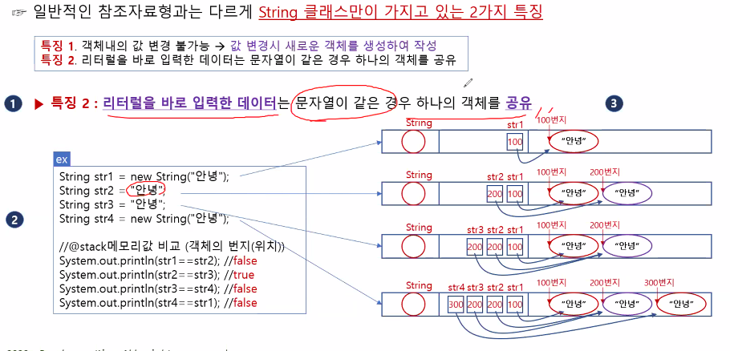

# 배열  
- 같은 타입의 여러 변수들을 하나의 묶음으로 다루는 것.  
- 각 저장공간들이 연속적으로 붙어있음  

`특징`  
1. 같은 자료형만 묶을 수 있음.  
2. 크기를 한 번 지정하면 변경할 수 없음.  

## 선언과 생성  

변수는 생성과 동시에 저장공간이 만들어짐  

배열은 변수와 달리 저장공간이 선언되는 것이 아니라  
 배열을 다루기 위한 `참조변수`가 선언되는 것.  

 stack 메모리에 참조 변수 생성.  
 Heap 메모리에 실제 데이터 생성.

º 선언 및 생성 방법

    - type[] 변수 = new type[갯수];  
        ↑선언          ↑생성  
    (참조변수 선언) (저장공간 생성)  

    - ex)  
        int[] score = new int[5];  
        string[] name  

[] - `배열기호`  

만들어진 저장공간의 `주소값`을 `참조변수`에 대입하여 배열을 다룬다.  
저장공간의 이름은 참조변수의 이름과 인덱스 번호로 이루어진다.  

ex)  

    int[] score;            //int 타입의 배열을 다루기 위한 참조변수 score 선언
    score = new int[5];     //int 타입의 값 5개를 저장할 수 있는 배열 생성  

 ## 인덱스 (index)  

 각 요소에 자동으로 붙는 번호  
 
인덱스의 범위는 `0`~`n-1`  

    int[] score = new int[5];
    저장공간 이름 : score[0], score[1], score[2], ... score[4]  
    // index는 0부터 시작  
    
    //배열 score의 4번째 요소의 값을 읽어서 변수 value에 저장
    int value = score[3];  

### 배열의 길이

배열.length - 배열의 길이를 나타냄  

    int [] score = new int[10];  
    System.out.println(score.length);  
    // ↑ score 배열의 길이인 10을 출력  


활용 예시)  

    int [] score = new int[5];  
    for (int i = 0; i < (score.length); i++)  {
        score [i] = i * 10 + 50;
    }
    // ↑ score 배열에 50, 60, 70, 80, 90 값이 저장됨.


### 배열의 초기화  

배열의 인덱스에 처음으로 값을 저장하는 것을 초기화라고 함.  

    int [] score = new int[5];  
    score[4] = 5;  
    // ↑ score의 4번 인덱스에 `5`라는 값을 저장

---
    int [] score = { 50, 60, 70, 80, 90};
    // new = int [5]를 생략할 수 있음

### 배열의 출력  

println, for문,  
Arrays.toString - 제일 많이 씀  

    Arrays.toString(배열이름);  
    // 단, Arrays method를 import 해야 함.  
    Ctrl + Shift + O : 자동 임포트 문 추가

- int 타입 배열일 때,  
println(배열이름)를 출력하면 `[I@6d69c` 같은 문자열이 출력됨.  

- char 타입 배열일 때,  
println(chArr)를 출력하면 정상적으로 출력 됨.


## String 배열  
    String [] name = new String[3];   
    // 3개의 문자열을 담을 수 있는 배열  

String 배열은 Heap 메모리에 생성된 배열에 실제 데이터가 들어가는 것이 아니라, 그 데이터를 가리키는 `주소값`이 들어감.  

stack 메모리 변수 값은 초기화 해주어야 함.  
그러나 `Heap 메모리` 변수 값은 `자동`으로 초기 값으로 `초기화` 됨.

- 각 변수들의 초기값  

<table border="2">
<tr>
<td>자료형</td>
<td>기본값</td>
</tr>
<tr>
<td>boolean</td>
<td>false</td>
</tr>
<tr>
<td>char</td>
<td>'\u0000'</td>
</tr>
<tr>
<td>byte, short ,int</td>
<td>0</td>
</tr>
<tr>
<td>long</td>
<td>0L</td>
</tr>
<tr>
<td>float</td>
<td>0.0f</td>
</tr>
<tr>
<td>double</td>
<td>0.0d 또는 0.0</td>
</tr>
<tr>
<td>참조형</td>
<td>null</td>
</tr>
</table>

```java
import java.util.Arrays;

class tmp {
    public static void main (String[] args) {
    // index : 0~2
    String[] strArr = { "가위", "바위" , "보"};
    
    for (int i = 0; i <3; i++) {
    int tmp = (int)(Math.random()*3);
    System.out.println(strArr[tmp]);
    }
    }
}
```
    무작위로 가위 바위 보 중 하나를 3번 출력하는 코드

---

### 2차원 배열  

배열이 또 다른 배열을 품고 있는 것.  
`행 배열`에 `열 배열`의 `주소값`이 들어감.
  

        행 열
    int [] [] Arr = {{10, 20, 30, 40},
                    {40, 50, 60, 70},
                    {70, 80, 90, 100}};

    int [] [] Arr = new int [3][4];
    

    Arr.length : 3
    Arr[0].length : 4

- 2차원 비정방행렬  
행마다 열의 개수가 서로 다른 2차원 행렬
```java
    // 행의 개수를 정하고, 행마다 선언을 해주는 방법.
    int [][] a = new int[2][];
    a[0] = new int[2];      //  값을 직접 넣어도 됨. 
    a[0][0] = 1; a[0][1] = 2;   //a[0] = {1,2}
    a[1] = new int[3];  //a[1] = {3,4,5}
    a[1][0] = 3; a[1][1] = 4; a[1][2] = 5;  

    int[][] b = /* new int[][] 생략 가능.*/ {{1,2},{3,4,5}}; 

```
2차원 비정방 배열 출력
```java
	// 이중 for문 사용
	for(int i = 0; i < array2.length; i++) {
		for(int j=0; j<array2[i].length;j++) {
			System.out.println(array2[i][j] + " ");
			}
		System.out.println();
	}
	System.out.println();
	// 이중 for-each문 사용
	for(int[] array: array2) {
		for(int k: array) {
			System.out.println(k + " ");
		}
		System.out.println();
	}
```


---
### String 클래스  
char[] 와 메서드(기능)을 결합한 것  
- 내용을 변경할 수 없음.  
- new 키워드 생략 시, 문자열이 같은 경우에는 객체를 공유.  
```java
String str1 = new String("Hi")
str1 = "Hello"
// str1이 가리키는 Hi의 값이 바뀌는 것이 아니라
// Hello가 저장된 새로운 주소값으로 바뀜.  
```

- 주요 메서드  


char `.charAt(int index)` - 문자열에서 해당 위치(index)에 있는 '문자'를 반환하다.  

int `.length()` - 문자열의 길이를 반환한다.  

String `.substring(int from, int to)` - 문자열에서 해당 범위의 문자열을 반환. (to는 포함되지 않음)  

boolean `.equals(Object obj)` - 문자열의 내용이 같은지 확인. true/false  
boolean `.equalsIgnoreCase(Object obj)` - 대/소문자 무시

char[] `.toCharArray()` - 문자열을 문자 배열로 변환하여 반환한다.  

`String.valueOf()` - 어떤 값을 String으로 형 변환 할때 사용.  

`indexOf()` - 문자열에 포함된 문자, 문자열의 위치를 앞에서부터 검색하여 해당하는 인덱스 값을 반환.  
`lastIndexOf()` - 뒤에서부터 검색

---
### Arrays  클래스 `Arrays.`

- `equals()` - 배열의 비교  

- `toString()` - 배열 출력  

- `deepEquals()` - 2차원 이상 배열의 비교  

- `deepToString()` - 2차원 이상 배열 출력  

- `copyOf()` - 배열의 복사  
    copyOf(arr,3); - 0부터 2까지 복사. (무조건 0부터)

- `copyOfRange()` - 배열 특정 범위 복사  
    copyOfRange(arr, 2, 4); - 2부터 3까지 복사.  

- `sort()` - 배열 오름차순 정렬  

---  

## Args  
- main 함수의 매개변수  
String 배열  

cmd나 Run configuration -> Arguments를 통해 입력할 수 있음.  
공백 단위로 끊음.  

```java
// args 요소 출력
public class ArgsEx {
	public static void main(String[] args) {
		// for 문
		for(int i=0; i<args.length;i++) {
			System.out.println(args[i]);
		}
		// for-each 문
		for(String k : args) {
			System.out.println(k);
		}
	}
}
```