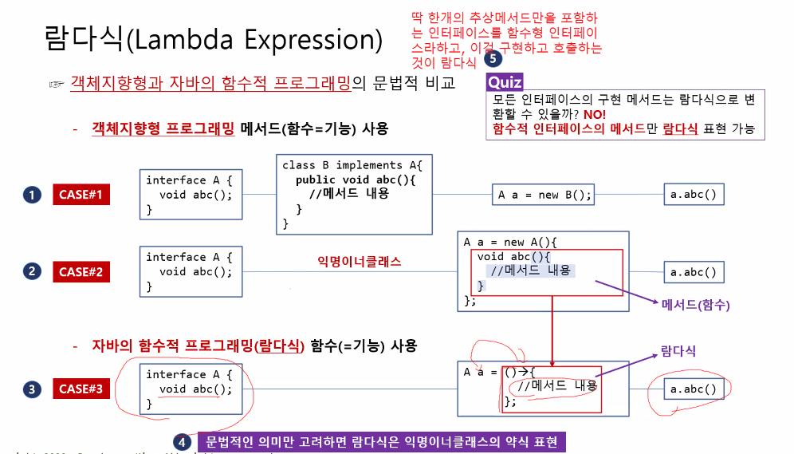
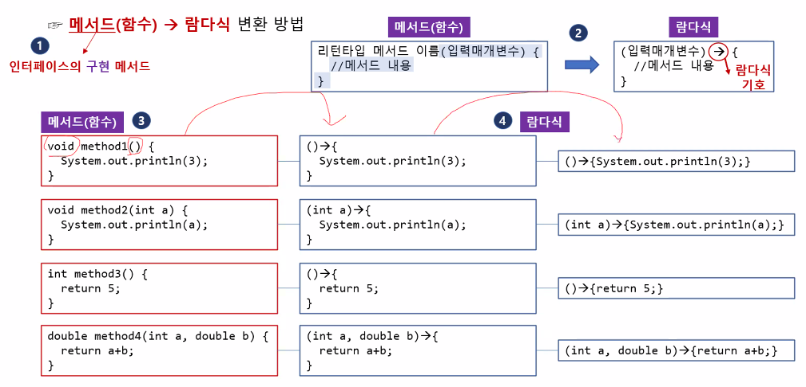
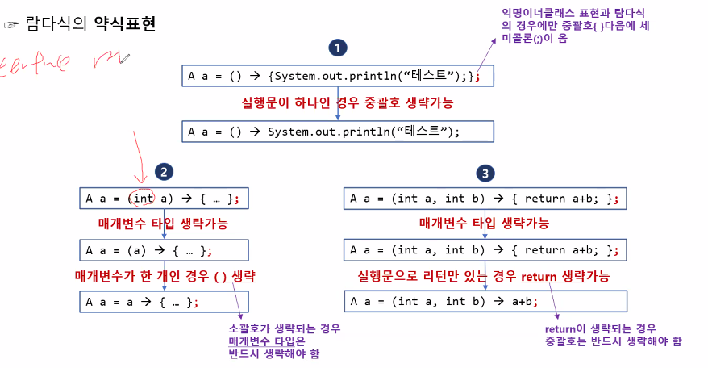
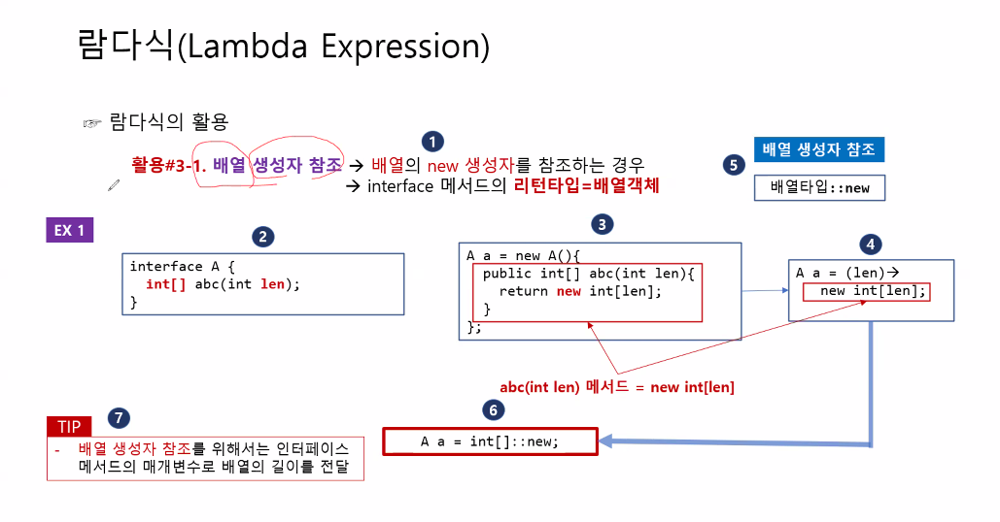

# 람다식 (Lambda Expression)  
- 객체 지향 언어인 `자바`에서 메소드가 아닌 `함수`를 사용할 수 있게 해줌.  

- `함수(Function)` : 기능  
    `메소드(Method)` : 객체의 기능  

- 코드의 간결화, 병렬 처리에 강함.  

- 실제로 객체 생성없이 사용할 수 있는 것은 `아님`.  
문법적으로는 `익명 이너 클래스의 약식 표현!`  

- 딱 한 개의 추상 메서드만을 포함하는 Interface = `함수형 인터페이스`  
    이를 구현하고 호출하는 것 = `람다식`  




### 표현 방법 : 
```java
    interface A {   // 람다식을 만들기 위한 함수형 인터페이스.
                    // 생성자 필요 X. 단 한 개의 메서드만 존재.
        void abc();
    }
    public class Ex
        public static void main(String[] args){
            A a = () -> {/*할일*/;};            
            a.abc();
```

  

#### 약식 표현  


```java
interface A{	// 입력 X, 리턴 X,
	void method1();
}
interface B{	// 입력 O, 리턴 X
	void method2(int a);
}
interface C{	// 입력 X, 리턴 O
	int method3();
}
interface D{	// 입력 O, 리턴 O
	double method4(int a, double b);
}
public class FunctionToLambdaExpression {
	public static void main(String[] args) {
		// 인터페이스의 함수 구현 -> 람다식

		// 1. 입력 X, 리턴 X
		A a2 = () -> {System.out.println("입력X 리턴X 함수");};
		A a3 = () -> System.out.println("입력X 리턴X 함수");	// 1줄 명령이면 증괄호 생략 가능

		// 2. 입력 O, 리턴 X
		B b2 = (int a) -> {System.out.println("입력O 리턴X 함수");};
		B b3 = (a) -> {System.out.println("입력O 리턴X 함수");};	// 입력 매개변수 생략
		B b4 = (a) -> System.out.println("입력O 리턴X 함수");		// 중괄호 생략
		B b5 = a -> System.out.println("입력O 리턴X 함수");			// 입력매개변수 1개면 소괄호 생략

		// 3. 입력X, 리턴O
		C c2 = () ->{return 4;};	// 실행문에 return만 있는 경우 생략 가능
		C c3 = () -> 4; 			// return이 생략되면 중괄호도 함께 생략
		
		// 4. 입력O, 리턴O
		D d2 = (int a, double b) -> {return a+b;};
		D d3 = (a, b) -> {return a+b;};
		D d4 = (a, b) -> a+b;
	}
}
```
---
#### 이미 정의된 `메서드를 참조`하는 경우의 `약식 표현`  
> 메서드 참조 Method Reference

##### 인스턴스 메서드 참조  

객체명::메서드명  

```java
interface A{void abc();}
class B{void bcd() {System.out.println("메서드");}}

public class RefOfInstanceMethod {
	public static void main(String[] args) {
		// 람다식으로 표현
		A a2 = () -> {
			B b = new B();
			b.bcd();
        };
		
		// 정의된 인스턴스 메서드 참조
		B b = new B();
		A a3 = b::bcd;
	}
}
```
#### 첫번째 매개변수로 전달된 객체의 메서드를 참조하는 경우  
> 내가 사용해야 되는 것이 `남이 만든 클래스의 메서드`인데, 그게 `static이 아닌` 경우.  

클래스명::메서드명
```java
interface A {void abc(B b, int k);}
class B{
	void bcd(int k) {System.out.println(k);}
}
public class RefOfInstanceMethod_Type2_1 {
	public static void main(String[] args) {
		A a = B::bcd;
		a.abc(new B(), 3);
	}
}
```

#### 예시:  
##### System.out.println();
---
It's called a "method reference" and it's a syntactic sugar for expressions like this:
```
numbers.forEach(x -> System.out.println(x));
```
Here, you don't actually need the name `x` in order to invoke `println` for each of the elements. That's where the method reference is helpful - the `::` operator denotes you will be invoking the `println` method with a parameter, which name you don't specify explicitly:
```
numbers.forEach(System.out::println);
```
##### length()
```java
interface A{
	int abc(String str);
}
public class RefOfInstanceMethod_Type2_2 {
	public static void main(String[] args) {
		A a = String::length;
		System.out.println(a.abc("안녕"));
	}
}
```

---
##### 정적(static) 메서드 참조  
```java
interface A{void abc();}
class B{
	static void bcd() {System.out.println("메서드");}}

public class RefOfStaticMethod {
	public static void main(String[] args) {
		A a = B::bcd;
        a.bcd();
	}
}
```
---
#### 정리 : 
> `인스턴스 메서드 참조 -> 객체명::메서드명`  
    `Static 메서드 참조 -> 클래스명::메서드명`  
    메서드를 참조할 때, 반드시 매개변수와 return 값이 같아야 함.  

### 배열 생성자 참조  

> 이건 뭔 소린지 모르겠음!!  

  
```java
interface A {
	int[] abc(int len);
}
public class RefOfArrayConstructor {
	public static void main(String[] args) {
		A a = int[]::new;	// int[]의 new를 호출. 즉, 배열의 생성자를 호출.
		int[] array1 = a.abc(3);	// => new int[3]
		System.out.println(array1.length);
	}
}

```

### 객체 생성자 참조  

```java
interface A{
	B abc();
}
interface B{
    B abc(int k);
}
class C {
	C() {System.out.println("첫 번째 생성자");}
	C(int k){System.out.println("두 번째 생성자");}
}

public class RefOfClassConstructor_1 {
	public static void main(String[] args) {
		A a = C::new;   // 기본 생성자 참조
		a.abc();
        B b = C::new;   // 매개변수가 있는 생성자 참조
        b.abc(5);
	}
}
```