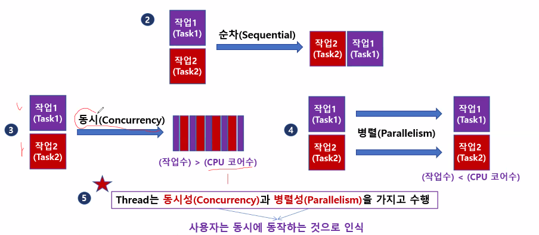
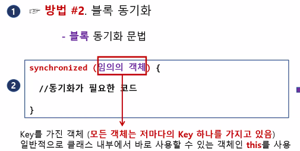
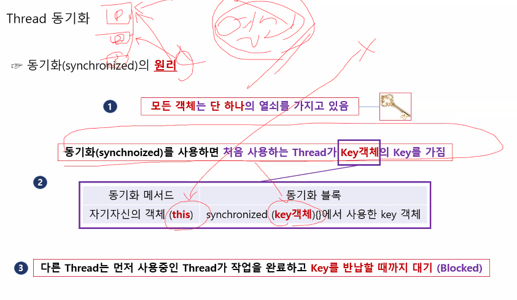
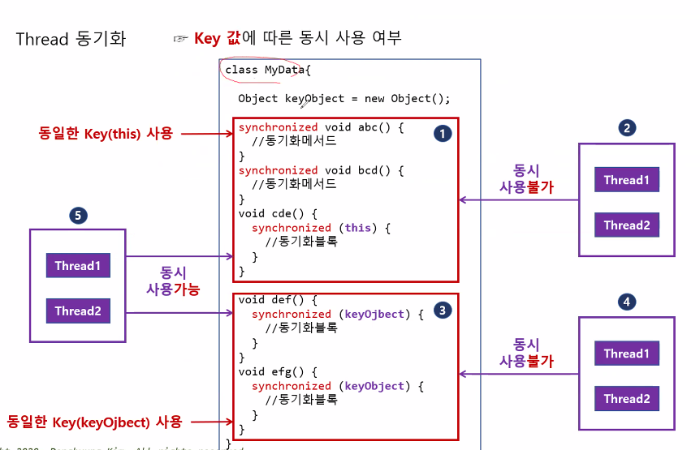

### 프로세스  
- `프로그램` : 하드디스크에 저장되어있는 파일  
- `프로세스` : 실행중인 프로그램  
자원(메모리, cpu)과 쓰레드로 구성됨  

- `쓰레드` : 프로세스 내에서 실제 작업을 수행하는 것.  
처리율을 향상시킬 수 있음.  
여러 쓰레드들은 모두 개별적인 제어 흐름을 갖는다.  
메서드처럼 순차적으로 실행되는 게 아님.  

---

    프로세스 : 쓰레드 = 공장 : 일꾼  
`싱글 쓰레드 프로세스` : 자원 + 쓰레드  
`멀티 쓰레드 프로세스` : 자원 + 쓰레드 + 쓰레드 ...  

#### 멀티쓰레드의 장점  
  
#### 멀티쓰레드 동작 순서
  
- 동시(Concurrency) : 여러 작업을 cpu 코어 수만큼 나눠서 번갈아가며 수행.  
하나의 CPU를 동시에 사용.  
- 병렬(Parallelism) : 작업들이 각각의 코어에 할당되어 수행.  

> `작업 수` > `코어 수` = <span style = "color:blue">동시</span>    
`작업 수` < `코어 수` = <span style = "color:green">병렬</span>  

코어가 여러 개이고, 작업 수가 더 많다면 동시성과 병렬성을 모두 가짐.  

### 쓰레드 생성 및 실행  
방법 1. Thread 클래스를 상속하여 `클래스`를 만들고  
`run() 메서드`를 `Override`  

방법 2. Runnable 인터페이스를 구현하여 `run()메서드`를 `Override` 한 후,  
Thread의 생성자 매개변수로 구현한 놈을 넘겨줌.  

Thread을 구현하느냐, Runnable을 구현하느냐 차이.  
둘이 뭐가 다르냐?  
Runnable을 구현하면서 또 다른 클래스를 상속할 수 있어서 더 유연함.

- `.run()` 메서드에는 작업을 작성.  
`.start()` 메서드로 Thread 실행!!!!  
객체 별로 `실행`은 `한 번만` 가능. 더 실행하면 예외 발생. `(IllegalThreadStateException)`  

- 동영상과 자막 파일 동시 송출을 예시로 만들어 보았음.  
Thread.sleep() 메서드로 싱크 조절.  


```java
package CreateAndStartThread_M1C1;

// 방법 1. Thread 클래스를 상속해 쓰레드 클래스 2개 생성

class SMIFileThread extends Thread{
	@Override	// run()을 Override하지만 실행은 start()로
	public void run() {
		// 자막 번호 하나~ 다섯
		String[] strArray = {"하나", "둘", "셋", "넷", "다섯"};
		try {Thread.sleep(10);}catch(InterruptedException e) {}	// 싱크 맞추기. Thread 준비 시간을 줌.
		// 자막 번호 출력
		for(String str : strArray) {
			System.out.println(" - (자막번호) " + str);
			try {Thread.sleep(200);}catch(InterruptedException e) {}
		}
	}
}

class VideoFileThread extends Thread{
	@Override	// run()을 Override하지만 실행은 start()로
	public void run() {
		// 비디오 프레임 번호 1~5
		int[] intArray = {1, 2, 3, 4, 5};
		// 비디오 프레임 출력
		for(int i : intArray) {
			System.out.print("(비디오 프레임) " + i);
			try {Thread.sleep(200);}catch(InterruptedException e) {}
		}
	}
}
public class CreateAndStartThread_M1C1 {

	public static void main(String[] args) {
		
		// SMIFileThread 객체 생성 및 시작
		Thread sFT = new VideoFileThread();
		Thread vFT = new SMIFileThread();
		sFT.start();// 새로운 쓰레드가 생성됨. Thread-0
		vFT.start();	
        // 배열로 관리 가능.
        Thread[] threads = {new VideoFileThread(), new SMIFileThread()};
		for (Thread thread : threads) thread.start();
	}
}
```
```java
// 방법 2. Runnable을 구현해 쓰레드 3개 생성  
package CreateAndStartThread_M2C1;

class VideoFileRunnable implements Runnable{
	@Override
	public void run() {
		int[] intArray = {1, 2, 3, 4, 5};
		for (int i : intArray) {
			System.out.print("(비디오 프레임) "+ i);
			try {Thread.sleep(100);} catch(InterruptedException e) {}
		}
	}
}

class SMIFileRunnable implements Runnable {
	@Override
	public void run() {
		// 자막 번호 하나~다섯
		String[] strArray = {"하나", "둘", "셋", "넷", "다섯"};
		try {Thread.sleep(10);} catch(InterruptedException e) {}
		// 자막 번호 출력
		for (int i = 0; i<strArray.length; i++) {
			System.out.print(" - (자막 번호) " + strArray[i]);
			try {Thread.sleep(110);} catch(InterruptedException e) {}
		}
	}
}

class EnglishFileRunnable implements Runnable{
	@Override
	public void run() {
		String[] strArray = {"One", "Two", "Three", "Four", "Five"};
		try {Thread.sleep(20);}catch(InterruptedException e) {}
		for(String a : strArray) {
			System.out.println(" - Eng : " + a);
			try {Thread.sleep(120);} catch(InterruptedException e) {}
		}
	}
}

public class CreateAndStartThread_M2C1 {

	public static void main(String[] args) {
        // 익명 내부 클래스로 구현해도 됨.
		VideoFileRunnable vfr = new VideoFileRunnable();
		SMIFileRunnable sfr = new SMIFileRunnable();
        EnglishFileRunnable efr = new EnglishFileRunnable();

		Thread[] threads = {new Thread(vfr), new Thread(sfr), new Thread(efr)};
		for (Thread t : threads) t.start();
	}
}
```
Runnable과 Thread 둘 다 배열로 관리도 가능  
```java
        // 둘 다 배열로 관리
		Runnable[] frs = {new VideoFileRunnable(), new SMIFileRunnable(), new EnglishFileRunnable()};
		Thread[] threads = new Thread[frs.length];
		for (int i = 0; i<frs.length;i++) {
			threads[i] = new Thread(frs[i]);
		}
		for(Thread t : threads) t.start();
```

### Thread의 속성  

- `.currentThread()` : 현재 실행중인 쓰레드 참조값 반환   
- `.activeCount()` : 현재 실행중인 쓰레드 개수 반환  
- `setName() / getName()` : 쓰레드 이름 설정 / 반환  

예시  
```java
package ThreadProperties_1;

// 쓰레드 객체의 속성 다루기

public class ThreadProperties_1 {
	public static void main(String[] args) {
		
		//객체 참조하기, 쓰레드의 개수 가져오기
		Thread curThread = Thread.currentThread();
		System.out.println("현재 쓰레드의 이름 = " +  curThread.getName());
		System.out.println("동작하는 쓰레드의 개수 = " + Thread.activeCount());
		
		// 쓰레드 이름 자동 지정
		for(int i = 0; i<3; i++) {
			Thread thread = new Thread();
			System.out.println(thread.getName());
			thread.start();
		}
		// 쓰레드 이름 직접 설정
		for(int i = 0; i<3; i++) {
			Thread thread = new Thread();
			thread.setName(i + "번째 쓰레드");
			System.out.println(thread.getName());
			thread.start();
		}
		// 쓰레드 이름 자동 지정
		for(int i = 0; i<3; i++) {
			Thread thread = new Thread();
			System.out.println(thread.getName());
			thread.start();
		}
		// 쓰레드의 개수 가져오기
		System.out.println("동작하는 쓰레드의 개수 = " + Thread.activeCount());// 실행 완료된 쓰레드는 제외
	}

}
```
실행 결과 :  
```java
현재 쓰레드의 이름 = main
동작하는 쓰레드의 개수 = 1
Thread-0
Thread-1
Thread-2
0번째 쓰레드
1번째 쓰레드
2번째 쓰레드
Thread-6
Thread-7
Thread-8
동작하는 쓰레드의 개수 = 4
```  
---


- `.setPriority(int Priority)` : 스레드 우선순위 설정.  
우선순위 : 1~10. 10이 가장 높은 순위.  

- `Runtime.getRuntime.availableProcessors()` : 현재 시스템의 CPU 코어 수를 반환.  

- `.setDaemon(boolean on)` : 데몬스레드 설정  
기본값 false. 켜기 true  

`데몬 스레드(Daemon Thread)` : `다른 일반 스레드`가 모두 `종료`되면 자신의 작업이 `끝나지 않았더라도` 같이 `종료`됨.  

```java
// 일반 스레드
package DaemonThread;
class MyThread extends Thread{
	@Override
	public void run() {
		System.out.println(getName() + ": " +(isDaemon()? "데몬쓰레드":"일반쓰레드"));
		for(int i = 0; i<6;i++) {
			System.out.println(getName() + ": " + i + "초");
			try {Thread.sleep(1000);}catch(InterruptedException e) {}
		}
	}
}
public class DaemonThread {
	public static void main(String[] args) {
		Thread thread1 = new MyThread();
		thread1.setDaemon(false);
		thread1.setName("thread1");
		thread1.start();
		try {Thread.sleep(3500);}catch(InterruptedException e) {}
		System.out.println("main Thread 종료");
	}
}
```
실행 결과:  
```java
thread1: 일반쓰레드
thread1: 0초
thread1: 1초
thread1: 2초
thread1: 3초
main Thread 종료
thread1: 4초
thread1: 5초
```
일반 스레드는 다른 스레드가 종료되어도 같이 종료되지 않음.  

set.Daemon(true)로 데몬스레드로 바꾸면,  
다른 스레드가 종료될 때 같이 종료됨.  

### 스레드의 동기화(Synchronize)  
- 동기화 : 다른 작업이 끝나고 나서 다음 작업이 수행되도록 하는 것.  
- 비동기화 : 동시에 작업들이 수행됨.  

가장 쉬운 동기화 방법 : 스레드들 사이에 Thread.sleep()으로 시간차를 둠.  

- 동기화와 비동기화 차이  
	```java
	package TheNeedsForSynchronized;
	// 공유 객체
	class MyData{
		int data = 3;
		public void plusData() {
			int mydata = data;	// 데이터 가져오기
			try {Thread.sleep(1000);}catch(InterruptedException e) {}
			this.data = mydata + 1;
		}
	}

	// 공유 객체를 사용하는 쓰레드
	class PlusThread extends Thread {
		MyData myData;
		public PlusThread(MyData myData) {
			this.myData = myData;
		}
		@Override
		public void run() {
			myData.plusData();
			System.out.println(getName() + "실행 결과: " + myData.data);
		}
	}
	public class TheNeedsForSynchronized {
		public static void main(String[] args) {
			// 공유 객체 생성
			MyData myData = new MyData();
			
			//plusThread 1
			Thread plusThread1 = new PlusThread(myData);
			plusThread1.setName("plusThread1");
			plusThread1.start();
			
			try {Thread.sleep(1000);}catch(InterruptedException e) {}	// 동기화 구문
			//plusThread2
			Thread plusThread2 = new PlusThread(myData);
			plusThread2.setName("plusThread2");
			plusThread2.start();

			try {Thread.sleep(2000);}catch(InterruptedException e) {}
			System.out.println("data 값 : " + myData.data);
		}
	}
	```

실행 결과 : 
```java
	plusThread2실행 결과: 4
	plusThread1실행 결과: 5
	data 값 : 5
```
동기화 구문이 없어지면?  
```java
	plusThread2실행 결과: 4
	plusThread1실행 결과: 4
	data 값 : 4
```
스레드들이 각각 data값을 가져와서 변경함.  

- 동기화 방법 두 가지  
1. 메서드 동기화  
스레드가 공유하는 객체 메서드 안에 동기화 구문을 넣음.  
```
접근지정자 synchronized 타입 메서드명 {동기화 구문}
``` 

```java
class MyData{
	int data = 3;
	// 메서드 동기화
	public synchronized void plusData() {
		int mydata = this.data;
		try {Thread.sleep(2000);}catch(InterruptedException e) {}
		data = mydata + 1;
	}
}
```

2. 블록 동기화  
스레드가 공유하는 객체 메서드 안에 동기화 블럭을 넣어, 그 안에 동기화가 필요한 코드를 넣음.  
```java
synchronized (임의의 객체) {// this를 자주 사용
	// 동기화가 필요한 코드
}
```
```java
class MyData{
	int data = 3;
	public void plusData() {
		synchronized(this) {	// 동기화가 필요한 구문
			int mydata = this.data;
			try {Thread.sleep(2000);} catch(InterruptedException e) {}
			this.data = mydata + 1;
		}
	}
}
```
---
### 동기화 원리  
모든 객체는 단 하나의 `KEY`를 갖고 있음.  
동기화를 하면, 처음 사용하는 `Thread`가 KEY객체의 `KEY`를 갖게 됨.  
작업 완료 후, `KEY`를 반납.  
그 다음 KEY를 받는 순서는 정해져있지 않음.  

(동기화 블록이 `KEY`로 `this`를 받는다는 가정 하에)  
객체 내, 동기화 메서드와 동기화 블록은 모두 같은 KEY를 사용.  
그래서 각기 다른 메서드라도 `동시접근`이 <span style = "color:red">불가능</span>함.  
그러나 동기화 블록이 받는 KEY가 다르다면 동시 접근이 가능함.  


  
  

---

### 스레드의 상태  

  
  
`NEW` : 스레드가 생성되고 실행되지 않은 상태.    

`RUNNABLE` : 스레드가 실행되고 있는 상태.  
CPU가 작업을 번갈아가면서 실행대기 - 실행으로 전환되며 수행함.  

`TERMINATED` : 작업을 완료하고 종료된 상태.  

`TIMED_WAITING` : 지정 시간동안 일시정지 된 상태.  

`BLOCKED` : 동기화 과정 중, 접근하지 못 하는 상태.  
(줄 서있는 상태)  

`WAITING` : wait() 메서드로 일시정지 된 상태.  
wait() - Object의 메서드  
`다른 스레드`의 notify(), notifyAll()로만 깨울 수 있음.  
wait(), notify(), notifyAll()은 동기화 메서드/블록에서만 사용 가능.  


(인스턴스 메서드임)  
- Object`.join()` :   
내 cpu 점유권을 해당 스레드에게 넘겨주고 WAITING으로 전환.  
숫자 입력 시 해당 시간만큼만.  

- `.yield()` :  
내 cpu 점유권을 다른 스레드에게 넘김.  
단, 다른 스레드의 작업이 끝날 때까지 넘겨주는 것이 아니라  
한 턴만 넘김.  
교대처리 시, 내 차례를 한 번 넘기는 것임.  

- `wait()`, `notify()`, `notifyAll()` :  
`wait()` : 다른 스레드가 깨워줄 때까지 대기  
`notity()` : 같은 객체 내 다른 스레드 깨우기  
`notifyAll()` : 모든 스레드 깨우기  

#### yield 예시  
```java
package YieldRunnableState;

class MyThread extends Thread{
	boolean yieldFlag;
	@Override
	public void run() {
		while(true) {
			if(yieldFlag) {
				Thread.yield();	// yieldFlag가 true이면, 다른 쓰레드에게 CPU 사용권을 한 턴 양보.
			}else {
				System.out.println(getName() + " 실행");
				for(long i = 0; i < 100000000L; i++) {}	// 시간 지연
			}
		}
	}
}
public class YieldRunnableState {
	public static void main(String[] args) {
		MyThread thread1 = new MyThread();
		thread1.setName("thread1");
		thread1.yieldFlag = false;
		thread1.setDaemon(true);	// main 스레드가 끝나면 같이 종료
		thread1.start();
		
		MyThread thread2 = new MyThread();
		thread2.setName("thread2");
		thread2.yieldFlag = true;
		thread2.setDaemon(true);
		thread2.start();
		
		// 6초 지연(1초마다 한 번씩 양보)
		for(int i=0; i<6; i++) {
			try {Thread.sleep(1000);}catch(InterruptedException e) {}
			thread1.yieldFlag = !thread1.yieldFlag;		// yieldFlag의 boolean 값을 반전시켜줌.
			thread2.yieldFlag = !thread2.yieldFlag;		// 1-false,2-true →1-true, 2-false
		}
	}
}

```

#### BLOCKED 예시  
```java
package BlockedState;

class MyBlockTest{
	// 공유 객체
	MyClass mc = new MyClass();
	// 3개의 쓰레드 필드 생성
	Thread t1 = new Thread("thread1") {
		public void run() {
			mc.syncMethod();
		};
	};

	Thread t2 = new Thread("thread2") {
		public void run() {
			mc.syncMethod();
		};
	};

	Thread t3 = new Thread("thread3") {
		public void run() {
			mc.syncMethod();
		};
	};
	
	void startAll() {
		t1.start();
		t2.start();
		t3.start();
	}

	class MyClass{
		synchronized void syncMethod() {
			try {Thread.sleep(100);} catch(InterruptedException e) {}
			System.out.println("====" + Thread.currentThread().getName() + "====");
			System.out.println("thread1->"+ t1.getState());
			System.out.println("thread2->"+ t2.getState());
			System.out.println("thread3->"+ t3.getState());
			for(long i = 0; i < 1000000000L; i++) {}
		}
	}
}
public class BlockedState {
	public static void main(String[] args) {
		MyBlockTest mbt = new MyBlockTest();
		mbt.startAll();
	}
}
// RUNNABLE BLOCKED BLOCKED
// 이후 순서는 랜덤
// TERMINATED RUNNABLE BLOCKED or TERMINATED BLOCKED RUNNABLE
// TERMINATED TERMINATED RUNNABLE or TERMINATED RUNNABLE TERMINATED
```

#### wait(), notify() 활용 예시  
```java
package Waiting_WaitNotify_2;

class DataBox{
	boolean isEmpty = true;
	int data;
	synchronized void inputData(int data) {
		if(!isEmpty) {
			try {wait();}catch(InterruptedException e) {}	// WAITING
		}
		this.data = data;
		isEmpty = false;
		System.out.println("입력 데이터: " + data);
		notify();	// 깨우기
	}
	synchronized void outputData() {
		if(isEmpty) {
			try {wait();}catch(InterruptedException e) {}	// WAITING
		}
		isEmpty = true;
		System.out.println("출력 데이터: " + data);
		notify();	// 깨우기
	}
}
public class Waiting_WaitNotify_2 {
	public static void main(String[] args) {
		DataBox dataBox = new DataBox();
		Thread t1 = new Thread() {
			public void run() {
				for(int i = 1; i < 9; i++) {
					dataBox.inputData(i);
				}
			};
		};
		Thread t2 = new Thread() {
			public void run() {
				for(int i = 1; i < 9; i++) {
					dataBox.outputData();
				}
			};
		};
		t1.start();
		t2.start();
	}
}
/*
1. Input 쓰레드 동작  
2. Output 쓰레드 깨우기  
3. Input 쓰레드 일시정지  

4. Output 쓰레드 동작  
5. Input 쓰레드 깨우기  
6. Output 쓰레드 일시정지  */
```

