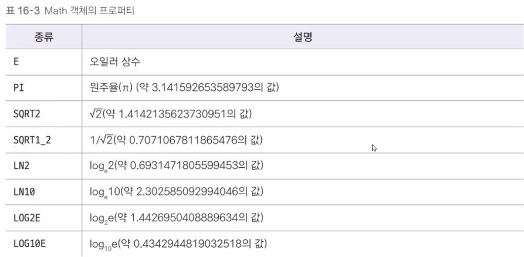
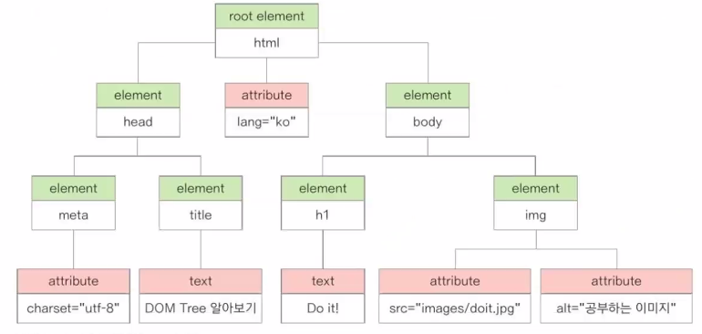

# JavaScript  
CSS와 유사하게 선택자를 통해 요소를 제어함.  

JS 소스가 짧을 경우, 웹 문서 내에 `<script>` 태그 안에 적기도 함.  
JS는 웹 문서 내 요소를 제어하는 경우가 많아서, 요소들이 렌더링된 뒤에 실행하는 것이 좋음.  
그래서 body 태그 아래에 작성함.  

HTML,CSS와 달리 대소문자를 구분함.  

요소를 변수에 저장하고, 함수를 정의해서 요소를 제어함.  

var를 쓰지 않는 이유? 재선언이 가능함.  
이로 인해 변수가 유실될 수 있음.  

let은 재선언 불가능, 값 변경 가능.(변수)  
const는 재선언, 값 변경 불가능.(상수)  
JS는 같은 변수로 다른 값을 넣는 일이 거의 없어서, const를 쓰는걸 권장.  

JS는 자료형은 존재하지만, 따로 선언하지는 않음.  

### 웹 브라우저 스크립트 해석 과정 (p.448)  
1. HTML 분석기 (구조 이해) html 표준에 맞춰 읽음 `<!DOCTYPE html>` 
2. CSS 분석기 -> `<style>`  
3. JS 해석기 -> `<script>`  
4. HTML,CSS 렌더링  
5. JS 분석기 -> 기능 부여 및 실행  

### 외부 스크립트 파일 연결  
```
<script src="와부 스크립트 파일 경로"></script>
또는
<script src="와부 스크립트 파일 경로"/>
```

## 기본 용어

JS의 큰 줄기는 식<sup>expression</sup>과 문.<sup>statement</sup>  
`식` : 값을 만들어내는 것 (연산식, 문자열, 숫자)  
`문` : 명령 (반복문, 조건문)  

## 입출력  
### alert()  
> 알림창.  
작은 알림창을 통해 출력하는 함수.  
확인 버튼만 있음.  

### confirm()  
> 확인창.  
alert()와 같지만, 확인과 취소 버튼이 있음.  
각각 true와 false 값을 반환함.  

### prompt()  
> 입력창  
텍스트와, 입력할 수 있는 텍스트 칸을 같이 출력됨.  
```javascript
prompt("메세지","기본값");
텍스트 입력칸에 기본값을 넣을 수 있음
```


### document.write()  
> html 문서에 매개변수를 입력함.  

### console.log()  
> 콘솔창에 매개변수를 출력함.  
보통 디버깅할 때 사용.  

## 자바스크립트 스타일 가이드  
구글 : https://google.github.io/styleguide/jsguide.html  
에어비앤비(리액트) : https://github.com/airbnb/javascript#strings--line-length  

## 자료형  
<table border=1>
<tr>
    <th colspan=2>종류</th>
    <th>설명</th>
    <th>예시</th>
</tr>
<tr>
    <td rowspan=3>기본유형</td>
    <td>숫자형</td>
    <td>따옴표 없이 숫자로만 표기</td>
    <td>let birthYear = 2000;</td>
</tr>
<tr>
    <td>문자열</td>
    <td>작은따옴표/큰따옴표로 묶어서 나타냄.</td>
    <td>let greeting = "Hello"; <br>let birthYear = "2000";</td>
</tr>
<tr>
    <td>논리형</td>
    <td>true,false 소문자로 표시함</td>
    <td>let isEmpty = true;</td>
</tr>
<tr>
    <td rowspan=2>복합유형</td>
    <td>배열</td>
    <td>하나의 변수에 여러 개의 값을 저장</td>
    <td>let seasons = ['봄', '여름', '가을', '겨울'];</td>
</tr>
<tr>
    <td>객체</td>
    <td>함수와 속성을 함께 포함함</td>
    <td>let date = new Date();</td>
</tr>
<tr>
    <td>undefined</td>
    <td colspan=3>자료형이 지정되지 않은 상태. 변수만 선언하고 값을 할당하지 않은 상태임.</td>
</tr>
<tr>
    <td>null</td>
    <td colspan=3>값이 유효하지 않은 상태</td>
</tr>
</table>

- JS에서 null은, 자바와 다르게 값이 유효하지 않은 상태임.  
- 정밀한 실수를 계산하기에는, 예상하지 못한 결과값이 나오기에 적합하지 않음.  
    정수를 입력받아도, 문자열로 취급하는데, 내부에서 무작위로 정수, 실수로 변환되면서 정확한 값이 안 나옴.  
    보통 `parseInt()`<sup> : 정수형으로 변환하는 함수</sup>  를 사용함.  
- 문자열 안에 문자열을 넣으려면, 큰 따옴표 안에 작은 따옴표로 구분해서 적으면 됨.  
- 배열 안에 타입이 다른 변수들을 넣을 수 있음.  

## 연산자  

### typeof 연산자  
변수의 자료형을 출력함.  
```javascript
typeof 100
> "number"
```

값 앞에 +를 붙이면, 정수값으로 인식함.  

---

`==`, `!=` (동등 연산자) : 값을 비교  
3 == "3" -> true  
`===`, `!==` (일치 연산자) : 값과 타입을 같이 비교  
3 === "3" -> false  

비트 논리 연산자는 사용 불가  

## 함수 (function)  
`function` : 함수 선언 키워드  
> 브라우저가 JS 소스를 해석할 때, 함수 선언부분을 가장 먼저 해석함.  
그래서 함수의 선언 위치는 어디든 상관 없음.  
```javascript
// 함수 선언
function addNumber(a,b)
{
    return a+b;
}

//함수 호출
addNumber(3,5);
```
#### 함수 선언문 매개변수에 기본값을 지정할 수 있음.  
```javascript
function addNumber(a,b,c=10) //c 기본값 지정
{
    return (a+b)*c;
}
// 기본값을 지정하고, 새로 입력받는 것도 가능.
```


### 익명 함수  

익명 함수를 선언해서, 변수에 할당 가능.  
다른 함수의 매개변수로 사용할 수도 있음.  

```javascript
// const는 호이스팅되지 않기 때문에, 호출구문 위에 작성해야 함.
const displayNumber = () => {
    console.log("123");
    }

//호출
displayNumber();
```

### 즉시 실행 함수  
함수를 정의하면서 동시에 실행할 수 있음.  
함수를 소괄호로 감싸고, 중괄호 뒤에 소괄호와 세미콜론<sup>명령 끝</sup>을 붙임.  
```javascript
(function() {
    console.log("123");
    }());

// 매개변수가 있는 즉시실행함수
const number = +prompt("인수");
(function(n) {  
    console.log("123");
    }(인수);    // 함수가 사용할 인수 : 함수 밖에서 할당한 변수, 또는 값을 직접 넣음. 

```

### 화살표 함수  
함수 선언을 좀 더 간단히 표현하는 방법.  
람다식과 비슷함.  

```javascript
(매개변수) => { 함수내용 }
// 매개변수가 없는 함수
// const hi = function() { return "안녕하세요?"; }
const hi = () => "안녕하세요?";
// 매개변수가 1개인 함수
// let hi = function(user) { document.write(user+ "님, 안녕하세요?"); }
let hi = user => document.write(user + "님, 안녕하세요?"); 
// 매개변수가 2개인 함수  
// let sum = function(a,b) { return a+b; }
let sum = (a,b) => a+b;
```


## 변수  

#### 변수 적용 범위 (스코프)  
`지역변수` or `로컬변수` : 함수 내에서만 사용하는 변수  
`전역변수` or `글로벌변수` : 스크립트 소스 전체에서 사용할 수 있는 변수  
예약어 없이 선언한 변수는 전역변수가 됨.  

#### 호이스팅(hoisting)  
상황에 따라 변수의 선언과 할당을 분리해서, 선언 부분을 스코프의 가장 위쪽으로 끌어올려 인식하는 것을 말함.  
변수를 선언하기 전, 해당 변수를 사용하는 코드가 있고, 그 아래에 해당 변수를 선언하는 코드가 있어도  
호이스팅으로 인해 제대로 실행 됨.  
```
var x = 10;
function displayNumber() {
    console.log(x);
    console.log(y);
    var y = 20;
}
displayNumber();
```

### var 변수  
지역 변수, 호이스팅/중복선언/재할당 가능.  
호이스팅, 중복선언 등 여러가지 이유로 예상치 못할 오류가 발생할 일이 많아서  
아예 사용하지 않음.  

### let 변수  
호이스팅/재선언 불가능, 재할당 가능  
블록 영역의 스코프를 가짐  

### const 변수  
호이스팅/재선언/재할당 불가능  
블록 영역의 스코프를 가짐  

---

## 이벤트와 이벤트 처리기  
"웹 문서 내에서" 버튼을 클릭하거나 항목을 선택하는 것이 `이벤트`.  
이벤트 발생 시에 실행하는 함수를 `이벤트 처리기`라고 함.  

이벤트 처리기는 사용자나, 개발자가 실행하는 것이 아니라,  
사용자가 이벤트를 발생시키면, 이와 연결된 이벤트 처리기를 "웹이 실행함".  

이벤트에는 마우스, 키보드, 문서 로딩, 폼 이벤트들이 있음.  

### 마우스 이벤트  

<table border="1">
    <thead>
        <tr>
            <th>헤드</th>
            <th>설명</th>
        </tr>
    </thead>
    <tbody>
        <tr>
            <td>click</td>
            <td>요소 클릭 시 이벤트 발생</td>
        </tr>
        <tr>
            <td>dblclick</td>
            <td>요소 더블클릭 시 이벤트 발생</td>
        </tr>
        <tr>
            <td>mousedown</td>
            <td>요소 위에서 마우스 버튼을 눌렀을 때 이벤트 발생</td>
        </tr>
        <tr>
            <td>mousemove</td>
            <td>요소 위에서 마우스 포인터를 움직일 때 이벤트 발생</td>
        </tr>
        <tr>
            <td>mouseover</td>
            <td>포인터가 요소 위로 옮겨질 때 이벤트 발생</td>
        </tr>
        <tr>
            <td>mouseout</td>
            <td>포인터가 요소에서 벗어날 때 이벤트 발생</td>
        </tr>
        <tr>
            <td>mouseup</td>
            <td>요소 위에 놓인 마우스 버튼에서 손을 뗄 때 이벤트 발생</td>
        </tr>
    </tbody>
</table>


### 키보드 이벤트  
<table border="1">
    <thead>
        <tr>
            <th>헤드</th>
            <th>설명</th>
        </tr>
    </thead>
    <tbody>
        <tr>
            <td>keydown</td>
            <td>키를 누르는 동안 이벤트 발생</td>
        </tr>
        <tr>
            <td>keypress</td>
            <td>키를 눌렀을 때 이벤트 발생</td>
        </tr>
        <tr>
            <td>keyup</td>
            <td>키에서 손을 뗄 때 이벤트 발생</td>
        </tr>
    </tbody>
</table>


### 문서 로딩 이벤트  

<table border="1">
    <thead>
        <tr>
            <th>헤드</th>
            <th>설명</th>
        </tr>
    </thead>
    <tbody>
        <tr>
            <td>abort</td>
            <td>문서가 완전히 로딩되기 전, 불러오기를 멈췄을 때 이벤트 발생</td>
        </tr>
        <tr>
            <td>error</td>
            <td>문서가 정확히 로딩되지 않았을 때 이벤트 발생</td>
        </tr>
        <tr>
            <td>load</td>
            <td>문서 로딩이 끝나면 이벤트 발생</td>
        </tr>
        <tr>
            <td>resize</td>
            <td>문서 화면 크기가 바뀌었을 때 이벤트 발생</td>
        </tr>
        <tr>
            <td>scroll</td>
            <td>문서 화면이 스크롤 되었을 때 이벤트 발생</td>
        </tr>
        <tr>
            <td>unload</td>
            <td>문서에서 벗어날 때 이벤트 발생</td>
        </tr>
    </tbody>
</table>

### 폼 이벤트  

<table border="1">
    <thead>
        <tr>
            <th>헤드</th>
            <th>설명</th>
        </tr>
    </thead>
    <tbody>
        <tr>
            <td>blur</td>
            <td>폼 요소에 포커스를 잃었을 때 이벤트 발생</td>
        </tr>
        <tr>
            <td>change</td>
            <td>목록이나 체크 상태 등이 변결되면 이벤트 발생 (input, select, textarea 태그에서 사용)</td>
        </tr>
        <tr>
            <td>focus</td>
            <td>폼 요소에 포커스가 놓였을 때 이벤트 발생 (label, select, textarea, button 태그에서 사용)</td>
        </tr>
        <tr>
            <td>reset</td>
            <td>폼이 리셋되었을 때 이벤트 발생</td>
        </tr>
        <tr>
            <td>submit</td>
            <td>submit 버튼을 클릭했을 때 이벤트 발생</td>
        </tr>
    </tbody>
</table>

---

### 이벤트 처리기 or 이벤트 핸들러  
이벤트가 발생하면 처리하는 함수.  
```javascript
<태그 on이벤트명 = "함수명">
<p onclick="alert('버튼을 클릭함')">ㅁㄴㅇㄹ</p>
<p onmouseover="userfunc()">ㄲㄲㄲㄲ</p>
```

클릭하면 div 배경색을 바꾸는 예시  
```javascript
<body>
	<ul>
		<li><a href="#" onclick="changeBg('green')">Green</a></li>
		<li><a href="#" onclick="changeBg('orange')">Orange</a></li>
		<li><a href="#" onclick="changeBg('purple')">Purple</a></li>
	</ul>		
	<div id="result"></div>
	
	<script>
		function changeBg(color) {
			var result = document.querySelector('#result');
			result.style.backgroundColor = color;
		}
	</script>
</body>
```

## JSP 객체  
JSP에서 사용하는 객체  
- DOM(문서 객체 모델) : 웹 문서에 삽입하는 요소들.  

- 브라우저 관련 객체 : 웹 브라우저에서 사용하는 정보를 담고 있는 객체  
navigator, history, location, screen 등.  

- 내장 객체 : 자주 사용하는 요소를 미리 객체로 정의해준 것들.  
Array, Date객체 등.  

JSP에서의 객체 사용법은,  
Java에서의 클래스 사용법과 유사함.  

### 내장 객체  

- #### Array 객체  
    - 배열을 다루는 객체  
    - 생성자 :  
    ```javascript
    let numbers = new Array();
    let numbers = new Array(4);
    let numbers = ["one", "two"];
    let numbers = Array("one","two");
    ```

    - `length` 속성 : 배열 길이가 저장되어 있음.  

    - 메서드 : 
        <table border = 1>
            <thead>
                <tr>
                <th>종류</th>
                <th>설명</th>
                </tr>
            </thead>
            <tbody>
                <tr>
                <td><code>concat</code></td>
                <td>기존 배열에 요소를 추가해 새로운 배열을 만듦.</td>
                </tr>
                <tr>
                <td><code>every</code></td>
                <td>배열의 모든 요소가 주어진 함수에 대해 참이면 true, 거짓이면 false 반환.</td>
                </tr>
                <tr>
                <td><code>filter</code></td>
                <td>배열 요소 중에서 주어진 필터링 함수에 대해 true인 요소만 골라 새로운 배열을 만듦.</td>
                </tr>
                <tr>
                <td><code>forEach</code></td>
                <td>배열의 모든 요소에 대해 주어진 함수를 실행.</td>
                </tr>
                <tr>
                <td><code>indexOf</code></td>
                <td>주어진 값과 일치하는 값이 존재하는 배열의 첫 인덱스를 찾음.</td>
                </tr>
                <tr>
                <td><code>join</code></td>
                <td>배열 요소들을 문자열로 합침. 이 때 구분자를 지정할 수 있음.</td>
                </tr>
                <tr>
                <td><code>push</code></td>
                <td>배열의 맨 끝에 새로운 요소를 추가 후, 새로운 length를 반환.</td>
                </tr>
                <tr>
                <td><code>unshift</code></td>
                <td>배열의 맨 앞에 새로운 요소를 추가.</td>
                </tr>
                <tr>
                <td><code>pop</code></td>
                <td>배열의 마지막 요소를 꺼내 그 값을 결과로 반환.</td>
                </tr>
                <tr>
                <td><code>shift</code></td>
                <td>배열의 첫 번째 요소를 꺼내 그 값을 결과로 반환.</td>
                </tr>
                <tr>
                <td><code>splice</code></td>
                <td>원하는 위치의 요소들을 뜯어내어 새로운 배열을 반환.</td>
                </tr>
                <tr>
                <td><code>slice</code></td>
                <td>기존 배열을 바꾸지 않고, 배열에서 특정한 부분만 복사하여 새로운 배열을 반환.</td>
                </tr>
                <tr>
                <td><code>reverse</code></td>
                <td>배열을 역순으로 정렬.</td>
                </tr>
                <tr>
                <td><code>sort</code></td>
                <td>배열을 지정한 조건에 따라 정렬.</td>
                </tr>
                <tr>
                <td><code>toString</code></td>
                <td>배열에서 지정한 부분을 문자열로 반환. 각 요소는 쉼표(,)로 구분.</td>
                </tr>
            </tbody>
        </table>

        `splice` :  
            인수가 1개인 경우 : 입력한 인덱스 번호부터 마지막까지 잘라내어 새로운 배열 반환.  
            인수가 2개인 경우 : 인덱스값, 뜯어낼 요소의 개수  
            인수가 3개인 경우 : 인덱스값, 뜯어낼 요소의 개수, 기존 배열에 넣을 값.  

        ```javascript
        const study = [1, 2, 3, 4, 5];
        const study1 = study.splice(2);    // study = [1, 2] study = [3, 4, 5] 
        const study2 = study.splice(2, 1);     // study = [1, 2, 4, 5] study2 = [3];
        const study3 = study.splice(2, 1, 'react'); // study = [1, 2, ]
        ```

        `slice` :  
            인수가 1개인 경우 : 인덱스값. 인덱스 번호부터 마지막까지 복사함.  
            인수가 2개인 경우 : 시작 인덱스값, 끝 인덱스값. 시작부터 끝-1 까지 복사함.  

- #### Date 객체  
    날짜와 시간 정보를 나타내는 객체  
    - 생성자 :  
        ```javascript
        new Date();
        // YYYY-MM-DD 형식
        new Date("2024");
        new Date("2024-06");
        new Date("2024-06-26");
        // YYYY- MM-DDTHH 형식
        new Date("2024-06-26T10:19:00");
        new Date("2024-06-26T10:19:00Z"); // Z는 국제 표준시
        // MM/DD/YYYY 형식
        new Date("06/26/2024");
        // 이름 형식
        new Date("Mon Jan 26 2024 10:20:24 GMT+0900 (대한민국 표준시)");
        ```
    - 메서드 :  
        크게 3가지로 구분.  
        1. 날짜 + 시간 정보 반환  
        2. 사용자가 원하는 날짜 + 시간 설정  
        3. 날짜 + 시간 형식을 변경
        <table border = 1>
            <thead>
                <tr>
                <th>구분</th>
                <th>설명</th>
                </tr>
            </thead>
            <tbody>
                <tr>
                <td><code>getFullYear()</code></td>
                <td>연도를 4자리 숫자로 반환합니다.</td>
                </tr>
                <tr>
                <td><code>getMonth()</code></td>
                <td>0부터 11까지의 숫자로 월을 반환합니다. (0은 1월, 11은 12월)</td>
                </tr>
                <tr>
                <td><code>getDate()</code></td>
                <td>1부터 31까지의 숫자로 일을 반환합니다.</td>
                </tr>
                <tr>
                <td><code>getDay()</code></td>
                <td>0부터 6까지의 숫자로 요일을 반환합니다. (0은 일요일, 6은 토요일)</td>
                </tr>
                <tr>
                <td><code>getTime()</code></td>
                <td>1970년 1월 1일 자정부터의 시간을 밀리초(1/1000 초)로 반환합니다.</td>
                </tr>
                <tr>
                <td><code>getHours()</code></td>
                <td>0부터 23까지의 숫자로 시를 반환합니다.</td>
                </tr>
                <tr>
                <td><code>getMinutes()</code></td>
                <td>0부터 59까지의 숫자로 분을 반환합니다.</td>
                </tr>
                <tr>
                <td><code>getSeconds()</code></td>
                <td>0부터 59까지의 숫자로 초를 반환합니다.</td>
                </tr>
                <tr>
                <td><code>getMilliseconds()</code></td>
                <td>0부터 999까지의 숫자로 밀리초를 반환합니다.</td>
                </tr>
                <tr>
                <td><code>setFullYear()</code></td>
                <td>연도를 설정합니다. 매개변수로 4자리 숫자를 받습니다.</td>
                </tr>
                <tr>
                <td><code>setMonth()</code></td>
                <td>월을 설정합니다. 매개변수로 0부터 11까지의 숫자를 받습니다.</td>
                </tr>
                <tr>
                <td><code>setDate()</code></td>
                <td>일을 설정합니다. 매개변수로 1부터 31까지의 숫자를 받습니다.</td>
                </tr>
                <tr>
                <td><code>setTime()</code></td>
                <td>1970년 1월 1일 자정 이후의 시간을 밀리초로 설정합니다.</td>
                </tr>
                <tr>
                <td><code>setHours()</code></td>
                <td>시를 설정합니다. 매개변수로 0부터 23까지의 숫자를 받습니다.</td>
                </tr>
                <tr>
                <td><code>setMinutes()</code></td>
                <td>분을 설정합니다. 매개변수로 0부터 59까지의 숫자를 받습니다.</td>
                </tr>
                <tr>
                <td><code>setSeconds()</code></td>
                <td>초를 설정합니다. 매개변수로 0부터 59까지의 숫자를 받습니다.</td>
                </tr>
                <tr>
                <td><code>setMillieseconds()</code></td>
                <td>밀리초를 설정합니다. 매개변수로 0부터 999까지의 숫자를 받습니다.</td>
                </tr>
                <tr>
                <td><code>toLocaleString()</code></td>
                <td>현재 날짜와 시간을 현지 시간으로 표시하는 문자열을 반환합니다.</td>
                </tr>
                <tr>
                <td><code>toLocaleTimeString()</code></td>
                <td>현재 시간을 현지 시간으로 표시하는 문자열을 반환합니다.</td>
                </tr>
                <tr>
                <td><code>toString()</code></td>
                <td>Date 객체를 문자열로 반환합니다.</td>
                </tr>
            </tbody>
            </table>

    - 설정한 날짜로부터 날짜 계산하는 예시 :  
        ```javascript
          <div id="container">
            <h1>책 읽기</h1>
            <p><span id="start"></span>일로 부터<span id="result"></span>일 지났습니다.</p>
        </div>  
        <script>
            const startDate = new Date("2024-01-01");
            const currDate = new Date();
            let days = (currDate.getTime() - startDate.getTime());
            days = Math.round(days/(1000*60*60*24));
            start.innerText = startDate.toLocaleDateString();
            result.innerText = days;
            // document.querySelector('#start').innerText = startDate.toLocaleDateString();
            // document.querySelector('#result').innerText = days;
        </script>
        ```


- #### Math 객체  
수학 계산과 관련된 객체  
- 프로퍼티(속성) :  

- 메서드 :  
    <table border = 1>
        <thead>
            <tr>
            <th>종류</th>
            <th>설명</th>
            </tr>
        </thead>
        <tbody>
            <tr>
            <td><code>abs()</code></td>
            <td>매개변수의 절댓값을 반환합니다.</td>
            </tr>
            <tr>
            <td><code>acos()</code></td>
            <td>아크 코사인 값을 반환합니다.</td>
            </tr>
            <tr>
            <td><code>asin()</code></td>
            <td>아크 사인 값을 반환합니다.</td>
            </tr>
            <tr>
            <td><code>atan()</code></td>
            <td>아크 탄젠트 값을 반환합니다.</td>
            </tr>
            <tr>
            <td><code>atan2()</code></td>
            <td>두 매개변수의 아크 탄젠트 값을 반환합니다.</td>
            </tr>
            <tr>
            <td><code>sin()</code></td>
            <td>사인 값을 반환합니다.</td>
            </tr>
            <tr>
            <td><code>cos()</code></td>
            <td>코사인 값을 반환합니다.</td>
            </tr>
            <tr>
            <td><code>tan()</code></td>
            <td>탄젠트 값을 반환합니다.</td>
            </tr>
            <tr>
            <td><code>exp()</code></td>
            <td>자연 상수 e의 거듭제곱 값을 반환합니다.</td>
            </tr>
            <tr>
            <td><code>log()</code></td>
            <td>매개변수에 대한 자연 로그 값을 반환합니다.</td>
            </tr>
            <tr>
            <td><code>max()</code></td>
            <td>주어진 매개변수 중 최대값을 반환합니다.</td>
            </tr>
            <tr>
            <td><code>min()</code></td>
            <td>주어진 매개변수 중 최소값을 반환합니다.</td>
            </tr>
            <tr>
            <td><code>pow()</code></td>
            <td>첫 번째 매개변수를 밑으로 하고 두 번째 매개변수를 지수로 하는 거듭제곱 값을 반환합니다.</td>
            </tr>
            <tr>
            <td><code>random()</code></td>
            <td>0과 1 사이의 무작위 수를 반환합니다.</td>
            </tr>
            <tr>
            <td><code>round()</code></td>
            <td>매개변수의 소수점 이하를 반올림한 값을 반환합니다.</td>
            </tr>
            <tr>
            <td><code>ceil()</code></td>
            <td>매개변수의 소수점 이하를 올림한 값을 반환합니다.</td>
            </tr>
            <tr>
            <td><code>floor()</code></td>
            <td>매개변수의 소수점 이하를 버림한 값을 반환합니다.</td>
            </tr>
            <tr>
            <td><code>sqrt()</code></td>
            <td>매개변수의 제곱근을 반환합니다.</td>
            </tr>
        </tbody>
    </table>

---

### 브라우저 관련 객체  
웹 브라우저 창에 문서가 표시되는 순간, 브라우저가 자동으로 관련 객체를 만들어냄.  
가장 먼저 window 객체가 만들어지고 하위 요소 객체들이 나타남.  

`window`, `document`, `navigator`, `history`, `location`, `screen` 등이 있음.  


---

- #### window 객체  
    > 웹 브라우저의 상태를 제어. JSP의 최상위 객체.  
    브라우저 창이 열릴 때마다 하나씩 만들어짐.  

- 프로퍼티 :  
    <table border=1>
  <thead>
    <tr>
      <th>종류</th>
      <th>설명</th>
    </tr>
  </thead>
  <tbody>
    <tr>
      <td><code>document</code></td>
      <td>현재 웹 문서에 접근할 수 있는 객체를 반환합니다.</td>
    </tr>
    <tr>
      <td><code>frameElement</code></td>
      <td>현재 창이 다른 요소 안에 포함되어 있으면 그 요소를 반환하고, 아니면 null을 반환합니다.</td>
    </tr>
    <tr>
      <td><code>innerHeight</code></td>
      <td>브라우저 창의 내용 영역의 높이를 나타내는 속성입니다.</td>
    </tr>
    <tr>
      <td><code>innerWidth</code></td>
      <td>브라우저 창의 내용 영역의 너비를 나타내는 속성입니다.</td>
    </tr>
    <tr>
      <td><code>localStorage</code></td>
      <td>웹 브라우저에서 데이터를 저장하는 로컬 스토리지 객체를 반환합니다.</td>
    </tr>
    <tr>
      <td><code>location</code></td>
      <td>window 객체의 위치 또는 현재 URL을 나타내는 객체를 반환합니다.</td>
    </tr>
    <tr>
      <td><code>name</code></td>
      <td>브라우저 창의 이름을 가져오거나 설정하는 속성입니다.</td>
    </tr>
    <tr>
      <td><code>outerHeight</code></td>
      <td>브라우저 창의 바깥 높이를 나타내는 속성입니다.</td>
    </tr>
    <tr>
      <td><code>outerWidth</code></td>
      <td>브라우저 창의 바깥 너비를 나타내는 속성입니다.</td>
    </tr>
    <tr>
      <td><code>scrollX</code></td>
      <td>스크롤했을 때 수평으로 이동하는 픽셀 수를 나타내는 속성입니다.</td>
    </tr>
    <tr>
      <td><code>scrollY</code></td>
      <td>스크롤했을 때 수직으로 이동하는 픽셀 수를 나타내는 속성입니다.</td>
    </tr>
    <tr>
      <td><code>pageXOffset</code></td>
      <td>스크롤했을 때 수평으로 이동하는 픽셀 수를 나타내는 속성입니다. (scrollX와 같습니다.)</td>
    </tr>
    <tr>
      <td><code>pageYOffset</code></td>
      <td>스크롤했을 때 수직으로 이동하는 픽셀 수를 나타내는 속성입니다. (scrollY와 같습니다.)</td>
    </tr>
    <tr>
      <td><code>parent</code></td>
      <td>현재 창이나 서브 프레임의 부모 창을 나타내는 객체를 반환합니다.</td>
    </tr>
    <tr>
      <td><code>screenX</code></td>
      <td>브라우저 창의 왼쪽 테두리가 모니터 왼쪽 테두리에서 떨어진 거리를 나타내는 속성입니다.</td>
    </tr>
    <tr>
      <td><code>screenY</code></td>
      <td>브라우저 창의 위쪽 테두리가 모니터 위쪽 테두리에서 떨어진 거리를 나타내는 속성입니다.</td>
    </tr>
    <tr>
      <td><code>sessionStorage</code></td>
      <td>웹 브라우저에서 데이터를 저장하는 세션 스토리지 객체를 반환합니다.</td>
    </tr>
  </tbody>
    </table>


- 메서드 : 
    <table border=1>
  <thead>
    <tr>
      <th>종류</th>
      <th>설명</th>
    </tr>
  </thead>
  <tbody>
    <tr>
      <td><code>open(경로, 창 이름, 창 옵션)</code></td>
      <td>새 브라우저 창을 엽니다. 정상적으로 열리지 않으면 null을 반환합니다.<br>
        <strong>창 이름:</strong> 지정한 이름의 창에 팝업 내용을 표시합니다. 이름을 지정하지 않으면 계속 새로운 창을 엽니다.<br>
        <strong>창 옵션:</strong> left, top으로 위치를 지정하거나, width, height로 크기를 지정합니다. 위치는 기본적으로 왼쪽 위를 기준으로 합니다.</td>
    </tr>
    <tr>
      <td><code>close()</code></td>
      <td>현재 브라우저 창을 닫습니다.</td>
    </tr>
    <tr>
      <td><code>alert()</code></td>
      <td>알림 창을 표시합니다.</td>
    </tr>
    <tr>
      <td><code>blur()</code></td>
      <td>현재 창에서 포커스를 제거합니다.</td>
    </tr>
    <tr>
      <td><code>confirm()</code></td>
      <td>확인, 취소 버튼이 있는 확인 창을 표시합니다.</td>
    </tr>
    <tr>
      <td><code>focus()</code></td>
      <td>현재 창에 포커스를 부여합니다.</td>
    </tr>
    <tr>
      <td><code>moveBy()</code></td>
      <td>현재 창을 지정한 크기만큼 이동시킵니다.</td>
    </tr>
    <tr>
      <td><code>moveTo()</code></td>
      <td>현재 창을 지정한 좌표로 이동시킵니다.</td>
    </tr>
    <tr>
      <td><code>postMessage()</code></td>
      <td>메시지를 다른 창으로 전달합니다.</td>
    </tr>
    <tr>
      <td><code>print()</code></td>
      <td>현재 문서를 인쇄합니다.</td>
    </tr>
    <tr>
      <td><code>prompt()</code></td>
      <td>프롬프트 창에 사용자 입력을 받아 반환합니다.</td>
    </tr>
    <tr>
      <td><code>resizeBy()</code></td>
      <td>현재 창의 크기를 지정한 크기만큼 조절합니다.</td>
    </tr>
    <tr>
      <td><code>resizeTo()</code></td>
      <td>현재 창의 크기를 동적으로 조절합니다.</td>
    </tr>
    <tr>
      <td><code>scroll()</code></td>
      <td>문서에서 특정 위치로 스크롤합니다.</td>
    </tr>
    <tr>
      <td><code>scrollBy()</code></td>
      <td>문서에서 지정한 크기만큼 스크롤합니다.</td>
    </tr>
    <tr>
      <td><code>scrollTo()</code></td>
      <td>문서를 지정한 위치로 스크롤합니다.</td>
    </tr>
    <tr>
      <td><code>sizeToContent()</code></td>
      <td>내용에 맞게 창의 크기를 조절합니다.</td>
    </tr>
    <tr>
      <td><code>stop()</code></td>
      <td>로딩을 중단합니다.</td>
    </tr>
  </tbody>
    </table>

#### open() 메서드의 창 옵션 인자는, 문자열임.  

#### 팝업이 차단되었는지 확인한 뒤 알림 창 표시  
```javascript
    const newWin = window.open("notice.html", "pop", "width=500, height=400");
    if(newWin == null) {
        alert("팝업이 차단됨.");
    }
```

---

- #### navigator 객체  
    > 현재 사용하는 브라우저의 정보가 들어있음.  

    웹 브라우저의 버전을 비롯해 플러그인 설치 정보다 온/오프라인 등의 여러 정보가 담겨있음.  
    정보는 사용자가 수정할 수 없고, 가져와서 보여 줄 수만 있음.  
    콘솔에 navigator 입력하면 navigator 객체의 모든 정보를 볼 수 있음.  
    - 프로퍼티  
    <table border = 1>
    <thead>
        <tr>
        <th>속성</th>
        <th>설명</th>
        </tr>
    </thead>
    <tbody>
        <tr>
        <td><code>userAgent</code></td>
        <td>현재 브라우저 정보를 담고 있는 사용자 에이전트 문자열입니다.<br>
            사용자의 웹 브라우저 정보를 서버에 보낼 때 사용됩니다.<br>
            최근에는 브라우저 엔진의 통합으로 인해 사용하지 않는 추세입니다.</td>
        </tr>
        <tr>
        <td><code>battery</code></td>
        <td>현재 장치의 배터리 충전 상태를 알려줍니다.</td>
        </tr>
        <tr>
        <td><code>cookieEnabled</code></td>
        <td>브라우저가 쿠키를 허용하는지 여부를 나타내는 속성입니다.<br>
            쿠키를 무시하면 false를 반환하고, 허용하면 true를 반환합니다.</td>
        </tr>
        <tr>
        <td><code>geolocation</code></td>
        <td>모바일 기기를 이용한 위치 정보를 나타냅니다.</td>
        </tr>
        <tr>
        <td><code>language</code></td>
        <td>브라우저 UI의 언어 정보를 나타냅니다.</td>
        </tr>
        <tr>
        <td><code>oscpu</code></td>
        <td>현재 운영체제의 정보를 나타냅니다.</td>
        </tr>
    </tbody>
    </table>


    ##### 렌더링 엔진과 자바스크립트 엔진  
    HTML이나 CSS를 해석하는 엔진과 자바스크립트를 해석하는 엔진.  
    브라우저마다 내장된 렌더링 엔진과 자바스크립트 엔진이 다름.  

---

- #### history 객체  
    > 현재 창에서 사용자의 방문 기록을 저장함.  

    브라우저에서 [뒤로], [앞으로] 또는 주소 표시줄에 입력해 방문한 사이트 주소가 배열 형태로 저장됨.  
    브라우저 히스토리는 보안 문제로 인해 읽기 전용임.  

    - 프로퍼티  
        `length` : 현재 브라우저 창의 history 목록에 있는 항목의 개수,  
        즉 방문한 사이트 개수가 저장됨.  

    - 메서드  
        <table border=1>
        <thead>
            <tr>
            <th>메서드</th>
            <th>설명</th>
            </tr>
        </thead>
        <tbody>
            <tr>
            <td><code>back()</code></td>
            <td><code>history</code> 목록에서 이전 페이지를 현재 화면으로 불러옵니다.</td>
            </tr>
            <tr>
            <td><code>forward()</code></td>
            <td><code>history</code> 목록에서 다음 페이지를 현재 화면으로 불러옵니다.</td>
            </tr>
            <tr>
            <td><code>go()</code></td>
            <td><code>history</code> 목록에서 현재 페이지를 기준으로, 상대적인 위치에 있는 페이지를 현재 화면으로 불러옵니다.<br>
                예를 들어, <code>history.go(1)</code>은 다음 페이지를, <code>history.go(-1)</code>은 이전 페이지를 불러옵니다.</td>
            </tr>
        </tbody>
        </table>


---

- #### location 객체  
    > 현재 페이지의 URl 정보가 담겨있음.  

    브라우저의 주소 표시줄과 관련됨.  
    이 정보를 편집하면, 현재 브라우저 창에서 열어야 할 사이트나 문서를 지정할 수 있음.  
    새로고침 역할을 하는 `reload()`와, 현재 창에 다른 문서나 사이트를 보여주는 `replace()` 메서드가 유용하게 쓰임.  
    
    - 프로퍼티 :  
        <table border=1>
        <thead>
            <tr>
            <th>종류</th>
            <th>설명</th>
            </tr>
        </thead>
        <tbody>
            <tr>
            <td><code>hash</code></td>
            <td>URL 중에서 #로 시작하는 해시 부분의 정보를 담고 있습니다.</td>
            </tr>
            <tr>
            <td><code>host</code></td>
            <td>URL의 호스트 이름과 포트 번호를 담고 있습니다.</td>
            </tr>
            <tr>
            <td><code>hostname</code></td>
            <td>URL의 호스트 이름을 담고 있습니다.</td>
            </tr>
            <tr>
            <td><code>href</code></td>
            <td>전체 URL을 담고 있습니다.</td>
            </tr>
            <tr>
            <td><code>pathname</code></td>
            <td>URL 경로를 담고 있습니다.</td>
            </tr>
            <tr>
            <td><code>port</code></td>
            <td>URL의 포트 번호를 담고 있습니다.</td>
            </tr>
            <tr>
            <td><code>protocol</code></td>
            <td>URL의 프로토콜을 담고 있습니다.</td>
            </tr>
            <tr>
            <td><code>search</code></td>
            <td>URL 중에서 ?로 시작하는 검색 내용을 담고 있습니다.</td>
            </tr>
        </tbody>
        </table>

    - 메서드 :  
        <table border=1>
        <thead>
            <tr>
            <th>종류</th>
            <th>설명</th>
            </tr>
        </thead>
        <tbody>
            <tr>
            <td><code>assign()</code></td>
            <td>현재 문서에서 새 문서 주소를 할당하여 새 문서를 가져옵니다.</td>
            </tr>
            <tr>
            <td><code>reload()</code></td>
            <td>현재 문서를 다시 불러옵니다.</td>
            </tr>
            <tr>
            <td><code>replace()</code></td>
            <td>현재 문서의 URL을 지우고, 다른 URL의 문서로 교체합니다. 새로 로딩하지 않고, 히스토리에도 남지 않습니다.</td>
            </tr>
            <tr>
            <td><code>toString()</code></td>
            <td>현재 문서의 URL을 문자열로 반환합니다.</td>
            </tr>
        </tbody>
        </table>


    - 팝업창의 하이퍼링크를 누르면, 메인 창에서 해당 창이 뜨도록 하는 예시  
    [main](ex/kh-ex/main.html)  
    [doit-event](ex/kh-ex/doit-event.html)  
    [doit-main](ex/kh-ex/doit-main.html)  

---

- #### screen 객체  
> 현재 사용자가 사용하는 화면 정보를 다룸.  

사용자의 화면 크기나, PC 모니터인지 모바일 기기인지 정보를 알아낼 수 있음.

- 프로퍼티  
        <table border=1>
        <thead>
            <tr>
            <th>종류</th>
            <th>설명</th>
            </tr>
        </thead>
        <tbody>
            <tr>
            <td><code>availHeight|Width</code></td>
            <td>UI 영역(윈도우 작업 표시줄 또는 Mac의 독 등)을 제외한 영역의 높이 또는 너비를 나타냅니다.</td>
            </tr>
            <tr>
            <td><code>height|width</code></td>
            <td>UI 영역을 포함한 전체 높이 또는 너비를 나타냅니다.</td>
            </tr>
            <tr>
            <td><code>orientation</code></td>
            <td>화면의 현재 방향을 나타냅니다 (가로 또는 세로).</td>
            </tr>
            <tr>
            <td><code>colorDepth</code></td>
            <td>화면에서 픽셀을 렌더링할 때 사용하는 색상 수를 나타냅니다.</td>
            </tr>
            <tr>
            <td><code>pixelDepth</code></td>
            <td>화면에서 픽셀을 렌더링할 때 사용하는 비트 수를 나타냅니다.</td>
            </tr>
        </tbody>
        </table>


- 메서드  
        <table border =1>
        <thead>
            <tr>
            <th>종류</th>
            <th>설명</th>
            </tr>
        </thead>
        <tbody>
            <tr>
            <td><code>lockOrientation()</code></td>
            <td>화면 방향을 잠금 상태로 설정합니다.</td>
            </tr>
            <tr>
            <td><code>unlockOrientation()</code></td>
            <td>이전에 잠금한 화면 방향을 해제합니다.</td>
            </tr>
        </tbody>
        </table>


팝업 창을 화면 한 가운데에 뜨도록 하는 예시  
```javascript
    <p>클릭하면 팝업 창이 표시됩니다</p>
    <script>
        // p 요소를 클릭하면 openCenter 함수를 실행.
          document.getElementByTag('p').onclick = openCenter("notice.html", "pop", 500, 400);
        // 전달받은 인수들로 팝업창을 띄우는 함수
      function openCenter(addr,name,width,height) {
        const lefts = +(screen.availWidth-width)/2;
        const tops = +(screen.availHeight-height)/2;
        const position = "left=" + lefts + ",top=" + tops + ",width=" + width + ",height=" + height;
        window.open(addr, name, position);
      }     
    </script>
```
---

## DOM (Document Object Model)  
> 자바스크립트를 이용하여 웹 문서에 접근하고 제어할 수 있도록 객체를 사용해 `웹 문서를 체계적으로 정리하는 방법`  

모든 태그 요소들을 문서 객체라고 함.  
HTML의 요소를 가져와서 이벤트 처리기에 연결하는, JS를 중심으로 사용하는 방식임.  
HTML와 jsp 파일을 분리할 수 있음.  

```javascript
// 함수 뒤에 소괄호를 붙이지 않음!!
웹요소.onclick = 함수;
document.querySelector('#desc').onclick = hideDetail;

// 딱 한번만 사용한다면 익명 함수를 만들어 사용
웹요소.onclick = function () {
    // 수행 내용;
};

// 화살표 함수
웹요소.onclick = () => {
    // 수행 내용;
};
```
### DOM Tree  
웹 문서 내 요소들을 DOM 관점에서 부모 자식 구조로 표시한 것.  

  

### DOM 요소에 접근하는 방법  

#### getElementBy 메서드  

반환값은 HTMLElement 객체.  

- `getElementById("아이디명")`  
id 선택자로 접근하는 메서드  

- `getElementsByClassName("클래스명")`  
클래스 선택자로 접근하는 메서드  
<span style="text-decoration:underline">클래스는 여러 요소에서 사용할 수 있어서, 반환하는 요소가 2개 이상일 수 있음</span>  

- `getElementsByTagName("태그명")`  
태그명을 사용해 요소에 접근하는 메서드  

--- 
#### querySelector, querySelectorAll 메서드  
DOM 트리의 텍스트, 속성 노드까지 자유롭게 제어할 수 있음.  
id, 클래스, 태그 모두 사용 가능.  
- `querySelector()` : 반환값이 하나.  
- `querySelectorAll()` : 여러 값이 한꺼번에 반환.  

---

#### innerText, innerHTML 프로퍼티  
웹 요소의 내용을 수정할 수 있음.  
- `innerText`: 텍스트 내용을 표시,  
- `innerHTML` : HTML 태그까지 반영하여 표시.  

##### innerText 와 textContent의 차이점  
Using "textContent" will return the complete text content,  including the hidden text. However, using "innerText" will only return the visible text content, excluding the hidden text.  
텍스트를 객체에 입력할 때는 결과가 똑같음.  
```javascript
<div id="example">
Hello <span style="display: none;">world</span>!
</div>

let element = document.getElementById("example");

console.log(element.textContent); // Output: Hello world!
console.log(element.innerText); // Output: Hello !
```
---

#### getAttribute(), setAttribute() 메서드  
> 웹 요소의 속성에 접근하는 메서드.  

- `getAttribute("속성명")` : 속성을 가져옴.  
- `setAttribute("속성명", "값")` : 해당 속성에 원하는 속성값을 지정.  
해당 속성이 없다면, 새로 추가함.  

---