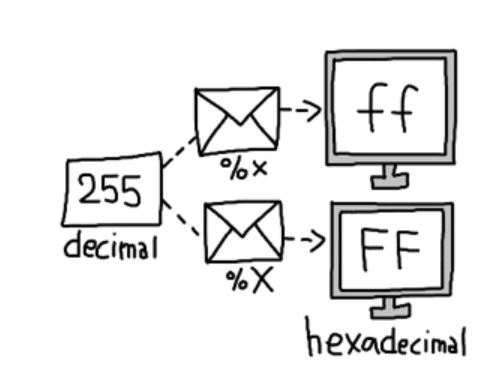
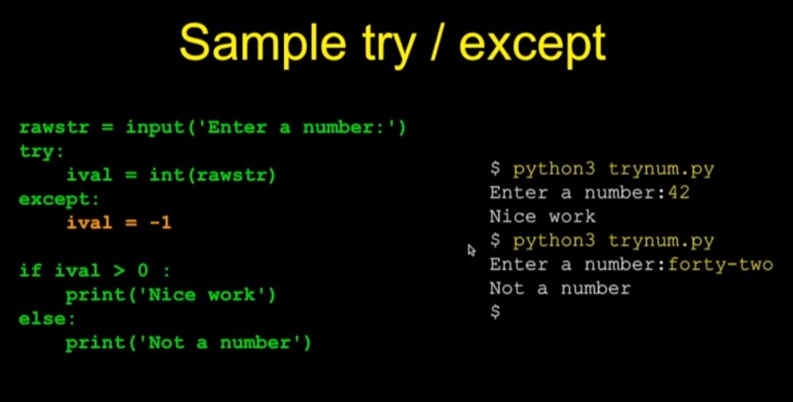
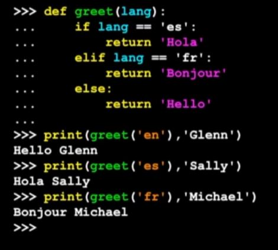
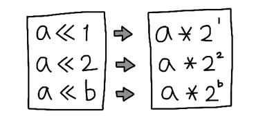
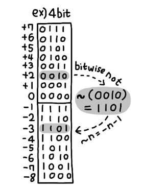
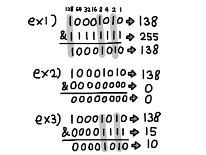
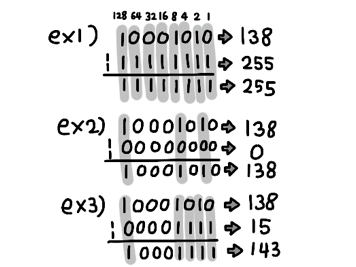
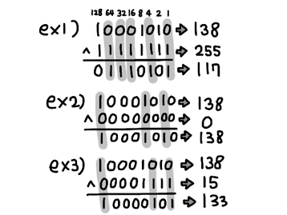
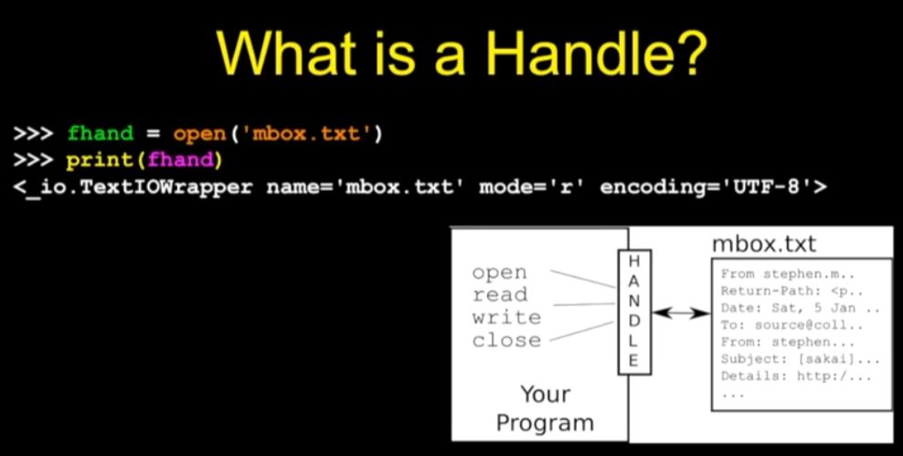
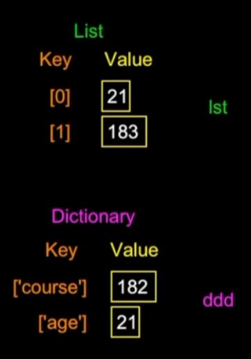

## 오류  
cmd에서 python 입력 시 스토어 실행되는 오류  
> 시스템 환경 변수 > PATH > python.exe 경로 추가  

<br>

# `함수, 메서드`  

### `map`  
타입과 대상을 입력하면 대상을 해당 타입으로 변환함

>map(타입, 배열/리스트 등등)  
```
a, b = map(int, input().split())
>> 입력받은 두 값을 int타입으로 a와 b에 저장.
```


### `print()` - 출력  

print('%x'%n)  
n을 16진법으로 표시  
%o : 8진법  
%d : 10진법  



### `F - string`  
fstring을 사용하면 {}안에 원하는 변수를 넣어 출력하도록 할 수 있음.  
```python
name = hoyoung
age = 26
print(f"your name is {name}, and your age is {age}.")
>>>your name is hoyoung, and your age is 26.
```

### `type()`  
 - 자료형 종류 출력  
```
type(123) 
>>> <class 'int'>  
```

### `round()`  
- 반올림  

`값`, `자리수`  
소수점 몇번째 자리수에서 반올림할지 정할 수 있음.  


### `format(수, ".nf")`  
 - 실수의 소수점 n번째 자리까지 출력.  

파이썬3에선 정수 나눗셈을 해도 소수점 (float) 값을 출력  
단, //로 정수값 출력 가능.  
/ - float 값  
// - 정수값

### `range()`  
범위를 반환함.  
`시작`, `끝`, `단계 크기` 3가지를 넣을 수 있음.  
```python
for num in range(1,11,3)
    print(num)
>>>1
4
7
10
```

### `random`모듈   
무작위 값 반환   
import random  
>.random()  
0.0 ~ 1.0 사이 무작위 float값 반환  
1.0은 포함x

>.randint(start, stop)  
start부터 stop까지 무작위 int값 반환  


### `input()` - ()안에 값을 출력한 후, 사용자의 입력을 기다림.  
`입력받은 내용을 문자열로 반환함.`

```python
name = input('Who are you? ')
print(`Welcome`, name)
```

파이썬은 {}를 사용하지 않음.   
대신 :와 들여쓰기를 사용함.  
```python
x=5
if x>2 :
    print("x는 2보다 크다")
```
else if 는 `elif`로 작성.

### `try except`  
- 오류가 나면 traceback이 뜨며 오류 아래로는 작동되지 않음  
오류가 날만한 문장 앞에 try를 쓰고, except로 오류가 났을 때 원하는 값을 반환하도록 하게 할 수 있음.  
`try 안의 문장은 다시 실행되지 않음!!`  
오류가 난 문장 아래는 모두 건너뜀.
```
    try:
        //위험한 문장
    except:
        //오류가 났을 때 실행할 문장
```



### `def`  
- 함수 정의
```
def 이름(매개변수):
    // 기능
```
- 호출  
```
함수이름(매개변수)  
```

### `max, min` 함수  
- 가장 큰 / 작은 값을 반환.
```python
big = max('Hello world')    // 'Hello world' 에서 가장 값이 큰 w를 반환, big에 저장
print(big)                  // big을 출력
w                           

tiny = min('Hello world')
print(tiny)
                            // 공백
```
  

---
return문 예시  
  


### `sep=()`  
- ()안 내용으로 구분하여 문자 출력.  
'' 공백으로 할 시엔 붙여서 출력.  
```
print(10, 20, sep=(':'))
>>> 10:20
```
### `ord()`  
- () 안 값을 10진수로 변환 후 반환.  
```
n = ord(input())
>>> 입력받은 값을 10진수로 변환 후 n에 저장
```


# 반복문  
`while, for`  

`break` - 루프에서 벗어나게 함. break 아래 문장들은 실행 X.   
`continue` - 맨 위 문장으로 다시 올라가게 함. continue 아래 문장들은 실행 X.  

```python
# while문
n = 5
while n > 0
    print(n)
    n = n -1
print("Done!")
```

```python
# for문
for i in [5, 4, 3, 2, 1]:
    print(i)
print("Done!")

//

list = ['fighter', 'shooter', 'magician']
for userclass in list:
    print("We have ", userclass)
print("Please select your class")
```
# 연산자  
### 3항 연산  
`x if A else y`  
A이면 x를, 아니면 y를 반환  


### 상수 `None`
null과 같음. 비어있음을 나타냄.  

### 연산자 `is`, `is not`  
자료형, 값이 같으면 true, 아니면 false  
== 는 값만 같으면 true
```
0 is 0.0 // false
0 == 0.0 // true
```
### `작다(<)/크다(>)/다르다(!) 기호는 등호(=)와 함께 왼쪽에 붙여써야 한다.`  


### 비트시프트 연산자 (`<<`, `>>`)  
`<<` : 왼쪽. 지정 숫자만큼 비트를 추가함. 원래 값의 2배. (오른쪽에 0 추가.)  
`>>` : 오른쪽. 지정 숫자만큼 비트를 삭제. 원래 값의 1/2배. (오른쪽 삭제.)  

  
```
1010 = 10
10 << 2 = 101000 = 40 (10 * 2 * 2)
10 << 4 = 10100000 = 160 (10 * 2 * 2 * 2 * 2)
```  

### `~` tilde(틸드)  
> `bitwise not`  
정수를 비트 단위로 거짓으로 바꿈.  

~n = -n -1  
-n = ~n + 1  
```python
a = 1
print(~a)
>> -2
```
  

### `^` ampersand(앰퍼센드)  
>`bitwise and`  
두 비트열이 주어졌을 때, 둘 다 1인 부분만 1로 만듦.  
```
3       : 00000000 00000000 00000000 00000011
5       : 00000000 00000000 00000000 00000101
3 & 5 : 00000000 00000000 00000000 00000001
```
  

### `|` pipe(파이프, 버티컬)  
`bitwise or`  
두 비트열이 주어졌을 때, 둘 중 하나라도 1인 부분을 모두 1로 바꿈.  
```
5 = 00000000 00000000 00000000 00000101
3 = 00000000 00000000 00000000 00000011
5 | 3 = 00000000 00000000 00000000 00000111 (=7)
```
  

### `^` circumflex/caret(서컴플렉스/카릿)  
> `bitwise xor`  
두 비트열이 주어졌을 때, 다른 부분만 1로 바꿈.

xor = 둘이 다를 때 True  

```
5 = 00000000 00000000 00000000 00000101
3 = 00000000 00000000 00000000 00000011
5 ^ 3 = 00000000 00000000 00000000 00000110 (=6)
```
  

## 문자열 메서드  

### `len()`  
() 안 문자열 "배열 길이 반환" 함수  

### `.lower()`, `.upper()`
소문자 / 대문자로 변환  

### `dir()`  
사용 가능한 모든 메서드 나열  

### `.find()`  
`앞의 문자열` 내에서 `() 안에 적은 문자열`을 탐색 후 해당 `인덱스 값` 반환  
(해당 문자열이 없으면 `-1`을 반환함.)  

### `.replace()`  
.replace(x,y) 문자열 내에 x를 y로 바꾼 후 반환  

### `.lstrip()` `.rstrip()`, `.strip()`  
왼쪽 공백 제거, 오른쪽 공백 제거, 양쪽 공백 제거  
(문자열 사이 공백은 제거 X.)  

### `.startwith()`  
`앞에 문자열`이 `() 안에 적은 특정 문자열`로 시작하는지 확인 후 bool값 (true of false) 반환.  
(대소문자 구분.)  

# 파일  
### `open()`  
open(파일명, 모드)  
모드 - r : read 읽기. 파일에 영향을 주지 않음.  
    - w : write 쓰기. 파일에 영향을 줌.  

handle(핸들)을 반환함.  
변수에 핸들을 저장하여 사용.  
```
fhand = open('mbox.txt','r')
```

핸들이란? 파일에 접근하는 걸 도와주는 "창구"  
참조변수.  

#### 개행문자 \n  
줄바꿈 문자. 문자 하나로 취급.  

# `컬렉션 (Collection)`

## `배열 (list)`  
순서대로 정리 된 컬렉션.  
데이터 삽입은 항상 배열의 끝에서 일어남.

#### `.append()` 메서드  
배열에 원소를 추가  

#### `in`,`not in` 연산자  
`어떠한 값`이 `배열` 안에 있는지 확인 후 T/F 반환  

#### `.sort()` 메서드  
배열 정렬  

#### `max` `min` `sum` `len`  
배열 내 최댓값  
배열 내 최솟값  
배열 원소들의 합  
배열의 길이  

#### `.split()` 메서드  
문자열을 공백 기준으로 끊어 배열로 반환.  
()안에 기호를 넣어 해당 기호를 기준으로 끊을 수도 있음.  
```python
line = 'first;second;third'
thing = line.split(;)
print(thing)
>>> ['first', 'second', 'third']
```

## `딕셔너리 (Dictionary)`  
리스트와 달리 순서가 없음.  
key라는 것이 존재함. 물건에 포스트잇을 붙이는 것과 같음.  
생성자 <span style = "color:turquoise">dict()</span> 로 생성.  
또는 abc = {} 로도 생성 가능.  

```python
lst = list()
lst.append(21)
lst.append(183)
print(lst)
>>> {21, 183}

ddd = dict()
ddd['course'] = 182
ddd['age'] = 21
print(ddd)
>>> {'course': 182, 'age': 21}
```
#### 리스트와 딕셔너리의 차이점   
리스트는 인덱스와 값 사이에 연결 관계가 있음.  
딕셔너리는 키와 값이 연결됨.  

  

### 연관 배열(Associative Arrays)  
키와 값이 연결되는 개념을 `연관 배열`이라고 함.  
리스트보다 강력하고 유연함.  

#### 다른 이름의 연관 배열  
property maps : Perl / PHP  
hash maps : Java  
property bags : C# /  .Net  

### `.get()` 메서드  

여러 단어의 수를 셀 때, `특정 단어`가 딕셔너리에 존재하는지를 판단한 뒤에,  
존재하면 키의 값을 반환하고, 존재하지 않으면 `지정 값`을 할당하는 메서드.  
괄호 안에 특정 단어와 지정 값을 써넣음.  

.get('word',0)

```python
if word in dictionary:
    value = dictionary[word]
else :
    value = 0

value = dictionary.get(word, 0)

>>> 둘 다 같은 기능을 함.
dictionary에 word가 있을 경우에, word의 값을 반환.  
없을 경우엔 word에 0 값을 할당.
```

딕셔너리는 list로도 반환될 수 있음. (값은 나타나지 않음)  
print list(dictionary)  
.keys()로 키만 반환.  
.values()로 값만 반환.  
.items()로 키와 값 반환.  

## 클래스  
### __init__ (생성자)  
매개변수를 통해 속성을 초기화할 수 있음.  
### 메서드  
첫 매개변수로 self를 갖고 있어야 함.
```python
class User:
    def __init__(self, user_id, username):
        self.id = user_id
        self.username = username
        self.follower = 0   #꼭 매개변수를 통해 초기화하지 않아도 됨.
        self.following = 0
    def follow(self, user):
        user.follower += 1
        self.following += 1        

user_1 = User("youngpanda", "황호영")
print(user_1.username)
print(user_1.id)
print(user_1.followers)

user_2 = User("grapeacid", "송영민")

user_1.follow(user_2)
print(user_1.followers)
print(user_1.following)
print(user_2.followers)
print(user_2.following)
>>황호영    #user_1.username
>>youngpanda#user_1.id
>>0         #user_1.followers
#after user_1.follow(user_2)
>>0
>>1
>>1
>>0
```

