# DBMS  
DataBase Maintain System  

보통 Web 서버와 WAS로 만듦  
Web 서버는 클라이언트가 요청한 정적 정보를 전달함.  
WAS는 DBMS로부터 실시간/동적 정보를 가공, 클라이언트에게 전달함.  

초기 데이터는 파일 시스템(메모장) 방식으로 저장되어 있었음.  

데이터가 저장되는 걸 DB라 하고, 이를 관리하는 시스템을 DBMS라고 함.  

Data(데이터) : 가공되지 않은 자료. 목적성이 없음.  
Information(정보) : 사용하기 용이하도록 처리(분석, 가공)된 자료.  

효율적인 데이터 관리를 위한 조건  
- 데이터를 통합하여 관리  
- 일관된 방법으로 관리  
- 데이터 누락 및 중복을 제거  
- 여러 사용자가 공동으로 실시간 사용 가능해야 함  

구조화된 데이터의 집합(DB)을, 효율적으로 관리하는 것이 데이터베이스 관리 시스템(DBMS)임.  
보통은 DB와 DBMS를 구별하지 않고, DB/데이터베이스라고 부름.  

DB를 통해 응용 프로그램의 서비스 제공과 데이터 관련 적업 효율을 높일 수 있음.  
여러 응용 프로그램들이 하나의 통합된 데이터를 같은 방식으로 사용/관리 하므로 데이터 누락/중복을 방지할 수 있음.  

---
## 데이터 모델 종류  

- 계층형 데이터 모델  
Tree 구조를 활용하여, 데이터 관련성을 부모 자식 같은 관계로 정의하고 관리함.  

- 네트워크형 데이터 모델  
망형 데이터 모델. 그래프 구조를 기반으로 관리함.  
개체 간 관계를 그래프 구조로 연결하므로, 자식 개체가 여러 부모 개체를 가질 수 있음. (계층형보다 서로 관계를 맺기 쉬움)  
그러나 한 눈에 파악하기 힘듦.  

- 객체 지향형 데이터 모델  
객체지향 개념을 데이터베이스에 그대로 접목시킨 모델.  
그러나 완전히 적용하는 것은 쉽지 않아, 이를 적용한 DBMS가 많지 않음.  

- 관계형 데이터 모델  
DB의 근간. 근래 SQL DB는 대부분 이를 사용함  
다른 모델과 달리, 데이터 간 관계에 초점을 둠.  
데이터들의 `독립 특성`만을 규정하여 데이터 묶음으로 나눔.  
그리고 중복이 발생할 수 있는 묶음은, 별개로 나누어서 연결함. (관계를 맺어줌)  
관계를 강조하기 위해, relational을 앞에 붙여 `RDBMS`라고 부름.  
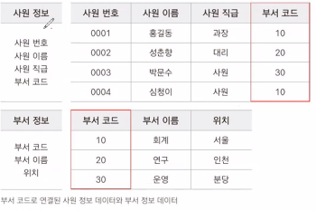  

RDBMS를 다루는 언어로는 MS-SQL, MySQL, MariaDB, PostgreSQL, DB2, ORACLE 등이 있음.  
이 중, ORACLE이 가장 많이 쓰임.  

---

### 관계형 데이터 모델의 핵심 구성 요소  

<table border>
  <thead>
    <tr>
      <th>이름</th>
      <th>설명</th>
    </tr>
  </thead>
  <tbody>
    <tr>
      <td>개체</td>
      <td>데이터화하려는 사물, 개념의 정보 단위. table 개념과 대응되며, table은 릴레이션으로 표기하기도 함.</td>
    </tr>
    <tr>
      <td>속성</td>
      <td>개체를 구성하는 데이터의 가장 작은 '논리적 단위'. 데이터의 종류, 특성, 상태 등을 정의함. column 개념과 대응됨.</td>
    </tr>
    <tr>
      <td>관계</td>
      <td>개체와 개체, 또는 속성 간의 연관성을 나타냄. 테이블 간의 관계를 외래키(foreign key) 등으로 구현하여 사용함.</td>
    </tr>
  </tbody>
</table>


RDBMS는 우리가 평소에 쓰는 xmls 문서라고 보면 됨.  

행(→) : 데이터 한 단위. 각각의 한 행을 row, tuple, `Record`라고 부름.  

열(↓) : 데이터를 대표하는 이름과 공통 특성을 정의함.  
저장 정보의 종류, 저장 가능한 값의 최대 길이, 값의 중복 허용 유무 등을 지정할 수 있음.  
각각의 한 열을 속성(attribute), field, column 등으로 부름.  

관계 : 테이블 하나하나를 의미함.  

키(key) : 데이터를 구별할 수 있는 유일한 값.  
하나의 테이블을 구성하는 여러 열 중에서, 특별한 의미를 지닌 하나 또는 여러 열의 조합을 의미함.  
종류별로 데이터를 구별하거나, 테이블 간의 연관 관계를 표현할 때, 키로 지정한 열을 사용함.  

---

#### 키의 종류  
`기본키(primary key)` - 기본키 PK는 가장 중요한 키. 한 테이블 내에서 중복되지 않는 값만 가질 수 있는 키.
- 속성 :  
    테이블에 저장된 행을 식별할 수 있는 유일한 값.  
    값의 중복이 없어야 함.  
    NULl 값을 가질 수 없음.  
하나 또는 여러 열의 조합으로 만들 수 있음.  
대부분의 경우, 개인 정보 노출이 가장 적은 데이터를 선정함.  

`보조키 (alternate key)` - 대체키라고도 함. 후보키 중에서 기본키로 지정되지 않은 열.  

`후보키(candidate key)` - 기본키가 될 수 있는 모든 키들.  

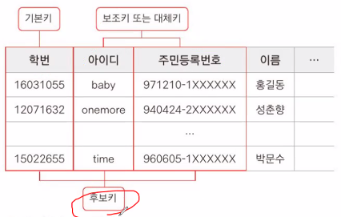  

`외래키(foreign key)` - 외부키라고도 부름. 특정 테이블에 포함되어 있으면서, 다른 테이블의 기본키로 지정된 키.  

이 때, 다른 테이블에서 외래키를 `참조`<sup>(reference)</sup>한다고 표현함.  
참조를 통해, 데이터 중복을 피할 수 있음. 셀 병합과 유사한 효과.  
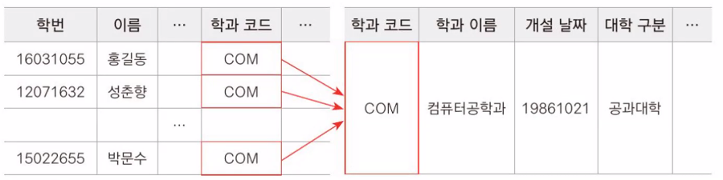  

`복합키(composite key)` - 두 개 이상의 열(속성)을 조합하여 기본키 역할을 할 수 있게 만든 키.  
하나의 열만으로는 행을 식별하는 것이 불가능할 때 사용함. 2~10개가 넘는 열을 조합하기도 함.  


### SQL(Structured Query Language)  
DBMS를 관리하기 위해 사용하는 언어.  
SQL을 통해 데이터베이스에서 여러 데이터 관련 작업을 수행할 수 있음.  

사용 목적에 따라 명령어가 나뉨.  
<table border>
  <thead>
    <tr>
      <th>종류</th>
      <th>설명</th>
    </tr>
  </thead>
  <tbody>
    <tr>
      <td>DQL</td>
      <td>RDBMS에 저장한 데이터를 조회하는 명령어</td>
    </tr>
    <tr>
      <td>DML</td>
      <td>데이터를 저장, 수정, 삭제하는 명령어</td>
    </tr>
    <tr>
      <td>DDL</td>
      <td>데이터 관리를 위해 테이블을 포함한 여러 객체를 생성, 수정, 삭제하는 명령어</td>
    </tr>
    <tr>
      <td>TCL</td>
      <td>트랜잭션 데이터의 영구 저장/취소 등과 관련된 명령어</td>
    </tr>
    <tr>
      <td>DCL</td>
      <td>데이터 사용 권한과 관련된 명령어</td>
    </tr>
  </tbody>
</table>


# Oracle DBMS  
가장 많이 사용되는 SQL  
대부분 2007년에 나온 11g 버전을 사용함.  

## 자료형  
데이터베이스에 저장하는 데이터는 다양한 형태<sub>숫자, 문자 등</sup>를 가지고 있음.  
데이터의 형태를 자료형이라고 부름.  

Oracle의 자료형 종류  
(*가 있는 자료형을 주로 사용함.)  

- 스칼라형 : 하나의 자료형에 맞춰 한 종류의 데이터를 저장할 수 있는 자료형.  
    - *`VARCHAR2`(길이) : 가변 길이 문자열 데이터를 저장. (4000~1byte)  
    - *`NUMBER`(전체 자릿수, 소수점 이하 자릿수) : ±38자릿수 숫자를 저장. 저장할 전체 자리수와, 그 중에서 소수점 자리수를 지정할 수 있음.  
    - *`DATE` : 날씨 형식을 저장.  
    - CHAR(길이) : 문자열 데이터를 저장. 한 글자를 쓰더라도 4000byte 고정. 거의 사용하지 않음.  
    - BLOB, CLOB : 이진 데이터 파일, 문자 데이터 파일을 저장.  
    - BFILE : 이진 데이터 파일을 저장.  
  
- 컬렉션형 : 한 번에 여러 데이터를 저장할 수 있는 자료형  
VARRAY, NESTED, TABLE  

## 객체  
데이터를 저장하고 관리하기 위한 논리 구조를 가진 구성 요소.  

객체 종류  

<table border="1">
  <thead>
    <tr>
      <th>용어</th>
      <th>설명</th>
    </tr>
  </thead>
  <tbody>
    <tr>
      <td>테이블 (table)</td>
      <td>데이터를 저장하는 장소</td>
    </tr>
    <tr>
      <td>인덱스 (index)</td>
      <td>검색 효율을 높이기 위해 사용</td>
    </tr>
    <tr>
      <td>뷰 (view)</td>
      <td>하나 또는 여러 개의 선별된 데이터들을 논리적으로 연결하여 하나의 테이블처럼 사용하게 해줌</td>
    </tr>
    <tr>
      <td>시퀀스 (sequence)</td>
      <td>호출될 때마다 자동으로 일련 번호를 생성해줌</td>
    </tr>
    <tr>
      <td>시노님 (synonym)</td>
      <td>오라클 객체의 별칭을 지정</td>
    </tr>
    <tr>
      <td>프로시저 (procedure)</td>
      <td>프로그래밍 연산 및 기능 수행이 가능함 (반환값 없음)</td>
    </tr>
    <tr>
      <td>함수 (function)</td>
      <td>프로그래밍 연산 및 기능 수행이 가능함 (반환값 있음)</td>
    </tr>
    <tr>
      <td>패키지 (package)</td>
      <td>관련 있는 프로시저와 함수를 보관함. 자바 패키지와 유사.</td>
    </tr>
    <tr>
      <td>트리거 (trigger)</td>
      <td>데이터 관련 작업의 연결 및 방지 관련 기능을 제공함</td>
    </tr>
  </tbody>
</table>


#### PL/SQL  
ORACLE을 포함한 기존 SQL만으로는, 복잡한 RDBMS를 다루기 힘듦.  
이를 보완한 것이 PL/SQL.  

## 사용법  
사용한 SQL 프로그램 : Oracle SQL Developer  
- 데이터베이스 접속 예시  
    1. 접속(ID/PW)  
    2. DB 선택  
    3. DB 조회/수정  

    SCOTT 계정 잠금 풀기  
    ```
    ALTER USER SCOTT  
    IDENTIFIED BY tiger
    ACCOUNT UNLOCK;
    ```
    SCOTT 계정 연결  
    ```
    CONN scott/tiger  
    ```

    scott db의 EMP 테이블 구성 요소
    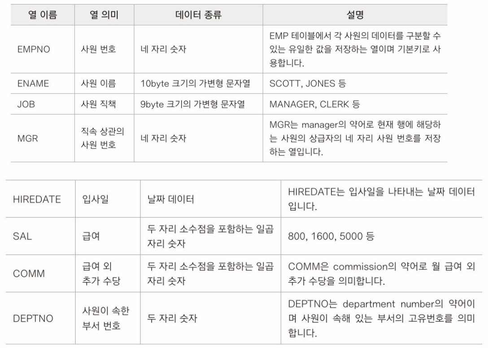  
    DEPT 테이블 구성 요소  
    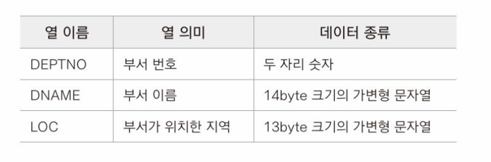  
    SALGRADE 테이블 구성 요소  
    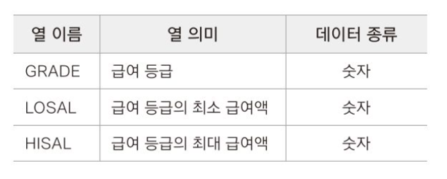  
    table 구성 요소는 대문자로 적는 것을 권장.  

## 데이터 제어 명령어(DML)  

### SELECT문  
데이터를 선택하는 명령어.  

셀렉션 : 행 단위로 데이터를 선택(조회)함.  

프로젝션 : 열 단위로 데이터를 조회함.  
여러 열을 선택하여 데이터를 조회할 수 있음.   

조인 : 셀렉션과 프로젝션을 함께 사용.  
원하는 행의 특정 열만 선택할 수 있음.  
두 개 이상의 테이블을 하나의 테이블로 붙인 것처럼 조회할 수 있음.  

SELECT문은 FROM절과 함께 사용함.  
```
SELECT [옵션] [조회할 열1 이름], [열2 이름], ... , [열N 이름]
FROM [조회할 테이블 이름]
```
- #### 옵션  
    - DISTINCT 옵션  
    SELECT문은 데이터를 선택할 때, 같은 값들도 중복해서 선택됨.  
    DISTINCT 옵션을 넣으면, 데이터를 선택할 때, 중복된 값은 선택하지 않음.  

    - ALL 옵션  
    SELECT문의 기본값.  

- #### 별칭(ALIAS)  
    별칭을 붙일 칼럼 뒤에 작성함.  
    컬럼의 이름을 바꾸거나,  
    SELECT문에 산술연산 구문을 넣으면, 그대로 수행하고 칼럼명도 그대로 출력되는데, 이 때 칼럼명을 지정하는 용도로 쓰임.  
    내부 프로그램에서 수행하는 실행문을 숨길 때도 자주 사용함.  
    ```
    [별칭을 붙일 칼럼] [별칭]
    [별칭을 붙일 칼럼] ["별칭"]
    [별칭을 붙일 칼럼] as ["별칭"]
    [별칭을 붙일 칼럼] as [별칭] → 주로 사용
    ```
    
    #### 산술연산할 때 대상으로 null 값이 들어가면, 결과가 null이 되어버림.  

- #### ORDER BY 절  
SELECT문을 사용할 때, 가장 마지막 부분에 씀.  
특정 기준으로 데이터를 정렬할 때 사용함.  

기준컬럼을 여러 개로 지정할 수 있음.  
이 때, 가장 앞에 있는 칼럼의 우선순위가 가장 높음  
```
SELECT ...
FROM ...
...
ORDER BY [기준컬럼1] [ASC | DESC], [기준칼럼2] [ASC | DESC], ...
```
ASC : 오름차순 (기본값)  
DESC : 내림차순  

ORDER BY 절은 꼭 필요한 경우가 아니면 사용하지 않는 것이 좋음.  
데이터의 양, 정렬 방식에 따라 SQL문의 효율이 낮아질 수 있기 때문.  

- #### WHERE 절  
IF문 조건과 유사함.  
특정 조건을 기준으로, 원하는 행을 선택할 때 사용함.  
조건을 만족하는 column만 선택함.  

SELECT ~ FROM이 먼저 수행되어 정보를 가져오고, 그 후에 WHERE로 필터링하여 선택함.  
(한 행마다 조건을 판별함)  

```
SELECT ...
FROM ...
WHERE [조건식]
```
조건식이 참인 경우의 데이터만을 출력  
WHERE 조건의 개수 제한은 없음.  

- #### 연산자  
  - 산술 연산자  
    +, -, *, /  
  - 비교 연산자  
      = , >, <, >=, <=  
      <>, !=, ^= (다르다)  
      문자, 문자열에도 쓸 수 있음.  
  - 논리 연산자
      AND, OR , NOT  
      NOT은 다른 연산자들과 함께 많이 쓰임  
  - BETWEEN AND, NOT BETWEEN AND 연산자  
    ```
    WHERE column_name BETWEEN value1 AND value2;
    WHERE column_name NOT BETWEEN value1 AND value2;
    ```
    value1과 value2를 포함한, 사이 범위(<=,>=)의 값들을 선택함.  

  - IN 연산자  
    ```
    WHERE column_name IN ('조건1', '조건2', ... '조건N') 
    ```
    OR 연산자와 같은 기능을 함.  
    조건들 중 하나라도 만족하는 값을 선택.  
  - LIKE 연산자  
    속성값이 특정 문자, 혹은 숫자인 값만 선택.  
    ```
    SELECT * FROM Customers
    WHERE Country LIKE 'Spain';
    // Country 속성 중, 'Spain'인 행만 출력
    ```
  
  - 와일드카드  
    와일드카드는 LIKE 연산자와 함께 쓰임  
    https://www.w3schools.com/sql/sql_wildcards.asp  
    와일드카드 문자 종류  
    <table border="1">
      <thead>
        <tr>
          <th>Symbol</th>
          <th>Description</th>
        </tr>
      </thead>
      <tbody>
        <tr>
          <td>%</td>
          <td>Represents zero or more characters 글자 수를 신경쓰지 않음</td>
        </tr>
        <tr>
          <td>_</td>
          <td>Represents a single character 한 글자만 올 수 있음</td>
        </tr>
        <tr>
          <td>[]</td>
          <td>Represents any single character within the brackets *</td>
        </tr>
        <tr>
          <td>^</td>
          <td>Represents any character not in the brackets *</td>
        </tr>
        <tr>
          <td>-</td>
          <td>Represents any single character within the specified range *</td>
        </tr>
        <tr>
          <td>{}</td>
          <td>Represents any escaped character **</td>
        </tr>
      </tbody>
    </table>

    *: PostgreSQL, MySQL에선 지원하지 않는 기능.  
    **: Oracle DB에서만 지원하는 기능.  

    Microsoft Access DB도 지원하지만, 사용하는 문자가 다름.  
    ```
    -- ENAME 중 S로 끝나는 값 출력
    SELECT *
    FROM EMP
    WHERE ENAME LIKE '%S';

    -- ENAME 중 두 번째 글자가 L인 값 출력
    SELECT *
    FROM EMP
    WHERE ENAME LIKE '_L%';

    -- ENAME 중 AM이라는 글자가 포함되면 모두 출력
    SELECT *
    FROM EMP
    WHERE ENAME LIKE '%AM%';
    ```

  - ESCAPE 절  
  데이터 명에 와일드카드 기호로 사용되는 _나 %가 들어갈 경우,    
  데이터의 이름을 와일드카드 기호로 인식하지 않도록 하기 위해 사용함.  
    ```
    SELECT * FROM SOME_TABLE
    WHERE SOME_COLUMN LIKE 'A\_A%' ESCAPE '\';
    -- \ 바로 뒤에 있는 _를 와일다 카드 기호가 아닌 데이터에 포함된 문자로 인식하라는 의미 --
    ```

  - IS NULL 연산자  
  값이 NULL인 경우 선택함.  
    ```
    -- WHERE COMM = NULL; 불가능 (NULL은 연산이 불가능함.)
    WHERE COMM IS NULL;
    -- COMM 속성 중 값이 NULL인 칼럼들을 선택.
    ```
    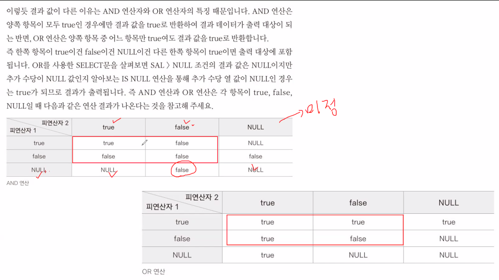  

  - 집합연산자  
    - UNION(합집합, 중복X)
    두 개 이상 SELECT를 하는 경우, UNION을 넣으면 모두 선택함.  
    단, 컬럼의 개수와 자료형이 같아야 함.  
    ```
    SELECT * FROM EMP WHERE DEPTNO = 10
    UNION
    SELECT * FROM EMP WHERE DEPTNO = 20
    -- DEPTNO가 10인 칼럼과 20인 칼럼을 모두 선택
    ```
    - UNION ALL(합집합, 중복O)  
    중복된 결과 값까지 모두 출력함.  
    - MINUS(차집합)  
    먼저 작성한 SELECT문의 결과값에서, 다음 SELECT 문의 결과값을 차집합한 값들을 선택힘.  
    즉, 먼저 작성한 SELECT문의 결과값 중에서, 다음 SELECT문에 존재하지 않는 데이터만 선택됨.  
    - INTERSECT(교집합)  
    먼저 작성한 SELECT문과 다음 SELECT문의 결과값 중, 둘 다 있는 데이터만 선택됨.  
    AND와 같은 기능을 함.  

  - ### 함수  
  내장 함수와 사용자 정의 함수로 나뉨.  

  #### 내장 함수  
  입력 방식에 따라 데이터 처리에 사용하는 행이 나뉨.  
  단일행 함수(Single-row function) : 데이터가 한 행씩 입력되고, 입력된 한 행당 결과가 하나씩 나오는 함수.  
  다중행 함수(Multiple-row function) : 데이터가 여러 행 입력되어, 항상 하나의 행으로 결과가 반환되는 함수.  
  
---
  #### 단일행 함수

  - `UPPER(문자열)` : 괄호 안 문자 데이터를 모두 대문자로 변환하여 반환  
  - `LOWER(문자열)` : 괄호 안 문자 데이터를 모두 소문자로 변환하여 반환  
  - `INITCAP(문자열)` : 괄호 안 문자 데이터 중 첫 글자는 대문자로, 나머지 문자는 소문자로 변환하여 반환  
  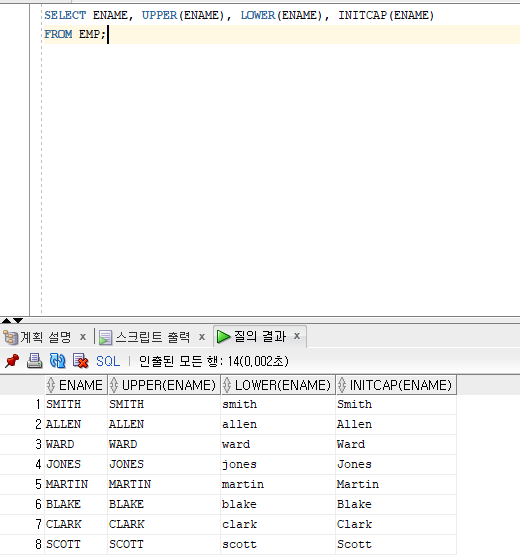  
  - `LENGTH(문자열)` : 괄호 안 데이터의 길이를 반환  
  - `LENGTHB(문자열)` : 길이를 byte수로 반환. (문자 하나당 2byte)  
  - `SUBSTR()` : 괄호 안 문자열 데이터에서 지정한 위치, 길이만큼 잘라서 반환  
    단, index는 1부터 시작. 길이를 지정하지 않으면 끝까지.  
    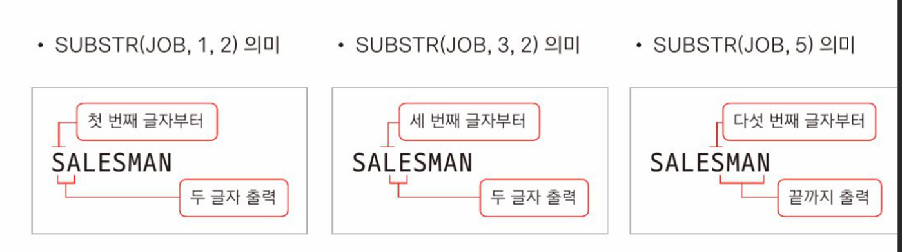  
    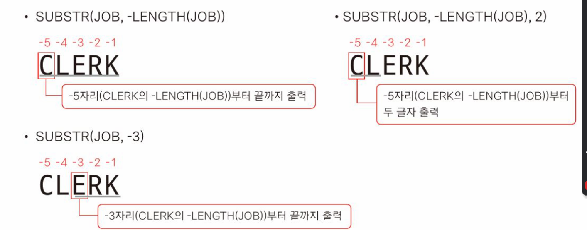  
  - `INSTR()` : 괄호 안 문자 데이터 중에서 지정한 데이터를 찾아, 해당 위치를 반환 (없으면 0을 반환)  
    INSTR(문자열, 찾을문자, 시작위치, n번째)  
      ```
        SELECT 'HELLO, ORACLE!' AS STR,
              -- 앞에서부터 검색한 L 위치
              INSTR('HELLO, ORACLE!', 'L') AS INSTR_1,
              -- 5번째 글자부터 검색한 L 위치
              INSTR('HELLO, ORACLE!', 'L', 5) AS INSTR_2,
              -- 2번째 글자부터 검색한 2번째 L 위치
              INSTR('HELLO, ORACLE!', 'L', 2, 2) AS INSTR_3
        FROM DUAL;
      ```
      
      INSTR을 사용해서, ENAME 중 S가 포함된 column을 출력하는 예시  
      ```
      SELECT * FROM EMP
      WHERE INSTR(ename,'S') > 0;
      ```

  - `REPLACE()` : 괄호 안 문자 데이터 중, 특정 값을 지정한 값으로 바꿈.  
    ```
    SELECT '010-1234-5678' AS 원본문자열,
      REPLACE('010-1234-5678','-',' ') AS 하이픈을공백으로,
      REPLACE('010-1234-5678', '-') AS 하이픈만제거
    FROM DUAL;
    ```
  - `LPAD()`,`RPAD()` : 문자열과 길이를 지정하고, 빈 공간을 원하는 값으로 채운 데이터를 반환.  
    ```
    LPAD('문자열',길이,'패딩문자(선택)')
    RPAD('문자열',길이,'패딩문자(선택)')
    패딩문자를 적지 않으면, 기본값인 공백이 들어감
    ```
    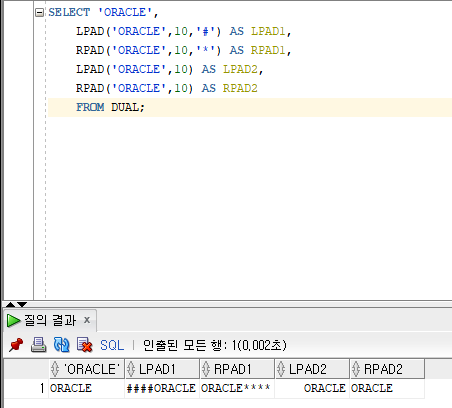  

  - `CONCAT()` : 두 문자열 데이터를 하나의 데이터로 연결함.  
    ```
    CONCAT(문자열1, 문자열2)
    CONCAT(문자열1, CONCAT(문자열3), 문자열2)
    두 문자열 사이에 문자열 3을 넣음
    ```
    || (AND) 연산자로 쓸 수도 있음.  
    ```
    SELECT EMPNO || ' : ' || ENAME
    FROM EMP;
    ```
  - `TRIM()` : 문자열 내 공백을 없앤 데이터를 반환함.  
    ```
    TRIM('  문자열  ')
    ```
    키워드를 통해 공백을 <span style="text-decoration:underline">제거할 위치</span>와, 공백이 아닌 <span style="text-decoration:underline">제거할 문자</span>를 지정 할 수 있음.  

    키워드를 통해 공백을 제거
    ```
    SELECT  '[' || TRIM(' _ _ORACLE_ _ ') || ']' AS TRIM,
          -- 문자열 앞 공백 제거
          '[' || TRIM(LEADING FROM ' _ _ORACLE_ _ ') || ']' AS TRIM_LEADING,
          -- 문자열 뒤 공백 제거
          '[' || TRIM(TRAILING FROM ' _ _ORACLE_ _') || ']' AS TRIM_TRAILING,
          -- 문자열 양쪽 공백 제거(기본값)
          '[' || TRIM(BOTH FROM ' _ _ORACLE_ _') || ']' AS TRIM_BOTH
          FROM DUAL;
    ```
    키워드를 통해 지정한 문자를 제거
    ```
    SELECT  '[' || TRIM('_' FROM '_ _ORACLE_ _') || ']' AS TRIM,
          '[' || TRIM(LEADING '_' FROM '_ _ORACLE_ _') || ']' AS TRIM_LEADING,
          '[' || TRIM(TRAILING '_' FROM '_ _ORACLE_ _') || ']' AS TRIM_TRAILING,
          '[' || TRIM(BOTH '_' FROM '_ _ORACLE_ _') || ']' AS TRIM_BOTH
          FROM DUAL;
    ```
  - `LTRIM`, `RTRIM` : 왼쪽/오른쪽에 있는 공백들을 제거함.  
    마찬가지로 키워드를 통해 제거할 문자를 지정할 수 있음.  
    ```
    LTRIM('  문자열  ')
    --`문자열  `
    RTRIM('  문자열  ')
    --`  문자열`
    ```
    지정한 키워드가 여러 개인 경우, 적은 키워드들이 있는 부분은 모두 제거함.  
     ```
    LTRIM('<__ORACLE_>','_<')
    --[ORACLE_>]
     ```
  - `ROUND` : 지정한 위치에서 <span style="text-decoration:underline">반올림</span>하는 함수  
    ```
    ROUND([숫자], [반올림위치(선택)])
    -- 반올림 위치를 적지 않으면, 소수 첫째자리에서 반올림 함.
    -- 음수를 적으면 정수 자리에서 반올림.  
    ```
    예시
    ```
        SELECT  ROUND(1234.5678),
            ROUND(1234.5678,0),
            ROUND(1234.5678,1),
            ROUND(1234.5678,2),
            ROUND(1234.5678,-1),
            ROUND(1234.5678,-2)
        FROM DUAL;

    ```
  - `TRUNC` : 지정된 위치에서 <span style="text-decoration:underline">버림</span>하는 함수
     ```
      SELECT
      TRUNC([숫자], [버림위치(선택)])
      -- 위치를 적지 않으면, 소수 첫째자리에서 버림.
      -- 음수를 적으면 정수 자리에서 버림.  
      ```
  - `CEIL`, `FLOOR` : 각각 입력된 숫자와 가장 가까운, 앞에 있는(큰) / 뒤에 있는(작은) 숫자를 반환함.  
    ```
    SELECT
      -- 4
      CEIL(3.14),
      -- 3
      FLOOR(3.14),
      -- -3
      CEIL(-3.14),
      -- -4
      FLOOR(-3.14)
    ```
  - `MOD` : (%) 나머지 값을 구하는 함수.  
    홀수, 짝수를 구분할 때 사용함.  
    ```
    MOD([숫자], [숫자])
    ``` 

---

  #### DATE 날짜 함수  
  날짜 데이터 + 숫자 : 숫자만큼 일수 이후의 날짜  
  날짜 데이터 - 숫자 : 숫자만큼 일수 이전의 날짜  
  날짜 데이터 - 날짜 데이터 : 두 날짜 데이터 간의 일수 차이  
  날짜 데이터 + 날짜 데이터 : 연산 불가. 지원x.  

  - `SYSDATE` : 시스템 날짜를 반환.  
  - `ADD_MONTHS()` : 날짜 데이터에 달을 더함.  
    ```
    ADD_MONTHS(날짜, 더할 달)
    ```
  - `MONTHS_BETWEEN()` : 두 날짜간의 달수 차이를 반환함.  
    ```
    SELECT EMPNO, ENAME, HIREDATE, SYSDATE, TRUNC(MONTHS_BETWEEN(HIREDATE, SYSDATE)) AS MONTH1,
        TRUNC(MONTHS_BETWEEN(SYSDATE, HIREDATE)) AS MONTH2
    FROM EMP;

    ```
    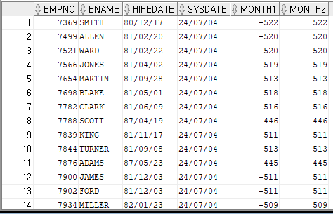  
  
  - `NEXT_DAY` : 입력한 날짜 기준으로 돌아오는 요일 날짜를 반환함.  
    ```
    NEXT_DAY(날짜, '요일')
    NEXT_DAY(SYSDATE, '월요일')
    ```
  - `LAST_DAY` : 입력한 날짜 기준 달의 마지막 날짜를 반환함.  
    ```
    LAST_DAY(날짜)
    LAST_DAY(SYSDATE)
    ```
  - `ROUND`, `TRUNC` : 날짜 데이터에서 사용하는 ROUND, TRUNC 함수는 매개변수가 다름.  
    ```
    ROUND([DATE], [FORMAT])
    ```
    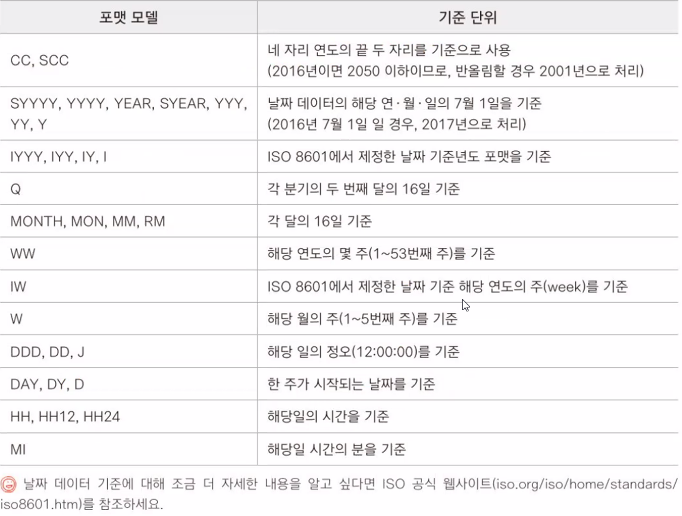  

---

  #### 데이터 형변환 함수  
    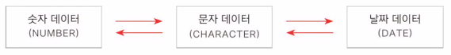  

  - `TO_CHAR` : 숫자 또는 날짜 데이터를 문자 데이터로 변환  
    날짜 데이터를 분자 데이터로 변환할 때, 형식과 언어를 지정할 수 있음.  
    language_types : https://ss64.com/ora/syntax-nls.html  
    ```
    SELECT TO_CHAR(DATEDATA, 'FORMAT', (선택)'NLS_DATE_LANGUAGE = language_type')
    SELECT TO_CHAR(SYSDATE, 'YYYY/MM/DD HH24:MI:SS') FROM DUAL;
    ```
    날짜, 시간 포맷(DATE, TIME FORMAT)  
    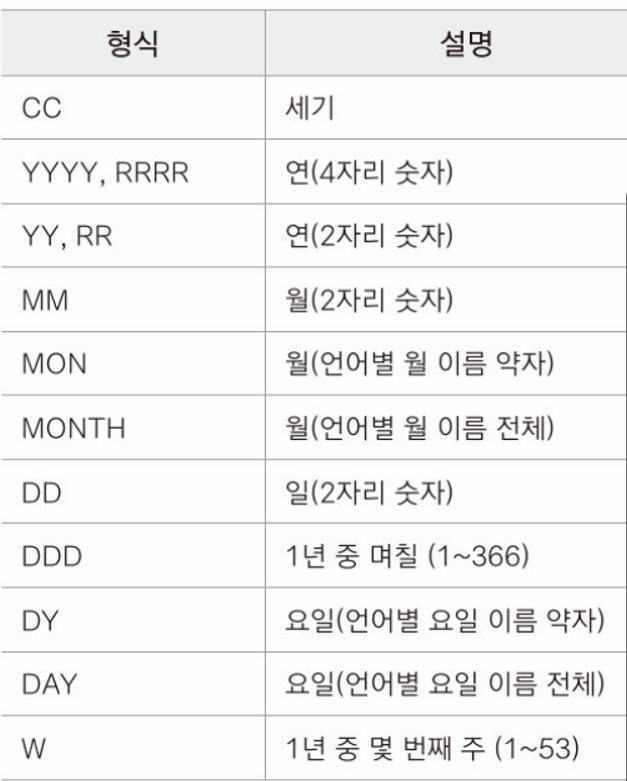  
    연도를 두 자리수로 표기할 때, YY는 무조건 2000년대, RR은 50년도 이전은 2000년대, 50년도 이후는 19년대로 표시.  
    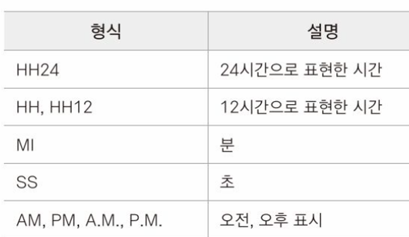  
    숫자 포맷(NUMBER FORMAT)  
    ```
    SELECT  TO_CHAR(SAL, '$999,999') AS SAL_$,
            TO_CHAR(SAL, 'L999,999') AS SAL_L,
            TO_CHAR(SAL, '999,999.00') AS SAL_1,
            TO_CHAR(SAL, '000,999,999.00') AS SAL_2,
            TO_CHAR(SAL, '000999999.99') AS SAL_3,
            TO_CHAR(SAL, '999,999,00') AS SAL_4
    FROM EMP;
    ```
  - `TO_NUMBER` : 문자 데이터를 숫자 데이터로 변환  
    숫자로 이루어진 문자 데이터만 연산한데, 이 때 문자가 포함된 데이터를 숫자 데이터로 변환하고 싶을 때 사용함.  
    ```
    TO_NUMBER(문자열,'NUMBER_FORMAT')
    -- 해당 문자열을 어떻게 읽을지 포맷을 알려줌
    ```
  - `TO_DATE` : 문자 데이터를 날짜 데이터로 변환  
    ```
    TO_DATE(`문자열`, `DATE_FORMAT`)
    -- 문자열과 형식 길이가 같아야 함.
    ```

---

  #### NULL 처리 함수  
  - `NVL()` : 입력한 칼럼의 값 중 NULL이 있으면, 지정한 값으로 바꾸는 함수  
  ```
  NVL(column_name, NULL_to_int/boolean/String)
  NVL([NULL여부를 검사할 데이터 OR 열], [NULL일 경우 반환할 데이터])
  ```

  - `NVL2()` : NULL이 아닌 경우도 값 지정 가능.  
  ```
  NVL2(NULL_col, NULL_to, NOT_NULL_to)
  NVL2([NULL여부를 검사할 데이터 OR 열], [NULL이 아닐 경우 반환할 데이터], [NULL일 경우 반환할 데이터])
  ```

---

  #### 조건문 함수  
  특정 조건에 따라 반환할 데이터를 설정할 때 사용함.  
  <span style="text-decoration:underline">조건에 따라 반환할 타입이 모두 같아야 함.</span>  
  - `DECODE()` : SWITCH문과 비슷함.  
    ```SQL
    DECODE([검사 대상],
            [조건1], [조건1일때 결과],
            [조건2], [조건2일때 결과],
            ...
            [조건n], [조건n일때 결과],
            (선택)[일치한 조건이 없을 때 결과])
    -- default 조건이 없는 경우, NULL로 반환됨.
    ```
    ```SQL
    -- 예시
    SELECT EMPNO, ENAME, JOB, SAL,
        DECODE(JOB, 
        'MANAGER', SAL*1.1, 
        'SALESMAN', SAL*1.05, 
        'ANALYST', SAL, 
        SAL*1.03) AS UPSAL
    FROM EMP;
    ```

  - `CASE()` : IF문과 비슷함.  
    ```SQL
    CASE [검사 대상],
      WHEN [조건1] THEN [조건1이 TRUE일 때 결과]
      WHEN [조건2] THEN [조건2이 TRUE일 때 결과]
      ...
      WHEN [조건n] THEN [조건 n이 TRUE일 때 결과]
      ELSE [일치하는 조건이 없을 때 결과]
    END
    ```
    JOB 별로 SAL값을 다르게 출력하는 예시
    ```SQL
    SELECT EMPNO, ENAME, JOB, SAL,
        CASE JOB
            WHEN 'MANAGER' THEN SAL*1.1
            WHEN 'SALESMAN' THEN SAL*1.05
            WHEN 'ANALYST' THEN SAL
            ELSE SAL*1.03
        END
            AS UPSAL
    FROM EMP;
    ```
    COMM 값을 참조해서 추가수당 별로 다르게 출력하는 예시  
      ```SQL
      SELECT EMPNO, ENAME, JOB, SAL, 
      CASE
          WHEN COMM=0 THEN '수당없음'
          WHEN COMM>0 THEN '수당:' || COMM
          ELSE '해당사항 없음'
      END
      FROM EMP;
      ```
---

  #### 다중행 함수  
  결과값이 한 행이기 때문에, 다중행과 함께 출력할 수 없음.  
  - `SUM()` : 지정한 데이터의 합을 반환  
  NULL처리를 따로 해주지 않아도 됨.  
  ```SQL
  SELECT SUM(col_name)
  FROM table_name
  ```
  ```SQL
  SUM([DISTINCT, ALL(선택)] [col_name])
  OVER(분석을 위한 여러 문법을 지정)(선택)
  ```
  - `COUNT()` : 지정한 데이터의 개수 반환  
  NULL은 세지 않음.  
    ```SQL
    COUNT([DISTINCT, ALL(선택)] [col_name])
    OVER(분석을 위한 여러 문법을 지정)(선택)
    ```
  - `MAX()` : 지정한 데이터 중 최댓값 반환  
  - `MIN()` : 지정한 데이터 중 최솟값 반환  
  문자열, 숫자, 날짜 모두 가능.  
  - `AVG()` : 지정한 데이터의 평균값 반환  

- `GROUP BY` 절 : 다중행 함수와 같이 자주 쓰임  
함수 결과 값을 행별로 나누고 싶을 때, 즉 다중행과 함께 나란히 출력하고 싶을 때  
해당 다중행을 기준으로 함수 결과행을 GROUP BY로 묶어줌.  
```SQL
SELECT [col_name1], [col_name2], ...
FROM [table_name]
WHERE [조건]
GROUP BY [그룹화할 열(여러개 가능)]
ORDER BY [정렬하려는 열]
```
```SQL
SELECT AVG(SAL), '10' AS DEPTNO FROM EMP WHERE DEPTNO = 10
UNION
SELECT AVG(SAL), '10' AS DEPTNO FROM EMP WHERE DEPTNO = 20
UNION
SELECT AVG(SAL), '10' AS DEPTNO FROM EMP WHERE DEPTNO = 30;
--↓
SELECT AVG(SAL), DEPTNO FROM EMP GROUP BY DEPTNO;
```
- `HAVING`절  
묶인 컬럼의 조건을 정의할 때 사용.  
GROUP BY절을 사용할 때, 조건을 넣기 위해 사용함.  
```SQL
-- 부서별, 직급별 평균 급여가 2000이상인 데이터를 출력
SELECT DEPTNO, JOB, AVG(SAL) FROM EMP
GROUP BY DEPTNO, JOB
    HAVING AVG(SAL)>=2000
ORDER BY DEPTNO ,JOB;
```
```SQL
-- 수행 순서
SELECT ② 
FROM  ①
WHERE ③
GROUP BY ④ 
HAVING 
```
- `ROLLUP`, `CUBE`, `GROUPING SETS` 함수  
GROUP BY 절에 지정할 수 있는 특수 함수.  
그룹화 데이터의 합게를 출력할 때 사용.  
  - `ROLLUP` : GROUP BY는 소그룹에 대한 결과만 출력하지만, ROLLUP함수를 사용하면 대그룹과 총그룹에 대한 결과도 출력.  
  포함관계를 기준으로 작은 그룹부터 큰 그룹까지 출력함.  
  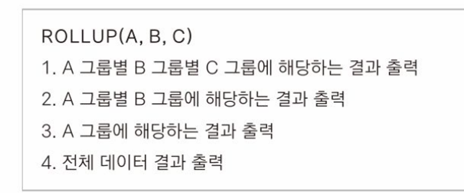  
  - `CUBE` : ROLLUP보다 더 많은 결과를 출력.  
  포함관계를 무시하고, 모든 열의 조합으로 출력함.  

  그룹화 => 가장 소그룹의 결과  
  ROLLUP => 소그룹->대그룹의 결과  
  CUBE => 조합 가능한 모든 그룹 결과  

  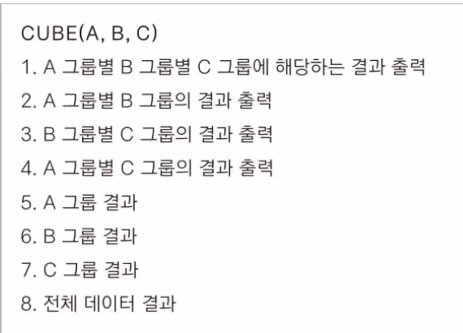  
  - `GROUPING SETS` : 계층없이, 지정한 그룹들의 결과만 출력함.  
```SQL
-- ROLLUP : 대그룹, 총그룹에 대한 결과를 출력
GROUP BY ROLLUP([col_name(대그룹)], [col_name(소그룹)])
-- CUBE : 모든 열의 조합 결과 출력
GROUP BY CUBE([col_name(대그룹)], [col_name(소그룹)])
-- GROUPING SETS
GROUP BY GROUPING SETS([col_name], [col_name])
```

  - `GROUPING` 함수 :  
  그룹화가 되었는지, 몇개의 그룹이 그룹화 되었는지 출력.  
  그룹화가 되었으면 0, 묶이지 않았으면 1  
  조건문에 사용하기 유용함.  
  ```
  SELECT 
  DECODE(GROUPING(DEPTNO), 1, 'ALL_DEPT', DEPTNO) AS DEPTNO,
  DECODE(GROUPING(JOB),1,'ALL_JOB', JOB) AS JOB,
  COUNT(*), MAX(SAL), SUM(SAL), AVG(SAL), GROUPING(DEPTNO), GROUPING(JOB)
  FROM EMP
  GROUP BY CUBE(DEPTNO, JOB)
  ORDER BY DEPTNO, JOB;
  ```

  - `GROUPING_ID` 함수 :  
  GROUPING은, 한 컬럼에 대한 그룹화 유무를 보여주지만, GROUPING_ID는 지정한 모든 컬럼에 대한 그룹화 유무를 보여줌.  
  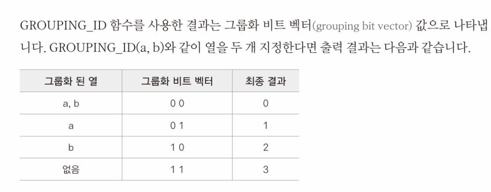  
  ```
  SELECT 
  DEPTNO,JOB,COUNT(*), MAX(SAL), SUM(SAL), AVG(SAL), GROUPING(DEPTNO), GROUPING(JOB), GROUPING_ID(DEPTNO, JOB)
  FROM EMP
  GROUP BY CUBE(DEPTNO, JOB)
  ORDER BY DEPTNO, JOB;
  ```
  - `LISTAGG` 함수 :  
  데이터를 가로로 출력할 수 있음. `WITHIN`과 함께 쓰임  
  ```
  SELECT DEPTNO, 
        LISTAGG(ENAME, ', ')
        WITHIN GROUP(ORDER BY SAL DESC) AS ENAMES
      FROM EMP
  GROUP BY DEPTNO;
  ```
  - `PIVOT` 함수 :  

  ```
  SELECT *
  FROM (SELECT DEPTNO, JOB, SAL FROM EMP)
  PIVOT(MAX(SAL) FOR DEPTNO IN (10,20,30))
  ORDER BY JOB;
  ```

  ### JOIN  
  두 개 이상의 테이블을 연결하여, 하나의 테이블처럼 출력할 때 사용함.  
  어떻게 연결하느냐에 따라 종류가 나뉨.  
  - EQUAL-JOIN(등가 조인) : 일반적으로 가장 많이 사용되는 JOIN 방식.  
  WHERE 절로 조건을 주어서, 데이터값이 같은(=) 행만 합침.  
  행 이름이 같을 때는, `TABLE.COLNAME`로 구분함.  
  AND로 조건 추가 가능.  
  ```
  SELECT EMP.EMPNO, EMP.ENAME, EMP.DEPTNO, DEPT.DNAME, DEPT.loc
  WHERE EMP.DEPTNO = DEPT.DEPTNO
  ORDER BY EMPNO;
  -- ALIAS 사용 ↓
  SELECT E.EMPNO, E.ENAME, E.DEPTNO, D.DNAME, D.loc
  FROM EMP E, DEPT D
  WHERE e.DEPTNO = d.DEPTNO;
  ```
  - NON-EQUAL-JOIN(비등가조인) : 등가 조인을 제외한 모든 조인 방법  
    - CROSS-JOIN : 모든 행을 조합함. (col * col)
    ```
    SELECT
    FROM TABLE1, TABLE2, TABLE...;
    ```
    - 포괄조인  
    ```
    SELECT * 
    FROM EMP E, SALGRADE S
    WHERE E.SAL BETWEEN S.LOSAL AND S.HISAL;
    ```
    - INNER-JOIN(자체조인) : 자신의 테이블 내에서 행을 참조하여 조인하는 방법  
    원본 테이블을 가져와 새로운 테이블을 만들고, 거기에 행을 조인하는 방법이 있지만,  
    데이터 용량이 거의 두 배가 되어 효율이 떨어짐.  
    이를 대신하는 방법이 자체 조인임.  
    매칭이 되는 데이터만 출력함.  
    ```
    SELECT E1.EMPNO, E1.ENAME, E1.MGR, E2.EMPNO AS 상사사번, E2.ENAME AS 상사이름
    FROM EMP E1, EMP E2
    WHERE E1.MGR = E2.EMPNO;
    ```
    FROM으로 자기 자신을 참조하면서, 별칭을 붙이면 됨.  
    - OUTER-JOIN(외부조인) : 매칭이 안 되는 데이터(비어있는 데이터)도 조인함.  
      <span style="text-decoration:underline">(JAVA 스레드처럼, 면접 질문으로 빈번히 나옴.)</span>  
      - LEFT-OUTER-JOIN : 왼쪽에 있는 데이터만 출력함.  
      - RIGHT-OUTER-JOIN : 오른쪽에 있는 데이터만 출력함.  
      왼쪽, 오른쪽 중 출력하고 싶은 곳에`(+)`를 적으면 됨.  
    ```
    SELECT E1.EMPNO, E1.ENAME, E1.MGR, E2.EMPNO AS 상사사번, E2.ENAME AS 상사이름
    FROM EMP E1, EMP E2
    WHERE E1.MGR = E2.EMPNO(+);
    ```
    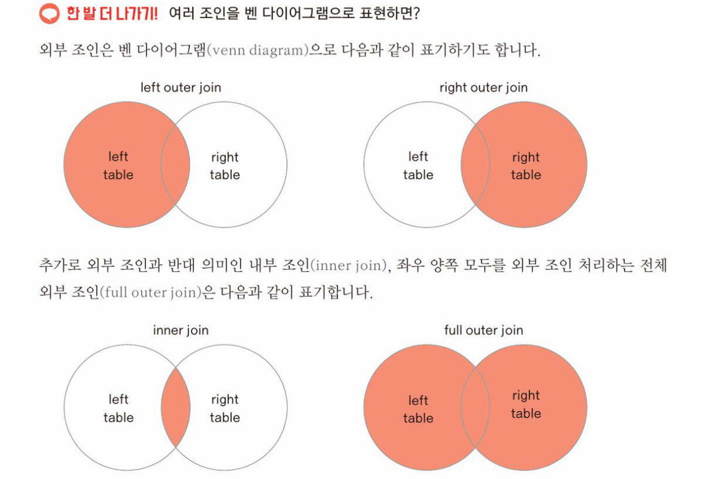  

# SQL-99 표준 문법  
ISO/ANSI에서 지정한 표준 문법. (ANSI 문법이라고도 부름)  
### JOIN 문법
- NATURAL JOIN (등가조인)  
WHERE 절을 사용하지 않고, FROM 절에서 조건을 적음.  
<span style="text-decoration:underline">COLUMN명 앞에 TABLE명도 적지 않음.</span>  
```
SELECT EMPNO, ENAME, JOB, MGR, HIREDATE, SAL, COMM, DEPTNO, DNAME, LOC
FROM EMP NATURAL JOIN DEPT;
```
- JOIN USING  
WHERE 절을 따로 적어 조건을 줄 수 있음.  
<span style="text-decoration:underline">COLUMN명 앞에 TABLE명도 적지 않음.</span>  
```
SELECT EMPNO, ENAME, JOB, MGR, HIREDATE, SAL, COMM, DEPTNO, DNAME, LOC
FROM EMP JOIN DEPT USING (DEPTNO)
WHERE SAL >= 3000;
```
- JOIN ON  
<span style="text-decoration:underline">COLUMN명 앞에 TABLE명을 적을 수 있음.</span>  
```
SELECT E.EMPNO, E.ENAME, E.JOB, E.MGR, E.HIREDATE, E.SAL, E.COMM, E.DEPTNO, D.DNAME, D.LOC
FROM EMP E JOIN DEPT D ON (E.DEPTNO = D.DEPTNO);
```

- OUTER JOIN  
WHERE절이 아닌 FROM절에서 외부조인을 선언.  
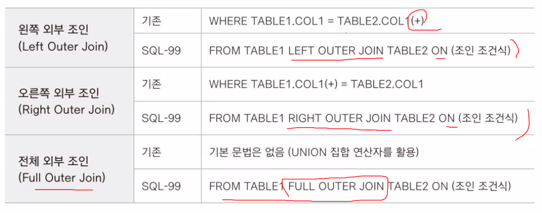  
  
```
SELECT E1.EMPNO, E1.ENAME, E1.MGR, E2.EMPNO, E2.ENAME
FROM EMP E1, EMP E2
WHERE E1.MGR = E2.EMPNO(+);
-- ▽
SELECT E1.EMPNO, E1.ENAME, E1.MGR, E2.EMPNO, E2.ENAME
FROM EMP E1 LEFT OUTER JOIN EMP E2 ON (E1.MGR = E2.EMPNO);
```
모두 출력하고 싶은 데이터에 (+)를 적는 대신, LEFT/RIGHT/BOTH를 적어 표시하고,  
ON에 조건을 적음.  

#### 세 개 이상의 TABLE JOIN  

```SQL
-- ORACLE
FROM TABLE1, TABLE2, TABLE3
WHERE TABLE1.COL = TABLE2.COL
AND TABLE2.COL = TABLE3.COL
-- ANSI ↓
FROM TABLE1 JOIN TABLE2 ON (조건식) 
JOIN TABLE3 ON(조건식)
```
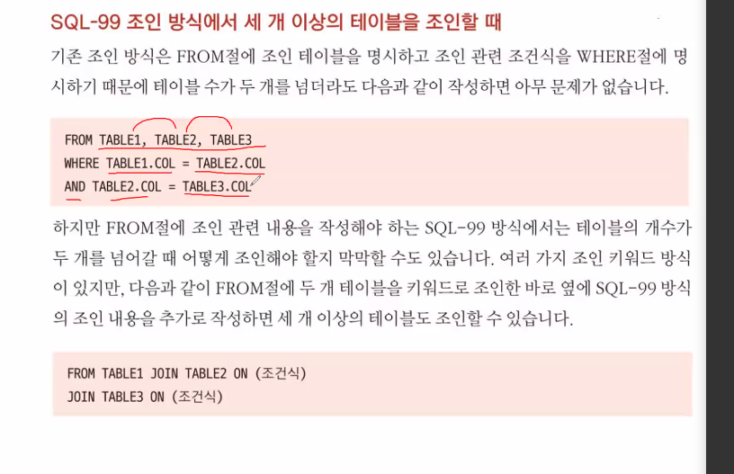  

## SUBQUERY 서브쿼리 
내부에서 사용하는 SELECT문  
데이터를 추가로 조회하기 위해 사용함.  

- 서브쿼리 특징 :  
  - 서브쿼리는 연산자와 같은 비교 또는 조회 대상의 오른쪽에 놓이며, 괄호()로 묶어서 사용함.  

  - 특수한 경우를 제외하고, 대부분의 서브쿼리는 ORDER BY 절을 사용할 수 없음.  

  - 서브쿼리의 SELECT절에 명시한 열은 메인쿼리의 비교대상과 같은 자료형, 같은 개수로 지정해야 함.  
  즉, 메인쿼리의 비교 대상 데이터가 하나라면, 서브쿼리의 SELECT절 역시 같은 자료형인 열을 하나 지정해야 함.  

  - 서브쿼리에 있는 SELECT문의 결과 행 수는, 함께 사용하는 메인쿼리의 연산자 종류와 호환 가능해야 함.  
  예를 들어 메인쿼리에 사용한 연산자가 단 하나의 데이터로만 연산이 가능한 연산자라면(>,<등),  
  서브쿼리의 결과 행 수는 반드시 하나여야 함.  

```SQL
SELECT SAL
FROM EMP
WHERE ENAME = 'JONES';

SELECT * FROM EMP
-- 만약, JONES라는 데이터가 여러개라면, >를 사용할 수 없음.
-- 대신, IN 키워드를 사용할 수 있음.
WHERE SAL > 2975;
-- ▽
SELECT *
FROM EMP
-- 같은 자료형인 SAL이 아니라, 다른 자료형을 지정하면 비교 불가능.
WHERE SAL > (SELECT SAL FROM EMP WHERE ENAME='JONES');
```

### 단일행 서브쿼리  
결과가 하나의 행인 서브쿼리  
- 사용 가능 연산자 : >,<,>=,<=,=  
단일행 함수를 사용할 수 있음.  

```SQL
...
AND E.SAL > (SELECT AVG(SAL)FROM EMP);
```

### 다중행 서브쿼리  
결과가 여러 행인 서브쿼리  
- 사용 가능 연산자  
  IN : 메인쿼리의 데이터가 서브쿼리의 결과 중 하나라도 일치한 데이터가 있다면 TRUE  
  ANY, SOME : 메인쿼리의 조건식을 만족하는 서브쿼리의 결과가 하나 이상이면 TRUE  
  ALL : 메인쿼리의 조건식을 서브쿼리의 결과 모두가 만족하면 TRUE  
  EXISTS : 서브쿼리의 결과가 존재하면(즉, 행이 1개 이상일 경우) TRUE  

```SQL
-- 부서 번호 별, 급여가 가장 높은 값들 출력
SELECT * FROM EMP
WHERE SAL IN (SELECT MAX(SAL) FROM EMP GROUP BY DEPTNO);
```

```SQL
-- 부서 번호가 10인 직원들보다 고용일이 빠른 모든 직원들을 출력
SELECT * FROM EMP
WHERE HIREDATE < ALL (SELECT HIREDATE FROM EMP WHERE DEPTNO=10 );
```

### 인라인 뷰  
FROM절에서 사용하는 서브쿼리는, 인라인 뷰라고 불림.  

```SQL
-- 부서번호 10번에 존재하는 직원들의 직원정보와 부서정보를 FROM절 서브쿼리를 이용하여 출력
SELECT E.EMPNO, E.ENAME, E.DEPTNO, D.DNAME, D.LOC
FROM (SELECT * FROM EMP WHERE DEPNO = 10) E,
    (SELECT * FROM DEPT) D
WHERE E.DEPTNO = D.DEPTNO;
--
SELECT * 
FROM(SELECT * FROM EMP WHERE DEPTNO = 10) NATURAL JOIN DEPT;
```

#### WITH절  
테이블 내 데이터 규모가 너무 크거나, 현재 작업에 불필요한 열이 너무 많아 일부 행과 열만 사용하고자 할 때,  
FROM절에서 너무 많은 서브쿼리를 지정하면 가독성, 성능이 떨어질 수 있기 때문에 WITH 절을 사용.  

메인쿼리가 될 SELECT문 안에서 사용할, 서브쿼리와 별칭을 먼저 지정한 후  
메인쿼리에서 사용함.  

```SQL
-- WITH절 기본 형식
WITH
[별칭1] AS (SELECT문 1),
[별칭2] AS (SELECT문 2),
...
[별칭N] AS (SELECT문 N)
SELECT
  FROM 별칭1, 별칭2, 별칭3
```

```SQL
WITH
E AS (SELECT * FROM EMP WHERE DEPTNO = 10),
D AS (SELECT * FROM DEPT)
SELECT E.EMPNO, E.ENAME, E.DEPTNO, D.DNAME, D.LOC
FROM E JOIN D ON (D.DEPTNO = E.DEPTNO);
```

### 상호 연관 서브쿼리  
메인쿼리에 사용한 데이터를, 서브쿼리에 사용하고,  
서브쿼리의 결과 값을 다시 메인쿼리로 돌려주는 방식.  

조건에 따라 성능이 저하될 수 있음.  
```

```

### 스칼라 서브쿼리
SELECT절에 사용하는 서브쿼리.  
SELECT절에 하나의 열 영역으로서 결과를 출력할 수 있음.  
반드시 하나의 결과만 반환하도록 작성해야 함.  
```SQL
SELECT EMPNO, ENAME, JOB, SAL,
  (SELECT GRADE 
    FROM SALGRADE
    WHERE E.SAL BETWEEN LOSAL AND HISAL) AS SALGRADE,
    DEPTNO,
    (SELECT DNAME
      FROM DEPT
      WHERE E.DEPTNO = DEPT.DEPTNO) AS DNAME
  FROM EMP E;
```

## 테이블 조작  

```SQL
-- TABLE 생성
CREATE TABLE table_name
  AS [SELECT문];
```
생성할 때, 속성은 같고 데이터는 비어있는 테이블로 복사하려면 `WHERE 1<>1`(FALSE) 를 적음.  

```SQL
-- TABLE 삭제
DROP TABLE table_name;
```

### INSERT문  
테이블에 데이터를 추가하는 명령어  
```SQL
INSERT INTO table_name [(col1,col2,...)]
VALUES (col1_value, col2_value...);
```
INSERT INTO : 새로운 데이터를 입력할 대상 테이블과 열을 입력.  
VALUES : INSERT INTO에서 지정한 테이블의 열 순서와, 자료형에 맞는 입력 데이터를 저장.  

값을 넣을 때, 순서, 자료형, 개수가 맞지 않으면 오류 발생.  
제약 조건도 맞아야 함.  

INSERT INTO에 col_name는 적지 않아도 됨.  

DATE 속성 열에 값을 넣을 때, 문자열로 적으면 자동으로 맞는 날짜 형식으로 형변환 되어 삽입됨.  
TO_DATE()나 SYSDATE로도 값 삽입 가능.  

빈 값을 넣을 때는 `NULL`, ''로 삽입 가능.  
그러나 가끔 빈 문자열이 들어가는 경우가 있어서, `NULL`을 넣는게 확실한 방법임.  
또는 INSET INTO에서 비워두고 싶은 곳을 생략하는 방법도 있음.  

```SQL
-- NULL 삽입
INSERT INTO DEPT_TEMP(DEPTNO, DNAME, LOC)
  VALUES(90, 'INCHEON', NULL);
-- 빈 문자열 '' 삽입
INSERT INTO DEPT_TEMP(DEPTNO, DNAME, LOC)
  VALUES(90, 'INCHEON', '');
-- col_name 생략
INSERT INTO DEPT_TEMP(DEPTNO, LOC)
  VALUES(90, 'INCHEON');
```
#### 다른 테이블의 데이터를 삽입  
SELECT문을 통해 데이터를 선택하여 삽입함.  
VALUES를 사용하지 않음.  
다른 테이블의 데이터를 삽입하는 예시  
```SQL
INSERT INTO EMP_TEMP (EMPNO, ENAME, JOB, MGR, HIREDATE, SAL, COMM, DEPTNO)
            SELECT E.EMPNO, E.ENAME, E.JOB, E.MGR, E.HIREDATE, E.SAL, E.COMM, E.DEPTNO
                FROM EMP E JOIN SALGRADE S ON(E.SAL BETWEEN S.LOSAL AND S.HISAL)
                    WHERE S.GRADE = 1;
```
다른 테이블의 데이터를 삽입하는데, 다른 테이블엔 존재하지 않는 열에는 NULL을 넣는 예시
```SQL
-- EMP_HW에 EMP에는 없는 REMARK 열이 있다고 가정.
-- 열 이름으로 NULL을 넣으면 NULL 값이 입력됨.
INSERT INTO EMP_HW
    SELECT EMPNO, ENAME, JOB, MGR, HIREDATE, SAL, COMM, DEPTNO, NULL
        FROM EMP;
```

ALL, FIRST 등의 옵션으로, 한 번에 여러 테이블을 대상으로 데이터를 추가하거나,  
특정 조건에 따라 다른 테이블에 데이터를 추가하는 등 다양하게 사용할 수 있음.  

MERGE문을 사용하면, 같은 열 구조를 가지는 여러 테이블 또는 서브쿼리의 결과 데이터를  
한 테이블에 병합하여 추가할 수도 있음.  

---

### UPDATE문  
테이블에 저장되어 있는 데이터 내용을 수정하는 명령어.  
```SQL
-- 기본형식  
UPDATE [table_name]
SET    [col_name1] = [value1], [col_name2] = [value2]...
WHERE [데이터를 변경할 대상 행을 선별하는 조건];
--- DEPT_TEMP2 테이블에서 DEPTNO가 40인 열의 LOC 데이터를 SEOUL로 수정
UPDATE DEPT_TEMP2
SET LOC = 'SEOUL'
WHERE DEPTNO = 40;
```
`UPDATE` : 데이터를 수정할 테이블을 지정.  
`SET` : 변경할 열을 선택, 변경할 데이터를 입력.  
`WHERE` : 테이블의 변경할 데이터 선별 조건식을 지정. 생략 시, 테이블 내 지정된 모든 열의 데이터 변경.  

WHERE 절을 쓰지 않아, 모든 행의 데이터가 변경됐을 때,  
`ROLLBACK;`(TCL) 명령어를 사용하면 원래대로 돌릴 수 있음.  

UPDATE문에도 서브쿼리 사용 가능.  
SET 조건을 정확히 알 수 없을 때 사용함.  

```SQL
-- 서브쿼리를 이용한 UPDATE문

-- DEPT_TEMP2 테이블에서 DEPTNO가 40인 열의 LOC 데이터를, 
-- DEPT 테이블에서 DEPTNO가 40인 열의 LOC 데이터로 수정

UPDATE DEPT_TEMP2 
SET (DNAME, LOC) = (SELECT DNAME, LOC FROM DEPT WHERE DEPTNO = 40)
WHERE DEPTNO = 40;

-- DEPT_TEMP2 테이블에서 DNAME이 OPERATIONS인 열의 LOC를 SEOUL로 수정
UPDATE DEPT_TEMP2
SET LOC = 'SEOUL'
WHERE DEPTNO = (SELECT DEPTNO FROM DEPT_TEMP2 WHERE DNAME='OPERATIONS');
```

UPDATE문을 사용할 때는 변경하려는 대상을 정확히 알고 수행해야 함.  

---

### DELETE문  
테이블에 저장되어 있는 데이터 내용을 삭제하는 명령어.  
```SQL
DELETE FROM [table_name]
WHERE [삭제할 대상 행을 선별하기 위한 조건식]; 
```
DELETE : 데이터를 삭제할 테이블을 지정.  
WHERE : 삭제할 데이터를 선별하는 조건식을 지정. 생략 시, 테이블 내 모든 데이터를 삭제.  

```SQL
-- EMP_TEMP2 테이블에서 DEPTNO가 30이고 GRADE가 3인 사원들을 삭제
DELETE FROM EMP_TEMP2
WHERE EMPNO IN(SELECT E.EMPNO FROM EMP_TEMP2 E JOIN SALGRADE S ON (E.SAL BETWEEN S.LOSAL AND S.HISAL) WHERE E.DEPTNO=30 
AND S.GRADE=3);

-- EMP_TEMP 테이블에서 급여가 3000이상인 사원들을 삭제
DELETE FROM EMP_TEMP
WHERE SAL >=3000;
-- 서브쿼리 사용
DELETE FROM EMP_TEMP
WHERE EMPNO IN(SELECT EMPNO FROM EMP_TEMP WHERE SAL>=3000);
```

# 트랜잭션(TRANSACTION)  
```
관계형 데이터베이스에서 하나의 작업 또는 밀접하게 연관되어 있는 작업 수행을 위해 나눌 수 없는 최소 수행 단위를  
트랜잭션이라고 합니다. SQL 문법 중 이러한 트랜잭션을 제어하는 데 사용하는 명령어를 TCL(Transaction Control Language)라고 합니다.  
```
트랜잭션 : 작업 단위.  
더 이상 분할해서는 안 되는, 할 수 없는 최소 수행 단위.  
어떠한 기능 한 가지를 수행하는 SQL문 덩어리.  

하나의 트랜잭션 내에 있는 여러 명령어를 한 번에 수행하여 작업을 완료한 상태와,  
아예 모두 수행하지 않은 상태로 나뉨. (ALL OR NOTHING)  

한 개 이상의 DML로 이루어짐.  

트랜잭션을 제어하기 위해 TCL 명령어를 사용함.  
트랜잭션은 데이터베이스 계정을 통해 데이터베이스에 접속하는 동시에 시작됨.  
TCL을 실행할 때 기존 트랜잭션이 끝나고, 새로운 트랜잭션이 다시 시작됨.  

```SQL
SQL> INSERT...
SQL> UPDATE...
SQL> DELETE...
SQL> TCL...
-- 트랜잭션 종료
-- 새로운 트랜잭션 시작
SQL> INSERT...
SQL> UPDATE...
SQL> DELETE...
SQL> TCL...
-- 트랜잭션 종료
...
-- 새로운 트랜잭션 시작
SQL> INSERT...
SQL> UPDATE...
SQL> DELETE...
SQL> TCL...
```
ROLLBACK, COMMIT 과 같은 TCL 명령어를 수행할 때, 한 트랜잭션 단위로 작업이 수행되어 데이터 베이스에 반영됨.  
한 번 COMMIT을 하면, 새로운 트랜잭션이 시작되기 때문에, 이전 트랜잭션 상태로 되돌릴 수 없음.  
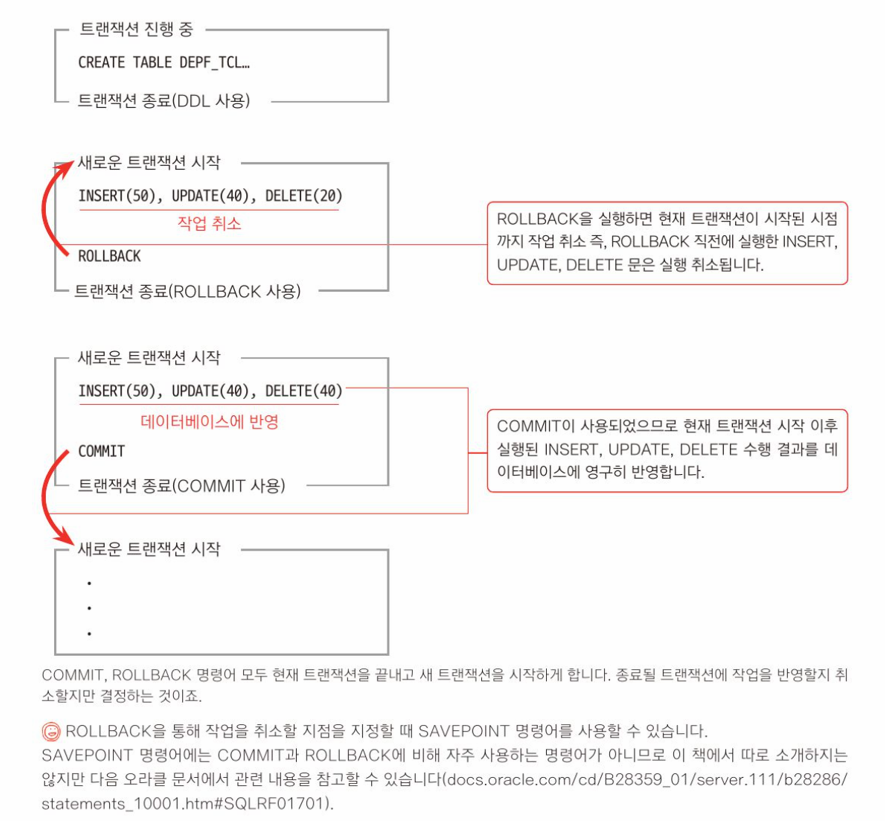

# 세션 (SESSION)  
```
오라클 데이터베이스에서의 세션은 데이터베이스 접속 시작부터 접속이 종료되기까지의 전체 기간을 의미합니다.
하나의 세션은 여러 SQL문이 하나의 작업 단위로 다뤄지는 여러 개의 트랜잭션으로 구성됩니다.
트랜잭션 작업을 데이터베이스에 영구히 반영할 때 COMMIT 명령어를 사용하고
지금까지 한 작업을 취소할 때 ROLLBACK 명령어를 사용합니다.
이 명령어를 통해 현재 트랜잭션이 종료될 때까지 다른 세션에서는 데이터 조작 전 상태의 데이터만 조회할 수 있으며
이러한 특성을 읽기일관성이라고 합니다.
```
어떤 활동을 위한 시간이나 기간.  
데이터베이스에서의 세션은 데이터베이스 접속을 시작으로, 작업을 수행한 후 접속을 종료하기까지 전체 기간을 의미함.  
데이터베이스 세션은 어느 곳에서 접속하느냐에 따라 각각 다른 세션으로 나뉨.(cmd, sql developer 등)  

세션 내에는 하나 이상의 트랜잭션이 존재함.  
  <fieldset style="width:300px">
    <legend>세션</legend>
      <fieldset>
        <legend>트랜잭션1</legend>
      </fieldset>
      <fieldset>
        <legend>트랜잭션2</legend>
      </fieldset>
      ...
      <fieldset>
        <legend>트랜잭션n</legend>
      </fieldset>
  </fieldset>
<br>

트랜잭션이 TCL로 끝나지 않으면, 해당 변경 사항은 다른 세션에서 조회할 때 `변경되지 않은 상태`로 조회 됨.  
이러한 특성을 일관성이라고 함.  
즉 확정된 데이터만 읽기 일관성이 보장됨.  
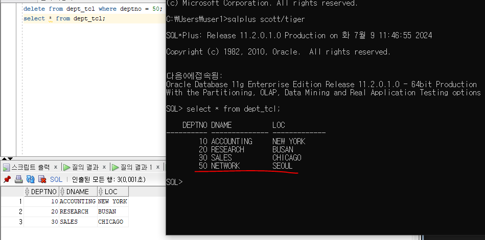  

### LOCK  
특정 세션에서 ROLLBACK, COMMIT으로 트랜잭션이 완료되지 않은 상태라면,  
다른 세션에서 접근할 수 없도록 `잠긴 상태`가 됨.  

LOCK으로 인해 접근하지 못하고 대기하는 상태를 `HANG`이라고 함.  

명령어를 어떤 방식으로 작성하느냐에 따라 `LOCK의 종류`가 달라짐.  

- LOCK의 종류  
  - `행 레벨 록 (row level lock)` :  
  `WHERE절을 지정한` UPDATE, DELETE문을 수행한 경우, 해당 행을 잠금.  
  `WHERE절을 지정하지 않은` UPDATE, DELETE문을 수행한 경우, 해당 테이블의 모든 행을 잠금.  
  UPDATE, DELETE 명령을 수행하는 세션은 `HANG` 상태에 들어감.  
  그러나 테이블 전체 행이 LOCK 상태여도, INSERT문의 수행은 가능함.  

  - `테이블 레벨 록 (table level lock)` :  
  테이블에 변경되는 행의 수와는 상관없이,  
  DML을 사용하여 데이터가 변경 중인 테이블은, 테이블 단위 잠금이 걸림.  
  데이터를 변경 중인 세션 외 다른 세션에서 `DDL`을 통해 테이블의 구조를 변경할 수 없음.  

## DDL(Data Definition Language)  
데이터 베이스 정의어.  
객체를 생성, 변경, 삭제하는 등의 기능을 수행하는 명령어.  
DML과 달리, <span style="text-decoration:underline">명령어를 수행하자마자 데이터베이스에 수행한 내용이 바로 반영됨.</span>  
즉, DDL을 실행하면 자동으로 COMMIT되기 때문에, ROLLBACK으로 실행 취소가 불가능함.  
(이러한 이유로 실무에서는 자주 사용하지 않음)  

- `CREATE` : 데이터베이스 객체를 생성함  
  ```SQL
  CREATE TABLE account.table_name(
    row1_name row1_type,
    row2_name row2_type,
    ...
    rown_name rown_type,
  );
  -- 소유 계정 이름을 생략하면, 현재 접속해 있는 계정 소유의 테이블이 만들어짐.
  -- 기본적으로 테이블 명은 대소문자 구별X. ""를 통해 대문자 지정 가능.
  -- 테이블의 열을 하나하나 만들어 생성하는 예시
  CREATE TABLE EMP_DDL(
    EMPNO NUMBER(4),
    ENAME VARCHAR2(10),
    JOB VARCHAR2(9),
    MGR NUMBER(4),
    HIREDATE DATE,
    SAL NUMBER(7,2),
    COMM NUMBER(7,2),
    DEPTNO NUMBER(2)
  );
  -- 다른 테이블을 그대로 복사하여 생성하는 예시
  CREATE TABLE DEPT_DDL AS SELECT * FROM DEPT;
  DESC DEPT_DDL;
  SELECT * FROM DEPT_DDL;
  -- 다른 테이블의 일부를 복사하여 생성하는 예시
  CREATE TABLE EMP_DDL_30 AS SELECT * FROM EMP WHERE DEPTNO=30;
  SELECT * FROM EMP_DDL_30;
  -- 다른 테이블들을 조인한 테이블을 생성하는 예시
  CREATE TABLE EMPDEPT_DDL AS SELECT * FROM EMP JOIN DEPT USING (DEPTNO)
  WHERE 1<>1;
  -- 모든 레코드에, 적용 결과를 FALSE로 나타나도록 하여 테이블 틀만 복사함.
  ```
  테이블 이름 생성 규칙  
   - 테이블 이름은 문자로 시작해야 함.  
   - 테이블 이름은 30BYTE 이하여야 함.  
   - 같은 사용자 소유의 테이블 이름은 중복될 수 없음.  
   - 테이블 이름은 영문자, 한글, 숫자와 특수 문자 $#_ 사용 가능.  
   - 예약어는 테이블 이름으로 사용 불가.  

- `ALTER` : 데이터베이스 객체를 변경함  
  컬럼을 추가, 변경, 삭제할 수 있음.  
  마찬가지로 변경 후에 ROLLBACK 불가능.  
  ADD(추가), RENAME(이름변경), MODIFY(타입변경), DROP(삭제)으로 컬럼을 변경함.  
  ```SQL
  ALTER TABLE table_name
    -- 열 추가
    ADD col_name coltype
    -- 열 이름 변경
    RENAME COLUMN col_name TO col_newname
    -- 열 타입 변경
    MODIFY col_name col_type
    -- 열 삭제
    DROP COLUMN col_name;
  ```
- `TRUNCATE` : 데이터베이스 객체의 내용을 삭제함.  
  마찬가지로 변경 후에 ROLLBACK 불가능.  
  DELETE보다 속도가 빠름.  
  ```SQL
  TRUNCATE TABLE table_name;
  ```
- `DROP` : 데이터베이스 객체를 삭제함  
  DELETE, TRUNCATE와 달리 객체 자체를 삭제하고, 되돌릴 수 없음.  
  ```SQL
  DTOP TABLE table_name;
  ```
  DELETE, TRUNCATE, DROP의 차이 : https://wikidocs.net/4021  
    

  # 데이터 객체  
  ### 데이터 사전(DATA DICTIONARY)  
  ```
  데이터 사전은 오라클 데이터베이스를 구성하고 운영하는 데이터를 저장하는 특수한 테이블로서 오라클 사용자가 직접 접근할수 없습니다.  
  하지만 SELECT문으로 데이터를 열람할 수 있도록 데이터 사전 뷰를 제공합니다.  
  대표적인 데이터 사전 뷰 중 현재 접속한 사용자가 소유하는 테이블 목록을 보기 위해서는 USER_TABLES를 사용합니다.  
  또한 사용자가 소유하는 테이블을 포함해 다른 사용자가 소유한 테이블 중 현재 사용자에게 사용 허가가 되어있는 테이블을 보기 위해서는 ALL_TABLES를 사용합니다.  
  ```
  ### 뷰(VIEW)  
  열람을 주 목적으로 사용하는 객체.  
  원본 데이터에 접근할 수 없음.  

  데이터 사전 뷰는 용도에 따라 이름 앞에 접두어를 지정하여 분류함.  
  - `USER_XXXX` : 현재 데이터베이스에 접속한 사용자가 소유한 객체 정보  
  - `ALL_XXXX` : 접속한 사용자가 소유한 객체 또는 다른 사용자가 소유한 객체 중 사용 허가를 받은 객체, 즉 사용 가능한 모든 객체 정보  
  - `DBA_XXXX` : 데이터베이스 관리를 위한 정보(관리 권한을 가진 SYSTEM, SYS 사용자만 열람 가능)  
  - `V$_XXXX` : 데이터베이스 성능 관련 정보(X$_XXXX 테이블의 뷰)  
  
  [SCOTT 데이터 사전 뷰](../../image/SCOTT_DICT.pdf)  

  ### 인덱스  
  데이터를 조회할 때 더 빠른 검색을 위해 사용함.  
  ```SQL
  -- 인덱스 생성 기본형
  CREATE INDEX index_name
    ON table_name(row_name1 ASC|DESC,
                  row_name2 ASC|DESC,
                  ...               );
  -- 인덱스 생성 예시
  CREATE INDEX IDX_EMP_SAL
    ON EMP(SAL);
  -- 인덱스 삭제 예시
  DROP INDEX IDX_EMP_SAL;
  -- 사용자가 소유한 인덱스를 조회
  SELECT * FROM USER_IND_COLUMNS;
  ```
  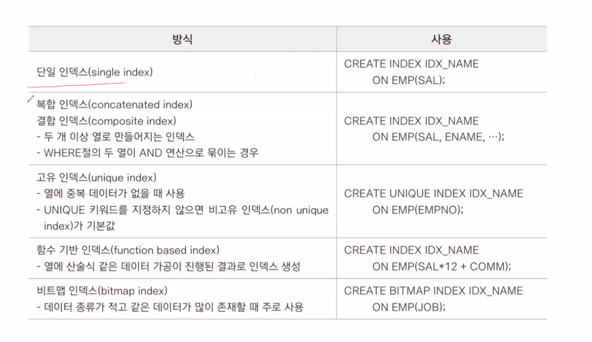  
  비트맵 인덱스 : 남/여밖에 들어갈 수 밖에 없는 성별같은 데이터를 조회할 때 사용함.  

  인덱스를 무한정 만든다고 검색 성능이 높아지진 않음.  