# DBMS  
DataBase Maintain System  

보통 Web 서버와 WAS로 만듦  
Web 서버는 클라이언트가 요청한 정적 정보를 전달함.  
WAS는 DBMS로부터 실시간/동적 정보를 가공, 클라이언트에게 전달함.  

초기 데이터는 파일 시스템(메모장) 방식으로 저장되어 있었음.  

데이터가 저장되는 걸 DB라 하고, 이를 관리하는 시스템을 DBMS라고 함.  

Data(데이터) : 가공되지 않은 자료. 목적성이 없음.  
Information(정보) : 사용하기 용이하도록 처리(분석, 가공)된 자료.  

효율적인 데이터 관리를 위한 조건  
- 데이터를 통합하여 관리  
- 일관된 방법으로 관리  
- 데이터 누락 및 중복을 제거  
- 여러 사용자가 공동으로 실시간 사용 가능해야 함  

구조화된 데이터의 집합(DB)을, 효율적으로 관리하는 것이 데이터베이스 관리 시스템(DBMS)임.  
보통은 DB와 DBMS를 구별하지 않고, DB/데이터베이스라고 부름.  

DB를 통해 응용 프로그램의 서비스 제공과 데이터 관련 적업 효율을 높일 수 있음.  
여러 응용 프로그램들이 하나의 통합된 데이터를 같은 방식으로 사용/관리 하므로 데이터 누락/중복을 방지할 수 있음.  

---
## 데이터 모델 종류  

- 계층형 데이터 모델  
Tree 구조를 활용하여, 데이터 관련성을 부모 자식 같은 관계로 정의하고 관리함.  

- 네트워크형 데이터 모델  
망형 데이터 모델. 그래프 구조를 기반으로 관리함.  
개체 간 관계를 그래프 구조로 연결하므로, 자식 개체가 여러 부모 개체를 가질 수 있음. (계층형보다 서로 관계를 맺기 쉬움)  
그러나 한 눈에 파악하기 힘듦.  

- 객체 지향형 데이터 모델  
객체지향 개념을 데이터베이스에 그대로 접목시킨 모델.  
그러나 완전히 적용하는 것은 쉽지 않아, 이를 적용한 DBMS가 많지 않음.  

- 관계형 데이터 모델  
DB의 근간. 근래 SQL DB는 대부분 이를 사용함  
다른 모델과 달리, 데이터 간 관계에 초점을 둠.  
데이터들의 `독립 특성`만을 규정하여 데이터 묶음으로 나눔.  
그리고 중복이 발생할 수 있는 묶음은, 별개로 나누어서 연결함. (관계를 맺어줌)  
관계를 강조하기 위해, relational을 앞에 붙여 `RDBMS`라고 부름.  
  

RDBMS를 다루는 언어로는 MS-SQL, MySQL, MariaDB, PostgreSQL, DB2, ORACLE 등이 있음.  
이 중, ORACLE이 가장 많이 쓰임.  

---

### 관계형 데이터 모델의 핵심 구성 요소  

<table border>
  <thead>
    <tr>
      <th>이름</th>
      <th>설명</th>
    </tr>
  </thead>
  <tbody>
    <tr>
      <td>개체</td>
      <td>데이터화하려는 사물, 개념의 정보 단위. table 개념과 대응되며, table은 릴레이션으로 표기하기도 함.</td>
    </tr>
    <tr>
      <td>속성</td>
      <td>개체를 구성하는 데이터의 가장 작은 '논리적 단위'. 데이터의 종류, 특성, 상태 등을 정의함. column 개념과 대응됨.</td>
    </tr>
    <tr>
      <td>관계</td>
      <td>개체와 개체, 또는 속성 간의 연관성을 나타냄. 테이블 간의 관계를 외래키(foreign key) 등으로 구현하여 사용함.</td>
    </tr>
  </tbody>
</table>


RDBMS는 우리가 평소에 쓰는 xmls 문서라고 보면 됨.  

행(→) : 데이터 한 단위. 각각의 한 행을 row, tuple, `Record`라고 부름.  

열(↓) : 데이터를 대표하는 이름과 공통 특성을 정의함.  
저장 정보의 종류, 저장 가능한 값의 최대 길이, 값의 중복 허용 유무 등을 지정할 수 있음.  
각각의 한 열을 속성(attribute), field, column 등으로 부름.  

관계 : 테이블 하나하나를 의미함.  

키(key) : 데이터를 구별할 수 있는 유일한 값.  
하나의 테이블을 구성하는 여러 열 중에서, 특별한 의미를 지닌 하나 또는 여러 열의 조합을 의미함.  
종류별로 데이터를 구별하거나, 테이블 간의 연관 관계를 표현할 때, 키로 지정한 열을 사용함.  

---

#### 키의 종류  
`기본키(primary key)` - 기본키 PK는 가장 중요한 키. 한 테이블 내에서 중복되지 않는 값만 가질 수 있는 키.
- 속성 :  
    테이블에 저장된 행을 식별할 수 있는 유일한 값.  
    값의 중복이 없어야 함.  
    NULl 값을 가질 수 없음.  
하나 또는 여러 열의 조합으로 만들 수 있음.  
대부분의 경우, 개인 정보 노출이 가장 적은 데이터를 선정함.  

`보조키 (alternate key)` - 대체키라고도 함. 후보키 중에서 기본키로 지정되지 않은 열.  

`후보키(candidate key)` - 기본키가 될 수 있는 모든 키들.  

  

`외래키(foreign key)` - 외부키라고도 부름. 특정 테이블에 포함되어 있으면서, 다른 테이블의 기본키로 지정된 키.  

이 때, 다른 테이블에서 외래키를 `참조`<sup>(reference)</sup>한다고 표현함.  
참조를 통해, 데이터 중복을 피할 수 있음. 셀 병합과 유사한 효과.  
  

`복합키(composite key)` - 두 개 이상의 열(속성)을 조합하여 기본키 역할을 할 수 있게 만든 키.  
하나의 열만으로는 행을 식별하는 것이 불가능할 때 사용함. 2~10개가 넘는 열을 조합하기도 함.  


### SQL(Structured Query Language)  
DBMS를 관리하기 위해 사용하는 언어.  
SQL을 통해 데이터베이스에서 여러 데이터 관련 작업을 수행할 수 있음.  

사용 목적에 따라 명령어가 나뉨.  
<table border>
  <thead>
    <tr>
      <th>종류</th>
      <th>설명</th>
    </tr>
  </thead>
  <tbody>
    <tr>
      <td>DQL</td>
      <td>RDBMS에 저장한 데이터를 조회하는 명령어</td>
    </tr>
    <tr>
      <td>DML</td>
      <td>데이터를 저장, 수정, 삭제하는 명령어</td>
    </tr>
    <tr>
      <td>DDL</td>
      <td>데이터 관리를 위해 테이블을 포함한 여러 객체를 생성, 수정, 삭제하는 명령어</td>
    </tr>
    <tr>
      <td>TCL</td>
      <td>트랜잭션 데이터의 영구 저장/취소 등과 관련된 명령어</td>
    </tr>
    <tr>
      <td>DCL</td>
      <td>데이터 사용 권한과 관련된 명령어</td>
    </tr>
  </tbody>
</table>


# Oracle DBMS  
가장 많이 사용되는 SQL  
대부분 2007년에 나온 11g 버전을 사용함.  

## 자료형  
데이터베이스에 저장하는 데이터는 다양한 형태<sub>숫자, 문자 등</sup>를 가지고 있음.  
데이터의 형태를 자료형이라고 부름.  

Oracle의 자료형 종류  
(*가 있는 자료형을 주로 사용함.)  

- 스칼라형 : 하나의 자료형에 맞춰 한 종류의 데이터를 저장할 수 있는 자료형.  
    - *`VARCHAR2`(길이) : 가변 길이 문자열 데이터를 저장. (4000~1byte)  
    - *`NUMBER`(전체 자릿수, 소수점 이하 자릿수) : ±38자릿수 숫자를 저장. 저장할 전체 자리수와, 그 중에서 소수점 자리수를 지정할 수 있음.  
    - *`DATE` : 날씨 형식을 저장.  
    - CHAR(길이) : 문자열 데이터를 저장. 한 글자를 쓰더라도 4000byte 고정. 거의 사용하지 않음.  
    - BLOB, CLOB : 이진 데이터 파일, 문자 데이터 파일을 저장.  
    - BFILE : 이진 데이터 파일을 저장.  
  
- 컬렉션형 : 한 번에 여러 데이터를 저장할 수 있는 자료형  
VARRAY, NESTED, TABLE  

## 객체  
데이터를 저장하고 관리하기 위한 논리 구조를 가진 구성 요소.  

객체 종류  

<table border="1">
  <thead>
    <tr>
      <th>용어</th>
      <th>설명</th>
    </tr>
  </thead>
  <tbody>
    <tr>
      <td>테이블 (table)</td>
      <td>데이터를 저장하는 장소</td>
    </tr>
    <tr>
      <td>인덱스 (index)</td>
      <td>검색 효율을 높이기 위해 사용</td>
    </tr>
    <tr>
      <td>뷰 (view)</td>
      <td>하나 또는 여러 개의 선별된 데이터들을 논리적으로 연결하여 하나의 테이블처럼 사용하게 해줌</td>
    </tr>
    <tr>
      <td>시퀀스 (sequence)</td>
      <td>호출될 때마다 자동으로 일련 번호를 생성해줌</td>
    </tr>
    <tr>
      <td>시노님 (synonym)</td>
      <td>오라클 객체의 별칭을 지정</td>
    </tr>
    <tr>
      <td>프로시저 (procedure)</td>
      <td>프로그래밍 연산 및 기능 수행이 가능함 (반환값 없음)</td>
    </tr>
    <tr>
      <td>함수 (function)</td>
      <td>프로그래밍 연산 및 기능 수행이 가능함 (반환값 있음)</td>
    </tr>
    <tr>
      <td>패키지 (package)</td>
      <td>관련 있는 프로시저와 함수를 보관함. 자바 패키지와 유사.</td>
    </tr>
    <tr>
      <td>트리거 (trigger)</td>
      <td>데이터 관련 작업의 연결 및 방지 관련 기능을 제공함</td>
    </tr>
  </tbody>
</table>


## 사용법  
사용한 SQL 프로그램 : Oracle SQL Developer  
> SID : orcl  
- 데이터베이스 접속 예시  
    1. 접속(ID/PW)  
    2. DB 선택  
    3. DB 조회/수정  

    SCOTT 계정 잠금 풀기  
    ```
    ALTER USER SCOTT  
    IDENTIFIED BY tiger
    ACCOUNT UNLOCK;
    ```
    SCOTT 계정 연결  
    ```
    CONN scott/tiger  
    ```

    scott db의 EMP 테이블 구성 요소
    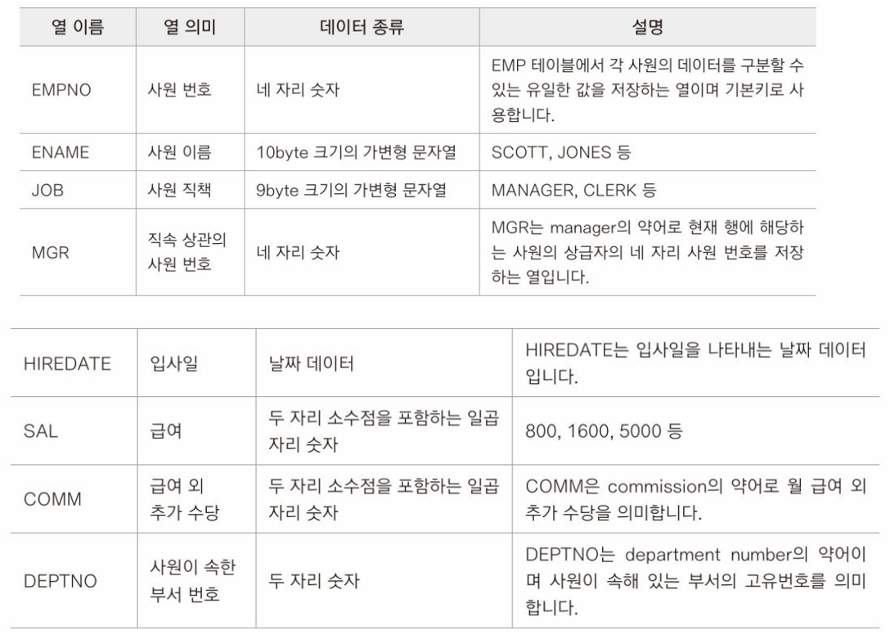  
    DEPT 테이블 구성 요소  
    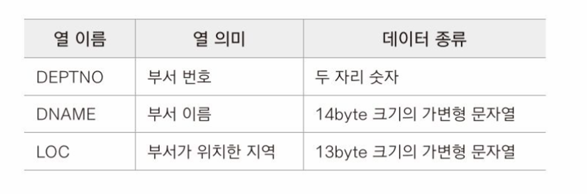  
    SALGRADE 테이블 구성 요소  
    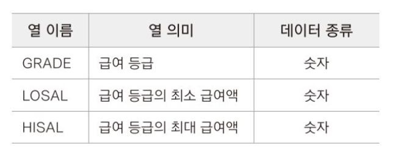  
    table 구성 요소는 대문자로 적는 것을 권장.  

## 데이터 제어 명령어(DML)  

### SELECT문  
데이터를 선택하는 명령어.  

셀렉션 : 행 단위로 데이터를 선택(조회)함.  

프로젝션 : 열 단위로 데이터를 조회함.  
여러 열을 선택하여 데이터를 조회할 수 있음.   

조인 : 셀렉션과 프로젝션을 함께 사용.  
원하는 행의 특정 열만 선택할 수 있음.  
두 개 이상의 테이블을 하나의 테이블로 붙인 것처럼 조회할 수 있음.  

SELECT문은 FROM절과 함께 사용함.  
```
SELECT [옵션] [조회할 열1 이름], [열2 이름], ... , [열N 이름]
FROM [조회할 테이블 이름]
```
- #### 옵션  
    - DISTINCT 옵션  
    SELECT문은 데이터를 선택할 때, 같은 값들도 중복해서 선택됨.  
    DISTINCT 옵션을 넣으면, 데이터를 선택할 때, 중복된 값은 선택하지 않음.  

    - ALL 옵션  
    SELECT문의 기본값.  

- #### 별칭(ALIAS)  
    별칭을 붙일 칼럼 뒤에 작성함.  
    컬럼의 이름을 바꾸거나,  
    SELECT문에 산술연산 구문을 넣으면, 그대로 수행하고 칼럼명도 그대로 출력되는데, 이 때 칼럼명을 지정하는 용도로 쓰임.  
    내부 프로그램에서 수행하는 실행문을 숨길 때도 자주 사용함.  
    ```
    [별칭을 붙일 칼럼] [별칭]
    [별칭을 붙일 칼럼] ["별칭"]
    [별칭을 붙일 칼럼] as ["별칭"]
    [별칭을 붙일 칼럼] as [별칭] → 주로 사용
    ```
    
    #### 산술연산할 때 대상으로 null 값이 들어가면, 결과가 null이 되어버림.  

- #### ORDER BY 절  
SELECT문을 사용할 때, 가장 마지막 부분에 씀.  
특정 기준으로 데이터를 정렬할 때 사용함.  

기준컬럼을 여러 개로 지정할 수 있음.  
이 때, 가장 앞에 있는 칼럼의 우선순위가 가장 높음  
```
SELECT ...
FROM ...
...
ORDER BY [기준컬럼1] [ASC | DESC], [기준칼럼2] [ASC | DESC], ...
```
ASC : 오름차순 (기본값)  
DESC : 내림차순  

ORDER BY 절은 꼭 필요한 경우가 아니면 사용하지 않는 것이 좋음.  
데이터의 양, 정렬 방식에 따라 SQL문의 효율이 낮아질 수 있기 때문.  

- #### WHERE 절  
IF문 조건과 유사함.  
특정 조건을 기준으로, 원하는 행을 선택할 때 사용함.  
조건을 만족하는 column만 선택함.  

SELECT ~ FROM이 먼저 수행되어 정보를 가져오고, 그 후에 WHERE로 필터링하여 선택함.  
(한 행마다 조건을 판별함)  

```
SELECT ...
FROM ...
WHERE [조건식]
```
조건식이 참인 경우의 데이터만을 출력  
WHERE 조건의 개수 제한은 없음.  

- #### 연산자  
  - 산술 연산자  
    +, -, *, /  
  - 비교 연산자  
      = , >, <, >=, <=  
      <>, !=, ^= (다르다)  
      문자, 문자열에도 쓸 수 있음.  
  - 논리 연산자
      AND, OR , NOT  
      NOT은 다른 연산자들과 함께 많이 쓰임  
  - BETWEEN AND, NOT BETWEEN AND 연산자  
    ```
    WHERE column_name BETWEEN value1 AND value2;
    WHERE column_name NOT BETWEEN value1 AND value2;
    ```
    value1과 value2를 포함한, 사이 범위(<=,>=)의 값들을 선택함.  

  - IN 연산자  
    ```
    WHERE column_name IN ('조건1', '조건2', ... '조건N') 
    ```
    OR 연산자와 같은 기능을 함.  
    조건들 중 하나라도 만족하는 값을 선택.  
  - LIKE 연산자  
    속성값이 특정 문자, 혹은 숫자인 값만 선택.  
    ```
    SELECT * FROM Customers
    WHERE Country LIKE 'Spain';
    // Country 속성 중, 'Spain'인 행만 출력
    ```
  
  - 와일드카드  
    와일드카드는 LIKE 연산자와 함께 쓰임  
    https://www.w3schools.com/sql/sql_wildcards.asp  
    와일드카드 문자 종류  
    <table border="1">
      <thead>
        <tr>
          <th>Symbol</th>
          <th>Description</th>
        </tr>
      </thead>
      <tbody>
        <tr>
          <td>%</td>
          <td>Represents zero or more characters 글자 수를 신경쓰지 않음</td>
        </tr>
        <tr>
          <td>_</td>
          <td>Represents a single character 한 글자만 올 수 있음</td>
        </tr>
        <tr>
          <td>[]</td>
          <td>Represents any single character within the brackets *</td>
        </tr>
        <tr>
          <td>^</td>
          <td>Represents any character not in the brackets *</td>
        </tr>
        <tr>
          <td>-</td>
          <td>Represents any single character within the specified range *</td>
        </tr>
        <tr>
          <td>{}</td>
          <td>Represents any escaped character **</td>
        </tr>
      </tbody>
    </table>

    *: PostgreSQL, MySQL에선 지원하지 않는 기능.  
    **: Oracle DB에서만 지원하는 기능.  

    Microsoft Access DB도 지원하지만, 사용하는 문자가 다름.  
    ```
    -- ENAME 중 S로 끝나는 값 출력
    SELECT *
    FROM EMP
    WHERE ENAME LIKE '%S';

    -- ENAME 중 두 번째 글자가 L인 값 출력
    SELECT *
    FROM EMP
    WHERE ENAME LIKE '_L%';

    -- ENAME 중 AM이라는 글자가 포함되면 모두 출력
    SELECT *
    FROM EMP
    WHERE ENAME LIKE '%AM%';
    ```

  - ESCAPE 절  
  데이터 명에 와일드카드 기호로 사용되는 _나 %가 들어갈 경우,    
  데이터의 이름을 와일드카드 기호로 인식하지 않도록 하기 위해 사용함.  
    ```
    SELECT * FROM SOME_TABLE
    WHERE SOME_COLUMN LIKE 'A\_A%' ESCAPE '\';
    -- \ 바로 뒤에 있는 _를 와일드 카드 기호가 아닌 데이터에 포함된 문자로 인식하라는 의미 --
    ```

  - IS NULL 연산자  
  값이 NULL인 경우 선택함.  
    ```
    -- WHERE COMM = NULL; 불가능 (NULL은 연산이 불가능함.)
    WHERE COMM IS NULL;
    -- COMM 속성 중 값이 NULL인 칼럼들을 선택.
    ```
    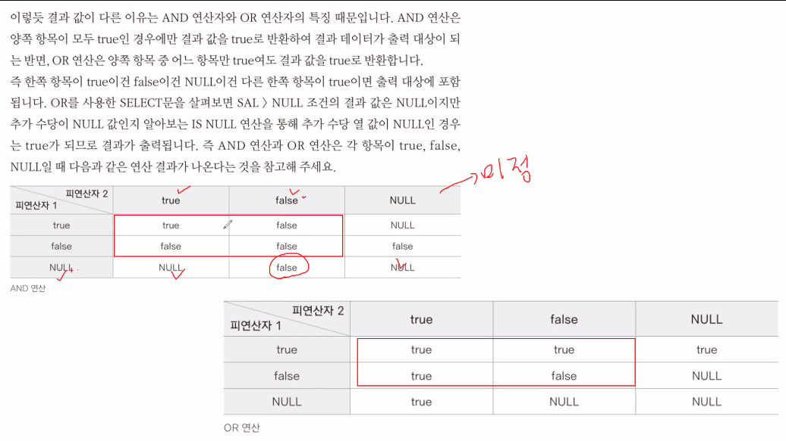  

  - 집합연산자  
    - UNION(합집합, 중복X)
    두 개 이상 SELECT를 하는 경우, UNION을 넣으면 모두 선택함.  
    단, 컬럼의 개수와 자료형이 같아야 함.  
    ```
    SELECT * FROM EMP WHERE DEPTNO = 10
    UNION
    SELECT * FROM EMP WHERE DEPTNO = 20
    -- DEPTNO가 10인 칼럼과 20인 칼럼을 모두 선택
    ```
    - UNION ALL(합집합, 중복O)  
    중복된 결과 값까지 모두 출력함.  
    - MINUS(차집합)  
    먼저 작성한 SELECT문의 결과값에서, 다음 SELECT 문의 결과값을 차집합한 값들을 선택힘.  
    즉, 먼저 작성한 SELECT문의 결과값 중에서, 다음 SELECT문에 존재하지 않는 데이터만 선택됨.  
    - INTERSECT(교집합)  
    먼저 작성한 SELECT문과 다음 SELECT문의 결과값 중, 둘 다 있는 데이터만 선택됨.  
    AND와 같은 기능을 함.  

  - ### 함수  
  내장 함수와 사용자 정의 함수로 나뉨.  

  #### 내장 함수  
  입력 방식에 따라 데이터 처리에 사용하는 행이 나뉨.  
  단일행 함수(Single-row function) : 데이터가 한 행씩 입력되고, 입력된 한 행당 결과가 하나씩 나오는 함수.  
  다중행 함수(Multiple-row function) : 데이터가 여러 행 입력되어, 항상 하나의 행으로 결과가 반환되는 함수.  
  
---
  #### 단일행 함수

  - `UPPER(문자열)` : 괄호 안 문자 데이터를 모두 대문자로 변환하여 반환  
  - `LOWER(문자열)` : 괄호 안 문자 데이터를 모두 소문자로 변환하여 반환  
  - `INITCAP(문자열)` : 괄호 안 문자 데이터 중 첫 글자는 대문자로, 나머지 문자는 소문자로 변환하여 반환  
  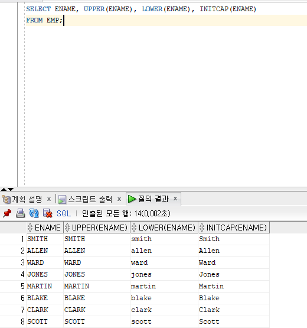  
  - `LENGTH(문자열)` : 괄호 안 데이터의 길이를 반환  
  - `LENGTHB(문자열)` : 길이를 byte수로 반환. (문자 하나당 2byte)  
  - `SUBSTR()` : 괄호 안 문자열 데이터에서 지정한 위치, 길이만큼 잘라서 반환  
    단, index는 1부터 시작. 길이를 지정하지 않으면 끝까지.  
    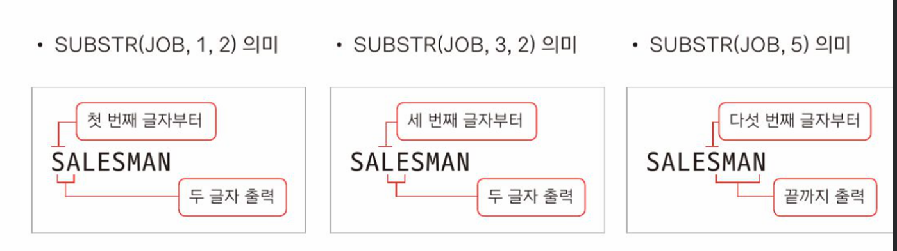  
    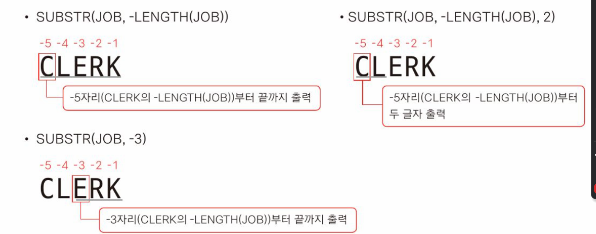  
  - `INSTR()` : 괄호 안 문자 데이터 중에서 지정한 데이터를 찾아, 해당 위치를 반환 (없으면 0을 반환)  
    INSTR(문자열, 찾을문자, 시작위치, n번째)  
      ```
        SELECT 'HELLO, ORACLE!' AS STR,
              -- 앞에서부터 검색한 L 위치
              INSTR('HELLO, ORACLE!', 'L') AS INSTR_1,
              -- 5번째 글자부터 검색한 L 위치
              INSTR('HELLO, ORACLE!', 'L', 5) AS INSTR_2,
              -- 2번째 글자부터 검색한 2번째 L 위치
              INSTR('HELLO, ORACLE!', 'L', 2, 2) AS INSTR_3
        FROM DUAL;
      ```
      
      INSTR을 사용해서, ENAME 중 S가 포함된 column을 출력하는 예시  
      ```
      SELECT * FROM EMP
      WHERE INSTR(ename,'S') > 0;
      ```

  - `REPLACE()` : 괄호 안 문자 데이터 중, 특정 값을 지정한 값으로 바꿈.  
    ```
    SELECT '010-1234-5678' AS 원본문자열,
      REPLACE('010-1234-5678','-',' ') AS 하이픈을공백으로,
      REPLACE('010-1234-5678', '-') AS 하이픈만제거
    FROM DUAL;
    ```
  - `LPAD()`,`RPAD()` : 문자열과 길이를 지정하고, 빈 공간을 원하는 값으로 채운 데이터를 반환.  
    ```
    LPAD('문자열',길이,'패딩문자(선택)')
    RPAD('문자열',길이,'패딩문자(선택)')
    패딩문자를 적지 않으면, 기본값인 공백이 들어감
    ```
    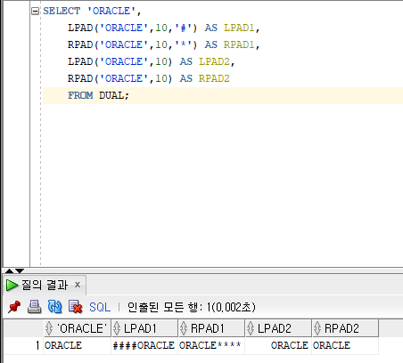  

  - `CONCAT()` : 두 문자열 데이터를 하나의 데이터로 연결함.  
    ```
    CONCAT(문자열1, 문자열2)
    CONCAT(문자열1, CONCAT(문자열3), 문자열2)
    두 문자열 사이에 문자열 3을 넣음
    ```
    || (AND) 연산자로 쓸 수도 있음.  
    ```
    SELECT EMPNO || ' : ' || ENAME
    FROM EMP;
    ```
  - `TRIM()` : 문자열 내 공백을 없앤 데이터를 반환함.  
    ```
    TRIM('  문자열  ')
    ```
    키워드를 통해 공백을 <span style="text-decoration:underline">제거할 위치</span>와, 공백이 아닌 <span style="text-decoration:underline">제거할 문자</span>를 지정 할 수 있음.  

    키워드를 통해 공백을 제거
    ```
    SELECT  '[' || TRIM(' _ _ORACLE_ _ ') || ']' AS TRIM,
          -- 문자열 앞 공백 제거
          '[' || TRIM(LEADING FROM ' _ _ORACLE_ _ ') || ']' AS TRIM_LEADING,
          -- 문자열 뒤 공백 제거
          '[' || TRIM(TRAILING FROM ' _ _ORACLE_ _') || ']' AS TRIM_TRAILING,
          -- 문자열 양쪽 공백 제거(기본값)
          '[' || TRIM(BOTH FROM ' _ _ORACLE_ _') || ']' AS TRIM_BOTH
          FROM DUAL;
    ```
    키워드를 통해 지정한 문자를 제거
    ```
    SELECT  '[' || TRIM('_' FROM '_ _ORACLE_ _') || ']' AS TRIM,
          '[' || TRIM(LEADING '_' FROM '_ _ORACLE_ _') || ']' AS TRIM_LEADING,
          '[' || TRIM(TRAILING '_' FROM '_ _ORACLE_ _') || ']' AS TRIM_TRAILING,
          '[' || TRIM(BOTH '_' FROM '_ _ORACLE_ _') || ']' AS TRIM_BOTH
          FROM DUAL;
    ```
  - `LTRIM`, `RTRIM` : 왼쪽/오른쪽에 있는 공백들을 제거함.  
    마찬가지로 키워드를 통해 제거할 문자를 지정할 수 있음.  
    ```
    LTRIM('  문자열  ')
    --`문자열  `
    RTRIM('  문자열  ')
    --`  문자열`
    ```
    지정한 키워드가 여러 개인 경우, 적은 키워드들이 있는 부분은 모두 제거함.  
     ```
    LTRIM('<__ORACLE_>','_<')
    --[ORACLE_>]
     ```
  - `ROUND` : 지정한 위치에서 <span style="text-decoration:underline">반올림</span>하는 함수  
    ```
    ROUND([숫자], [반올림위치(선택)])
    -- 반올림 위치를 적지 않으면, 소수 첫째자리에서 반올림 함.
    -- 음수를 적으면 정수 자리에서 반올림.  
    ```
    예시
    ```
        SELECT  ROUND(1234.5678),
            ROUND(1234.5678,0),
            ROUND(1234.5678,1),
            ROUND(1234.5678,2),
            ROUND(1234.5678,-1),
            ROUND(1234.5678,-2)
        FROM DUAL;

    ```
  - `TRUNC` : 지정된 위치에서 <span style="text-decoration:underline">버림</span>하는 함수
     ```
      SELECT
      TRUNC([숫자], [버림위치(선택)])
      -- 위치를 적지 않으면, 소수 첫째자리에서 버림.
      -- 음수를 적으면 정수 자리에서 버림.  
      ```
  - `CEIL`, `FLOOR` : 각각 입력된 숫자와 가장 가까운, 앞에 있는(큰) / 뒤에 있는(작은) 숫자를 반환함.  
    ```
    SELECT
      -- 4
      CEIL(3.14),
      -- 3
      FLOOR(3.14),
      -- -3
      CEIL(-3.14),
      -- -4
      FLOOR(-3.14)
    ```
  - `MOD` : (%) 나머지 값을 구하는 함수.  
    홀수, 짝수를 구분할 때 사용함.  
    ```
    MOD([숫자], [숫자])
    ``` 

---

  #### DATE 날짜 함수  
  날짜 데이터 + 숫자 : 숫자만큼 일수 이후의 날짜  
  날짜 데이터 - 숫자 : 숫자만큼 일수 이전의 날짜  
  날짜 데이터 - 날짜 데이터 : 두 날짜 데이터 간의 일수 차이  
  날짜 데이터 + 날짜 데이터 : 연산 불가. 지원x.  

  - `SYSDATE` : 시스템 날짜를 반환.  
  - `ADD_MONTHS()` : 날짜 데이터에 달을 더함.  
    ```
    ADD_MONTHS(날짜, 더할 달)
    ```
  - `MONTHS_BETWEEN()` : 두 날짜간의 달수 차이를 반환함.  
    ```
    SELECT EMPNO, ENAME, HIREDATE, SYSDATE, TRUNC(MONTHS_BETWEEN(HIREDATE, SYSDATE)) AS MONTH1,
        TRUNC(MONTHS_BETWEEN(SYSDATE, HIREDATE)) AS MONTH2
    FROM EMP;

    ```
    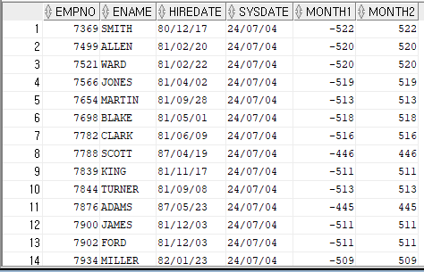  
  
  - `NEXT_DAY` : 입력한 날짜 기준으로 돌아오는 요일 날짜를 반환함.  
    ```
    NEXT_DAY(날짜, '요일')
    NEXT_DAY(SYSDATE, '월요일')
    ```
  - `LAST_DAY` : 입력한 날짜 기준 달의 마지막 날짜를 반환함.  
    ```
    LAST_DAY(날짜)
    LAST_DAY(SYSDATE)
    ```
  - `ROUND`, `TRUNC` : 날짜 데이터에서 사용하는 ROUND, TRUNC 함수는 매개변수가 다름.  
    ```
    ROUND([DATE], [FORMAT])
    ```
      

---

  #### 데이터 형변환 함수  
    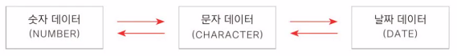  

  - `TO_CHAR` : 숫자 또는 날짜 데이터를 문자 데이터로 변환  
    날짜 데이터를 문자 데이터로 변환할 때, 형식과 언어를 지정할 수 있음.  
    language_types : https://ss64.com/ora/syntax-nls.html  
    ```
    SELECT TO_CHAR(DATEDATA, 'FORMAT', (선택)'NLS_DATE_LANGUAGE = language_type')
    SELECT TO_CHAR(SYSDATE, 'YYYY/MM/DD HH24:MI:SS') FROM DUAL;
    ```
    날짜, 시간 포맷(DATE, TIME FORMAT)  
    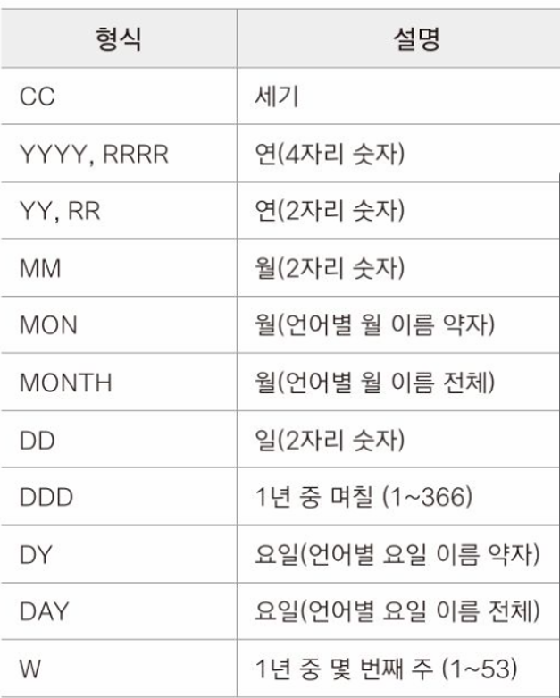  
    연도를 두 자리수로 표기할 때, YY는 무조건 2000년대, RR은 50년도 이전은 2000년대, 50년도 이후는 19년대로 표시.  
    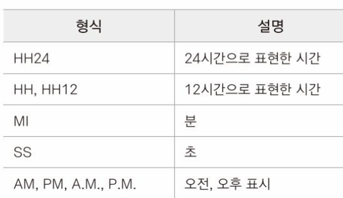  
    숫자 포맷(NUMBER FORMAT)  
    ```
    SELECT  TO_CHAR(SAL, '$999,999') AS SAL_$,
            TO_CHAR(SAL, 'L999,999') AS SAL_L,
            TO_CHAR(SAL, '999,999.00') AS SAL_1,
            TO_CHAR(SAL, '000,999,999.00') AS SAL_2,
            TO_CHAR(SAL, '000999999.99') AS SAL_3,
            TO_CHAR(SAL, '999,999,00') AS SAL_4
    FROM EMP;
    ```
  - `TO_NUMBER` : 문자 데이터를 숫자 데이터로 변환  
    숫자로 이루어진 문자 데이터만 연산한데, 이 때 문자가 포함된 데이터를 숫자 데이터로 변환하고 싶을 때 사용함.  
    ```
    TO_NUMBER(문자열,'NUMBER_FORMAT')
    -- 해당 문자열을 어떻게 읽을지 포맷을 알려줌
    ```
  - `TO_DATE` : 문자 데이터를 날짜 데이터로 변환  
    ```
    TO_DATE(`문자열`, `DATE_FORMAT`)
    -- 문자열과 형식 길이가 같아야 함.
    ```

---

  #### NULL 처리 함수  
  - `NVL()` : 입력한 칼럼의 값 중 NULL이 있으면, 지정한 값으로 바꾸는 함수  
  ```
  NVL(column_name, NULL_to_int/boolean/String)
  NVL([NULL여부를 검사할 데이터 OR 열], [NULL일 경우 반환할 데이터])
  ```

  - `NVL2()` : NULL이 아닌 경우도 값 지정 가능.  
  ```
  NVL2(NULL_col, NULL_to, NOT_NULL_to)
  NVL2([NULL여부를 검사할 데이터 OR 열], [NULL이 아닐 경우 반환할 데이터], [NULL일 경우 반환할 데이터])
  ```

---

  #### 조건문 함수  
  특정 조건에 따라 반환할 데이터를 설정할 때 사용함.  
  <span style="text-decoration:underline">조건에 따라 반환할 타입이 모두 같아야 함.</span>  
  - `DECODE()` : SWITCH문과 비슷함.  
    ```SQL
    DECODE([검사 대상],
            [조건1], [조건1일때 결과],
            [조건2], [조건2일때 결과],
            ...
            [조건n], [조건n일때 결과],
            (선택)[일치한 조건이 없을 때 결과])
    -- default 조건이 없는 경우, NULL로 반환됨.
    ```
    ```SQL
    -- 예시
    SELECT EMPNO, ENAME, JOB, SAL,
        DECODE(JOB, 
        'MANAGER', SAL*1.1, 
        'SALESMAN', SAL*1.05, 
        'ANALYST', SAL, 
        SAL*1.03) AS UPSAL
    FROM EMP;
    ```

  - `CASE()` : IF문과 비슷함.  
    ```SQL
    CASE [검사 대상],
      WHEN [조건1] THEN [조건1이 TRUE일 때 결과]
      WHEN [조건2] THEN [조건2이 TRUE일 때 결과]
      ...
      WHEN [조건n] THEN [조건 n이 TRUE일 때 결과]
      ELSE [일치하는 조건이 없을 때 결과]
    END
    ```
    JOB 별로 SAL값을 다르게 출력하는 예시
    ```SQL
    SELECT EMPNO, ENAME, JOB, SAL,
        CASE JOB
            WHEN 'MANAGER' THEN SAL*1.1
            WHEN 'SALESMAN' THEN SAL*1.05
            WHEN 'ANALYST' THEN SAL
            ELSE SAL*1.03
        END
            AS UPSAL
    FROM EMP;
    ```
    COMM 값을 참조해서 추가수당 별로 다르게 출력하는 예시  
      ```SQL
      SELECT EMPNO, ENAME, JOB, SAL, 
      CASE
          WHEN COMM=0 THEN '수당없음'
          WHEN COMM>0 THEN '수당:' || COMM
          ELSE '해당사항 없음'
      END
      FROM EMP;
      ```
---

  #### 다중행 함수  
  결과값이 한 행이기 때문에, 다중행과 함께 출력할 수 없음.  
  - `SUM()` : 지정한 데이터의 합을 반환  
  NULL처리를 따로 해주지 않아도 됨.  
  ```SQL
  SELECT SUM(col_name)
  FROM table_name
  ```
  ```SQL
  SUM([DISTINCT, ALL(선택)] [col_name])
  OVER(분석을 위한 여러 문법을 지정)(선택)
  ```
  - `COUNT()` : 지정한 데이터의 개수 반환  
  NULL은 세지 않음.  
    ```SQL
    COUNT([DISTINCT, ALL(선택)] [col_name])
    OVER(분석을 위한 여러 문법을 지정)(선택)
    ```
  - `MAX()` : 지정한 데이터 중 최댓값 반환  
  - `MIN()` : 지정한 데이터 중 최솟값 반환  
  문자열, 숫자, 날짜 모두 가능.  
  - `AVG()` : 지정한 데이터의 평균값 반환  

- `GROUP BY` 절 : 다중행 함수와 같이 자주 쓰임  
함수 결과 값을 행별로 나누고 싶을 때, 즉 다중행과 함께 나란히 출력하고 싶을 때  
해당 다중행을 기준으로 함수 결과행을 GROUP BY로 묶어줌.  
```SQL
SELECT [col_name1], [col_name2], ...
FROM [table_name]
WHERE [조건]
GROUP BY [그룹화할 열(여러개 가능)]
ORDER BY [정렬하려는 열]
```
```SQL
SELECT AVG(SAL), '10' AS DEPTNO FROM EMP WHERE DEPTNO = 10
UNION
SELECT AVG(SAL), '10' AS DEPTNO FROM EMP WHERE DEPTNO = 20
UNION
SELECT AVG(SAL), '10' AS DEPTNO FROM EMP WHERE DEPTNO = 30;
--↓
SELECT AVG(SAL), DEPTNO FROM EMP GROUP BY DEPTNO;
```
- `HAVING`절  
묶인 컬럼의 조건을 정의할 때 사용.  
GROUP BY절을 사용할 때, 조건을 넣기 위해 사용함.  
```SQL
-- 부서별, 직급별 평균 급여가 2000이상인 데이터를 출력
SELECT DEPTNO, JOB, AVG(SAL) FROM EMP
GROUP BY DEPTNO, JOB
    HAVING AVG(SAL)>=2000
ORDER BY DEPTNO ,JOB;
```
```SQL
-- 수행 순서
SELECT ② 
FROM  ①
WHERE ③
GROUP BY ④ 
HAVING 
```
- `ROLLUP`, `CUBE`, `GROUPING SETS` 함수  
GROUP BY 절에 지정할 수 있는 특수 함수.  
그룹화 데이터의 합게를 출력할 때 사용.  
  - `ROLLUP` : GROUP BY는 소그룹에 대한 결과만 출력하지만, ROLLUP함수를 사용하면 대그룹과 총그룹에 대한 결과도 출력.  
  포함관계를 기준으로 작은 그룹부터 큰 그룹까지 출력함.  
  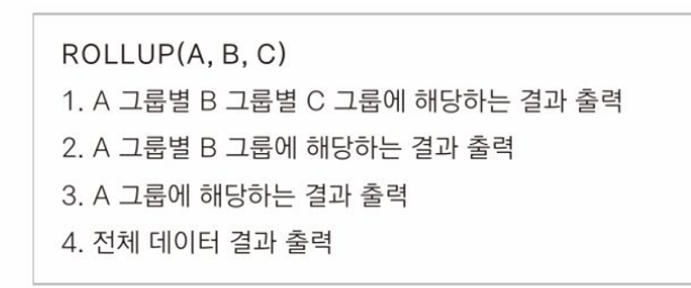  
  - `CUBE` : ROLLUP보다 더 많은 결과를 출력.  
  포함관계를 무시하고, 모든 열의 조합으로 출력함.  

  그룹화 => 가장 소그룹의 결과  
  ROLLUP => 소그룹->대그룹의 결과  
  CUBE => 조합 가능한 모든 그룹 결과  

  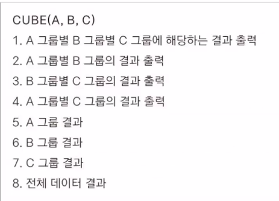  
  - `GROUPING SETS` : 계층없이, 지정한 그룹들의 결과만 출력함.  
```SQL
-- ROLLUP : 대그룹, 총그룹에 대한 결과를 출력
GROUP BY ROLLUP([col_name(대그룹)], [col_name(소그룹)])
-- CUBE : 모든 열의 조합 결과 출력
GROUP BY CUBE([col_name(대그룹)], [col_name(소그룹)])
-- GROUPING SETS
GROUP BY GROUPING SETS([col_name], [col_name])
```

  - `GROUPING` 함수 :  
  그룹화가 되었는지, 몇개의 그룹이 그룹화 되었는지 출력.  
  그룹화가 되었으면 0, 묶이지 않았으면 1  
  조건문에 사용하기 유용함.  
  ```
  SELECT 
  DECODE(GROUPING(DEPTNO), 1, 'ALL_DEPT', DEPTNO) AS DEPTNO,
  DECODE(GROUPING(JOB),1,'ALL_JOB', JOB) AS JOB,
  COUNT(*), MAX(SAL), SUM(SAL), AVG(SAL), GROUPING(DEPTNO), GROUPING(JOB)
  FROM EMP
  GROUP BY CUBE(DEPTNO, JOB)
  ORDER BY DEPTNO, JOB;
  ```

  - `GROUPING_ID` 함수 :  
  GROUPING은, 한 컬럼에 대한 그룹화 유무를 보여주지만, GROUPING_ID는 지정한 모든 컬럼에 대한 그룹화 유무를 보여줌.  
  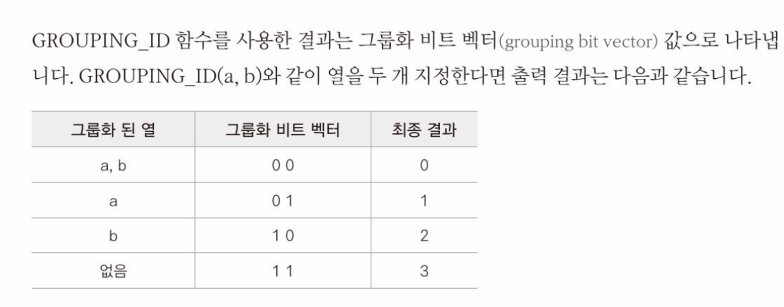  
  ```
  SELECT 
  DEPTNO,JOB,COUNT(*), MAX(SAL), SUM(SAL), AVG(SAL), GROUPING(DEPTNO), GROUPING(JOB), GROUPING_ID(DEPTNO, JOB)
  FROM EMP
  GROUP BY CUBE(DEPTNO, JOB)
  ORDER BY DEPTNO, JOB;
  ```
  - `LISTAGG` 함수 :  
  데이터를 가로로 출력할 수 있음. `WITHIN`과 함께 쓰임  
  ```
  SELECT DEPTNO, 
        LISTAGG(ENAME, ', ')
        WITHIN GROUP(ORDER BY SAL DESC) AS ENAMES
      FROM EMP
  GROUP BY DEPTNO;
  ```
  - `PIVOT` 함수 :  

  ```
  SELECT *
  FROM (SELECT DEPTNO, JOB, SAL FROM EMP)
  PIVOT(MAX(SAL) FOR DEPTNO IN (10,20,30))
  ORDER BY JOB;
  ```

  ### JOIN  
  두 개 이상의 테이블을 연결하여, 하나의 테이블처럼 출력할 때 사용함.  
  어떻게 연결하느냐에 따라 종류가 나뉨.  
  - EQUAL-JOIN(등가 조인) : 일반적으로 가장 많이 사용되는 JOIN 방식.  
  WHERE 절로 조건을 주어서, 데이터값이 같은(=) 행만 합침.  
  행 이름이 같을 때는, `TABLE.COLNAME`로 구분함.  
  AND로 조건 추가 가능.  
  ```
  SELECT EMP.EMPNO, EMP.ENAME, EMP.DEPTNO, DEPT.DNAME, DEPT.loc
  WHERE EMP.DEPTNO = DEPT.DEPTNO
  ORDER BY EMPNO;
  -- ALIAS 사용 ↓
  SELECT E.EMPNO, E.ENAME, E.DEPTNO, D.DNAME, D.loc
  FROM EMP E, DEPT D
  WHERE e.DEPTNO = d.DEPTNO;
  ```
  - NON-EQUAL-JOIN(비등가조인) : 등가 조인을 제외한 모든 조인 방법  
    - CROSS-JOIN : 모든 행을 조합함. (col * col)
    ```
    SELECT
    FROM TABLE1, TABLE2, TABLE...;
    ```
    - 포괄조인  
    ```
    SELECT * 
    FROM EMP E, SALGRADE S
    WHERE E.SAL BETWEEN S.LOSAL AND S.HISAL;
    ```
    - INNER-JOIN(자체조인) : 자신의 테이블 내에서 행을 참조하여 조인하는 방법  
    원본 테이블을 가져와 새로운 테이블을 만들고, 거기에 행을 조인하는 방법이 있지만,  
    데이터 용량이 거의 두 배가 되어 효율이 떨어짐.  
    이를 대신하는 방법이 자체 조인임.  
    매칭이 되는 데이터만 출력함.  
    ```
    SELECT E1.EMPNO, E1.ENAME, E1.MGR, E2.EMPNO AS 상사사번, E2.ENAME AS 상사이름
    FROM EMP E1, EMP E2
    WHERE E1.MGR = E2.EMPNO;
    ```
    FROM으로 자기 자신을 참조하면서, 별칭을 붙이면 됨.  
    - OUTER-JOIN(외부조인) : 매칭이 안 되는 데이터(비어있는 데이터)도 조인함.  
      <span style="text-decoration:underline">(JAVA 스레드처럼, 면접 질문으로 빈번히 나옴.)</span>  
      - LEFT-OUTER-JOIN : 왼쪽에 있는 데이터만 출력함.  
      - RIGHT-OUTER-JOIN : 오른쪽에 있는 데이터만 출력함.  
      왼쪽, 오른쪽 중 출력하고 싶은 곳에`(+)`를 적으면 됨.  
    ```
    SELECT E1.EMPNO, E1.ENAME, E1.MGR, E2.EMPNO AS 상사사번, E2.ENAME AS 상사이름
    FROM EMP E1, EMP E2
    WHERE E1.MGR = E2.EMPNO(+);
    ```
    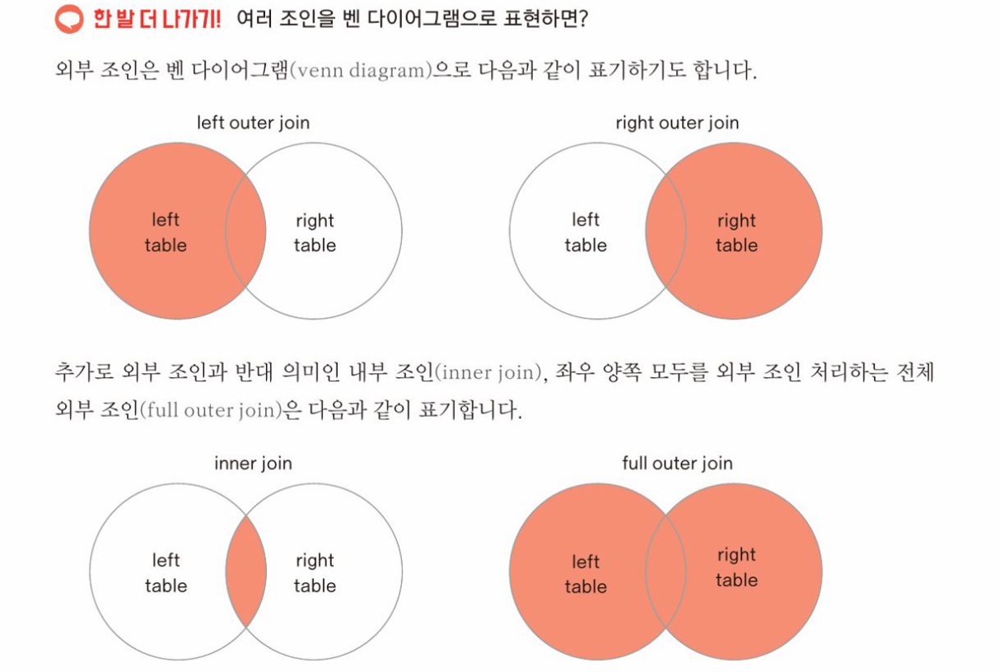  

# SQL-99 표준 문법  
ISO/ANSI에서 지정한 표준 문법. (ANSI 문법이라고도 부름)  
### JOIN 문법
- NATURAL JOIN (등가조인)  
WHERE 절을 사용하지 않고, FROM 절에서 조건을 적음.  
<span style="text-decoration:underline">COLUMN명 앞에 TABLE명도 적지 않음.</span>  
```
SELECT EMPNO, ENAME, JOB, MGR, HIREDATE, SAL, COMM, DEPTNO, DNAME, LOC
FROM EMP NATURAL JOIN DEPT;
```
- JOIN USING  
WHERE 절을 따로 적어 조건을 줄 수 있음.  
<span style="text-decoration:underline">COLUMN명 앞에 TABLE명도 적지 않음.</span>  
```
SELECT EMPNO, ENAME, JOB, MGR, HIREDATE, SAL, COMM, DEPTNO, DNAME, LOC
FROM EMP JOIN DEPT USING (DEPTNO)
WHERE SAL >= 3000;
```
- JOIN ON  
<span style="text-decoration:underline">COLUMN명 앞에 TABLE명을 적을 수 있음.</span>  
```
SELECT E.EMPNO, E.ENAME, E.JOB, E.MGR, E.HIREDATE, E.SAL, E.COMM, E.DEPTNO, D.DNAME, D.LOC
FROM EMP E JOIN DEPT D ON (E.DEPTNO = D.DEPTNO);
```

- OUTER JOIN  
WHERE절이 아닌 FROM절에서 외부조인을 선언.  
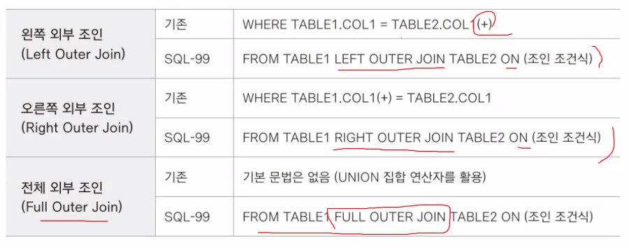  
  
```
SELECT E1.EMPNO, E1.ENAME, E1.MGR, E2.EMPNO, E2.ENAME
FROM EMP E1, EMP E2
WHERE E1.MGR = E2.EMPNO(+);
-- ▽
SELECT E1.EMPNO, E1.ENAME, E1.MGR, E2.EMPNO, E2.ENAME
FROM EMP E1 LEFT OUTER JOIN EMP E2 ON (E1.MGR = E2.EMPNO);
```
모두 출력하고 싶은 데이터에 (+)를 적는 대신, LEFT/RIGHT/BOTH를 적어 표시하고,  
ON에 조건을 적음.  

#### 세 개 이상의 TABLE JOIN  

```SQL
-- ORACLE
FROM TABLE1, TABLE2, TABLE3
WHERE TABLE1.COL = TABLE2.COL
AND TABLE2.COL = TABLE3.COL
-- ANSI ↓
FROM TABLE1 JOIN TABLE2 ON (조건식) 
JOIN TABLE3 ON(조건식)
```
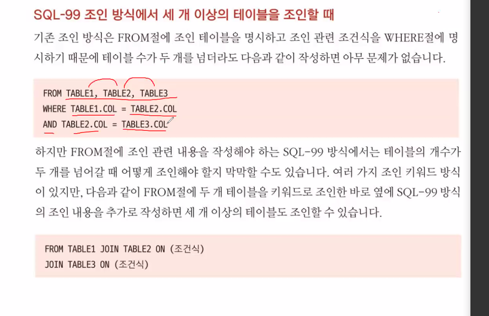  

## SUBQUERY 서브쿼리 
내부에서 사용하는 SELECT문  
데이터를 추가로 조회하기 위해 사용함.  

- 서브쿼리 특징 :  
  - 서브쿼리는 연산자와 같은 비교 또는 조회 대상의 오른쪽에 놓이며, 괄호()로 묶어서 사용함.  

  - 특수한 경우를 제외하고, 대부분의 서브쿼리는 ORDER BY 절을 사용할 수 없음.  

  - 서브쿼리의 SELECT절에 명시한 열은 메인쿼리의 비교대상과 같은 자료형, 같은 개수로 지정해야 함.  
  즉, 메인쿼리의 비교 대상 데이터가 하나라면, 서브쿼리의 SELECT절 역시 같은 자료형인 열을 하나 지정해야 함.  

  - 서브쿼리에 있는 SELECT문의 결과 행 수는, 함께 사용하는 메인쿼리의 연산자 종류와 호환 가능해야 함.  
  예를 들어 메인쿼리에 사용한 연산자가 단 하나의 데이터로만 연산이 가능한 연산자라면(>,<등),  
  서브쿼리의 결과 행 수는 반드시 하나여야 함.  

```SQL
SELECT SAL
FROM EMP
WHERE ENAME = 'JONES';

SELECT * FROM EMP
-- 만약, JONES라는 데이터가 여러개라면, >를 사용할 수 없음.
-- 대신, IN 키워드를 사용할 수 있음.
WHERE SAL > 2975;
-- ▽
SELECT *
FROM EMP
-- 같은 자료형인 SAL이 아니라, 다른 자료형을 지정하면 비교 불가능.
WHERE SAL > (SELECT SAL FROM EMP WHERE ENAME='JONES');
```

### 단일행 서브쿼리  
결과가 하나의 행인 서브쿼리  
- 사용 가능 연산자 : >,<,>=,<=,=  
단일행 함수를 사용할 수 있음.  

```SQL
...
AND E.SAL > (SELECT AVG(SAL)FROM EMP);
```

### 다중행 서브쿼리  
결과가 여러 행인 서브쿼리  
- 사용 가능 연산자  
  IN : 메인쿼리의 데이터가 서브쿼리의 결과 중 하나라도 일치한 데이터가 있다면 TRUE  
  ANY, SOME : 메인쿼리의 조건식을 만족하는 서브쿼리의 결과가 하나 이상이면 TRUE  
  ALL : 메인쿼리의 조건식을 서브쿼리의 결과 모두가 만족하면 TRUE  
  EXISTS : 서브쿼리의 결과가 존재하면(즉, 행이 1개 이상일 경우) TRUE  

```SQL
-- 부서 번호 별, 급여가 가장 높은 값들 출력
SELECT * FROM EMP
WHERE SAL IN (SELECT MAX(SAL) FROM EMP GROUP BY DEPTNO);
```

```SQL
-- 부서 번호가 10인 직원들보다 고용일이 빠른 모든 직원들을 출력
SELECT * FROM EMP
WHERE HIREDATE < ALL (SELECT HIREDATE FROM EMP WHERE DEPTNO=10 );
```

### 인라인 뷰  
FROM절에서 사용하는 서브쿼리는, 인라인 뷰라고 불림.  

```SQL
-- 부서번호 10번에 존재하는 직원들의 직원정보와 부서정보를 FROM절 서브쿼리를 이용하여 출력
SELECT E.EMPNO, E.ENAME, E.DEPTNO, D.DNAME, D.LOC
FROM (SELECT * FROM EMP WHERE DEPNO = 10) E,
    (SELECT * FROM DEPT) D
WHERE E.DEPTNO = D.DEPTNO;
--
SELECT * 
FROM(SELECT * FROM EMP WHERE DEPTNO = 10) NATURAL JOIN DEPT;
```

#### WITH절  
테이블 내 데이터 규모가 너무 크거나, 현재 작업에 불필요한 열이 너무 많아 일부 행과 열만 사용하고자 할 때,  
FROM절에서 너무 많은 서브쿼리를 지정하면 가독성, 성능이 떨어질 수 있기 때문에 WITH 절을 사용.  

메인쿼리가 될 SELECT문 안에서 사용할, 서브쿼리와 별칭을 먼저 지정한 후  
메인쿼리에서 사용함.  

```SQL
-- WITH절 기본 형식
WITH
[별칭1] AS (SELECT문 1),
[별칭2] AS (SELECT문 2),
...
[별칭N] AS (SELECT문 N)
SELECT
  FROM 별칭1, 별칭2, 별칭3
```

```SQL
WITH
E AS (SELECT * FROM EMP WHERE DEPTNO = 10),
D AS (SELECT * FROM DEPT)
SELECT E.EMPNO, E.ENAME, E.DEPTNO, D.DNAME, D.LOC
FROM E JOIN D ON (D.DEPTNO = E.DEPTNO);
```

### 상호 연관 서브쿼리  
메인쿼리에 사용한 데이터를, 서브쿼리에 사용하고,  
서브쿼리의 결과 값을 다시 메인쿼리로 돌려주는 방식.  

조건에 따라 성능이 저하될 수 있음.  
```

```

### 스칼라 서브쿼리
SELECT절에 사용하는 서브쿼리.  
SELECT절에 하나의 열 영역으로서 결과를 출력할 수 있음.  
반드시 하나의 결과만 반환하도록 작성해야 함.  
```SQL
SELECT EMPNO, ENAME, JOB, SAL,
  (SELECT GRADE 
    FROM SALGRADE
    WHERE E.SAL BETWEEN LOSAL AND HISAL) AS SALGRADE,
    DEPTNO,
    (SELECT DNAME
      FROM DEPT
      WHERE E.DEPTNO = DEPT.DEPTNO) AS DNAME
  FROM EMP E;
```

## 테이블 조작  

```SQL
-- TABLE 생성
CREATE TABLE table_name
  AS [SELECT문];
```
생성할 때, 속성은 같고 데이터는 비어있는 테이블로 복사하려면 `WHERE 1<>1`(FALSE) 를 적음.  

```SQL
-- TABLE 삭제
DROP TABLE table_name;
```

### INSERT문  
테이블에 데이터를 추가하는 명령어  
```SQL
INSERT INTO table_name [(col1,col2,...)]
VALUES (col1_value, col2_value...);
```
INSERT INTO : 새로운 데이터를 입력할 대상 테이블과 열을 입력.  
VALUES : INSERT INTO에서 지정한 테이블의 열 순서와, 자료형에 맞는 입력 데이터를 저장.  

값을 넣을 때, 순서, 자료형, 개수가 맞지 않으면 오류 발생.  
제약 조건도 맞아야 함.  

INSERT INTO에 col_name는 적지 않아도 됨.  

DATE 속성 열에 값을 넣을 때, 문자열로 적으면 자동으로 맞는 날짜 형식으로 형변환 되어 삽입됨.  
TO_DATE()나 SYSDATE로도 값 삽입 가능.  

빈 값을 넣을 때는 `NULL`, ''로 삽입 가능.  
그러나 가끔 빈 문자열이 들어가는 경우가 있어서, `NULL`을 넣는게 확실한 방법임.  
또는 INSET INTO에서 비워두고 싶은 곳을 생략하는 방법도 있음.  

```SQL
-- NULL 삽입
INSERT INTO DEPT_TEMP(DEPTNO, DNAME, LOC)
  VALUES(90, 'INCHEON', NULL);
-- 빈 문자열 '' 삽입
INSERT INTO DEPT_TEMP(DEPTNO, DNAME, LOC)
  VALUES(90, 'INCHEON', '');
-- col_name 생략
INSERT INTO DEPT_TEMP(DEPTNO, LOC)
  VALUES(90, 'INCHEON');
```
#### 다른 테이블의 데이터를 삽입  
SELECT문을 통해 데이터를 선택하여 삽입함.  
VALUES를 사용하지 않음.  
다른 테이블의 데이터를 삽입하는 예시  
```SQL
INSERT INTO EMP_TEMP (EMPNO, ENAME, JOB, MGR, HIREDATE, SAL, COMM, DEPTNO)
            SELECT E.EMPNO, E.ENAME, E.JOB, E.MGR, E.HIREDATE, E.SAL, E.COMM, E.DEPTNO
                FROM EMP E JOIN SALGRADE S ON(E.SAL BETWEEN S.LOSAL AND S.HISAL)
                    WHERE S.GRADE = 1;
```
다른 테이블의 데이터를 삽입하는데, 다른 테이블엔 존재하지 않는 열에는 NULL을 넣는 예시
```SQL
-- EMP_HW에 EMP에는 없는 REMARK 열이 있다고 가정.
-- 열 이름으로 NULL을 넣으면 NULL 값이 입력됨.
INSERT INTO EMP_HW
    SELECT EMPNO, ENAME, JOB, MGR, HIREDATE, SAL, COMM, DEPTNO, NULL
        FROM EMP;
```

ALL, FIRST 등의 옵션으로, 한 번에 여러 테이블을 대상으로 데이터를 추가하거나,  
특정 조건에 따라 다른 테이블에 데이터를 추가하는 등 다양하게 사용할 수 있음.  

MERGE문을 사용하면, 같은 열 구조를 가지는 여러 테이블 또는 서브쿼리의 결과 데이터를  
한 테이블에 병합하여 추가할 수도 있음.  

---

### UPDATE문  
테이블에 저장되어 있는 데이터 내용을 수정하는 명령어.  
```SQL
-- 기본형식  
UPDATE [table_name]
SET    [col_name1] = [value1], [col_name2] = [value2]...
WHERE [데이터를 변경할 대상 행을 선별하는 조건];
--- DEPT_TEMP2 테이블에서 DEPTNO가 40인 열의 LOC 데이터를 SEOUL로 수정
UPDATE DEPT_TEMP2
SET LOC = 'SEOUL'
WHERE DEPTNO = 40;
```
`UPDATE` : 데이터를 수정할 테이블을 지정.  
`SET` : 변경할 열을 선택, 변경할 데이터를 입력.  
`WHERE` : 테이블의 변경할 데이터 선별 조건식을 지정. 생략 시, 테이블 내 지정된 모든 열의 데이터 변경.  

WHERE 절을 쓰지 않아, 모든 행의 데이터가 변경됐을 때,  
`ROLLBACK;`(TCL) 명령어를 사용하면 원래대로 돌릴 수 있음.  

UPDATE문에도 서브쿼리 사용 가능.  
SET 조건을 정확히 알 수 없을 때 사용함.  

```SQL
-- 서브쿼리를 이용한 UPDATE문

-- DEPT_TEMP2 테이블에서 DEPTNO가 40인 열의 LOC 데이터를, 
-- DEPT 테이블에서 DEPTNO가 40인 열의 LOC 데이터로 수정

UPDATE DEPT_TEMP2 
SET (DNAME, LOC) = (SELECT DNAME, LOC FROM DEPT WHERE DEPTNO = 40)
WHERE DEPTNO = 40;

-- DEPT_TEMP2 테이블에서 DNAME이 OPERATIONS인 열의 LOC를 SEOUL로 수정
UPDATE DEPT_TEMP2
SET LOC = 'SEOUL'
WHERE DEPTNO = (SELECT DEPTNO FROM DEPT_TEMP2 WHERE DNAME='OPERATIONS');
```

UPDATE문을 사용할 때는 변경하려는 대상을 정확히 알고 수행해야 함.  

---

### DELETE문  
테이블에 저장되어 있는 데이터 내용을 삭제하는 명령어.  
```SQL
DELETE FROM [table_name]
WHERE [삭제할 대상 행을 선별하기 위한 조건식]; 
```
DELETE : 데이터를 삭제할 테이블을 지정.  
WHERE : 삭제할 데이터를 선별하는 조건식을 지정. 생략 시, 테이블 내 모든 데이터를 삭제.  

```SQL
-- EMP_TEMP2 테이블에서 DEPTNO가 30이고 GRADE가 3인 사원들을 삭제
DELETE FROM EMP_TEMP2
WHERE EMPNO IN(SELECT E.EMPNO FROM EMP_TEMP2 E JOIN SALGRADE S ON (E.SAL BETWEEN S.LOSAL AND S.HISAL) WHERE E.DEPTNO=30 
AND S.GRADE=3);

-- EMP_TEMP 테이블에서 급여가 3000이상인 사원들을 삭제
DELETE FROM EMP_TEMP
WHERE SAL >=3000;
-- 서브쿼리 사용
DELETE FROM EMP_TEMP
WHERE EMPNO IN(SELECT EMPNO FROM EMP_TEMP WHERE SAL>=3000);
```

# 트랜잭션(TRANSACTION)  
```
관계형 데이터베이스에서 하나의 작업 또는 밀접하게 연관되어 있는 작업 수행을 위해 나눌 수 없는 최소 수행 단위를  
트랜잭션이라고 합니다. SQL 문법 중 이러한 트랜잭션을 제어하는 데 사용하는 명령어를 TCL(Transaction Control Language)라고 합니다.  
```
트랜잭션 : 작업 단위.  
더 이상 분할해서는 안 되는, 할 수 없는 최소 수행 단위.  
어떠한 기능 한 가지를 수행하는 SQL문 덩어리.  

하나의 트랜잭션 내에 있는 여러 명령어를 한 번에 수행하여 작업을 완료한 상태와,  
아예 모두 수행하지 않은 상태로 나뉨. (ALL OR NOTHING)  

한 개 이상의 DML로 이루어짐.  

트랜잭션을 제어하기 위해 TCL 명령어를 사용함.  
트랜잭션은 데이터베이스 계정을 통해 데이터베이스에 접속하는 동시에 시작됨.  
TCL을 실행할 때 기존 트랜잭션이 끝나고, 새로운 트랜잭션이 다시 시작됨.  

```SQL
SQL> INSERT...
SQL> UPDATE...
SQL> DELETE...
SQL> TCL...
-- 트랜잭션 종료
-- 새로운 트랜잭션 시작
SQL> INSERT...
SQL> UPDATE...
SQL> DELETE...
SQL> TCL...
-- 트랜잭션 종료
...
-- 새로운 트랜잭션 시작
SQL> INSERT...
SQL> UPDATE...
SQL> DELETE...
SQL> TCL...
```
ROLLBACK, COMMIT 과 같은 TCL 명령어를 수행할 때, 한 트랜잭션 단위로 작업이 수행되어 데이터 베이스에 반영됨.  
한 번 COMMIT을 하면, 새로운 트랜잭션이 시작되기 때문에, 이전 트랜잭션 상태로 되돌릴 수 없음.  
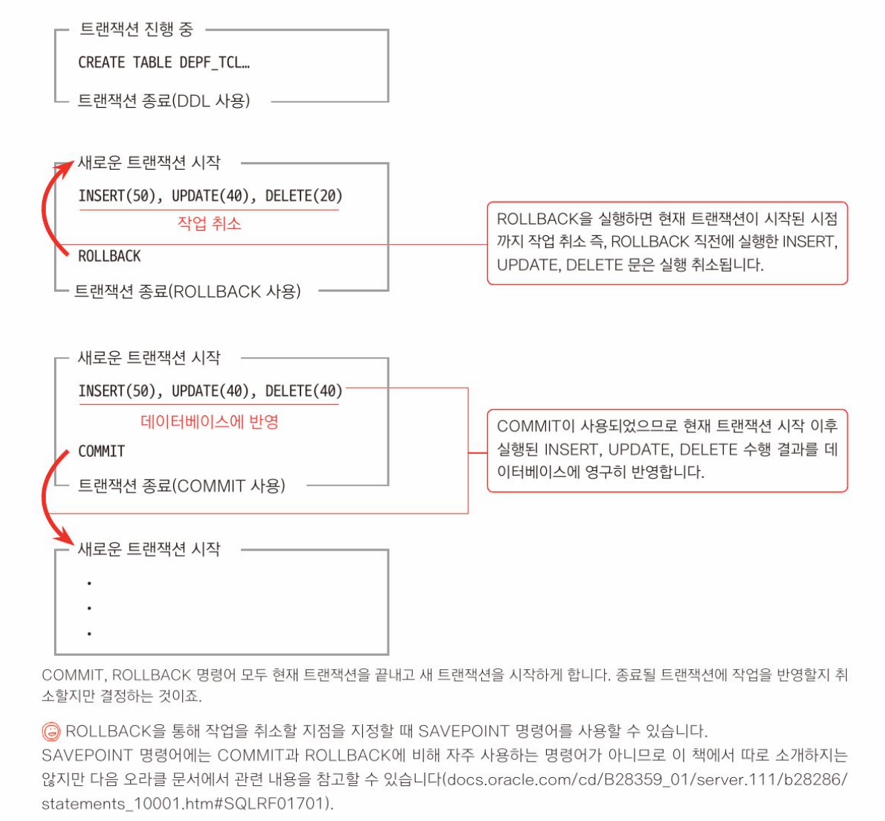

# 세션 (SESSION)  
```
오라클 데이터베이스에서의 세션은 데이터베이스 접속 시작부터 접속이 종료되기까지의 전체 기간을 의미합니다.
하나의 세션은 여러 SQL문이 하나의 작업 단위로 다뤄지는 여러 개의 트랜잭션으로 구성됩니다.
트랜잭션 작업을 데이터베이스에 영구히 반영할 때 COMMIT 명령어를 사용하고
지금까지 한 작업을 취소할 때 ROLLBACK 명령어를 사용합니다.
이 명령어를 통해 현재 트랜잭션이 종료될 때까지 다른 세션에서는 데이터 조작 전 상태의 데이터만 조회할 수 있으며
이러한 특성을 읽기일관성이라고 합니다.
```
어떤 활동을 위한 시간이나 기간.  
데이터베이스에서의 세션은 데이터베이스 접속을 시작으로, 작업을 수행한 후 접속을 종료하기까지 전체 기간을 의미함.  
데이터베이스 세션은 어느 곳에서 접속하느냐에 따라 각각 다른 세션으로 나뉨.(cmd, sql developer 등)  

세션 내에는 하나 이상의 트랜잭션이 존재함.  
  <fieldset style="width:300px">
    <legend>세션</legend>
      <fieldset>
        <legend>트랜잭션1</legend>
      </fieldset>
      <fieldset>
        <legend>트랜잭션2</legend>
      </fieldset>
      ...
      <fieldset>
        <legend>트랜잭션n</legend>
      </fieldset>
  </fieldset>
<br>

트랜잭션이 TCL로 끝나지 않으면, 해당 변경 사항은 다른 세션에서 조회할 때 `변경되지 않은 상태`로 조회 됨.  
이러한 특성을 일관성이라고 함.  
즉 확정된 데이터만 읽기 일관성이 보장됨.  
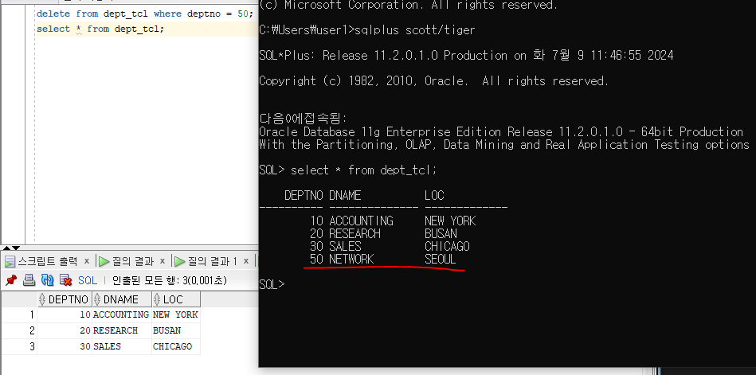  

### LOCK  
특정 세션에서 ROLLBACK, COMMIT으로 트랜잭션이 완료되지 않은 상태라면,  
다른 세션에서 접근할 수 없도록 `잠긴 상태`가 됨.  

LOCK으로 인해 접근하지 못하고 대기하는 상태를 `HANG`이라고 함.  

명령어를 어떤 방식으로 작성하느냐에 따라 `LOCK의 종류`가 달라짐.  

- LOCK의 종류  
  - `행 레벨 록 (row level lock)` :  
  `WHERE절을 지정한` UPDATE, DELETE문을 수행한 경우, 해당 행을 잠금.  
  `WHERE절을 지정하지 않은` UPDATE, DELETE문을 수행한 경우, 해당 테이블의 모든 행을 잠금.  
  UPDATE, DELETE 명령을 수행하는 세션은 `HANG` 상태에 들어감.  
  그러나 테이블 전체 행이 LOCK 상태여도, INSERT문의 수행은 가능함.  

  - `테이블 레벨 록 (table level lock)` :  
  테이블에 변경되는 행의 수와는 상관없이,  
  DML을 사용하여 데이터가 변경 중인 테이블은, 테이블 단위 잠금이 걸림.  
  데이터를 변경 중인 세션 외 다른 세션에서 `DDL`을 통해 테이블의 구조를 변경할 수 없음.  

## DDL(Data Definition Language)  
데이터 베이스 정의어.  
객체를 생성, 변경, 삭제하는 등의 기능을 수행하는 명령어.  
DML과 달리, <span style="text-decoration:underline">명령어를 수행하자마자 데이터베이스에 수행한 내용이 바로 반영됨.</span>  
즉, DDL을 실행하면 자동으로 COMMIT되기 때문에, ROLLBACK으로 실행 취소가 불가능함.  
(이러한 이유로 실무에서는 자주 사용하지 않음)  

- `CREATE` : 데이터베이스 객체를 생성함  
  ```SQL
  CREATE TABLE account.table_name(
    row1_name row1_type,
    row2_name row2_type,
    ...
    rown_name rown_type,
  );
  -- 소유 계정 이름을 생략하면, 현재 접속해 있는 계정 소유의 테이블이 만들어짐.
  -- 기본적으로 테이블 명은 대소문자 구별X. ""를 통해 대문자 지정 가능.
  -- 테이블의 열을 하나하나 만들어 생성하는 예시
  CREATE TABLE EMP_DDL(
    EMPNO NUMBER(4),
    ENAME VARCHAR2(10),
    JOB VARCHAR2(9),
    MGR NUMBER(4),
    HIREDATE DATE,
    SAL NUMBER(7,2),
    COMM NUMBER(7,2),
    DEPTNO NUMBER(2)
  );
  -- 다른 테이블을 그대로 복사하여 생성하는 예시
  CREATE TABLE DEPT_DDL AS SELECT * FROM DEPT;
  DESC DEPT_DDL;
  SELECT * FROM DEPT_DDL;
  -- 다른 테이블의 일부를 복사하여 생성하는 예시
  CREATE TABLE EMP_DDL_30 AS SELECT * FROM EMP WHERE DEPTNO=30;
  SELECT * FROM EMP_DDL_30;
  -- 다른 테이블들을 조인한 테이블을 생성하는 예시
  CREATE TABLE EMPDEPT_DDL AS SELECT * FROM EMP JOIN DEPT USING (DEPTNO)
  WHERE 1<>1;
  -- 모든 레코드에, 적용 결과를 FALSE로 나타나도록 하여 테이블 틀만 복사함.
  ```
  테이블 이름 생성 규칙  
   - 테이블 이름은 문자로 시작해야 함.  
   - 테이블 이름은 30BYTE 이하여야 함.  
   - 같은 사용자 소유의 테이블 이름은 중복될 수 없음.  
   - 테이블 이름은 영문자, 한글, 숫자와 특수 문자 $#_ 사용 가능.  
   - 예약어는 테이블 이름으로 사용 불가.  

- `ALTER` : 데이터베이스 객체를 변경함  
  컬럼을 추가, 변경, 삭제할 수 있음.  
  마찬가지로 변경 후에 ROLLBACK 불가능.  
  ADD(추가), RENAME(이름변경), MODIFY(타입변경), DROP(삭제)으로 컬럼을 변경함.  
  ```SQL
  ALTER TABLE table_name
    -- 열 추가
    ADD col_name coltype
    -- 열 이름 변경
    RENAME COLUMN col_name TO col_newname
    -- 열 타입 변경
    MODIFY col_name col_type
    -- 열 삭제
    DROP COLUMN col_name;
  ```
- `TRUNCATE` : 데이터베이스 객체의 내용을 삭제함.  
  마찬가지로 변경 후에 ROLLBACK 불가능.  
  DELETE보다 속도가 빠름.  
  ```SQL
  TRUNCATE TABLE table_name;
  ```
- `DROP` : 데이터베이스 객체를 삭제함  
  DELETE, TRUNCATE와 달리 객체 자체를 삭제하고, 되돌릴 수 없음.  
  ```SQL
  DTOP TABLE table_name;
  ```
  DELETE, TRUNCATE, DROP의 차이 : https://wikidocs.net/4021  
    

  # 데이터 객체  
  ### 데이터 사전(DATA DICTIONARY)  
  ```
  데이터 사전은 오라클 데이터베이스를 구성하고 운영하는 데이터를 저장하는 특수한 테이블로서 오라클 사용자가 직접 접근할수 없습니다.  
  하지만 SELECT문으로 데이터를 열람할 수 있도록 데이터 사전 뷰를 제공합니다.  
  대표적인 데이터 사전 뷰 중 현재 접속한 사용자가 소유하는 테이블 목록을 보기 위해서는 USER_TABLES를 사용합니다.  
  또한 사용자가 소유하는 테이블을 포함해 다른 사용자가 소유한 테이블 중 현재 사용자에게 사용 허가가 되어있는 테이블을 보기 위해서는 ALL_TABLES를 사용합니다.  
  ```
  ### 뷰(VIEW)  
  ```
  하나 이상의 테이블을 조회하는 SELECT문을 저장한 객체. 물리적 데이터를 따로 저장하지 않음.  
  ```
  열람을 주 목적으로 사용하는 객체. 흔히 가상 테이블이라고 부름.  
  실제로는 존재하지 않고, 원본 데이터에 접근할 수 없음.  
  SELECT문의 FROM절에 사용하면 특정 테이블을 조회하는 것과 같은 효과를 얻을 수 있음.  
  실제로 데이터 조작이 불가능하진 않지만, 조회를 목적으로 만들어진 테이블이기 때문에 잘못된 값이 들어갈 수 있고, 조건이 까다롭기 때문에 권장하지 않음.  

  뷰의 사용 목적  
  편리성 : SELECT문의 복잡도를 완화함.  
  보안성 : 테이블의 특정 열을 노출하고 싶지 않을 경우.  

  ```SQL
  -- 뷰 생성은 권한이 필요함.  
  -- 권한 부여 cmd  
  sqlplus system/oracle  
  grant CREATE VIEW to scott;  
  ```
  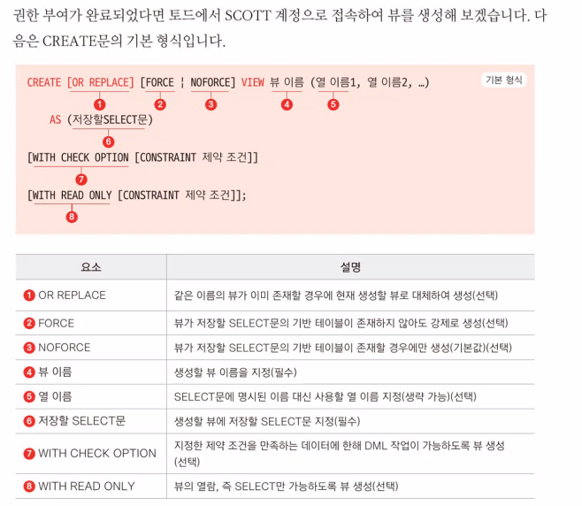  
  ```SQL
  CREATE VIEW VW_EMP20
    AS (SELECT EMPNO, ENAME, JOB, DEPTNO FROM EMP WHERE DEPTNO=20);
  SELECT * FROM VW_EMP20;
  -- 아래 SQL문과 같음.
  -- SELECT * FROM (SELECT EMPNO, ENAME, JOB, DEPTNO, FROM EMP WHERE DEPTNO=20);
  ```


  데이터 사전 뷰는 용도에 따라 이름 앞에 접두어를 지정하여 분류함.  
  - `USER_XXXX` : 현재 데이터베이스에 접속한 사용자가 소유한 객체 정보  
  - `ALL_XXXX` : 접속한 사용자가 소유한 객체 또는 다른 사용자가 소유한 객체 중 사용 허가를 받은 객체, 즉 사용 가능한 모든 객체 정보  
  - `DBA_XXXX` : 데이터베이스 관리를 위한 정보(관리 권한을 가진 SYSTEM, SYS 사용자만 열람 가능)  
  - `V$_XXXX` : 데이터베이스 성능 관련 정보(X$_XXXX 테이블의 뷰)  
  ```SQL
  -- 사용자가 소유한 뷰 목록 조회
  SELECT * FROM USER_VIEWS;
  ```
  
  [SCOTT 데이터 사전 뷰](../../image/SCOTT_DICT.pdf)  
  
  ---

  ### 인라인 뷰를 사용한 TOP-N SQL문  
  #### 인라인 뷰  
  SQL문에서 일회성으로 만들어서 사용하는 뷰.  
  SELECT문에서 사용되는 서브쿼리, WITH절에서 미리 이름을 정의해두고 사용하는 SELECT문 등이 이에 해당됨.  

  ```sql
  SELECT ROWNUM, E.*
  FROM EMP E;
  ```
  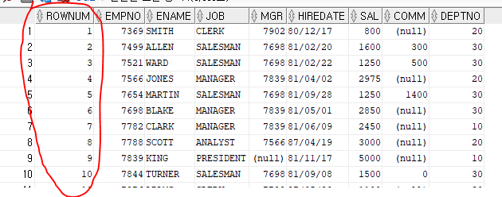  

  #### 특수컬럼(의사열)  
  실제 존재하는 데이터는 아니고, 특정 목적을 위해서 사용되는 열  
  
  `ROWNUM` : 가장 많이 쓰이는 특수 컬럼. 데이터 순서대로 번호를 매김. 이 번호는 다른 행을 기준으로 ORDER BY 해도 바뀌지 않음.  

  ```SQL
  SELECT ROWNUM, E.*
  FROM (SELECT ROWNUM AS INNER_ROWNUM, E.* FROM EMP E ORDER BY SAL DESC) E;
  ```
  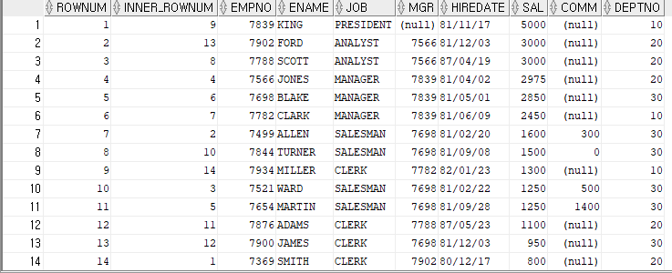  


  - ROWNUM을 통해 상위 데이터들을 조회하는 구문을 작성할 수 있음.  
  ```SQL
  -- WITH절과 ROWNUM을 통해 상위 3명을 조회하는 구문
  WITH E AS (SELECT * FROM EMP E ORDER BY SAL DESC)
  SELECT ROWNUM, E.*
  FROM E
  WHERE ROWNUM <=3;
  -- FROM절에서 SAL 기준 내림차순 정렬이 완료된 상태로 ROWNUM을 적용시킴.
  ```
  #### ROWNUM을 활용한 예시들  
  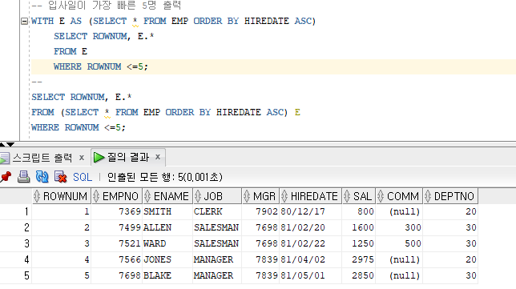  
  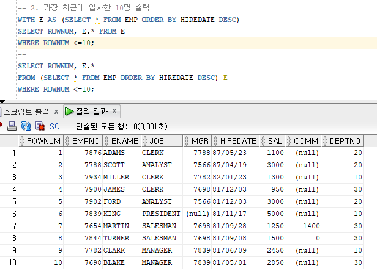  
  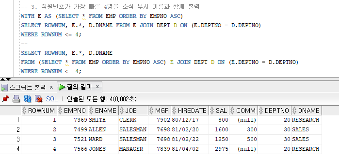  

  ### 인덱스  
  데이터를 조회할 때 더 빠른 검색을 위해 사용함.  
  ```SQL
  -- 인덱스 생성 기본형
  CREATE INDEX index_name
    ON table_name(row_name1 ASC|DESC,
                  row_name2 ASC|DESC,
                  ...               );
  -- 인덱스 생성 예시
  CREATE INDEX IDX_EMP_SAL
    ON EMP(SAL);
  -- 인덱스 삭제 예시
  DROP INDEX IDX_EMP_SAL;
  -- 사용자가 소유한 인덱스를 조회
  SELECT * FROM USER_IND_COLUMNS;
  ```
  <table border="1">
    <thead>
      <tr>
        <th>방식</th>
        <th>사용</th>
      </tr>
    </thead>
    <tbody>
      <tr>
        <td>단일 인덱스 (SINGLE INDEX)</td>
        <td>CREATE INDEX idx_name ON table_name(row_name);</td>
      </tr>
      <tr>
        <td>복합 인덱스 (CONCATENATED INDEX) | 결합 인덱스 (COMPOSITE INDEX)<br>- 두 개 이상 열로 만들어지는 인덱스. <br> -WHERE 절의 두 열이 AND 연산으로 묶이는 경우</td>
        <td>CREATE INDEX idx_name ON table_name(row_name1, row_name2, ...);</td>
      </tr>
      <tr>
        <td>고유 인덱스 (UNIQUE INDEX)<br>
        - 열에 중복 데이터가 없을 때 사용.<br>
        - UNIQUE 키워드를 지정하지 않으면 비고유 인덱스가 기본값</td>
        <td>CREATE UNIQUE INDEX idx_name ON table_name(row_name);</td>
      </tr>
      <tr>
        <td>함수 기반 인덱스 (FUNCTION BASED INDEX)<br>
        - 열에 산술식 같은 데이터 가공이 진행된 결과로 인덱스 생성</td>
        <td>CREATE INDEX idx_name ON table_name(function);</td>
      </tr>
      <tr>
        <td>비트맵 인덱스 (BITMAP INDEX)<br>
        - 데이터 종류가 적고 같은 데이터가 많이 존재할 때 주로 사용<br>
        - 성별같이 남/여밖에 들어갈 수 없는 데이터를 조회할 때 사용함
        </td>
        <td>CREATE BITMAP INDEX idx_name ON table_name(row_name);</td>
      </tr>
    </tbody>
  </table>

  인덱스를 무한정 만든다고 검색 성능이 높아지진 않음.  

  ---

  ### 시퀀스(SEQUENCE)  
  오라클 데이터베이스에서, 특정 규칙에 맞는 연속 숫자를 생성하는 객체.  
  ```SQL
  CREATE SEQUENCE sequence_name 
  [INCREMENT BY] 
  [START WITH]
  [MAXVALUE n | NOMAXVALUE]
  [MINVALUE n | NOMINVALUE]
  [CYCLE | NOCYCLE]
  [CACHE n | NOCACHE]
  ```
  `INCREMENT BY` : 시퀀스에서 생성할 번호의 증가 값. (기본값은 1)  
  `START WITH` : 시퀀스에서 생성할 번호의 시작 값. (기본값은 1)  
  `MAXVALUE` | `NOMAXVALUE` : 생성할 번호의 최댓값 지정. 범위는 시작값 이상, 최솟값 초과로 지정.  

  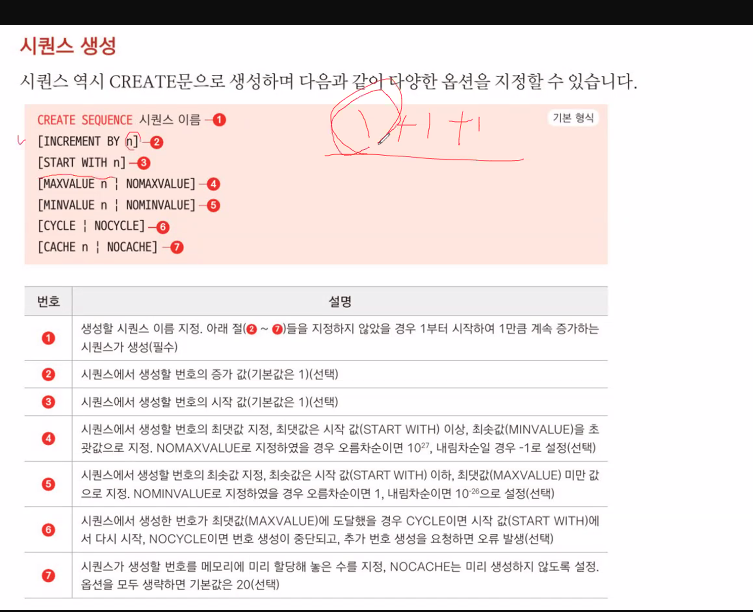

  ```SQL
  -- 시퀀스 생성 예시
  CREATE SEQUENCE SEQ_DEPT_SEQUENCE
    INCREMENT BY 10
    START WITH 10
    MAXVALUE 90
    MINVALUE 0
    NOCYCLE
    CACHE 2;
  -- 사용자 시퀀스 조회
  SELECT * FROM USER_SEQUENCES;
  -- LAST_NUMBER에 있는 값이 마지막 값.
  -- 시퀀스의 현재 값을 확인하는 CURRVAL
  SELECT SEQ_DEPT_SEQUENCE.CURRVAL
  FROM DUAL;
  -- 값을 증가시키면서 세팅하는 NEXTVAL
  INSERT INTO DEPT_SEQ (DEPTNO, DNAME, LOC)
    VALUES(SEQ_DEPT_SEQUENCE.NEXTVAL, 'DATABASE', 'SEOUL');
    -- 시퀀스 수정
  ALTER SEQUENCE SEQ_DEPT_SEQUENCE
    INCREMENT BY 50
    MAXVALUE 99
    NOCYCLE;
    -- 시퀀스 삭제
  DROP SEQUENCE SEQ_DEPT_SEQUENCE;
    
  ```

  > ALTER 명령어로 시퀀스를 수정할 수 있지만, START WITH 옵션은 수정할 수 없음.  

  단지 연속하는 새로운 번호를 만드는 일이라면, MAX 함수에 1을 더한 값을 사용해도 상관 없음.  
  ```SQL
  SELECT MAX(글 번호) + 1
    FROM 게시판 테이블
  ```
  이 방식은 웹 서비스의 게시판 번호, 상품 주문 번호를 생성할 때 종종 사용하는 방식임.  
  그러나 이 방식은 SELECT라서 LOCK이 걸리지 않아 같은 번호가 생성될 수도 있고,  
  숫자가 높아질 수록 과부하가 걸릴 확률이 높아짐.  

### 동의어(SYNONYM)  
객체 이름 대신 사용할 수 있는 다른 이름을 부여하는 객체.  
주로 테이블 이름이 너무 길 때 사용함.  
ALIAS는 일회성.  
```SQL
-- 기본형
CREATE [PUBLIC] SYNONYM 동의어 이름
FOR[사용자.][객체 이름];

-- 예시
CREATE SYNONYM E FOR EMP;
```
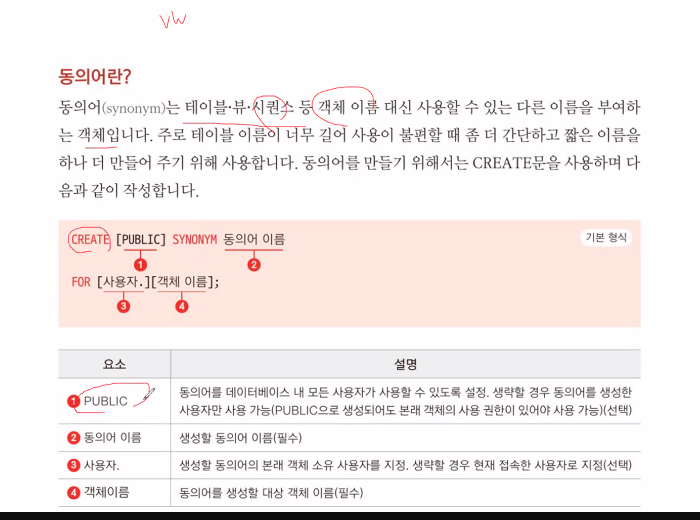  

```
시퀀스, public 시퀀스 생성 권한을 부여하는 cmd 명령어

grant CREATE SYNONYM to scott;
grant CREATE PUBLIC SYNONYM to scott;
```

# Constraints(제약 조건)  
```
제약 조건은 어떤 테이블에 저장할 데이터 특성을 정의하는 데 사용하는 특수한 규칙을 뜻합니다.  
오라클 데이터베이스에서 사용할 수 있는 제약 조건은 다섯 가지가 있는데요.  
지정한 열에 NULL 값을 제외한 값의 중복이 불가능한 UNIQUE, NULL을 허용하지 않는 NOT NULL,  
다른 테이블의 열을 참조하는 FOREIGN KEY, NULL값과 데이터의 중복을 모두 허용하지 않는 PRIMARY KEY가 있습니다.  
```
테이블에 저장할 데이터를 제약하는 특수한 규칙.  
DDL로 설정할 수 있음.  
제약 조건도 하나의 객체임.  

- 오라클 데이터베이스 제약 조건 종류  
  - `NOT NULL` : 지정한 열에 NULL을 허용하지 않음. 중복 허용.  
  - `UNIQUE` : 지정한 열에 중복을 허용하지 않음. NULL은 중복에서 제외.  
  - `PRIMARY KEY` : UNIQUE, NOT NULL을 모두 사용. 테이블에 하나만 지정 가능. 해당 열에 자동으로 인덱스가 생성됨.  
  - `FOREIGN KEY` : 다른 테이블의 열을 참조하여 존재하는 값만 입력할 수 있음.   
  - `CHECK` : 설정한 조건식을 만족하는 데이터만 입력 가능.  
  - `DEFAULT` : 값을 지정하지 않은 경우에 설정할 기본값을 지정할 수 있음.  

  > 참고 : PK, FK 모두 후보키이기 때문에, 중복, NULL을 허용할 수 없음.  
  테이블 생성 시, 열 타입 뒤에 적어주면 해당 제약 조건이 적용됨.  
  ```SQL
  -- 테이블을 생성하면서 제약조건 지정
  create table table_notnull(
    login_id varchar2(20) not null,
    login_pwd varchar2(20) not null,
    tel varchar2(20)
  );
  -- 제약조건 이름도 지정
  create table table_notnull2(
    login_id varchar2(20) CONSTRAINT TBLNN2_LGNID_NN not null,
    login_pwd varchar2(20) CONSTRAINT TBLNN2_LGNPW_NN not null,
    tel varchar2(20)
  );
  -- OUTOFLINE 방식. 제약조건 지정을 마지막에 몰아서 쓰거나, 열 생성 후 제약조건을 따로 추가.
  CREATE TABLE TABLE_NAME(
    COL1 VARCHAR2(20),
    COL2 VARCHAR2(20),
    COL3 VARCHAR2(20),
    PRIMARY KEY (COL1),
    CONSTRAINT CONSTRAINT_NAME UNIQUE(COL2)
  );

  -- 기존에 있는 테이블에 제약조건을 추가
  ALTER TABLE TABLE_NOTNULL
    MODIFY(TEL NOT NULL);
  -- 제약조건 이름도 지정
  ALTER TABLE TABLE_NOTNULL
    MODIFY(TEL CONSTRAINT TBLNN_TEL_NN NOT NULL);

  -- 제약 조건 이름 변경. 테이블을 지정한 뒤에 제약조건 이름을 변경함.
  ALTER TABLE TABLE_NOTNULL2
    RENAME CONSTRAINT TBLNN_TEL_NN TO TBLNN2_TEL_NN;
  -- 제약 조건 삭제. 테이블을 지정한 뒤에 제약조건을 삭제함.
  ALTER TABLE TABLE_NOTNULL2
    DROP CONSTRAINT TBLNN2_TEL_NN;
  ```
  > 제약 조건을 변경할 때, 이미 존재하는 데이터가 변경하려는 제약조건에 맞지 않으면 변경할 수 없음.  
  또한 ALTER로 테이블을 지정한 뒤에, 제약 조건을 변경해야 함.  

  #### FOREIGN KEY 제약조건 설정  
  ```SQL
  -- 테이블 생성하면서 FOREIGN KEY 제약조건 설정
  CREATE TABLE TABLE_NAME(
  ...
  row_name row_type CONSTRAINT constraint_name REFERENCES TABLE_NAME(ROW_NAME)
  );
  -- FOREIGN KEY라고 지정하지 않고, REFERENCE 키워드 + 연결할 테이블명(연결할 열명)로 연결함.

  -- 아웃라인에서 FOREIGN KEY 지정
  ALTER TABLE TABLE_NAME
    ADD CONSTRAINT constraint_name FOREIGN KEY (row_name) 
    REFERENCES TABLE_NAME(ROW_NAME);
  ```
  외래키 특징 :  
  자식 레코드가 있으면, 해당 열을 삭제할 수 없음.  
  외래키 열이 생성되지 않은 상태라면, 데이터를 삽입할 수 없음.  
  ```SQL
  -- 열 데이터를 삭제할 때, 이 데이터를 참조하는 데이터를 NULL로 수정
  CONSTRAINT [제약 조건 이름] REFERENCES 참조 테이블(참조할 열) ON DELETE SET NULL;
  -- 열 데이터를 삭제할 때, 이 데이터를 참조하는 데이터를 모두 삭제
  CONSTRAINT [제약 조건 이름] REFERENCES 참조 테이블(참조할 열) ON UPDATE CASCADE;
  ```
  #### CHECK 제약 조건 설정  
  ```SQL
  CREATE TABLE TABLE_CHECK(
    ...
    row_name row_type CONSTRAINT constraint_name CHECK (조건)
  );

  --- 3글자 이상인 값만 들어갈 수 있게 제한한 예시.

  CREATE TABLE TABLE_CHECK(
    LOGIN_PWD VARCHAR2(20) CONSTRAINT TBLCK_LOGINPW_CK CHECK (LENGTH(LOGIN_PWD)>3)
  );
  ```
  #### DEFAULT 제약 조건  
  값을 지정하지 않았을 때, 기본으로 들어갈 값을 지정할 수 있음.  
  ```SQL
  row_name row_type DEFAULT 기본값;

  -- LOGIN_PWD에 기본값으로 1234를 지정하는 예시.

  CREATE TABLE TABLE_DEFAULT (
    LOGIN_ID VARCHAR(20) CONSTRAINT TBLCK2_LOGINID_PK PRIMARY KEY,
    LOGIN_PWD VARCHAR2(20) DEFAULT '1234',
    TEL VARCHAR2(20)
  );
  ```
  #### 제약조건 비활성화, 활성화  
  테스트할 때 제약 조건을 끄고 킬 수 있음.  
  활성화 할 때는 ENABLE절을, 비활성화 할 때는 DISABLE 절을 사용.  
  ```SQL
  ALTER TABLE 테이블 이름
  DISABLE [NOVALIDATE/VALIDATE(선택)] CONSTRAINT 제약조건이름;

  ALTER TABLE 테이블 이름
  ENABLE [NOVALIDATE/VALIDATE(선택)] CONSTRAINT 제약조건이름;
  ```

  ```SQL
  -- 사용자 제약 조건 조회
  SELECT * FROM USER_CONSTRAINTS;
  ```
  - 조회 시 나오는 데이터 종류  
    - OWNER : 제약 조건 소유 계정  
    - CONSTRAINT_NAME : 제약 조건 이름 (정하지 않을 시, 오라클이 자동으로 지정)  
    - CONSTRAINT_TYPE : 제약 조건 종류(앞글자를 따옴. NOT NULL은 C로, FOREIGN KEY는 R로 표시됨.)  
    - TABLE_NAME : 제약 조건을 지정한 테이블 이름  

- `데이터 무결성`이란?  
  `Data Integrity`  
  데이터의 정확성과 일관성을 보장한다는 의미.  
  이를 위해 항상 유지해야 하는 기본 규칙을 갖고 있음.  
  제약 조건은 이러한 데이터 무결성을 지키기 위한 안전장치로서 중요한 역할을 함.  
  그리고 데이터의 삽입, 수정, 삭제 등 모든 과정에서 지켜져야 함.  
  - 데이터 무결성 종류  
    - `영역 무결성` : 열에 저장되는 값의 적정 여부를 확인. (형석, NULL 여부)  
    - `개체 무결성` : 데이터를 유일하게 식별할 수 있는 기본키는, 반드시 값을 갖고 있어야 하고, NULL 불가, 중복될 수 없음을 규정    
    - `참조 무결성` : 참조 테이블의 외래키 값은 참조 테이블의 기본키로서 존재해야 하며, NULL이 가능.  

# 권한 조작  

```SQL
-- 권한 조작 기본 형식
GRANT [시스템 권한] TO [사용자 이름|롤(ROLE)이름|PUBLIC]
[WITH ADMIN OPTION](선택);
```
// 테이블로 변경하셈  
`시스템 권한` : 시스템 권한 지정. ,(쉼표)로 구분하여 권한 이름을 여러 개 적으면 한 번에 부여 가능.  
`사용자 이름|롤 이름|PUBLIC` : 권한을 부여하려는 대상을 지정. 사용자 이름을 지정 OR 롤을 지정 OR (PUBLIC)모든 사용자에게 권한을 부여. 마찬가지로 쉼표로 구분하여 여러 사용자,ROLE에 부여 가능.  
`WITH ADMIN OPTION` : 현재 GRANT문을 통해 부여받은 권한을 다른 사용자에게 부여할 수 있는 권한도 함께 부여받음. 현재 사용자가 권한이 사라져도, 권한을 재부여한 다른 사용자의 권한은 유지됨. (대상에게 ADMIN 권한을 함께 주는 것.)  

- 시스템 권한 분류      // 테이블로 변경하셈  
  - USER(사용자)  
    - CREATE USER : 사용자 생성 권한  
    - ALTER USER : 생성된 사용자의 정보 수정 권한  
    - DROP USER : 생성된 사용자의 삭제 권한  
  - SESSION(접속)  
    - CREATE SESSION : 데이터베이스 접속 권한  
    - ALTER SESSION : 데이터베이스 접속 상태에서 환경 값 변경 권한  
  - TABLE(테이블)  
    - CREATE TABLE : 자신의 테이블 생성 권한  
    - CREATE ANY TABLE : 임의의 스키마 소유 테이블 생성 권한  
    - ALTER ANY TABLE : 임의의 스키마 소유 테이블 수정 권한  
    - DROP ANY TABLE : 임의의 스키마 소유 테이블 삭제 권한  
    - INSERT ANY TABLE : 임의의 스키마 소유 테이블 데이터 삽입 권한  
    - UPDATE ANY TABLE : 임의의 스키마 소유 테이블 데이터 변경 권한  
    - DELETE ANY TABLE : 임의의 스키마 소유 테이블 데이터 삭제 권한  
    - SELECT ANY TABLE : 임의의 스키마 소유 테이블 데이터 조회 권한  
  - INDEX(인덱스)  
    - CREATE ANY INDEX : 임의의 스키마 소유 테이블의 인덱스 생성 권한  
    - ALTER ANY INDEX : 임의의 스키마 소유 테이블의 인덱스 수정 권한  
    - DROP ANY INDEX : 임의의 스키마 소유 테이블의 인덱스 삭제 권한  
  ... 이 외에도 VIEW, SEQUENCE, SYNOSYM, PROFILE(사용자 접속 조건 지정 등), ROLE(권한을 묶은 그룹과 관련된 권한) 등 권한 부여 가능.  


SYSTEM 계정으로 유저 생성 및 비밀번호 지정 예시  
```SQL
-- 유저 생성
-- PW는 IDENTIFIED BY 로 지정
CREATE USER PREV_HW IDENTIFIED BY ORCL;
-- 세션 접속 권한 부여
GRANT CREATE SESSION TO PREV_HW;
--GRANT CONNECT TO PREV_HW; 

-- 접속
CONN PREV_HW/ORCL;
```


SCOTT 계정으로 테이블 관련 권한 변경 예시  
```SQL
-- 테이블 조회 권한 부여 GRANT TO
-- 사용자 명은 여러 개 지정 가능하지만, 테이블은 각각 지정해줘야함.
GRANT SELECT ON EMP TO PREV_HW;
GRANT SELECT ON DEPT TO PREV_HW;
GRANT SELECT ON SALGRADE TO PREV_HW;

-- 테이블 조회 권한 박탈 REVOKE FROM
REVOKE SELECT ON SALGRADE FROM PREV_HW;
```

# PL/SQL  
ORACLE을 포함한 기존 SQL만으로는, 복잡한 RDBMS를 다루기 힘듦.  
이를 보완한 것이 PL/SQL.  

# PL/SQL의 구조  
## 블록  
데이터베이스 관련 특정 장업을 수행하는 명령어, 실행에 필요한 여러 요소를 정의하는 명령어 등을 모아둔 것.  
명령어 종류 : 
```SQL
DECLARE  
실행에 필요한 여러 요소 선언 (변수 선언)  
BEGIN  
작업을 위해 실제 실행하는 명령어  
EXCEPTION  
PL/SQL 수행 도중 발생하는 오류 처리  
END;  
```
> DECLARE, EXCEPTION은 생략 가능.  

- PL/SQL문 작성 문법  
  1. 블록을 구성하는 DECLARE, BEGIN, EXCEPTION 키워드에는 세미콜론을 적지 않음.  
  2. 블록의 각 부분에서 실행해야 하는 문장 끝에는 세미콜론을 적음.  
  3. 한 줄 주석`(--)`과 여러 줄 주석`(/**/)` 사용 가능.  
  4. 작성을 마치고 실행하기 위해 마지막에 슬래시 `/` 를 적음.  
  > 토드 같은 응용 프로그램에서는 슬래시를 적지 않아도 실행 가능.  

#### PL/SQL 구문 예시  
```SQL
-- SQL DEVELOPER를 쓸 때 사용하는 구문. 실행 결과를 화면에 출력하는 옵션 설정.
SET SERVEROUTPUT ON;

DECLARE
-- TABLE 열 지정할 때와 동일함.
V_EMPNO NUMBER(4) := 7788; -- INT V_EMPNO = 7788;
V_TAX CONSTANT NUMBER(1) := 3;
V_DEPTNO NUMBER(2) NOT NULL DEFAULT 10;
V_ENAME VARCHAR2(10);
BEGIN
    V_ENAME := 'SCOTT';
--    V_TAX := 4; 상수라서 값 변경 불가
    V_DEPTNO := NULL;
    DBMS_OUTPUT.PUT_LINE('V_ENAME : ' || V_ENAME);
    DBMS_OUTPUT.PUT_LINE('V_TAX : ' || V_TAX);
    DBMS_OUTPUT.PUT_LINE('V_DEPTNO : ' || V_DEPTNO);
END;
/
-- /가 들어가야 완전한 문장.
```

### 스칼라형(SCALAR TYPE) 변수  
숫자 문자열 날짜 등과 같이 오라클에서 기본으로 정의해 놓은 자료형.  
추가로 BOOLEAN 값에 TRUE, FALSE, NULL이 존재함.  

### 참조형 변수  
특정 테이블 열의 자료형이나, 하나의 행 구조를 참조하는 자료형.  
열을 참조할 때는 `%TYPE`, 행을 참조할 때는 `%ROWTYPE`을 사용.  
`%TYPE`으로 선언한 변수는 지정한 테이블 열과 완전히 같은 자료형이 됨.  
`%ROWTYPE`으로 선언한 변수는 지정한 테이블 행의 구조를 모두 가져옴.  

> 행 : 가로 ROW.  
열 : 세로 COLUMN.  

#### 참조형 변수 선언 기본형
```SQL
변수이름 테이블이름.열이름%TYPE;
var_name table_name.row_name%type;
```
//////////////////  
```sql
SET SERVEROUTPUT ON;
DECLARE 
    -- DEPTNO 열의 형식을 가져옴 
    V_DEPTNO DEPT.DEPTNO%TYPE;
    -- DEPT의 행 형식을 가져옴
    V_DEPT_ROW DEPT%ROWTYPE;
BEGIN
--    V_DEPTNO := 50;
--    DBMS_OUTPUT.PUT_LINE('V_DEPTNO : ' || V_DEPTNO);
    SELECT DEPTNO, DNAME, LOC INTO V_DEPT_ROW
        FROM DEPT WHERE DEPTNO=40;
    DBMS_OUTPUT.PUT_LINE('DEPTNO : ' || V_DEPT_ROW.DEPTNO);
    DBMS_OUTPUT.PUT_LINE('DNAME : ' || V_DEPT_ROW.DNAME);
    DBMS_OUTPUT.PUT_LINE('LOC : ' || V_DEPT_ROW.LOC);
END;
/

SELECT * FROM DEPT;
```
/////////////////////  
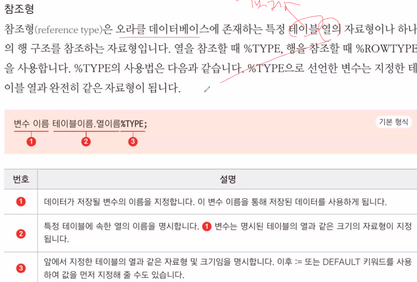  

### 복합형, LOB형  
복합형 : 여러 종류, 개수의 데이터를 저장하기 위해 직접 정의하는 자료형.  
컬렉션형과 레코드형으로 구분됨.  
컬렉션(TABLE) : 한 가지 자료형의 데이터를 여러 개 저장(테이블의 열과 유사)  
레코드(RECORD) : 여러 종류 자료형의 데이터를 저장(테이블의 행과 유사)  
LOB형(LARGE OBJECT) : 대용량 데이터를 저장하기 위해 씀. 웹/앱 개발자는 자주 사용하지 않음.  

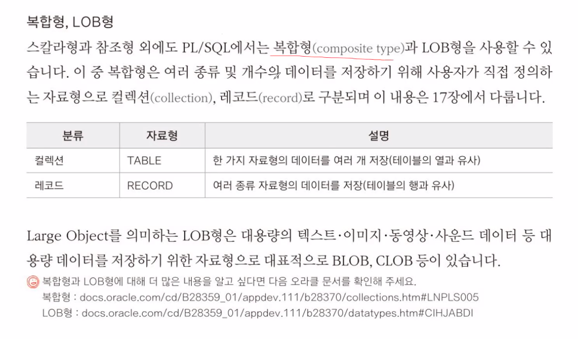  

## 조건문  

### IF 조건문  
IF문에 중괄호 대신 시작에 THEN과, 끝에 END IF가 들어가는 것 말고는 자바 IF문과 똑같음.  
종류
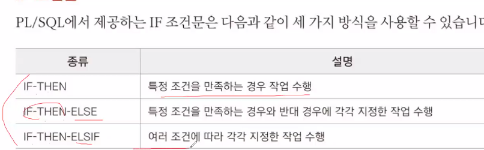  

IF-THEN  
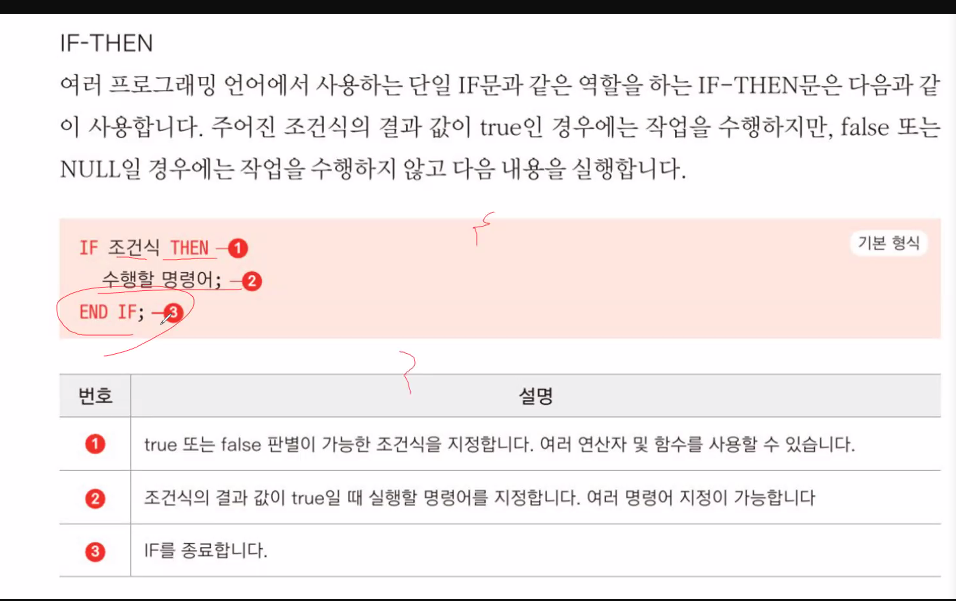  

IF-THEN-ELSE  
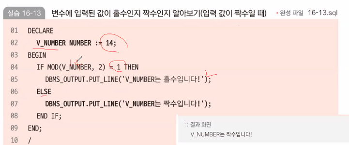  

IF-THEN-ELSIF  
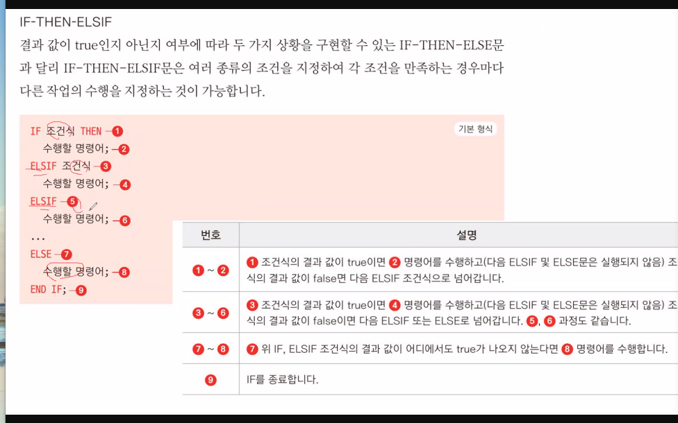  

### CASE 조건문  

종류  
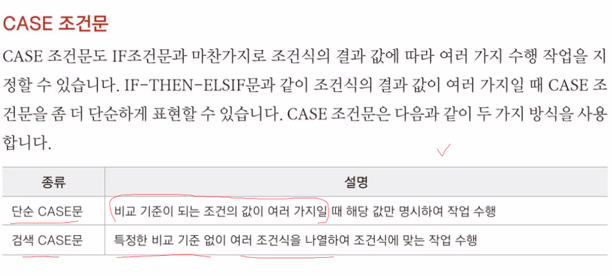  

단순 CASE  
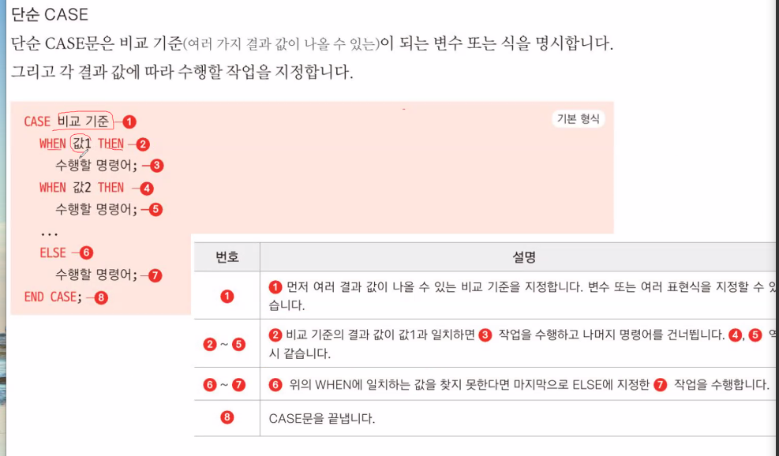  
아래와 같음  
```JAVA
SWITCH(비교기준):  
  CASE 값1:
  CASE 값2:
  DEFAULT:
```

단순 CASE 예시  
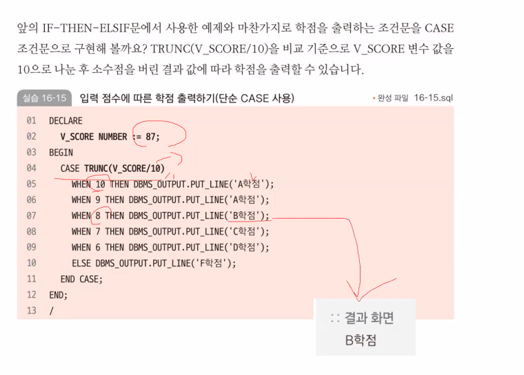  

검색 CASE  
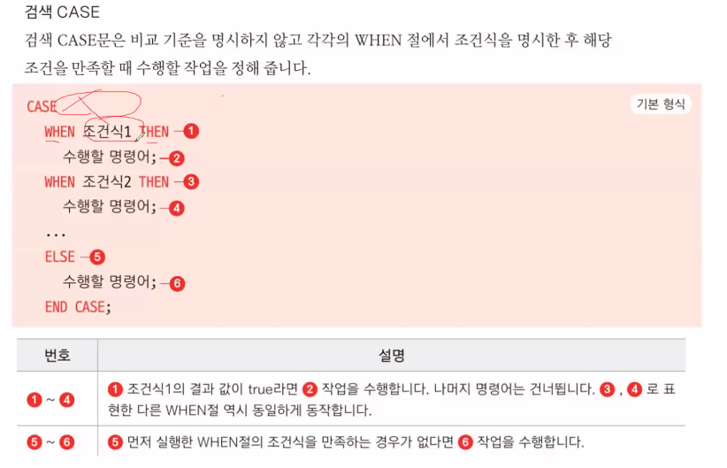  

검색 CASE 예시  
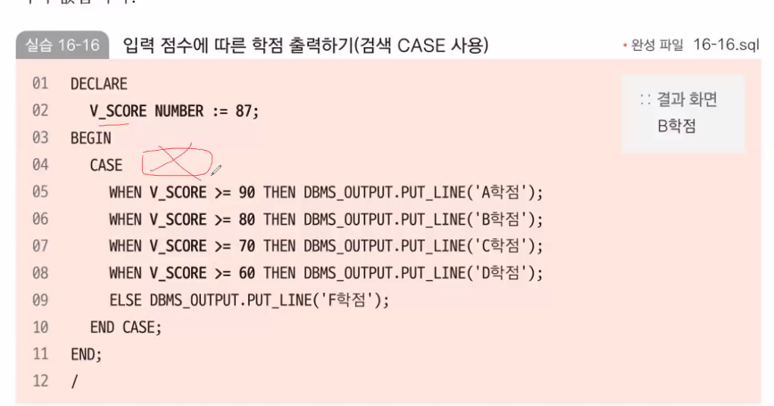  
IF문과 비슷하지만 IF문보다 간단하게 쓸 수 있어 편리함  

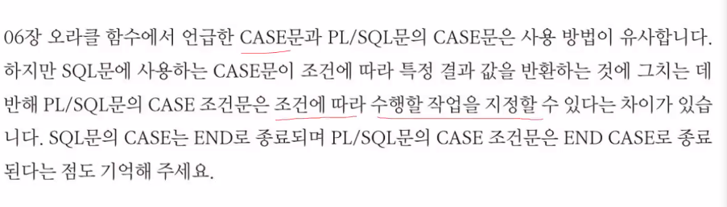  

## 반복문  
종류  
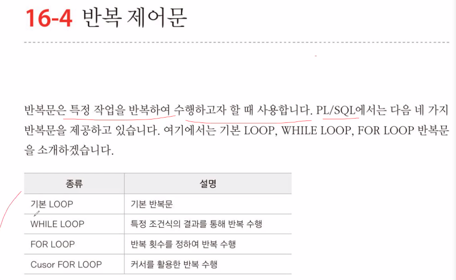  

중단 명령어  
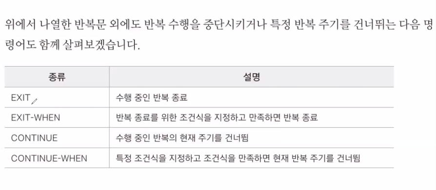  
EXIT = BREAK  
EXIT-WHEN = IF() BREAK  


기본 LOOP문  
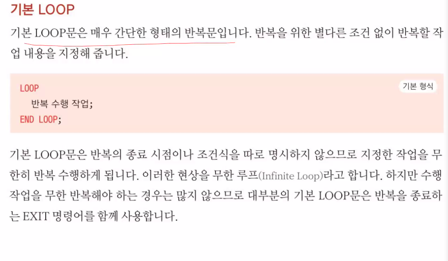  
중단 명령어가 없으면 무한 루프  

WHILE LOOP문  
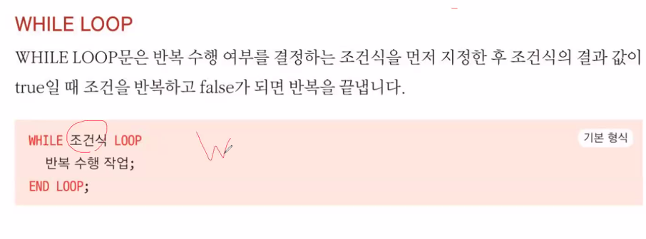  

WHILE LOOP문 예시  
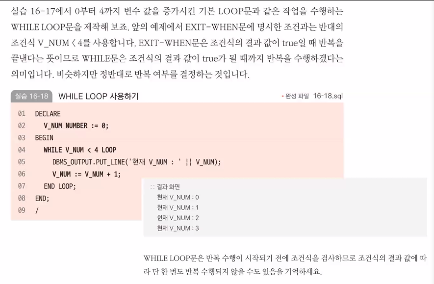  

FOR LOOP  
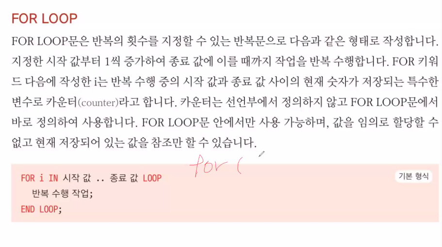  
FOR문과 형식이 약간 다름.  


FOR LOOP 예시  
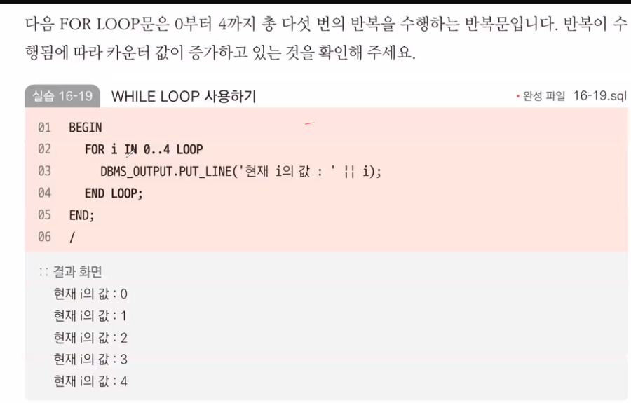  

FOR LOOP REVERSE  
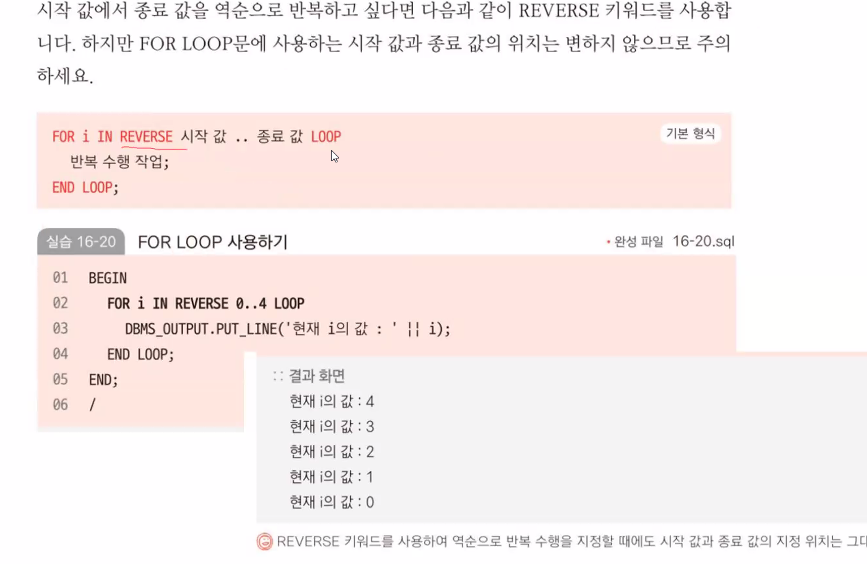  

FOR LOOP + CONTINUE  
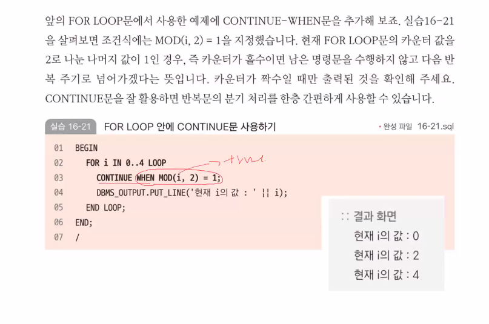  

## 레코드
자료형이 각기 다른 데이터를 저장하는 변수(행)  
행 데이터를 다루는 용도로 사용함.  

선언 예시  
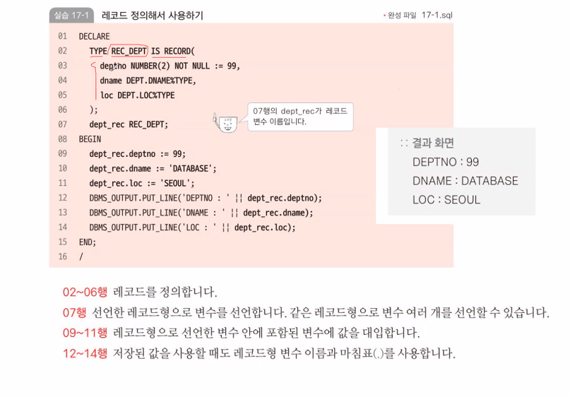  

INSERT INTO로 레코드 변수를 삽입하는 예시  
  

UPDATE에도 사용 가능.  
  

레코드를 포함하는 레코드  
  
조인을 한 것 같은 효과가 나타남.  


## 컬렉션  
한 자료형의 데이터를 여러 개 저장하는 복합 자료형  
열 또는 테이블과 같은 형태로 사용할 수 있음.  

종류  
  

연관 배열  
  

연관 배열 예시  
  
키는 인덱스 번호로 접근함  
index by pls_integer 이게 인덱스 선언하는 부분
text_arr(1) 이게 인덱스  

### 컬렉션 메서드  
  

메서드 종류  
  

정리
```
오라클에서는 여러 가지 데이터를 하나의 자료형으로 지정하고 사용하기 위해 직접 정의하는 복합 자료형을 제공합니다.  
레코드형은 여러 종류의 자료형을 하나의 변수에 저장할 때 사용합니다.  
컬렉션형은 특정 자료형의 데이터 여러 개를 하나의 변수에 저장할 때 사용합니다.  
```

//////////////// 여기까지는 대충 알아도 됨  

## 커서  
  

select into는 이거였음  
  

```sql
-- select into
set serveroutput on;
declare 
    v_dept_row dept%rowtype;
begin
    select deptno, dname, loc into v_dept_row
        from dept
    where deptno = 40;  -- v_dept_row에 하나의 행만 들어가기 때문에, where절이 필수임. 
    dbms_output.put_line('deptno : ' || v_dept_row.deptno);
    dbms_output.put_line('dname : ' || v_dept_row.dname);
    dbms_output.put_line('loc : ' || v_dept_row.loc);
end;
/
```
이런 경우에, 명시적 커서로 해결할 수 있음.  

명시적 커서 사용법  
  

명시적 커서 문법  
  

명시적 커서를 이용하여 여러 행 데이터를 가져오는 예시  
```SQL
set serveroutput on;
declare 
    v_dept_row dept%rowtype;
    -- 커서 선언
    cursor c1 is
        select deptno, dname, loc from dept;
begin
    -- 커서 열기
    open c1;
        /* 커서 c1을 사용하여 dept로부터 한 행씩 fetch한 뒤, v_dept_row에 삽입하면서
         행 데이터들을 출력하는 loop*/
        LOOP
            fetch c1 into v_dept_row;
            exit when c1%NOTFOUND;  
            
            DBMS_OUTPUT.PUT_LINE('deptno : ' || v_dept_row.deptno ||
                                ', dname : ' || v_dept_row.dname ||
                                ', loc   : ' || v_dept_row.loc);
        end loop;
    close c1;
end;
/
```
결과 :  
  

!! exit when의 속성들  
  

  
  
  
  
  
  
  

  
  
  

## 저장 서브프로그램  

  
  
  
  

저장 프로시저는 만들어 놓고 외부 프로그램에서 호출하여 자주 사용.  
저장 함수는 SQL 내에서 사용.  
실행할 때마다 컴파일하는게 아니라서, 속도가 빠름.  
다른 프로그램에서도 호출할 수 있음.  

### 프로시저  
특정 처리 작업을 수행하는 데 사용하는 저장 서브 프로그램.  
프로시저 역시 객체임.  

파라미터가 없는 프로시저  
  

파라미터가 없는 프로시저 생성 및 실행 예시
```sql
-- 프로시저 생성
create procedure pro_noparam
is
    v_empno number(4) := 7788;
    v_ename varchar2(10);
begin
    v_ename := 'SCOTT';
    DBMS_OUTPUT.PUT_LINE('v_empno : ' || v_empno);
    DBMS_OUTPUT.PUT_LINE('v_ename : ' || v_ename);
end;
/

-- 프로시저 실행
execute pro_noparam;
```

파라미터를 사용하는 프로시저  
  

#### 파라미터를 사용하는 프로시저 생성 및 실행 예시
```SQL
create procedure pro_param_in
    (
        param1 in number, 
        param2 number, 
        param3 number :=3, 
        param4 number default 4
    )
is
begin
    DBMS_OUTPUT.PUT_LINE(PARAM1);
    DBMS_OUTPUT.PUT_LINE(PARAM2);
    DBMS_OUTPUT.PUT_LINE(PARAM3);
    DBMS_OUTPUT.PUT_LINE(PARAM4);
END;
/
execute pro_param_in(1,2);
execute pro_param_in(1,2,35,64);
```
만약 위 sql문에서 param2에 default값이 있다면, execute로 인수를 넘겨줄 때 갯수와 순서를 맞춰서 넘겨줘야 함.  
그러나 default는 건들지 않고 넣고 싶다면  
```sql
execute pro_param_in(param1=>10, param3=>30);
```
이렇게 변수 명을 직접 지정하면 됨.  

---

변수 선언할 때, 타입으로 in | out을 넣을 수 있음.  
이 둘을 넣을 때의 차이점은?  
in은 프로시져를 호출할 때 값을 입력받고,  
out은 호출할 때 값을 반환함.  

#### out 파라미터를 사용하는 프로시저 생성 및 실행 예시  
```sql
create or replace procedure pro_param_out
(
    in_empno in emp.empno%type, -- in_empno in number(4), 와 같지만 전자가 유지보수에 용이함.
    out_ename out emp.ename%type,
    out_sal out emp.sal%type
)
is
begin
    -- ename이 out_ename에, sal이 out_sal에 치환됨
    select ename, sal into out_ename, out_sal
    from emp
    where empno = in_empno;
end;
/
-- pro_param_out 파라미터의 반환값을 변수에 저장하여 출력하는 익명 블록
declare
    v_ename emp.ename%type;
    v_sal emp.sal%type;
begin
    pro_param_out(7788, v_ename, v_sal);
    DBMS_OUTPUT.PUT_LINE(v_ename);
    DBMS_OUTPUT.PUT_LINE(v_sal);
end;
/
```

--- 

IN, OUT 속성을 모두 사용할 수도 있음.  

#### INOUT 파라미터를 사용하는 프로시저 생성 및 실행 예시  
```sql
-- 입력받은 값에 2를 곱하여 내보내는 프로시저
create or replace procedure pro_param_inout
(
    inout_no IN OUT number
)
is
begin
    inout_no := inout_no * 2;
end;
/
-- pro_param_inout 프로시저를, 인수 5를 넣어 호출하는 익명 블록
declare 
    num number;
begin
    num := 5;
    pro_param_inout(num);
    DBMS_OUTPUT.PUT_LINE(num);
end;
/
```
정리하자면 프로시저의 특징은 return이 없지만, 그 대신에 out 파라미터를 통해 결과를 반환할 수 있음.  
SQL문에서 직접 사용할 순 없고, 외부 프로그램에서 호출하여 사용함.  

### 함수  
프로시저와 달리 SQL문에서도 사용할 수 있음.  
SQL의 함수(MAX, SUM)과 비슷함.  
PL/SQL의 함수와 다른 점은.  

#### 프로시저와 함수의 차이점  
  

#### 함수 생성  
  

함수에서도 IN,OUT 모드를 사용할 순 있지만, 그렇게 되면 SQL에서 사용할 수 없게 됨.  
그래서 IN,OUT 모드를 사용하지 않음.  
  

#### 함수 생성 및 실행 예시  
sal을 인수로 받아 tax%만큼 떼서 반환하는 함수.  
세금 계산 함수.  
execute로 실행할 수 있는데, 주로 SQL문에서 사용함.  

```sql
create or replace function func_aftertax
(
    sal number
)
return number
is 
    tax number := 0.05;
begin
    return (round(sal-(sal*tax)));
end func_aftertax;
/
-- PL/SQL문에서 사용
declare
    aftertax number;
begin
    aftertax := func_aftertax(3000);
    DBMS_OUTPUT.PUT_LINE(aftertax);
end;
/
-- SQL문에서 사용
select func_aftertax(3000)
from dual;
--
select empno, ename, sal, func_aftertax(sal) as aftertax
from emp;

-- 함수 삭제
drop function func_aftertax;
```

DATE형식 데이터를 받아 날짜 형식을 바꾸는 함수 예시2  
```SQL
CREATE OR REPLACE FUNCTION FUNC_DATE_KOR
(
    HIREDATE DATE
)
RETURN CHAR
IS
BEGIN
                -- YY/MM/DD -> CHAR YYYY년MM월DD일
    RETURN TO_CHAR(HIREDATE,'YYYY"년"MM"월"DD"일"');
END;
/
SELECT ENAME, FUNC_DATE_KOR(HIREDATE) AS HIREDATE
FROM EMP
WHERE EMPNO = 7369;

```

---

### 패키지  
연관성 있는 여러 서브프로그램들을 하나로 묶는 것.  
  

패키지의 장점  
  

#### 패키지 명세  
선언부라고 생각하면 됨.  
  

패키지 명세 작성(패키지 생성)  
  

USER_SOURCE 데이터 사전으로 조회 가능  

#### 패키지 본문  
  

  

#### 서브 프로그램 오버로드  
  
예시  
  
자바 메서드 오버로드와 똑같음.  
  

#### 패키지 사용  
  
사용 예시  
  

#### 패키지 삭제  
패키지의 명세, 본문을 한 번에 삭제할 수도 있고,  
패키지의 본문만 따로 삭제할 수도 있음.  
  

---

### 트리거(!!중요함!!)  
이벤트가 발생할 경우에 자동으로 실행되는 기능을 정의하는 서브프로그램.  

#### 주로 사용되는 경우  
  
  
DML, DDL, 데이터베이스 동작에 설정하는 트랩이라고 할 수 있음.  

#### 트리거 종류  
  
이 중에서 DML 트리거가 가장 많이 사용됨.  

#### DML 트리거  
형식  
  

BEFORE DML 트리거 예시  
```SQL
CREATE TABLE EMP_TRG AS SELECT * FROM EMP;
-- EMP_TRG에 INSERT,UPDATE,DELETE가 일어나기 전에 트리거가 발동
CREATE OR REPLACE TRIGGER TRG_EMP_NODML_WEEKEND
BEFORE
INSERT OR UPDATE OR DELETE ON EMP_TRG
-- 현재 날짜가 토,일일 경우, 에러를 발생시켜 명령 수행 취소
BEGIN
    IF TO_CHAR(SYSDATE, 'DY') IN ('토','일') THEN
        IF INSERTING THEN
            RAISE_APPLICATION_ERROR(-20000,'주말 사원정보 추가 불가');
        ELSIF UPDATING THEN
            RAISE_APPLICATION_ERROR(-20000,'주말 사원정보 변경 불가');
        ELSIF DELETING THEN
            RAISE_APPLICATION_ERROR(-20000,'주말 사원정보 삭제 불가');
        ELSE
            RAISE_APPLICATION_ERROR(-20000,'주말 사원정보 접근 불가');
        END IF;
    END IF;
END;
/
```

AFTER DML 트리거 예시  
```SQL
CREATE TABLE EMP_TRG_LOG    -- 테이블 접근 로그 정보를 담을 테이블
(
    TABLENAME VARCHAR2(10), -- DML이 수행된 테이블 이름
    DML_TYPE VARCHAR2(10),  -- DML 명령어 종류
    EMPNO NUMBER(4),        -- DML의 대상이 된 사원의 번호
    USER_NAME VARCHAR2(30), -- DML을 수행한 사용자의 이름
    CHANGE_DATE DATE        -- DML이 수행된 날짜
);

CREATE OR REPLACE TRIGGER TRG_EMP_LOG
AFTER
INSERT OR UPDATE OR DELETE ON EMP_TRG   -- EMP_TRG에 INSERT, UPDATE, DELETE를 수행할 때마다 트리거 발동
FOR EACH ROW                            -- DML 명령어의 대상이 되는 행마다 트리거가 각각 작동
BEGIN
    IF INSERTING THEN
        INSERT INTO EMP_TRG_LOG
        VALUES ('EMP_TRG', 'INSERT',:NEW.EMPNO, SYS_CONTEXT('USERENV','SESSION_USER'),SYSDATE);
    ELSIF UPDATING THEN
        INSERT INTO EMP_TRG_LOG
        VALUES ('EMP_TRG', 'UPDATE',:OLD.EMPNO, SYS_CONTEXT('USERENV','SESSION_USER'),SYSDATE);
    ELSIF DELETING THEN
        INSERT INTO EMP_TRG_LOG
        VALUES ('EMP_TRG', 'DELETE',:OLD.EMPNO, SYS_CONTEXT('USERENV','SESSION_USER'),SYSDATE);
    END IF;
END;
/

SELECT SYS_CONTEXT('USERENV','SESSION_USER') FROM DUAL; -- 접속한 사용자명을 출력하는 구문
```

```SQL
-- 트리거 이름을 특정하여 트리거를 활성 | 비활성화
ALTER TRIGGER TRG_EMP_LOG ENABLE | DISABLE;
-- 테이블 이름을 특정하여 해당 테이블에 적용된 모든 트리거들을 활성 | 비활성화 
ALTER TABLE EMP_TRG ENABLE | DISABLE ALL TRIGGERS;
```

