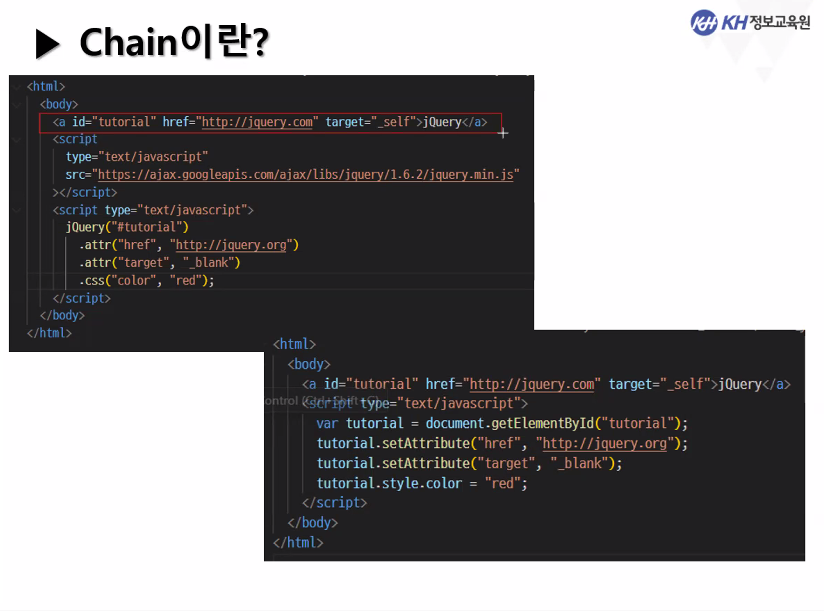

# jQuery  
Javascript의 라이브러리 중 하나.  
DOM과 관련된 처리, 일관된 이벤트 연결, 시각적 효과, Ajax app을 쉽게 구현할 수 있음.  
그 외에도 플러그인을 통해 차트 작성, 슬라이드쇼, 엑셀 등을 구현할 수 있음.  

그러나 유지보수가 힘들다는 단점 때문에 요즘은 잘 사용하지 않는 추세.  

## 연결 방법  
CDN(Content Delivery Network)을 통한 연결  
(온라인으로 js 파일을 불러옴)  
<a href="https://developers.google.com/speed/libraries?hl=ko">Google Hosted Libraries</a>
```javascript
<script src="https://ajax.googleapis.com/ajax/libs/jquery/3.7.1/jquery.min.js"></script>
```
#### 참고 : min.js는 자바스크립트 코드를 경량화한 것. 변수명도 줄이고, 공백도 모두 제거한 버전  

또는  

공식 홈에서 파일을 다운로드해서 연결  
https://jquery.com/  

## 시작 코드  
jQuery를 사용하는 웹 페이지의 시작 코드.  
$ 또는 `jQuery`를 사용함. <= 이를 `Wrapper`라고 부름.  
window.load 속성과 같은 개념의 메서드로, 페이지 내용 로드 후 ready 메서드가 실행됨.  

```javascript
<script>
    $(document).ready(function(){});
    또는
    $(function(){});
</script>
```

```
$('h1').css('color','red');
// 선택자.메소드명.(속성,속성값);
```
선택자 종류는 아래 페이지들을 참조.  
https://www.w3schools.com/jquery//jquery_selectors.asp  
https://api.jquery.com/category/selectors/  


### javascript 기본 문법과 jQuery 비교1   
```javascript
// javascript
$('.welcome').html('hello world').css('background-color', 'red');

// jQuery
const div = document.querySelector('.welcome');
div.innerText = 'hello world';
div.setAttribute('style','background-color:red');
```

### javascript 기본 문법과 jQuery 비교 2  

```javascript
    // javascript
    <script type="text/javascript">
      function addEvent(target, eventType, eventHandler, useCapture) {
        if (target.addEventListener) {
          // W3C DOM
          target.addEventListener(
            eventType,
            eventHandler,
            useCapture ? useCapture : false
          );
        } else if (target.attachEvent) {
          // IE DOM
          var r = target.attachEvent("on" + eventType, eventHandler);
        }
      }

      function clickHandler(event) {
        var nav = document.getElementById("navigation");
        for (var i = 0; i < nav.childNodes.length; i++) {
          var child = nav.childNodes[i];
          if (child.nodeType == 3) continue;
          child.className = "";
        }
        event.target.className = "selected";
      }

      addEvent(window, "load", function (eventObj) {
        var nav = document.getElementById("navigation");
        for (var i = 0; i < nav.childNodes.length; i++) {
          var child = nav.childNodes[i];
          if (child.nodeType == 3) continue;
          addEvent(child, "click", clickHandler);
        }
      });
    </script>

    // jQuery
    <script src="https://ajax.googleapis.com/ajax/libs/jquery/3.7.1/jquery.min.js"></script>
    <script>
      $(document).ready(function(){
        $("#navigation li").on("click",function(){
          $("#navigation li").removeClass("selected");
          $(this).addClass("selected");
        })
      }); 
    </script>

```

## Wrapper  

```javascript
<script type="text/javascript">
(function($){
    ...
})(jQuery)
</script>
```
즉시 실행 함수 형태로 만든 뒤,  
`$`를 함수의 지역변수로 선언해서 `외부 라이브러리의 $`와의 충돌을 예방함.  

#### 즉시 실행 함수가 뭐더라?  
선언과 동시에 매개변수를 넘겨주면서 즉시 실행되는 함수
```
(function b(str) {console.log(str);})("hi");
```

## 선택자  
Wrapper에 전달될 수 있는 요소. 선택자를 통하여 제어하려는 객체를 빠르고 정확하게 지정할 수 있음.  

[selector 예제](<jQuery 연습/selector.html>)  

## Chain  
jQuery는 아래와 같이 선택자 하나에, 여러 메서드들을 연달아 사용할 수 있음.  

  


## Event  
jQuery 메서드를 통해 이벤트 설치, 제거, 호출할 수 있음.  

bind : 이벤트를 설치  
unbind :  이벤트를 제거  
trigger : 이벤트를 호출  

사용 예시  
```javascript
// 이벤트 설치
$("click_me").bind("click",clickHandler);
// 이벤트 제거
$("remove_event").bind("click",()=>{$("click_me").unbind("click, clickHandler");});
// 이벤트 호출
$("trigger_event").bind("click",()=>{$("click_me").trigger("click");});
```

## manipulation 요소 제어 메서드들  

append : 요소의 자식으로 추가  
```javascript
$("p").append("<string>Hello</strong>");  
```

after : 요소의 형제로 추가  
```javascript
$("p").after("<string>Hello</strong>");  
```

before : 요소의 앞에 추가  
```javascript
$("p").before("<string>Hello</strong>");  
```

이 외에도 text, html, appendto, prepend 등이 있음.  

remove : 해당 요소들을 모두 제거  
```javascript
$("button").click(()=> $("p").remove());  
```

다시 요소 추가  
```javascript
$("button").click(()=>$("button").before("<p>Hello</p>").after("<p>you</p>"));  
```

replaceAll : 문서 상 존재하는 특정 태그를 바꿈.  
```javascript
$("<b>Paragraph. </b>").replaceAll("p");  
// p 태그들을 모두 <b>Paragraph. </b>로 바꿈.  
```

toggleClass : 요소에 class 속성을 추가함.  
```javascript
$("p").click((e)=> $(e.target).toggleClass("highlight"));
```

keyup과 val을 이용해 키보드 입력시 input 태그 내 값들을 p 요소에 추가하는 예시  
```javascript
$("input").keyup( (e) => {
    let value = $(e.target).val();
    $("p").text(value);
});
```

## form 관련 메서드  

input 태그에 focus시 span 태그로 "focus"를 출력,  
blur 시 "blur" 출력,  
글자 선택 시 "select" 출력,  
글자 변경 후 blur 시 change!! 입력값 을 알림창으로 출력하는 예시  

```javascript
$("input").focus((e)=> $(e.target).next("span").html("focus"))
    .blur((e)=> $(e.target).next("span").html("blur"))
    .change((e)=> alert("change!!"+ $(e.target).val()))
    .select((e)=> $(e.target).next("span").html("select"));
```

[transversing 연습페이지](<jQuery 연습/transversing.html>)  
  


## 애니메이션  
요소에 간단한 메서드로 애니메이션 기능을 추가할 수 있음.  

.fadeIn .fadeOut .show .hide .slideUp .slideDown 등이 있음.  
속성으로 slow, fast 등을 넣을 수 있음.  
delay(숫자)로 애니메이션 간 딜레이를 줄 수 있음  