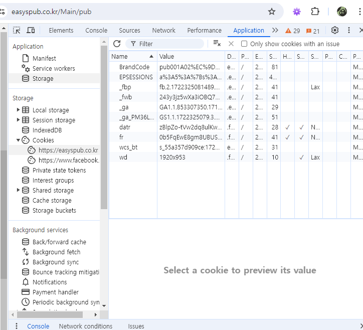
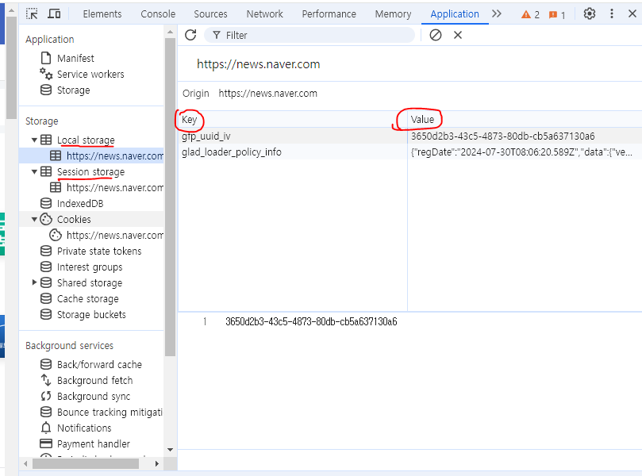

# 되짚어보기  

비동기 통신이란 작업 순서를 임의로 정할 수 있다는 것...  
동기 통신은 무조건 요청이 들어온 순서대로 처리하는 것  

Promise 방식을 더 먼저 배우긴 했는데
자바스크립트에서 비동기 통신을 할 땐 Promise보단 fetch를 더 많이 씀  

---

다시 스레드가 뭐임?  
HDD 내 프로그램을 실행 -> 메모리에 `프로세스`로 들어감(같은 프로그램도 각각의 프로세스로 존재)  
이 때 `프로세스` 내부에 존재하는 작업을 실행하는 단위  

다시 말하지만 자바스크립트는 `싱글 스레드`임.  

그래서 비동기 통신처럼 쓰려면, `콜백 함수`를 사용해야 함.  
함수를 매개변수로 받는 함수를 만들 때, 받는 함수를 콜백 함수라 함.  

---

근데 이게 너무 복잡해서 ES6부터 `Promise`라는게 등장했음  
프로미스 객체는 성공했을 때 실행할 함수(resolve), 실패했을 때(reject) 실행할 함수를 매개변수로 받아 지정하고, 생성부분과 소비부분으로 나뉜다고 했음.  

> 생성부분 키워드 : `new`, `resolve`, `reject`  
실행부분 키워드 : `then`, `catch`, `finally`  

> 프로미스의 3가지 상태 : pending, fulfilled, rejected  

> .then을 실행하면 Promise를 반환함. 즉 본인을 반환함.  
이를 통해 체인 then을 쓸 수 있음.  

```javascript
A.then(B).then(C)
```

# fetch API  

서버에 자료를 요청하거나 자료를 받아올 때 사용하는 API.  
XMLHttpRequest를 대신함.  
fetch는 Promise를 반환함.  

```javascript
fetch(위치,옵션)
// 위치 : url || 파일 이름
// 옵션 : 요청 방식(Default : GET)
```

XMLHttpRequest와 fetch api를 통한 json 객체 가져오기 비교  
```javascript
const xhr = new XMLHttpRequest();
xhr.open("GET","student-2.json");
xhr.send();
const students = JSON.parse(xhr.responseText);

const st = fetch("student-2.json").then(response=>response.json());
```

예시 2
```javascript
        //XMLHttpRequest
        const xhr = new XMLHttpRequest();
        xhr.open("GET","/student-2.json");
        xhr.send();

        xhr.onreadystatechange = function() {
            if(xhr.readyState == 4 && xhr.status == 200) {
                const students = JSON.parse(xhr.responseText);
                (function(contents){
                    let output="";
                    for(let content of contents) {
                        output += `
                            <h2>${content.name}</h2>
                            <ul>
                                <li>전공 : ${content.major}</li>
                                <li>학년 : ${content.grade}</li>
                            </ul>
                            <hr>
                        `;
                    }
                    document.querySelector("#result").innerHTML = output;
                }(students));
                }
            }
        
        //fetch
        
        fetch('/student-2.json')
            .then((response)=>response.json())
            .then((json)=>{
                let output="";
                    json.forEach(content=>{
                        output += `
                            <h2>${content.name}</h2>
                            <ul>
                                <li>전공 : ${content.major}</li>
                                <li>학년 : ${content.grade}</li>
                            </ul>
                            <hr>
                        `;
                    });
                document.querySelector("#result").innerHTML = output;
            })
            .catch(error=> console.log(error));
```

하지만 이 또한 체이닝으로 계속 연결하기 때문에 콜백 지옥에 빠질 수 있음.  
이를 해결하기 위해 async 함수와 await 예약어가 등장했음.  

# async 함수  

```javascript
async function() {...}
```
단순히 함수 앞에 async 키워드를 붙이면 됨.  
함수 실행 후 Promise 객체를 반환함.  
함수들 앞에 await를 붙이면 이전 함수가 실행되기 전까지 기다렸다가 끝나면 실행됨.  
팁 : fetch도 Promise 객체를 반환하기 때문에, await를 붙일 수 있음.  

async와 await 예시  

```javascript
// ----- Promise 사용 -------
function whatsYourFavorite() {
  let fav = "Javascript";
  return new Promise((resolve, reject) => resolve(fav));      
}

function displaySubject(subject) {
  return new Promise((resolve, reject) => resolve(`Hello, ${subject}`));      
}

whatsYourFavorite()
.then(displaySubject)  // .then(response => displaySubject(response))
.then (console.log);   // .then (result => console.log(result));

// ------- async 사용 -------

async function whatsYourFavorite() {
  let fav = "Javascript";
  return fav;
}

async function displaySubject(subject) {
  return `Hello, ${subject}`;
}

whatsYourFavorite()
.then(displaySubject)
.then(console.log);

// 이러면 Promise를 그냥 간단하게 쓴건데 이럴거면 왜 씀?
// 그래서 await를 같이 씀

async function whatsYourFavorite() {
  let fav = "Javascript";
  return fav;
}

async function displaySubject(subject) {
  return `Hello, ${subject}`;
}

async function init(){
  const response = await whatsYourFavorite();
  const result = await displaySubject(response);
  console.log(result);
}

init();

// 만약, whatsYourFavorite이 걸리는 시간이 3초고, displaySubject가 걸리는 시간이 2초라면,
// 자동으로 displaySubject가 먼저 실행되겠지만,
// async, await를 통해 작동 순서를 임의로 정할 수 있음.

// 내부적으론 Promise를 사용하는 거랑 똑같은데 좀 더 간편하게 사용할 수 있음.
```

# API  
Application Programming Interface  

애플리케이션을 만들 때 프로그램 간 쉽게 정보를 주고 받을 수 있도록 도와주는 인터페이스  

# 쿠키  
사용자가 웹 사이트에 접속한 동안 사용자 컴퓨터에 저장되는 텍스트 파일.  
쿠키 내 저장된 사용자 정보를 통해 사이트를 간편하게 사용할 수 있게 됨.  
(이전에 했던 행동, 임시 데이터 등)  

각 도메인당 50개까지, 파일 최대 크기는 4kbyte.  
복잡한 데이터는 저장 불가.  

  

쿠키는 클라이언트 PC에 저장되고,  
클라이언트는 요청 헤더의 쿠키 부분에 담아 서버에 요청함.  
서버는 이를 확인하여 응답.  
서버 측의 부담을 줄일 수 있는 한 가지 방법.  

# 웹 스토리지  
쿠키처럼 웹 사이트 관련 정보를 저장하는 것은 똑같음.  
그러나 웹 스토리지는 (사용자가 임의로 서버로 전송하지 않는 이상) 서버에서 사용자의 스토리지 정보를 읽어갈 수 없음.  
도메인당 2~10MB의 데이터를 저장할 수 있음.  

웹 스토리지는 `세션 스토리지` 와`로컬 스토리지`로 나뉘고, 둘 다 타입이 Storage 객체로 나와있음.  

  

Storage 객체에는 여러가지 메서드들이 들어있음.  
https://developer.mozilla.org/ko/docs/Web/API/Storage  

그래서 스토리지 값 변경하면 뭘 할 수 있는데?  
따로 DB를 사용하지 않고도 사용자의 임시 정보를 저장해둘 수 있음.  
[예제](연습/js/todo-result.js)  

