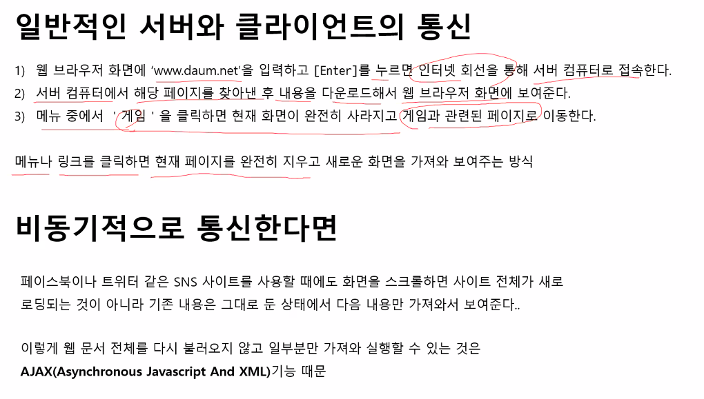

## 템플릿 리터럴  
기존에는 문자열, 변수를 출력하려면 ",'를 활용해 번거롭게 작성해야 했음.  
```javascript
const name = "이름"; 
const classroom = 201;
document.write("<h1>"+name+"님, "+classroom+"호 강의실로 입장하세요<h1>");
```
템플릿 리터럴을 이용하면 좀 더 쉽게 작성할 수 있음.  
```javascript
document.write(`<h1>${name}님 , ${classroom}호 강의실로 입장하세요<h1/>`);
```
템플릿 리터럴을 작성할 때는 문자열 전체를 백틱 backtick (`)으로 감싸주고, 변수는 ${}로 감싸줌.  

또한 기존 형식으로 작성할 때, 줄바꿈을 하면 문자열 형식이 적용이 안 됐는데  
템플릿 리터럴로 작성할 때는 줄바꿈을 해도 문자열 형식이 적용 됨.  

```javascript
// 기존 형식
console.log("asdfg
            asdfg");

// 템플릿 리터럴
console.log(`asdfg
            asdfg`);
```

배열을 넣으면 요소들이 한 줄로 출력됨.  

```javascript
items=['pen','pencil','ink','shovel'];
console.log(`items : ${items} `);
// => items : pen,pencil,ink,shovel
```

---

## truthy와 falsy  
true와 false라는 명확한 값 외에 참과 거짓을 판별하는 방법.  
truthy는 true로 인정할 수 있는 값,  
falsy는 false로 인정할 수 있는 값.  
falsy값을 제외한 모든 값은 truthy임.  

falsy값 :  
- 0  
- ""  
- NaN   
- undefined : 변수를 선언하기만 하고 값을 할당하지 않았을 때의 초기값. 값이면서 자료형.  
- null : 유효하지 않는 값. null 역시 값이면서 자료형.  

javascript에서 보통 undefined값은 사용자가 실수로 값을 할당하지 않을 경우에 생기고,  
null값은 직접 넣음.  


---

## 심볼  
ES6에 새롭게 추가된 원시 유형의 자료형  
심볼은 한 번 정의하면 값을 변경할 수 없고, 유일한 값을 가짐. 또한 객체 프로퍼티의 키로 사용할 수 있음.  
또한 심벌을 사용해 프로퍼티를 정의하면, 심볼 키에 접근할 수 없고 정보가 드러나지 않음.  

javascript 오픈 소스를 사용하거나, 다른 팀원이 만든 객체들을 함께 사용할 경우, 객체의 키 이름이 중복될 수 있는데  
심볼을 사용하여 프로퍼티를 지정하면 충돌을 피할 수 있음.  

심볼을 만들 때는 Symbol() 함수 사용.  
```javascript
    const | let | var v_name = Symbol();

    // 객체 프로퍼티로 심볼 지정
    let id = Symbol();
    const member = 
    {
        name : "Kim",
        [id] : 12345
    }

    // 객체 심볼 프로퍼티 호출
    member[id]
    
    // 심볼 프로퍼티 추가
    let grade = Symbol("grade");
    member[grade] = "VIP";
    member[grade]   // => "VIP"
```

``` javascript
    // forIn문을 사용하면, 심볼 프로퍼티는 반환되지 않음.
    const id = Symbol("id");
    const tel = Symbol("telephone number");
    const member = {
        name : "Kim",
        age : 25,
        [id] : 1235,
        [tel] : function () {
            alert(prompt("전화번호 : "));
        }
    }

    for(item in member) {
        console.log(`${item} : ${member[item]}`);
    }
    // name : Kim
    // age : 25
```

  

### 전역 심벌  
여러 군데에서 사용할 수 있는 심벌.  
전역 심벌에 접근하려면 아래 메서드를 사용해야 함.  

#### Symbol.for() 메서드  
키를 인수로 받고 전역 심벌 레지스트리를 뒤져서 키에 해당하는 심벌을 찾음.  
레지스트리에 키에 맞는 심벌이 있으면 해당 심벌을 반환하고, 그렇지 않으면 새로운 심벌을 만들어서 반환함.  

```javascript
Symbol.for(키)
// 키에 해당하는 심볼을 반환.

let tel = Symbol.for("tel") // 심벌 생성
let phone = Symbol.for("tel") // tel에 대한 심벌이 이미 있으므로 
tel === phone // true
```

#### Symbol.keyFor() 메서드  
심벌값을 인수로 받아서 전역 심벌 레지스트리를 뒤져서 심벌값의 키를 찾음.  
```javascript
Symbol.keyFor(심벌값)

let tel = Symbol.for("tel");
let phone = Symbol.for("tel");
tel === phone // true
Symbol.keyFor(phone)    // "tel"
```


---

## 자료형  
javascript에서는 자동으로 형변환됨.  
```javascript
num = 20;
num = "John";
num // => "John"
```
그런데 자동 형변환이 일관성 없이 일어남.  
```javascript
// 문자 + 숫자 = 문자  
"20" + 10 = "2010"  

//문자 - 숫자 = 숫자  
"20" - 10 = 10  

Number(true)
=> 1
Number(false)
=> 0
Number(null)
=> 0
Number(undefined)
=> NaN
```
또한 prompt로 입력받은 값들은 string으로 들어옴.  
때문에 자료형을 명시하는 것이 좋음.  

- parseInt() : 정수형으로 변환하는 함수 
- parseFloat() : 실수형으로 변환하는 함수  
(꼼수 : prompt 앞에 '+'를 앞에 붙이면 숫자로 변환됨. 근데 가끔 작동이 안 될 때가 있음.)  
- toString() : null과 undefined 형을 제외한 데이터형을 문자열로 변환. 매개변수로 2, 8, 16 등을 넣으면 2진수, 8진수, 16진수로 변환.  
    (String()로도 가능.)  
- Boolean() : 논리형으로 변환하는 함수  
    0, 빈 문자열, undefined는 false.  
    나머지는 true.  

---

## 반복문  
`forEach` : 배열에 사용되는 함수. 반복문과 같은 효과를 냄.  
`forIn` : 객체에만 사용되는 반복문 (key 안에(in) value)  
`forOf` : 반복가능한 객체에 사용하는 반복문  


### forEach()문  
> 배열에 사용하는 함수  
배열의 크기(length)가 정해져 있지 않을 경우에 사용함.  
for문보다 더 자주 사용함.  

```
배열명.forEach(콜백 함수){...}
```

배열 요소 값 표시 예시  

```javascript
const students = ["Park","Kim","Lee","Kang"];
students.forEach(function(student)){
    document.write(`${student}. `)
});
// students 배열에 있는 각 요소를 student라 하고, student 표시
// 화살표 함수로 간단히 표현
students.forEach(student => document.write(`${student}. `));
```
객체 출력은 forEach를 사용할 수 없음.  


### forIn문  
> 객체 전용 반복문.  
객체의 key와 value에 접근할 때 사용함.  
```javascript
for (변수 in 객체) {
    ...
    // 변수는 key를,
    // 객체[변수]는 value를 가져옴. 
}
```
``` javascript
const book = {
    title : "git",
    pubDate : "2099-01-01",
    pages : 272,
    finished : true
}

for ( key in book ) // key는 변수
    {
        document.write(`${key} : ${book[key]}<br>`);
        // key와 value를 출력
    }

const jelly = 
{
    name : "Jellycious",
    flavor : "Lemon",
    fromWho : "좌측 신사분",
    isGood : true
};

for(k in jelly)
    {
        document.write(`${k} : ${jelly[k]}<br>`);
    };
    
```

### forOf문  
> 배열 말고도, iterable한 객체에도 사용 가능한 반복문.  

```javascript
const students = ["Park","Kim","Lee","Kang"];
for(s of students)
    {
        document.write(`<br>${s}`);
    }
```

객체에 사용할 수 없는 이유 : 반복 가능한 데이터 내에는 .next()라는 메서드가 있는데,  
반복하면서 이를 호출하기 때문에 .next()가 없는 `객체`는 반복될 수 없음.  

반대로 forIn을 반복 가능한 데이터에 사용한다면, 값이 나오는게 아니라 인덱스 번호가 반환됨.  
배열[변수] 형태로 출력하면 값이 출력되긴 하지만, 이럴 바엔 forEach나 forOf를 사용할듯.  


## 콜백 함수  
> 직접적으로 호출하지 않고, 간접적으로 호출하는 함수를 콜백 함수라고 함.  

```javascript
const btn = document.querySelector("button");
btn.addEventListener("click", ()=>{
    alert("클릭했습니다");
});
```
여기서 화살표 함수도 콜백 함수.  

보통 사용하는 방식은, 함수를 통해 다른 함수를 부르는 건데  
A 함수에 B 함수를 매개변수로 받아 호출한다면, A 함수 내에 함수를 콜백 함수라고 함.  

```javascript
    document.querySelector("button").addEventListener("click",runner);

    function runner() { getData(writeData) }
    function showData(name,age){
        alert(`안녕하세요? ${name}님, 나이가 ${age}이십니다.`);
    }
    function writeData(name, age){
        document.write(`<p>${name}님, 나이가 ${age}이십니다.</p>`);
    }
    function getData(callBack){ // 매개변수로 함수를 전달받아서 간접적으로 실행
        const userName = prompt("이름을 입력하세요");
        const userAge = prompt("나이를 입력하세요");
        callBack(userName,userAge); // 콜백함수
    }
```

자바스크립트의 함수는 다음과 같은 조건들을 만족함  
- 변수에 할당될 수 있어야 함.  
- 다른 함수의 인자로 활용할 수 있어야 함.  
- 다른 함수에서 반환값으로 반환될 수 있어야 함.  
이런 특징으로 자바스크립트의 함수를 1급 시민(first-class citizen) 이라고 부름.  

대부분 이런 형식으로 코드를 짜기 때문에, 구조를 이해하는 것이 중요함.  

## spread 연산자 (전개 구문)  

배열 앞에 `...`을 써서 요소들을 한 줄에 모두 반환.  

```javascript
fruits=['apple','banana','grape'];
console.log(...fruits)
// => apple banana grape
```

삽입할 때 유용하게 쓰임.  
concat 메서드보다 편함.  

```javascript
items1 = [1,2,3]
items2 = [4,5,6]

newItems = items1+items2;
// newItems => '1,2,34,5,6' 

newItems = [items1,items2];
// newItems => [Array(3),Array(3)]

newItems = items1.concat(items2);
// newItems => [1,2,3,4,5,6]

newItems = [...items1, ...items2];
// newItems => [1,2,3,4,5,6]
```

매개변수 개수가 정해져 있는 함수를 사용할 때, 더 많은 매개변수를 전달 받으면 자바스크립트는 에러가 나지 않고  
정해진 개수만큼만 연산해서 반환함.  

이 때, 매개변수로 spread 연산자를 넣으면 매개변수 개수가 따로 정해지지 않음.  

```javascript
function addNumber(int a, int b){
    let sum = 0;
    sum = a + b;
    return sum;
};

addNumber(1,3,5,7);     
// => 4    매개변수 2개만 적용 됨

function addNum(...numbers) {
    let sum = 0;
    for(let number of numbers) {sum += number};
    return sum;
}

addNum(1,3,5,7);
// => 16
```
길이가 정해져 있지 않은 배열 중 특정 부분을 사용해야 할 때는, first 같은 키워드를 사용할 수 있음.  

```javascript 
function displayFavorites(first, ...favs){
    let str = '';
    favs.forEach(f=>str+=`${f}, `);
    str += `중에서 제가 제일 좋아하는 과일은 ${first}입니다.`
    console.log(str);
}

displayFavorites('복숭아','사과','포도','수박');
// => 사과, 포도, 수박, 중에서 제가 제일 좋아하는 과일은 복숭아입니다.

function getAverage(first, ...scores) {
    let avg = 0;
    scores.forEach(score=>{avg += score});
    avg /= scores.length;
    console.log(`${first}의 평균 점수는 ${avg}입니다.`);
}
getAverage('철수',100,80,100);
// => 철수의 평균 점수는 93.33333333333333입니다.

function showScores(first, ...scores){
    console.log(`${first}의 점수들은 각각 ${scores} 입니다.`);
}
showScores('영희', 100, 80, 90, 100);
// => 영희의 점수들은 각각 100,80,90,100 입니다.

```

---

## 타이머 함수  
특정 시간이 되었을 때, 또는 특정 시간 동안 반복해서 실행하는 함수  

### setInterval()  
일정 시간마다 반복하는 함수.  
시간은 밀리초 단위.  

반복 중지 구문을 정하지 않으면, 페이지 이동, 브라우저 종료, 새로고침하기 전까지 무한 반복  

```javascript
setInterval(콜백함수, 시간)

function greeting() {console.log("안녕하세요");}
setInterval(greeting, 2000);
```

### clearInterval()  
타이머 함수를 멈추는 함수  

```javascript
clearInterval(함수);

const timer = setInterval(()=>console.log("ㅎㅇ"),2000);
clearInterval(timer);

// 5번 출력 후 멈춤
let time = 0;
const interHi = setInterval(()=>{
    console.log("안녕하세요");
    time++;
    if (time===5) clearInterval(interHi);
},1000);
```

### setTimeout()  
정해진 시간 뒤에 딱 한 번 실행하는 함수.  
```javascript
setTimeout(함수, 시간)

setTimeout(()=>console.log("안녕하세요"),3000);
// 3초 뒤에 한 번 실행
```

## 이벤트 전파  
이벤트가 발생했을 때, 해당 요소에서만 이벤트가 처리되는 것이 아니라, 해당 요소를 감싸고 있는  
부모 요소, 그리고 그 요소의 부모 요소에서도 똑같이 이벤트가 처리되는데 이걸 `이벤트 전파`라고 함.  

이벤트 리스너를 사용할 때 전파 방식을 지정할 수 있음.  


```
요소.addEventListener(이벤트,함수,캡처 여부);
```

캡처 여부: 이벤트를 캡처할지 여부를 지정. (기본값 = false)  
  true = 캡처링, false = 버블링

`이벤트 버블링` : DOM의 자식 노드에서 부모 노드로 전달. (아래에서 위로)  
`이벤트 캡처링` : DOM의 부모 노드에서 자식 노드로 전달. (위에서 아래로)  

### 이벤트 버블링  
  
이벤트가 발생한 요소에서부터 부모 요소로, 다시 그 요소의 부모 요소로 이벤트가 전달됨.  
모든 브라우저에서 대부분의 이벤트는 버블링 됨.  
[버블링 예제](연습/html/bubbling.html)  

즉 하위 요소 이벤트 발생 시, (동일한 이벤트 리스너가 있는) 상위 요소 이벤트들도 모두 발동되기 때문에 유의해야 함.  

이 때, event.target은 실제 이벤트가 일어난 객체이고,  
event.currenttarget은 이벤트를 처리하는 객체를 반환함.  
[버블링 target 예제](연습/html/propagation.html)  

### 이벤트 캡처링  
  
버블링의 반대.  
부모 요소로부터, 이벤트가 발생한 자식 요소로 이벤트가 전달됨.  

## 객체  
jsp에서 객체는 관련된 정보와 동작을 함께 모아 놓은 것  

- 내장 객체  
    - 문서 객체 모델  
    - 브라우조 객체 모델  
- 사용자 정의 객체  

### 프로퍼티  

javascript에서 객체는 key,value로 구성된 property로 이루어져있음.  
```javascript
const book =
    {
        title : '깃허브 입문',
        pubDate : '2099-12-06',
        pages : 272,
        finished : true
    }
book.title // => '깃허브 입문'
book['title']; // => '깃허브 입문'
```
javascript의 객체에 이미 있는 키에 값을 부여하면 값이 변경되고,  
없는 키와 값을 대입하면 자동으로 추가됨.  

jsp에서 <span style="text-decoration:underline">객체 메서드는 value로 존재할 수 있음.</span>  
그러나 key에는 문자열, 숫자, 심볼만 들어갈 수 있음.  

```javascript  
let book = {
    title : "이름",
    pages : 360,
    buy : function() {
        console.log("이 책을 구입했습니다.");
    }
}

// ES6 
let book = {
    title : "이름",
    pages : 360,
    buy () {
        console.log("이 책을 구입했습니다.");
    }
}
```

객체의 키 값에 접근할 때, 일반적으로 `.` 표기법을 사용하지만, 대괄호`[]`를 사용할 수도 있음.  

```javascript
const book = {
    title : "JS",
    pages : 330,
    done : false
}
book.title  // => "JS"
book[title] // => "JS"
```

메서드에서 객체 속성값을 사용하고 싶을 때, this 키워드를 사용할 수 있음.  

```javascript
const book = {
    title : "JS",
    pages : 330,
    done : false,
    finish() {
        this.done === false ? console.log("읽는 중") : console.log("다 읽음");
    }
}
```

객체의 프로퍼티로 산술식, 함수를 사용할 수도 있음.  

---

### 객체 복사  
자바에서 변수, 참조 변수 복사 같이 `원시 유형 자료 복사`와 `객체 복사`가 있음.  

- 원시 유형 자료 복사는 `값`을 복사함.  
복사한 자료의 값을 변경해도 원래 자료의 값은 그대로임.  

- 객체 복사는 `주소`를 복사함.  
복사한 자료의 값을 변경하면 원래 자료의 값도 변경됨.  

---

### 생성자 함수  
자바에서 클래스 생성자와 같음.  

일반적인 함수와 같은 형식  
함수 이름의 첫 글자는 대문자로 작성.  
함수 내부에서 this를 사용함.  

```javascript
function 함수명(매개변수) {
    this.키1 : 값1,
    this.키2 : 값2,
    ...
    this.메서드1 : function() {...},
    this.메서드2 : function() {...},
    ...
}
// 또는
const 함수명(매개변수) = function () {
    ...
}
```

```javascript
// 생성자 함수
function Book(title, pages, done=false){
    this.title = title;
    this.pages = pages;
    this.done = done;
    this.finish = function() {
        let str = "";
        this.done = false ? str = "읽는중" : str = "다읽음";
        return str;
    }
}
// new 키워드로 객체 생성
const book1 = new Book("웹 표준의 정석", 340);
const book2 = new Book("점프 투 파이썬", 500, true);

// book1의 finish 메서드 사용
console.log(`${book1.title} - ${book1.pages}쪽 - ${book1.finish()}`);
```

객체의 프로퍼티값을 단축해서 표현할 수도 있음.  
아래는 객체를 만들어내는 생성자 함수 예시.  

```javascript
function makeUser(name, age){
    return{
        name : name,
        age : age
    }
}
//  ▼
function makeUser(name, age){
    return{
        name,
        age
    }
}
```

---

### 클래스를 통한 객체 생성  
jsp에서 클래스는, 정확한 클래스 개념이 아니라 생성자 함수를 좀 더 표현하기 쉽게 바꾼,  
syntactic sugar이다.  

위의 생성자 함수를 보기 쉽게 바꾼 것 뿐, 기능은 똑같다.  

```javascript
class Book{
    constructor(title, pages, done){
        this.title = title;
        this.pages = pages;
        this.done = done;
    }
    finish(){
        let str = "";
        this.done === false ? str = "읽는중" : str = "다읽음";
        return str;
    }
}

// 클래스 생성자로 객체 생성
const book1 = new Book("자바자바", 600);
```

---

### 프로토타입  
자바스크립트 객체에서 프로토타입은, 객체를 만들어 내는 원형.  
모든 객체는 프로토타입을 가지고 있고, 프로토타입으로부터 프로퍼티와 메서드를 상속받는다.  
(객체의 원형) 부모와는 다른 개념임.  

  
  
[[Prototype]] 속성 : 객체가 어디서부터 온 것인지 알려주는 속성  
arr은 프로토타입 Array로부터 온 객체.  

사용자 정의 객체의 prototype은 Object.  

  

`객체.__proto__`, `클래스.prototype`를 통해 프로토타입을 확인할 수 있음.  

프로토타입을 활용하면  
생성자 함수와 함수를 나눠서, 함수를 나중에 추가할 수 있음.

```javascript
// 생성자만 생성
function newBook(title,pages,done){
    this.title = title;
    this.pages = pages;
    this.done = done;
}

// 함수 나중에 추가
newBook.prototype.finish = function() {
    this.done === false ? str = "읽는중" : str = "다읽음";
    return str;
}
```

---

#### 상속

프로토타입을 통해 상속과 같은 효과를 낼 수 있음.  
단, setPrototypeOf(자식.prototype, 부모.prototype)으로 연결해줘야 함.  


```javascript
// Book 생성자
function Book(title,price){
    this.title = title;
    this.price = price;
}
// Book 메서드 추가
Book.prototype.buy = function() {
    console.log(`${this.title}을 ${this.price}원에 구매했습니다.`);
}

// Textbook 생성자
function Textbook(title, price, major) {
    Book.call(this, title, price);  // super(title, price); 부모의 생성자를 호출하는 효과
    this.major = major;
}
// Textbook 메서드
Textbook.prototype.buyTextbook = function() {
    console.log(`${this.major} 전공 서적인, ${this.title}을 ${this.price}에 구매하였습니다.`);
}

// Textbook의 프로토타입과 Book의 프로토타입을 연결하여 상속.
// 자바에서 extends 키워드를 쓰는 것과 같은 효과
Object.setPrototypeOf(Textbook.prototype, Book.prototype);

// Textbook 객체 생성. Book의 메서드도 사용 가능.
const book2 = new Textbook("알고리즘", 5000, "컴퓨터공학");
book2.buyTextbook();
book2.buy();
```
[예제html](연습/html/inheri-1.html),[예제js](연습/js/inheri-1.js)  

---

#### 클래스를 사용한 프로토타입 상속  
위의 방법은 문법적으로 복잡해서, 더 편안하고 보기 쉽게 문법 개선(syntactic sugar)을 한 방법.  
같은 개념인데 문법만 다른 것.  

setProtytypeof 대신에,  
`extends` 키워드와 `super` 생성자를 사용하여 복잡한 문법을 <span style="text-decoration:underline">java 문법과 유사하게 단순화 시킨 방법</span>임.  

```javascript
class Book {
    constructor(title, price){
        this.title = title;
        this.price = price;
    }
    buy(){
        console.log(`${this.title}을 ${this.price}원에 구매하였습니다.`);
    }
}

const book1 = new Book("자료구조",15000);
book1.buy();

class Textbook extends Book{
    constructor(title, price, major){
        super(title, price);
        this.major = major;
    }
    buyTextbook(){
        console.log(`${this.major} 전공서적인 ${this.title}을 ${this.price}원에 구매하였습니다.`);
    }
}
const book2 = new Textbook("인공지능",5000,"컴퓨터공학");
book2.buyTextbook();
book2.buy();
```
  
Textbook의 프로토타입은 Book, Book의 프로토타입은 Object  

[예제html](연습/html/inheri-2.html),[예제js](연습/js/inheri-2.js)  

---

## 구조 분해 할당 (destructuring)  
자료의 구조를 분해해서 변수에 할당하는 기능.  
배열이나 객체에서 일부만 꺼내어 다른 변수로 할당할 수 있음.  
활용도가 굉장히 높고, 리액트같은 기술에서도 자주 쓰임.  

```javascript
let[apple,peach] = ["사과","복숭아"]
// 또는
const fruits = ["사과", "복숭아"]
let [apple, peach] = fruits

apple // "사과"
peach // "복숭아"

// 직접 넣을 수도 있음
[apple,peach] = ["사과","복숭아"]
```
<span style="text-decoration:underline">만약 키 개수보다 많은 값을 대입하면, 남는 값들은 버려짐.</span>  

공백으로 구분하여 원하는 부분에만 넣을 수도 있음.  
```javascript
const seasons = ['봄','여름','가을','겨울']
let[spring, , fall, ] = seasons;

spring // '봄'
fall // '가을'
```

... spread 연산자로 각각 지정할 수도 있음.  
```javascript
const ppl = ['kim','lee','park','choi'];
let teacher;
let students;
[teacher, ...students] = ppl;
teacher // 'kim'
students // 'lee', 'park', 'choi'
```

변수의 값을 서로 바꿀 때, 원래라면 temp같은 변수를 따로 지정하여 바꿔줘야 했지만,  
javascript에서는 구조분해할당을 통해 아래와 같은 방법으로 바꿀 수 있음.  
```javascript
let x = 20;
let y = 10;
[x,y] = [y,x]
x // 10
y // 20
```

구조분해할당을 통해 객체의 프로퍼티들을 가져올 수 있음.  
이 때, 배열과 달리 순서대로 가져오는 게 아니라, 키값을 대조하여 동일한 변수값에만 가져옴.  

아래는 변수들에 프로퍼티 값들을 가져오는 예시.  
```javascript
const member= {name:"kim", age:25}
let {name, age} = member;
name // "kim"
age // 25

// 키 값이 다른 변수명은 가져와지지 않음
let {a, b} = member;
a // undefined
b // undefiend
```


같은 변수명을 쓰고 싶지 않은 경우에는  
사실상 이게 원래 구조분해 기본 문법인데, 위의 예시는 객체 프로퍼티명을 단순화한 것임.  
```javascript
const member= {name:"kim", age:25}
let {name : userName, age:a} = member;
userName // "kim"
a // 25
```

구조분해할당을 통해 가져온 객체의 프로퍼티들을 객체에 넣을 수도 있음.  
```javascript
const student = {
    name : "도레미",
    score : {
        history : 85,
        science : 94
    },
        friends : ["Kim","Lee","Park"]
}

let {
    name,
    score: {
        history,
        science
    },
    friends: [f1,f2,f3]
} = student

name    // "도레미"
history // 85
science // 94
f1      // "Kim"
f2      // "Lee"
f3      // "Park"
```

이 또한 변수 명을 다른 이름으로 저장할 수 있음.  

---

## 배열에 같은 함수 적용  
### map()  
각 배열 요소에 똑같은 함수를 실행한 후 그 결과를 새로운 배열로 반환하는 메서드  
매 반복을 순회하여 요소에 적용함.  

매개변수로는 자동으로 배열의 인덱스값들이 들어가게 됨.  
화살표 함수 사용 가능.  

```javascript
// 기본형
map(함수(매개변수))
map(함수(값, 인덱스))   // 인덱스도 함께 출력할 수 있음. 인덱스에는 배열의 인덱스 번호가 각각 들어감
map(함수(값, 인덱스, 배열))

// 예시
let numbers = [1,2,3,4,5]
let newNumbers = numbers.map(number => number*2);
newNumbers      // [2,4,6,8,10]
```  

### filter()  
특정 조건에 맞는 요소만 골라내어 새로운 배열을 반환하는 메서드  

```javascript
filter(함수(값))
filter(함수(값, 인덱스))
filter(함수(값, 인덱스, 배열))

const scores = [90,35,64,77,45,92];
const highScores = scores.filter( s => s>=85 );
highScores  // [90, 92]

// 인덱스 번호도 함께 출력
const scores = [90,35,64,77,45,92]
let highScores = scores.filter((score,index) => {
    if(score>=85){
        console.log(`${index+1}번째 점수 : ${score}`);
        return score;
    }
});
```

### reduce()  
배열 요소에 차례로 함수를 실행하면서 결과값을 하나로 누적하는 메서드  
초기값은 생략할 수 있음. 생략하면 배열의 첫번째 값을 초기값으로 사용함.  
값을 누적하는 누산기라고 이해하면 됨.  

```javascript
reduce(함수(누산기, 현재값, 인덱스, 원래배열), 초기값) // 초기값 생략 가능
// 1.현재값 = 초기값 + 첫번째 배열 요소 실행한 값
// 2. 현재값 = 기존 현재값 + 두번째 배열 요소 실행한 값
// ...


// numbers 배열에 있는 요소들을 차례대로 더하는 예시
const numbers = [1,2,3,4,5];
const result = numbers.reduce( (total, current) =>  {
    return total + current;
}, 0);
result  // 15

// numbers 배열에 있는 요소들을 차례대로 빼는 예시
const numbers = [10,1,2,3];
const result = numbers.reduce((total,current) => {
    return total -= current;
});
result // 4
```
  

---

## 이터러블 객체  
이터러블이란, 순서대로 처리할 수 있다는 뜻.  
배열, 문자열, 맵, 셋이 이터러블 객체임. (해당 객체들의 프로토타입이 iterable임)  
forOf, 전개 연산자(...), 구조 분해 할당(destructuring) 사용가능.  
iterable 프로퍼티에는 `.next()` 메서드가 있음.(value와 done을 반환.)  

일반 객체는 이터러블하지 않음.  

이터러블 객체에는 `Symbol(Symbol.iterator)` (함수)프로퍼티가 포함되어 있음.  
이터레이터 프로퍼티를 넘겨주는 메서드  
https://gist.github.com/qodot/ecf8d90ce291196817f8cf6117036997  

```javascript
const arr = [1,2,3,4,5]
const it = arr[Symbol.iterator]()
it // Array Iterator  
it.next();  // value : 1,         done : false
it.next();  // value : 2,         done : false
it.next();  // value : 3,         done : false
it.next();  // value : 4,         done : false
it.next();  // value : 5,         done : false
it.next();  // value : undefined, done : true
```

<fieldset style="width:200px">
<legend>Iterator</legend>
    <fieldset>
    1 2 3 4 5
    </fieldset>
</fieldset>  

---

## 제네레이터 함수  
일반 객체를 이터러블하게 만들기 위해 사용하는 함수  

일반 함수와 구별하기 위해 function 다음에 `*` 기호를 붙여서 작성하고, 함수 안에 return문 대신 yield문을 사용함.  
단, yield는 중간에 끊기지 않음.  

제네레이터 함수로 만든 객체는 forOf를 사용할 수 있게 됨.  

```javascript
// 함수 정의
function* 함수명(){
    ...
    yield
}
// 객체 생성
객체명 = 함수명()


// 함수 정의 예시
function* gen(){
    yield 1;
    yield 2;
    yield 3;
}
// 객체 생성 및 next() 사용 예시
let g1 = gen()
g1          // <suspended>
g1.next();  // value : 1, done : false  yield한 값 출력
g1.next();  // value : 2, done : false
g1.next();  // value : 3, done : false
g1.next();  // value : undefined, done : true
g1          //  <closed>  수명이 다 해 다시 쓸 수 없음.

let g2 = gen()
for(let i of g2){ console.log(i); }
// 1
// 2
// 3

let g3 = gen()
g3.next();
for(let i of g3) console.log(i);    // 값 1은 이미 꺼내졌기 때문에 출력되지 않음.
// 2
// 3
```
지하철역 노선을 가져오는 간단한 예시.  
button을 통해 .next() 메서드를 호출함.  
[subway.html](연습/html/subway.html)  

# HTTP 통신과 JSON  
jQuery, Ajax 등 모두 내부적으로는 이 원리를 사용함.  

`프로토콜` : 클라이언트와 서버 간에 미리 약속된 규칙.  
`HTTP` : 웹에서 사용하는 프로토콜.  
`HTTPS` : 쉽게 말해 HTTP에 암호화를 통해 보안 단계를 추가한 것. 클라이언트 측에서 해석함.  
내부에서 내용을 열어봐도 무슨 내용인지 알 수 없음.  

클라이언트 => 서버 : HTTP 요청  
서버 => 클라이언트 : HTTP 응답  

요청, 응답할 때마다 헤더와 함께 송신됨.  
헤더에 들어가는 내용들 : 인코딩 방식, 언어 종류, 시스템 정보 등등  
응답에는 헤더와 추가적으로 응답 본문에 세부 내용이 담겨 함께 송신됨.   

이는 개발자 도구 Network 탭에서 확인할 수 있음.  
  

이 중에서 `Status Code`와 `Request Method`가 가장 중요함.  

- Status Code
200, 300, 400, 500으로 나뉨.  
200대 : (정상) 클라이언트가 요청한 응답이 정상적으로 처리되었음.  
300대 : 서버에서 redirection하라는 응답을 줌. 다른 페이지를 보여주려 함.  
400대 : (클라이언트 잘못) 클라이언트 측에서 잘못 요청함. 요청한 페이지가 없음.  
500대 : (서버 잘못) 서버측에서 클라이언트가 요청한 페이지가 있는지 알 수 없음.  
  

- Request Method
GET과 POST로 나뉨  
GET : 서버에 자료를 요청만 할 때, 사이트 주소 뒤에 자료를 붙여서 보내는 방식  
구글에 검색하면 나오는 주소와 같음  
  
웹 브라우저의 주소 표시줄에 요청 메세지가 함께 표시되고 따로 요청 본문은 사용하지 않음  
서버로 사이트 주소를 보내면서 요청 자료도 함께 공개됨.  
때문에 요청 자료가 공개되어도 상관 없을 경우에만 사용함.  

POST : 요청 내용이 겉으로 드러나지 않고, 요청 본문에 따로 담아서 헤더와 함께 보냄.  
  


## JSON  
데이터 전달 형식  

서버와 클라이언트 간에 자료를 주고받기 위해 양쪽 모두 이해할 수 있는 형식을 사용해야 하는데  
XML과 JSON이 있음.  
최근에는 JSON을 더 많이 사용함.  

### 특징  
텍스트로만 구성되어 있어서 전송 속도가 아주 빠름.  
JSON은 문서라서 언어나 플랫폼에 독립적이기 때문에, C++, 자바, JSP, 파이썬 등 많은 언어에서 사용 가능.  
javascript 객체 (key:value) 표기법을 사용하기 때문에 가독성이 좋고, 필요에 따라 객체로 변환할 수도 있음.  

Youtube에서 프로그램에 필요한 자료를 넘겨주는 예시  
  

### 형식  
```
{
    "이름" : 값,
    ...
}
```
javascript 객체와 달리  
중괄호 사이에 이름과 값으로 구성됨.  

#### 이름
이름 부분에는 반드시 큰따옴표를 붙여야 함.  
이름에는 작은따옴표를 사용할 수 없음.  
공백, 하이픈(-), 언더바(_)를 함께 사용할 수 있으나,  
공백, 하이픈이 있을 경우 프로그램을 통해 접근하기 쉽지 않아 언더스코어를 사용하는 것이 좋음.  

#### 값  
함수(메서드) 사용 불가능.  
숫자, 문자열, 배열 등 사용 가능.  
값 내에서 또 다른 중괄호로 묶을 수 있음.  

#### 객체 <-> JSON 변환  
클라이언트에서 정보를 처리할 때는 객체를 사용함.  
객체를 JSON 형식으로 저장하거나, JSOn 형식을 요구하는 서버로 넘기려면  
객체를 JSOn 형식으로 변환(직렬화 stringify)함.  
```javascript
JSON.stringify(객체)  
let student = {name:"도레미", major:"컴공", grade:2}
let json = JSON.stringify(student)

// JSON을 객체로 변환  
JSON.parse(json)
// JSON 문서의 텍스트를 객체 변수 data에 저장
const data = JSON.parse(json.responseText);

```
  

## 서버에서 자료 가져오기  

javascript에서는 비동기적 통신을 지원함.  
필요한 데이터만 가져와서 웹 문서 전체 내용은 그대로 둔 상태에서 새로운 내용을 일부분 가져올 수 있음.  
  

이는 AJAX 기능이 있기 떄문에 가능함.  

### AJAX  
서버와의 비동기 통신을 위한 방법.  
서버에 요청하는 것과 서버의 응답이 한꺼번에 일어나지 않는 것을 말함.  
요청한 후 응답을 기다리는 동안 다른 요청을 할 수 있음.  
  


### XMLHttpRequest 객체  
  

Network 탭 Fetch/XHR에서 볼 수 있음.  
XHR : XMLHttpRequest의 약자.  

상태 체크를 통해 비동기 통신을 할 수 있음.  
존재하지 않는 자료만 가져옴.  
지금은 JSON을 더 많이 사용함.  

#### 객체 만들기  
  

#### 메서드  
`open()`  
  
설정을 통해 객체에 대한 상태를 초기화함.  

`send()`  
  
내용 부분에 body가 들어감.  

xhr -> 객체 -> open() -> send()  

```javascript
const xhr = new XMLHttpRequest();
xhr.open("GET","student.json"); // 같은 경로에 없으면 절대 경로 입력
xhr.send();                     // 리퀘스트 발생
xhr                             // 리스폰스 정보 조회
```
- readyState 프로퍼티  
  
없는 파일을 요청하더라고 readyState가 4까지 오긴 하는데, status가 달라짐.  

- response 프로퍼티  
가져온 데이터가 들어있음.  

XMLHttpRequest로 가져온 json 파일을 객체로 변환하여 화면에 표시하는 예제  
[student-2.html](연습/html/student-2.html)  

## 동기 처리 방식과 비동기 처리 방식  
  

동기 처리 방식 : 모든 기능이 순서대로 동작 (싱글 스레드)  
비동기 처리 방식 : 기능별로 개별 동작 (멀티 스레드)  

자바스크립트는 기본적으로 싱글 스레드로 동작함.  
단, 시간이 오래 걸리는 작업은 따로 처리함으로써 동기 처리 방식임에도 단점을 보완함.  
!!!!실질적으로 비동기 처리 방식은 아님!!!!  

### 자바스크립트에서 비동치 처리 방식 사용방법  

함수 이름을 콜백으로 사용  
콜백 지옥이 일어날 수 있음.  

```javascript
    function displayA(){
        console.log("A");
    }
    function displayB(){
        setTimeout(()=>{ console.log("B"); },3000);
    }
    function displayC(){
        console.log("C");
    }
    displayA();
    displayB();
    displayC();
    // ▼
    function displayA(){
        console.log("A");
    }
    function displayB(callback){
        setTimeout(()=>{
            console.log("B");
            callback();
        },3000);
    }
    function displayC(){
        console.log("C");
    }
    displayA();
    displayB(displayC);
```

```javascript
function order(coffee, callback){
    // coffee 주문
    // 3초 기다린 후 완료 표시
}
function display(result) {
    // 커피 완료 표시
}

order("아메리카노", display);
```

```javascript
    //  콜백지옥의 알맞은 예시
      function displayLetter() {
        console.log("A");
        setTimeout(() => {
          console.log("B");
          setTimeout(() => {
            console.log("C");
            setTimeout(() => {
              console.log("D");
              setTimeout(() => {
                console.log("Stop!");
              }, 1000);
            }, 2000);
          }, 1500);
        }, 3000);
      }
      displayLetter();
```

---

### 프로미스  
위와 같은 방식의 복잡함을 피하기 위해 ES6부터 등장함.  

처리에 성공했을 때 실행할 함수와, 성공하지 못 했을 때 실행할 함수를 미리 정함.  
프로미스를 사용하려면 Promise 객체를 먼저 만들어야 함.  
성공했을 때 실행할 함수 resolve()와, 실패했을 때 실행할 함수 reject()도 함께 지정.  
```javascript
new Promise(resolve, reject);
```
  

제작 코드(선언)과 소비 코드로 나뉨.  
소비 코드 부분에서는 `that`, `catch`, `finally` 메서드를 사용.  
java의 try-catch문과 유사함.  
finally 함수는 언제나 실행됨.  

```javascript
      // Promise 방식
      let likePizza = false;
      const pizza = new Promise((resolve, reject) => {
        if (likePizza) {
            // 전달해줄 문자열 지정
            resolve("피자를 주문합니다.");
        } else {
            // 전달해줄 문자열 지정
          reject("피자를 주문하지 않습니다.");
        }
      });
      pizza
        .then(result => console.log(result))
        .catch(result => console.log(result))
        .finally(()=> console.log('완료'));
```
likePizza가 true면, resolve 내 값이 then 메서드의 result에 들어가고, then만 실행됨.  
likePizza가 false면, reject 내 값이 catch 메서드의 result에 들어가고, catch 메서드만 실행됨.  

  
  

위 coffee 예시를 Promise를 사용한 방식으로 바꾼 예제  
```javascript
    const order = new Promise( (resolve, reject) => {
      let coffee = prompt("어떤 커피를 주문하시겠습니까?", "아메리카노");
      if(coffee != null && coffee != ""){
        document.querySelector(".start").innerText = `${coffee}에 대한 주문을 접수하였습니다`;
        setTimeout( () => {
          resolve(coffee);
        },3000);
      }
      else{
        reject("커피를 주문하지 않았습니다.");
      }
    });
    
    order.then(display).catch(showErr);

    function display(result){
      document.querySelector(".end").innerText = `${result} 준비 완료.`;
      document.querySelector(".end").classList.add("active");
      document.querySelector(".start").classList.add("done");
    }
    function showErr(err){
      console.log(err);
    }
```
#### 프로미스 체이닝으로 여러 단계 연결하기  
프로미스는 .then()을 사용해 여러 개의 프로미스를 연결할 수 있는데, 이를 프로미스 체이닝이라고 함.  
성공과 실패에 대한 동작을 명확하게 구별할 수 있고, 함수에 계속해서 함수를 포함시키지 않기 때문에 콜백 지옥을 벗어날 수 있는 좋은 방법임.  

```javascript
      // 제작 코드
      // pizza를 실행하자마자 resolve 값을 반환.
      const pizza = () => {
        return new Promise((resolve, reject) => {
          resolve("피자를 주문합니다");
        });
      };
      const step1 = (message) => {
        console.log(message);
        return new Promise((resolve, reject) => {
          setTimeout(() => {
            resolve("피자 도우 준비");
          }, 3000);
        });
      };

      const step2 = (message) => {
        console.log(message);
        return new Promise((resolve, reject) => {
          setTimeout(() => {
            resolve("토핑 완료");
          }, 1000);
        });
      };

      const step3 = (message) => {
        console.log(message);
        return new Promise((resolve, reject) => {
          setTimeout(() => {
            resolve("굽기 완료");
          }, 2000);
        });
      };

      // 소비 코드
      // pizza()
      //   .then((result) => step1(result))
      //   .then((result) => step2(result))
      //   .then((result) => step3(result))
      //   .then((result) => console.log(result))
      //   .then(() => {
      //     console.log("피자가 준비되었습니다.")
      //   });
      // 약식 표현
      pizza()
      .then(step1)
      .then(step2)
      .then(step3)
      .then(console.log)
      .then(()=>{console.log("피자가 준비되었습니다.")});
```

fetch // async - wait 개념을 이해하는 것이 중요함.  

fetch() 사용법, javascript와 spring(java) 양방향 JSON 통신 방법 : https://d-life93.tistory.com/349  
Promise와 fetch API (1) Promise란 : https://ant-programmer.tistory.com/48  
스프링 MVC가 그래서 대체 뭔데 : https://velog.io/@junho918/%EC%8A%A4%ED%94%84%EB%A7%81-MVC-%EA%B7%B8%EB%9E%98%EC%84%9C-%EC%9B%B9-%EC%84%9C%EB%B2%84%EA%B0%80-%EB%8C%80%EC%B2%B4-%EB%AD%94%EB%8D%B0  


json 샘플 데이터 사이트 : https://jsonplaceholder.typicode.com/  