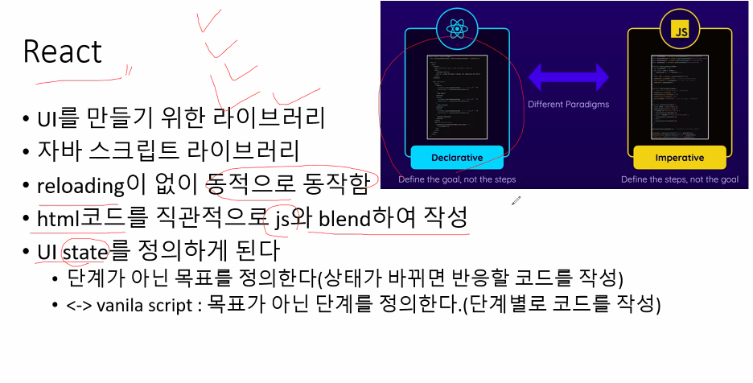
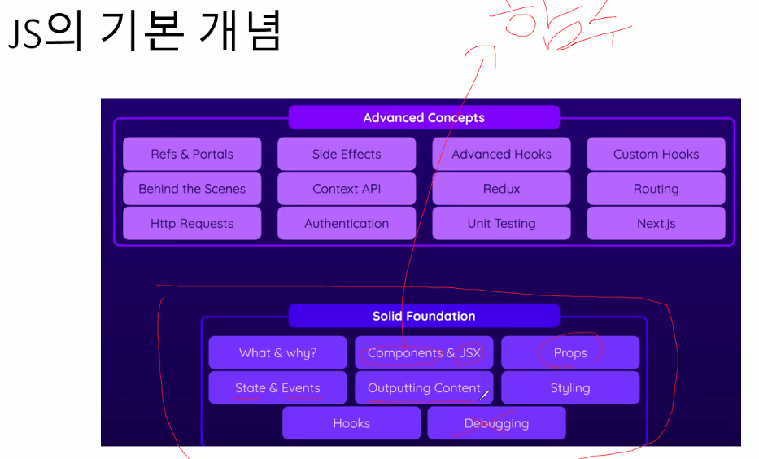

# React 라이브러리  
  
UI를 만들기 위한 자바스크립트 라이브러리  
React로 component를 꾸밀 수 있음.  
Component : 썸네일, 좋아요버튼, 영상같은 것들  
Front-end programming에 사용하기 좋음  

프론트에 함수를 넣는 느낌  

공식 문서 한글화가 잘 되어있기 때문에 읽어보는 것이 좋음.  
https://vitejs.dev/  


- `Back-end programming`  
모든 처리를 서버에서 하도록 설계하는 방식  
지금까지 한 방식처럼, 프론트에서 요청을 보내면 백에서 데이터를 가져와 뷰를 만들어 보내줌.  


- `Front-end programming`  
뷰에 대한 처리는 프론트에서, 데이터에 대한 처리는 서버에서 하도록 설계하는 방식  
페이지에서 요청을 하면, 백에서 thymeleaf, jsp 등을 사용하지 않고  
단순히 data만을 json 형태로 보냄  

front는 데이터를 통해 화면을 구성하는 로직을 가지고 있기 때문에,  
페이지 요소 중 갱신될 부분만 변경하여 로드함.  
즉 reloading 없이 동적으로 동작함.  
이를 통해 끊김없는 사용자 경험을 구현할 수 있음.  
국내에서는 Spring을 주로 사용하지만, `front-end programming`에 최적화된 언어는 node.js임.  


굳이 Front-end Programming을 하지 않더라도, ui를 구현하기 편리해서 React를 사용하기도 함.  


요소 내에 렌더링 하는 기능을 구현할 때, vanilla javascript로 구현한다면  
요소를 만들 때마다 Event를 달아주면서 구현해야 하는데,  
react를 통해 이미 만들어진 javascript 코드를 가져와 간단하게 구현할 수 있음.  


---

```
React는 사용자 인터페이스를 구축하기 위한 JavaScript 라이브러리입니다. React는 Facebook에서 개발되었으며, 재사용 가능한 UI 컴포넌트를 작성하고 이를 조합하여 복잡한 UI를 구성하는 데 사용됩니다.

React의 핵심 개념은 컴포넌트입니다. 컴포넌트는 UI의 작은 부분을 나타내는 독립적인 요소로 생각할 수 있습니다. 각 컴포넌트는 자체적으로 상태(state)를 가지고 있고, 이 상태에 따라 UI가 업데이트됩니다. React는 가상 DOM(Virtual DOM)을 사용하여 효율적으로 UI를 업데이트하고 렌더링합니다.

ㅂReact는 JSX라는 JavaScript의 확장 문법을 사용하여 컴포넌트를 작성합니다. JSX는 HTML과 JavaScript를 조합한 형태로, 컴포넌트의 구조와 동작을 선언적으로 표현할 수 있습니다. JSX 코드는 Babel과 같은 도구를 사용하여 일반 JavaScript 코드로 변환됩니다.

React는 단방향 데이터 흐름을 갖는다는 특징도 있습니다. 부모 컴포넌트에서 자식 컴포넌트로 데이터를 전달하고, 자식 컴포넌트는 전달받은 데이터를 사용하여 UI를 업데이트합니다. 이러한 데이터 흐름은 애플리케이션의 상태 관리를 단순하게 만들어줍니다.

React는 많은 개발자들에게 인기가 있으며, 커뮤니티에서 다양한 지원과 라이브러리를 제공합니다. React를 사용하면 유지보수 가능하고 확장 가능한 UI를 구축할 수 있으며, 효율적인 개발 프로세스를 갖출 수 있습니다.
```

## React 프로젝트 생성 방법  

1. npm create vite@latest 프로젝트명  
2. 프로젝트 디렉토리로 이동  
3. npm install  
4. npm run dev  


new react app 또는 vite를 통해 생성  
vite는 node.js가 필요함.  

node.js 설치 후,  
vscode 새 창을 열어서 터미널을 열음  
원하는 경로에  
```bash
npm create vite@latest 프로젝트명
```
을 입력하여 프로젝트 생성  

그 후,  
```bash
npm install
```
를 입력하여 npm 서버를 설치  
Spring에서 Apache Tomcat 역할을 같이 함.  
npm은 단순하게 웹에 접속하면, react 프로그램을 실행시켜줌.  

```bash
npm run dev
```
를 입력하여 서버를 구동시켜줌.  

---  

초기 구조 간단한 설명  

App.jsx의 App() 함수를 통해  
div root 요소 내에 지정한 `react 문법으로 작성된 내용`을 내부에 넣어줌.  
이 내용은 겉보기엔 html처럼 보이지만, react 문법으로 작성된 jsx코드임.  
`jsx` : JavaScript eXtension  

> npm 서버를 dev 모드로 구동하면, 수정 내용이 실시간으로 적용됨.  
개꿀;;  

---

  

Java는 Class로 시작하고 Class로 끝난다고 한다면,  
React는 Component로 시작하고 Component로 끝남.  

Component가 정확히 뭔가?  
컴포넌트는 데이터(props)를 입력받아 View(state) 상태에 따라 DOM Node를 출력하는 함수.  
단순히 기능만 들어있는 것이 아니라 HTML, CSS, JS 코드가 모두 들어가있음.  

클래스처럼 컴포넌트 하나로 여러 요소를 만들어낼 수 있음.  
그렇기 때문에 굉장히 간단하게 모듈화 가능.  

`.render()` : jsx 코드를 읽어 view를 만들어냄.  

jsx 코드는 render를 통해 읽어야 제대로 화면이 만들어짐.  
그대로 html코드처럼 사용하면 의도대로 출력되지 않음.  


# Component 컴포넌트  

## 컴포넌트 규칙  
1. 컴포넌트명의 첫글자는 대문자  
2. 컴포넌트의 return 값은 React에 의해 render될 수 있는 jsx 코드여야만 함.  
    (리액트는 소문자로 시작하는 컴포넌트를 DOM 태그로 취급하기 때문.)  


## 컴포넌트 호출 방법  
함수는 세미콜론을 통해 호출하지만, 컴포넌트는 다르다.  
보통 태그로 호출함.  

아래 코드는 header를 따로 Header()라는 컴포넌트로 분리하여,  
App() 컴포넌트에서 Header() 컴포넌트를 호출하는 예시임.  

```jsx
function App() {
  return (
    <div>
      <header>
        
        <h1>React Essentials</h1>
        <p>
          Fundamental React concepts you will need for almost any app you are
          going to build!
        </p>
      </header>
      <main>
        <h2>Time to get started!</h2>
      </main>
    </div>
  );
}

export default App;

```
↓
```jsx
function Header() {
  return (
    <header>
      
      <h1>React Essentials</h1>
      <p>
        Fundamental React concepts you will need for almost any app you are
        going to build!
      </p>
    </header>
  );
}

function App() {
  return (
    <div>
      <Header />    <!--호출부분-->
      <main>
        <h2>Time to get started!</h2>
      </main>
    </div>
  );
}

export default App;
```

어떻게 보면, `jsp의 include`나 `thymeleaf의 replace`의 사용법과 비슷함.  

`export default`는 파일의 기본 컴포넌트를 지정함.  

default를 사용하여 내보내지는 컴포넌트는, 불러올 때 이름을 마음대로 지정할 수 있다.  

html<->jsx [온라인 변환기](https://transform.tools/html-to-jsx)  

# State  
기본적으로 사용자에게 출력되는 화면은 값이 변경되더라도 업데이트 되지 않음.  
컴포넌트는 단 한번만 실행되기 때문.  

이를 가능하게 하려면 State를 사용해야함.  
State 훅을 호출하면, 값이 다를 때 react가 알아서 업데이트해줌.  

```jsx
import { useState } from 'react';
```

`useState()` 함수를 사용하는 데에는 두 가지 규칙이 있음.  
1. 컴포넌트 내에서 직접 사용.  
2. 컴포넌트의 가장 상단에 위치해야 함.  

useState의 매개변수에 초기값을 넣어줌.  
useState의 반환값은 두 원소로 이루어진 배열임.  
두 원소는 `state 변수`, `setState 함수`임.  

State를 이용할 때,  
값이 변경되면 리액트에게 App 컴포넌트를 다시 실행하라고 요청  
이후 리액트는 렌더링 사이클에서 다음 렌더링이 필요할 때에 요청한 값으로  
화면을 다시 재구성 (단, App 컴포넌트에 한해서)  
