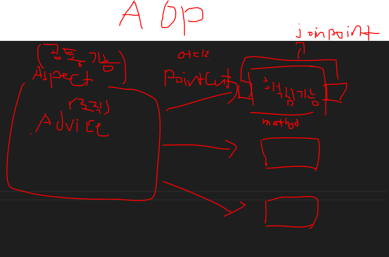
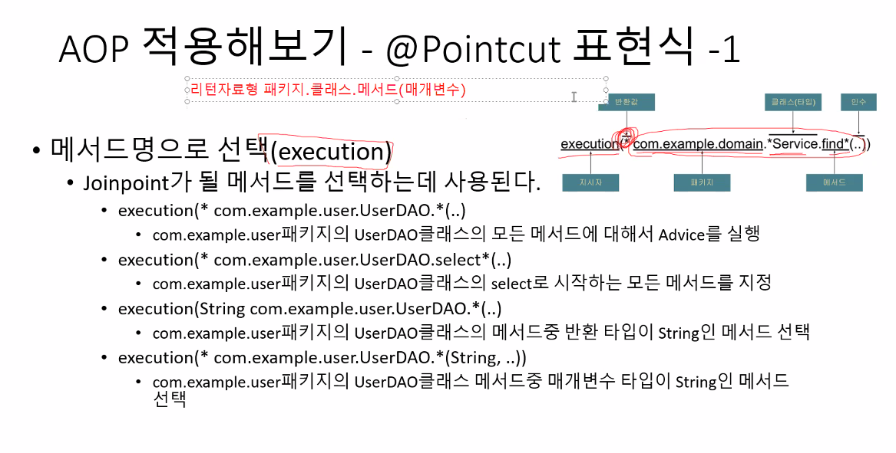
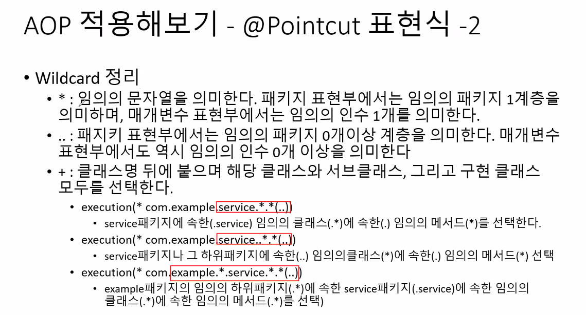
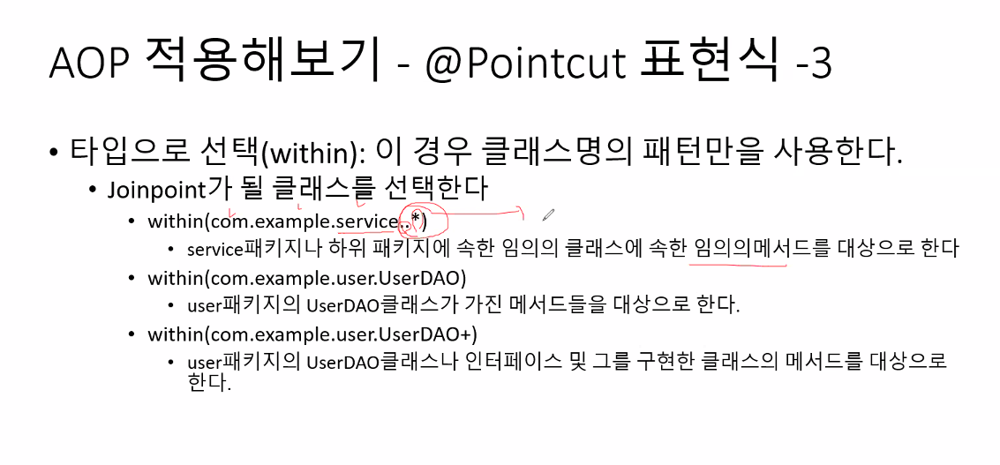
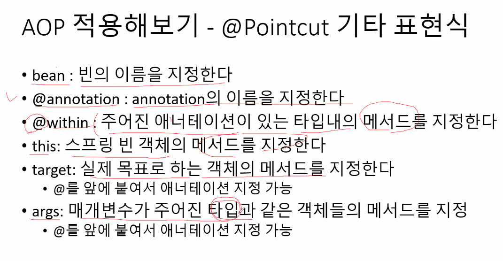

# Aspect Oriented Programming  

횡단 관심사에 대한 분리를 통해 모듈성을 높이는 프로그래밍 방식.  
공통기능과 핵심기능을 분리시켜서 공통기능을 재활용하는게 목적이다.  

(공통기능을 하는)메서드에 붙는 @Aspect 어노테이션  
기존 코드를 수정하지 않고도 새로운 동작을 추가하는데 사용함.  
공통의 기능을 컨테이너 및 AOP 라이브러리가  
지정된 메서드를 실행 전에 가로채서 공통 기능을 대신 구현해줌.  

공통 기능에 관련된 메서드를 직접 핵심 기능의 코드 내에 끼워넣지 않음.  

대표적인 사용 예시는 (성능 테스트) 메서드 실행 시간을 측정하는 기능과
로그를 남기는 기능.  

## AOP가 포함하는 네가지 개념  
모두 어노테이션으로 존재함.  

- Aspect(관점) : 여러 클래스에 걸쳐 있는 관심사의 모듈화  
공통된 기능들을 하나에 모아둔 클래스를, Aspect라고 부름.  

- Join point : 프로그램의 수행 중의 특정 지점.  
메서드의 "실행"과 같은 것들.  
일반적으로 Spring AOP에서의 Join point는 메서드 실행 지점을 말함.  

- Advice : 특정 join point에서 Aspect가 취하는 행동  
Around, before, after 등의 어드바이스가 존재함.  

- Pointcut : 조인포인트에 매칭되는 서술어  
어드바이스는 포인트컷 표현식과 연관되어 있고,  
포인트컷과 일치하는 모든 조인 포인트에서 실행됨.  ???  

기능을 붙이고 싶은 지점(메서드)이 여러개라면,  
메서드의 이름을 지정할 수 있는 식을 PointCut이라고 함.  

  

## 설정  
횡단 관심사를 구현하는데 필요한 기능을 어노테이션으로 간편히 구현할 수 있도록 도와주는 라이브러리 설치  
`AspectJ`, `mvnrepository`, `AspectjWeaver`  
AspectJ만 사용하면 이를 구현하는 interface를 만들어 사용해야 해서 불편함.  

maven 기준   
pom.xml에 아래와 같이 추가  
관련 문서 링크 :  

https://mvnrepository.com/artifact/org.aspectj/aspectjweaver/1.6.10  
https://mvnrepository.com/artifact/org.springframework/spring-aop

```xml
		<!-- AspectJ -->
		<dependency>
			<groupId>org.aspectj</groupId>
			<artifactId>aspectjrt</artifactId>
			<version>${org.aspectj-version}</version>
		</dependency>	
		<!-- https://mvnrepository.com/artifact/org.aspectj/aspectjweaver -->
		<dependency>
		    <groupId>org.aspectj</groupId>
		    <artifactId>aspectjweaver</artifactId>
		    <version>${org.aspectj-version}</version>
		    <scope>runtime</scope>
		</dependency>
		<!-- https://mvnrepository.com/artifact/org.springframework/spring-aop -->
		<dependency>
		    <groupId>org.springframework</groupId>
		    <artifactId>spring-aop</artifactId>
		    <version>${org.springframework-version}</version>
		</dependency>
```

servlet-context.xml에 아래와 같이 추가  
관련 문서 링크 : https://docs.spring.io/spring-framework/reference/core/appendix/xsd-schemas.html  

```xml
<?xml version="1.0" encoding="UTF-8"?>
<beans xmlns="http://www.springframework.org/schema/beans"
	xmlns:xsi="http://www.w3.org/2001/XMLSchema-instance"
	xmlns:aop="http://www.springframework.org/schema/aop"
	xsi:schemaLocation="
		http://www.springframework.org/schema/beans https://www.springframework.org/schema/beans/spring-beans.xsd
		http://www.springframework.org/schema/aop https://www.springframework.org/schema/aop/spring-aop.xsd">

	<!-- bean definitions here -->

</beans>
```

## 구현  
공통적으로 사용할 기능을 구현할 Aspect 클래스를 작성하면 됨.  
AOP에서 이 클래스를 만들면, 프록시 역할을 함.  

프록시가 뭔가요?  
https://velog.io/@lsx2003/CS-React-%EB%A6%AC%EC%95%A1%ED%8A%B8-Proxy-%EC%82%AC%EC%9A%A9%ED%95%98%EA%B8%B0  
요청 처리 시 중간에 거쳐가는 것이라고 생각하면 됨.  

또한 내부의 Advice 메서드에 JoinPoint에 대한 어노테이션들을 붙여서 사용함.  
이를 통해 해당 advice 메서드가 언제 실행될지 결정할 수 있음.  

### JoinPoint 지정  
공통 기능이 어느 때에 수행될지 지정함.  

- `@Around` : 메서드 실행 전, 후, 예외 발생 시에 삽입  
- `@Before` : 메서드 실행 전  
- `@After` : 예외 발생 여부와 관계없이 메서드 실행 후  
- `@AfterReturning` : 예외 없이 정상 완료된 후  
- `@AfterThrowing` : 예외가 발생하였을 때만  
    @Around가 붙은 메서드를 제외하고, 모두 반환값이 void여야만 함.  

`@Around가 붙은 메서드`는, 핵심기능이 뭘 반환할지 모르니 `return 타입이 Object`여야함.  
그렇지 않으면 언제나 null값이 return됨.  

이러면 After도 반환값이 있어야 하는 거 아님?  
After 메서드는 핵심 기능이 끝난 후 본인 할 일만 하는 거고,  
Around는 핵심 기능을 감싸는 메서드이기 때문에 After는 반환값이 없음.  

실제 Around 메서드를 가로채는 지점은, 즉 proceed() 메서드가 실행되는 실행되는 지점은  
try, catch, finally 구문을 이용해서 원하는 시점을 선택할 수 있음.  
  

### Pointcut 지정  
공통 기능을 어느 핵심 기능에 붙일지 지정함.  

표현식으론 여러가지가 있는데 `execution`과 `within`을 주로 사용함  
execution은 메서드를 선택, within은 클래스를 선택함.  

#### execution  
  

와일드 카드 :  
  

`.`이랑 `..` 뭔 차이?  
`.`은 바로 위 패키지의 하위 패키지  
`..`은 바로 위 패키지 + 하위 패키지  

`+`는 상속하는 모든 클래스도 포함한다는 뜻.  

예시)  
`execution(* com.example.user.UserService.*(*))`  
UserService 내 모든 return 타입, 매개변수가 하나인 메서드들  

#### within  

  

#### 기타 표현식  
  

예를 들면 모든 DAO 클래스의 메서드에 PointCut을 지정하고 싶다면, bean 표현식으로 더 간결하게 명시할 수 있음.  
```java	
	@Pointcut("execution(* com.office.library.user.member.UserMemberDao.*(..)) ||" + 
			"execution(* com.office.library.admin.member.AdminMemberDao.*(..)) ||" +
			"execution(* com.office.library.book.admin.BookDao.*(..)) ||" +
			"execution(* com.office.library.book.user.BookDao.*(..))")
            
	@Pointcut("bean(*Dao)")
```

#### PointCut 분리  

아래와 같이, 아무런 기능을 하지 않는 메서드에 PointCut을 명시하여 분리할 수 있음.  
해당 PointCut을 사용할 땐, 메서드 이름을 명시하면 됨.  

```java
	@Pointcut("within(com.office..*)")
	public void pointCut() {}
	
	// 패키지 지정용 서술어(pointcut)
	// 포함하는 패키지 : com.office 모든 한 단계 하위 경로
	@Before("pointCut()")
	public void beforeMethod() {
		System.out.println("메서드 시작 전");
	}
	
	@After("pointCut()")
	public void afterMethod() {
		System.out.println("메서드 종료");
	}
```

#### 메서드 수행 시간 측정 예시  
```java
@Component
@Aspect
public class Aop {
	
	private long startTime;
	private String entryPoint;
	
	@Pointcut("execution(* com.office.library.HomeController.home(..))|| " + 
	"execution(* com.office.library.user.UserHomeController.home(..))")
	private void pointcutMethod() {}
	
	
	@Around("pointcutMethod()")
	public Object around(ProceedingJoinPoint jp) throws Throwable{
		String methodName = jp.getSignature().getName(); // Advice가 달린 메서드 이름

			if(startTime == 0) {
				// 처음 진입점
				startTime = System.currentTimeMillis();
				entryPoint = methodName;
				System.out.println("시간체크 진입점 : " + methodName);
			}
			long methodStartTime = System.currentTimeMillis();
			Object result = jp.proceed();
			long executionTime = System.currentTimeMillis() - methodStartTime;
			System.out.println(methodName + "이 실행되는데 걸린 시간 : " + executionTime);
			if(!isRedirect(result)) {
				long totalTime = System.currentTimeMillis() - startTime;
				System.out.println("종료점 : " + methodName);
				System.out.println("총 처리 시간 : " + totalTime + "ms");
				
				startTime = 0;
				entryPoint = null;
			}
			return result;
		}
	
	private boolean isRedirect(Object result) {
		return result instanceof String && ((String)result).startsWith("redirect:/");
	}
	
	}
```

