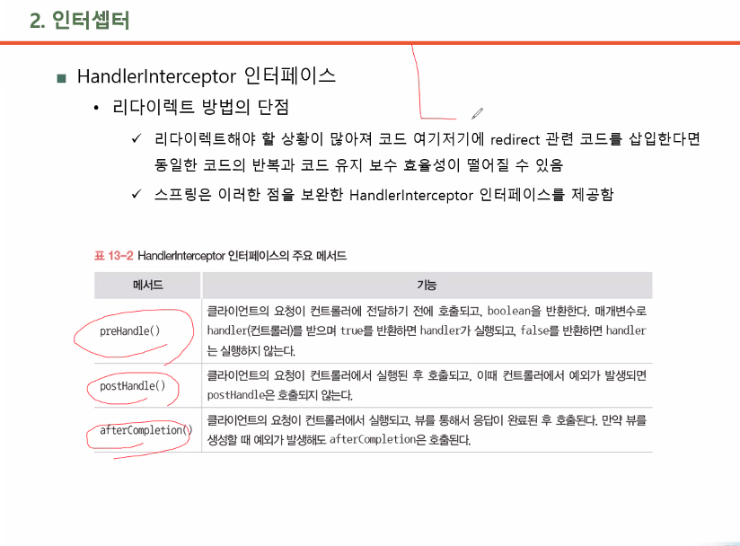
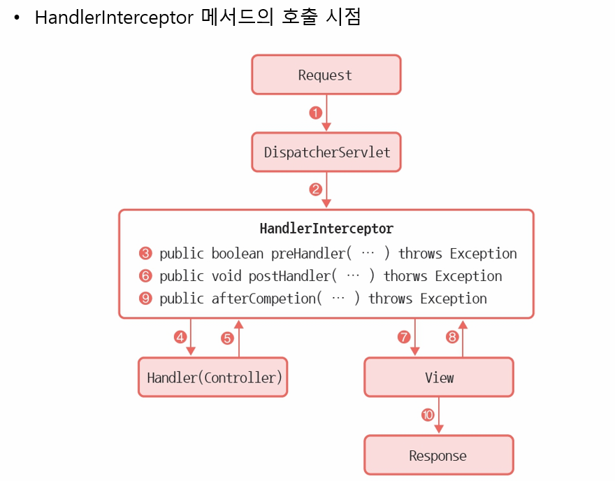

# HandlerInterCeptor  
어떠한 조건을 만족했을 때만 컨트롤러를 실행하도록 도와주는 기능  

prehandler()  
로그인 체크할 때 많이 사용  
필터와는 다름  

  
  

인터페이스 메서드 중 일부분만 구현하고 싶으면, 아무런 기능이 없는 메서드로 구성된 콘크리트 클래스를 만들어, 이를 상속받아 원하는 메서드만 구현할 수 있음.  
Spring에선 자동으로 이 콘크리트 클래스를 제공해줌.  

```java
package com.office.library.user.member;

import javax.servlet.http.HttpServletRequest;
import javax.servlet.http.HttpServletResponse;
import javax.servlet.http.HttpSession;

import org.springframework.web.servlet.handler.HandlerInterceptorAdapter;

public class UserMemberLoginInterceptor extends HandlerInterceptorAdapter {
	// request:사용자가 보낸 요청, response:서버가 보내는 응답
	public boolean preHandle(HttpServletRequest request, HttpServletResponse response, Object handler) throws Exception {
		// servlet의 코드
		HttpSession session = request.getSession(false);
		if(session != null) {
			Object object = session.getAttribute("loginedUserMemberVo");
			if(object != null) {
				return true;	// Controller 실행 O
			}
		}						// /library/
		response.sendRedirect(request.getContextPath()+"/user/member/loginForm");
		return false;			// Controller 실행 X
		
	}
}

```

mapping path에 연결할 Interceptor를 적어주고,  
bean에 연결할 Controller를 적어줌.  

Interceptor를 적용하지 않을 경로는, exclude-mapping에 적어줌.  
css처럼 위에서부터 적용되기 때문에, 순서대로 잘 작성해야 함.
```xml
	<interceptors>
		<interceptor>
			<mapping path="/book/user/rentalBookConfirm" />
			<mapping path="/user/member/**" />
			<exclude-mapping path="/user/member/createAccountForm" />
			<exclude-mapping path="/user/member/createAccountConfirm" />
			<exclude-mapping path="/user/member/loginForm" />
			<exclude-mapping path="/user/member/loginConfirm" />
			<exclude-mapping path="/user/member/findPasswordForm" />
			<exclude-mapping path="/user/member/findPasswordConfirm" />
			<beans:bean 
				class="com.office.library.user.member.UserMemberLoginInterceptor" />
		</interceptor>
	</interceptors>
```