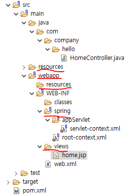
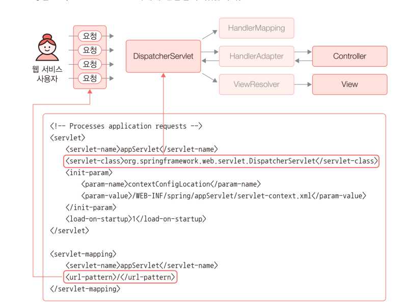
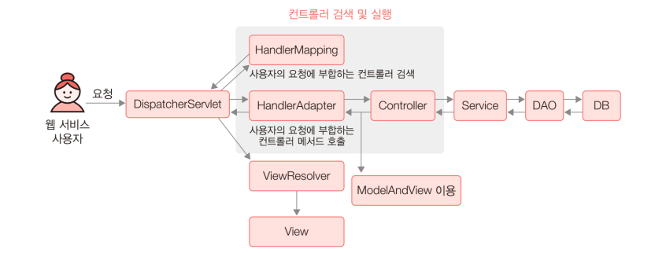
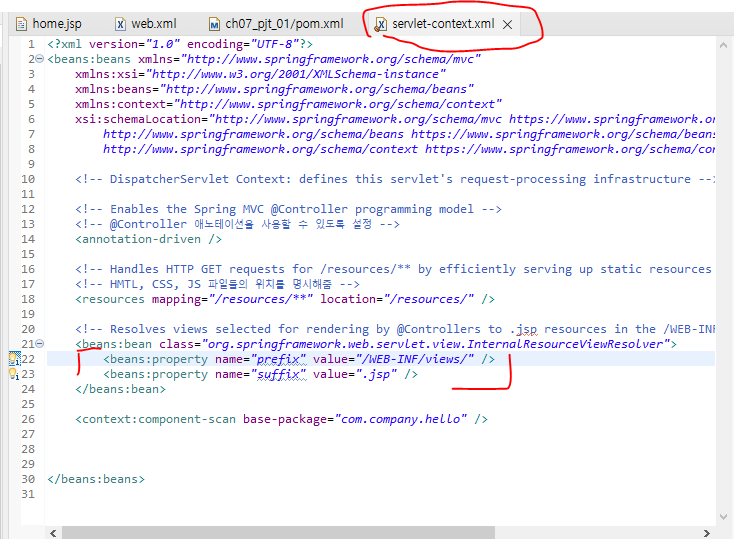
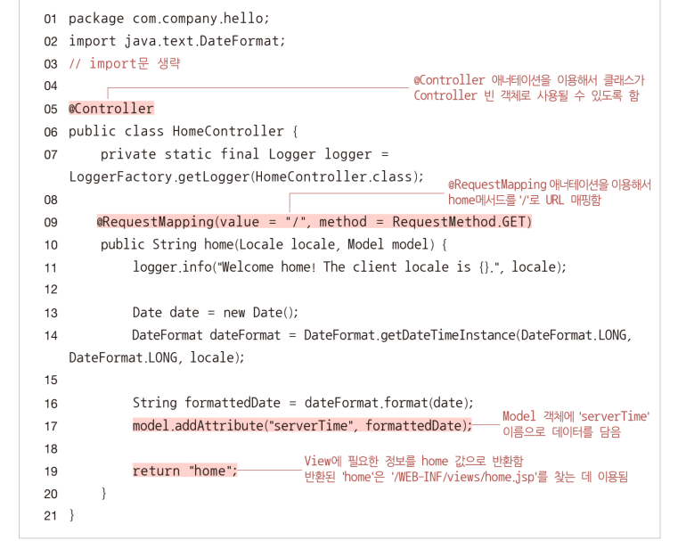
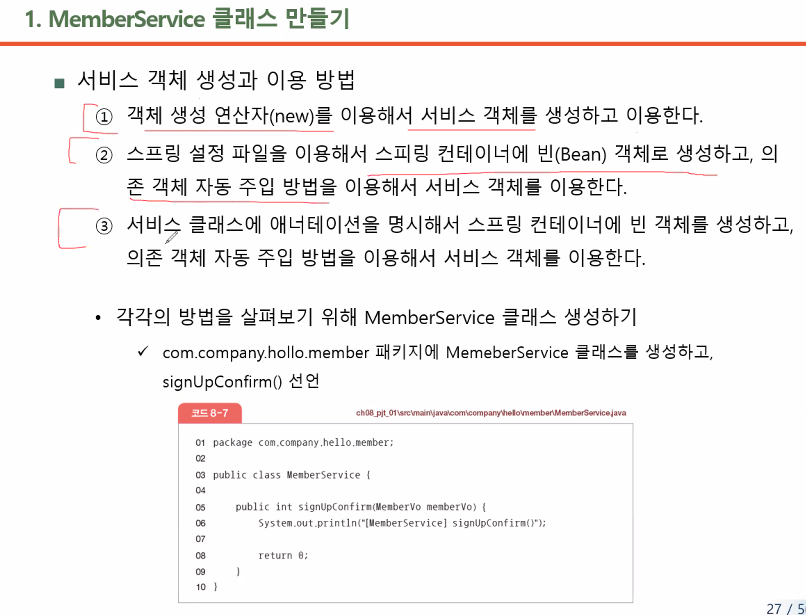
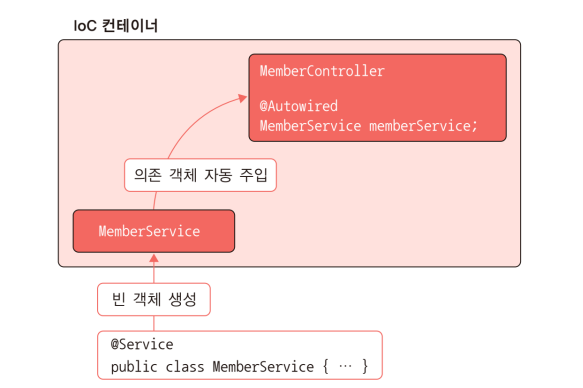
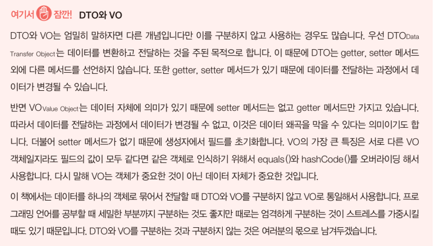
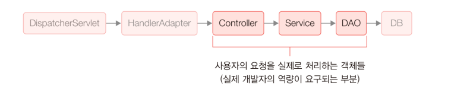

## 패키지 구조  

참고 사이트 : https://dig06161.github.io/2022/03/28/make-spring-project/  

  

기본적인 코드 작성은 com.company.hello 에 작성하게 된다.  

src/main/webapp 아래에 resources폴더는 우리가 웹 서버를 프로그래밍 하면서 정적 링크를 사용할 경로이다. 예를 들어 이미지 파일들이 될 것이다.  

WEB-INF -> spring 아래의 파일과 폴더들은 웹 서버 상에서는 접근이 불가능한 부분이다. 스프링의 기본적인 설정파일들이 담겨있다.  

web.xml -> 서블릿 설정과 컨텍스트관련 경로 설정을 잡아준다. WAS에서 필요한 Servlet설정들을 명시해주는 부분이다. servlet-context.xml을 가리키고 있음.  

view -> home.jsp는 servlet-context.xml에서 설정한것 같이, 컨트롤러에 URL 요청이 들어오면 리턴되는 jsp 파일들이 저장되는 곳이다.  

/src/test 폴더는 JUnit test에 사용된 코드와 class들이 저장되는 곳이다.  

pom.xml  
Spring은 Maven의 의존성을 통해 버전관리를 하고 원하는 라이브러리를 편하게 다운받을 수 있다. 이런 Maven의 설정에 관한 코드를 pom.xml에 작성한다. 스프링 버전, 자바 버전, 기타 라이브러리 등 모든 버전과 관련된 설정파일은 전부 여기에 작성된다.  

WEB-INF 폴더 내 resources 폴더에 사진을 넣으면, 웹에서 폴더 내 파일들에 접근할 수 있음.  

---

Dispatcher Servlet이 연결되는 구조 :  
  

Dispatcher Servlet 동작 구조 :  
  


---

  
`View Resolver`에게 `WEB-INF/views/` 경로와 `.jsp` 확장자를 설정해줌.  


```xml
<!-- Enables the Spring MVC @Controller programming model -->
<annotation-driven />
<!-- @Controller 애노테이션을 사용할 수 있도록 설정 -->
<!-- 이게 없으면 bean을 생성할 때 자바 파일을 하나하나 연결해줘야됨 -->
```

```xml
<context:component-scan base-package="com.company.hello" />
<!-- 패키지 경로를 설정하여 Spring이 하위 경로를 탐색할 수 있도록 함 -->
<!-- 이게 없으면 아무리 애노테이션을 잘 써놔도 자동으로 탐색할 수 없음 -->
```

---

<h3>여기가 가장 핵심임!!</h3>  

### HomeController.java와 home.jsp  
  

클라이언트가 가장 상위 디렉토리 `/`에 연결을 요청하면, home.jsp를 바탕으로 만들어진 html 파일을 반환하도록 되어있음.  

정확히 말하자면, 연결이 요청되면 home 메서드가 정보를 만들어 반환하고,  
반환된 정보를 통해 ViewResolver가 view를 만들어 dispatcherservlet에게 전달해주고 이를 화면에 뿌리게 됨.  

컨트롤러 내 메서드를 어느 상황에 실행시킬지 정하려면,  
@RequestMapping 애노테이션을 붙이고, 어떤 경로로 요청이 들어왔을 때, 어떤 메서드 방식(GET,POST 등)을 수행할지 정함.  
메서드 방식은 안 적을 수도 있음.  


```java
@Controller
public class HomeController {
	
	private static final Logger logger = LoggerFactory.getLogger(HomeController.class);
	
	/**
	 * Simply selects the home view to render by returning its name.
	 */
	@RequestMapping(value = "/", method = RequestMethod.GET)
	public String home(Locale locale, Model model) {
		logger.info("Welcome home! The client locale is {}.", locale);
		
		Date date = new Date();
		DateFormat dateFormat = DateFormat.getDateTimeInstance(DateFormat.LONG, DateFormat.LONG, locale);
		
		// 날짜값을 String으로 형변환
		String formattedDate = dateFormat.format(date);
		
		// model에 String으로 변환된 날짜값을 서버타임이라는 이름으로 담음
		// model이란 객체는 데이터를 담을 바구니 .addAttribute 메서드를 통해 담음
		model.addAttribute("serverTime", formattedDate );
		
		return "home";
	}
	
}
```
```javascript
<!-- home.jsp -->

<%@ taglib uri="http://java.sun.com/jsp/jstl/core" prefix="c" %>
<%@ page session="false" %>
<html>
<head>
	<title>Home</title>
</head>
<body>
<h1>
	Hello world!  
</h1>
	<!-- HomeController에서 만든 model 안에 있는 serverTime 데이터 -->
<P>  The time on the server is ${serverTime}. </P>
</body>
</html>
```
home() 메서드가 home을 return하면서 home.jsp를 실행함.  
home.jsp는 serverTime 변수를 갖다 쓰고, 최종적으로 html 파일을 만들어서 이 파일을 Client에게 전송하여 화면에 보여줌  
단, 파일이 동적으로 변하지 않고 정적인 화면을 보여줌  
이 요청은 새로고침 할 때마다 수행됨  

리턴할 때, 문자열 "home"을 반환하게 되는데 이는 home.jsp의 파일명을 나타냄  

# 컨트롤러와 jsp 연결 예시  

우선 아래와 같이 컨트롤러 클래스를 하나 만들어줌.  

```java
package com.company.hello.member;

import org.springframework.stereotype.Controller;
import org.springframework.web.bind.annotation.RequestMapping;

@Controller	// 컨트롤러임을 명시
public class MemberController {
	
	@RequestMapping("/signUp")	// 어떤 경우에 이 메서드를 실행할지 명시. /signUp 디렉토리에 연결 요청하면 실행
	public String signUp() {
		
		return "sign_up";		// 연결할 jsp 파일명을 반환.
	}
	
	@RequestMapping("/signIn")
	public String signIn() {
		
		return "sign_in";
	}
}

```
링크에 연결되는 각각의 페이지를 반환할 jsp 파일을 만들어줌  

```jsp
<!-- sign_up.jsp -->
<%@ page language="java" contentType="text/html; charset=UTF-8"
    pageEncoding="UTF-8"%>
<!DOCTYPE html>
<html>
<head>
<meta charset="UTF-8">
<title>회원가입 페이지</title>
</head>
<body>
	<p> 이 페이지는 회원가입을 위한 페이지입니다. </p>
</body>
</html>
```

```jsp
<!-- sign_in.jsp -->
<%@ page language="java" contentType="text/html; charset=UTF-8"
    pageEncoding="UTF-8"%>
<!DOCTYPE html>
<html>
<head>
<meta charset="UTF-8">
<title>로그인 페이지</title>
</head>
<body>
	<p> 이 페이지는 로그인용 페이지입니다. </p>
</body>
</html>
```

기본 페이지 경로 뒤에 signUp, signIn을 입력하여 연결 요청하면, 해당 페이지로 이동.  
즉, jsp 파일들을 통해 만들어진 html을 볼 수 있게 됨.  

---

```
정리

1. STS는 스프링을 이용한 프로그램 개발을 좀더 쉽게 진행할 수 있도록 고안된 프로젝트이다.  

2. pom.xml은 프로젝트에 필요한 라이브러리를 메인 리포지터리에서 다운받기 위한 메이븐 설정 파일이다.

3. web.xml은 웹 서비스의 전반적인 설정을 하는 파일이다. 웹 애플리케이션의 모든 객체를 관리하는 DispatcherServlet 객체를 서블릿으로 등록해주는 코드도 web.xml에 있다.

4. servlet-context.xml은 스프링 설정 역할을 하는 설정 파일이다. 스프링 설정 파일은 클래스로부터 빈 객체를 생성하고 조립하는 역할을 한다.

5. Controller 객체는 클라이언트의 요청을 받아서 사용자의 요청에 부합하는 메서드를 실행한다. 그리고 해당 메서드는 Service와 DAO 등을 이용해서 사용자의 요청에 대한 작업을 진행한다. 메서드의 작업이 완료되면 View 정보를 반환하고, 반환된 정보를 이용해서 JSP 파일이 실행된다. 
```

# 컨트롤러와 jsp 연결 회원가입 예시  

▼ jsp에 값을 입력받을 수 있는 form을 아래와 같이 작성  

```jsp
<%@ page language="java" contentType="text/html; charset=UTF-8"
    pageEncoding="UTF-8"%>
<!DOCTYPE html>
<html>
<head>
<meta charset="UTF-8">
<title>회원가입 페이지</title>
</head>
<body>

	<h3>회원 가입 페이지입니다.</h3>
	<!-- action에 적은 경로로 데이터 전달 -->
	<form action="/hello/signUpConfirm">
		ID : <input type="text" name="m_id"><br/>
		PW : <input type="password" name="m_pw"><br/>
		MAIL : <input type="text" name="m_mail"><br/>
		PHONE : <input type="text" name="m_phone"><br/>
		<input type="submit" value="회원가입">
		<input type="reset" value="취소">
	</form>
</body>
</html>
```

▼ 클라이언트로부터 입력받은 값을 전달받아 처리할 컨트롤러를 아래와 같이 작성  

```java
@Controller	// 컨트롤러임을 명시
public class MemberController {
	
	@Autowired
	private MemberService memberService;

	
	@RequestMapping("/signUp")	// 어떤 경우에 이 메서드를 실행할지 명시. /signUp 디렉토리에 연결 요청하면 실행
	public String signUp() {
		
		return "sign_up";		// 연결할 jsp 파일명을 반환.
	}
	
	@RequestMapping("/signIn")
	public String signIn() {
		
		return "sign_in";
	}
	
		// @RequestParam으로 받아올 때, 원시형 자료형은 에러가 발생할 수 있음.  
		// 때문에 String, Integer같은 클래스로 받아오는 것이 좋음.  
	@RequestMapping("/signUpConfirm")
	public String signUpConfirm(@RequestParam String m_id,
								@RequestParam String m_pw,
								@RequestParam String m_mail,
								@RequestParam String m_phone) {
		
		System.out.println("[MemberController] signUpConfirm()");
		
		System.out.println("m_id : " + m_id());
		System.out.println("m_pw : " + m_pw());
		System.out.println("m_mail : " + m_mail());
		System.out.println("m_phone : " + m_phone());

		return null;
	}
}
```

## 서비스 객체  
▼ 생성 방법  
  
3가지 방법 중 3번째 방법이 가장 보편적임.  

### 첫번째 방법  

```java
public class MemberService {
	
	public int signUpConfirm(MemberVo memberVo) {
		
		System.out.println("[MemberService] signUpConfirm()");
		System.out.println("m_id : " + memberVo.getM_id());
		System.out.println("m_pw : " + memberVo.getM_pw());
		System.out.println("m_mail : " + memberVo.getM_mail());
		System.out.println("m_phone : " + memberVo.getM_phone());
		
		return 0;
	}
}
```
```java
	// MemberController.java에 추가.

@Controller	
public class MemberController {
	
	// new 키워드를 통해 만들기 때문에 의존성이 생김
	private MemberService memberService = new MemberService();
	
	@RequestMapping("/signUp")	
	public String signUp() {
		
		return "sign_up";
	}
	
	@RequestMapping("/signIn")
	public String signIn() {
		
		return "sign_in";
	}
	
	@RequestMapping("/signUpConfirm")
	public String signUpConfirm(MemberVo memberVo) {
		
		System.out.println("[MemberController] signUpConfirm()");
		
		System.out.println("m_id : " + memberVo.getM_id());
		System.out.println("m_pw : " + memberVo.getM_pw());
		System.out.println("m_mail : " + memberVo.getM_mail());
		System.out.println("m_phone : " + memberVo.getM_phone());
		
		
		memberService.signUpConfirm(memberVo);
		return null;
	}
}

```

---

### 두번째 방법  

```xml
<!-- servlet-context.xml에 추가하여 memberService bean 생성 -->
<beans:bean id="memberService" class="com.company.hello.member.service.MemberService" />
```

```java
// MemberController.java에 아래 내용으로 수정
@Autowired
private MemberService memberService;
```

---

### 세번째 방법 (주로 사용)  

MemberService 클래스에 `@Service` or `@Component` or `@Repository` 애노테이션을 달아줌.  
```java
@Service // or @Component or @Repository 애노테이션을 통해 아래 클래스를 Bean으로 만듦
public class MemberService {
	
	public int signUpConfirm(MemberVo memberVo) {
		
		System.out.println("[MemberService] signUpConfirm()");
		System.out.println("m_id : " + memberVo.getM_id());
		System.out.println("m_pw : " + memberVo.getM_pw());
		System.out.println("m_mail : " + memberVo.getM_mail());
		System.out.println("m_phone : " + memberVo.getM_phone());
		
		return 0;
	}
}
```

```java
@Controller	// 컨트롤러임을 명시
public class MemberController {
	
	// @AutoWired 애노테이션으로 의존 객체 자동 주입
	@Autowired
	private MemberService memberService;
	
	@RequestMapping("/signUp")	
	public String signUp() {
		
		return "sign_up";		
	}
	
	@RequestMapping("/signIn")
	public String signIn() {
		
		return "sign_in";
	}
	
	@RequestMapping("/signUpConfirm")
	public String signUpConfirm(MemberVo memberVo) {
		
		System.out.println("[MemberController] signUpConfirm()");
		
		System.out.println("m_id : " + memberVo.getM_id());
		System.out.println("m_pw : " + memberVo.getM_pw());
		System.out.println("m_mail : " + memberVo.getM_mail());
		System.out.println("m_phone : " + memberVo.getM_phone());
		
		
		memberService.signUpConfirm(memberVo);
		return null;
	}
}

```
동작 원리는 아래와 같음.  

  

## DAO 객체  

Member 데이터를 저장할 클래스를 아래와 같이 만듦.  

```java
@Repository
public class MemberDao {
	
	private Map<String, MemberVo> memberDB = new HashMap<String, MemberVo>();
	
	public void insertMember(MemberVo memberVo)
	{
		System.out.println("[MemberDao] insertMember()");
		System.out.println("m_id : " + memberVo.getM_id());
		System.out.println("m_pw : " + memberVo.getM_pw());
		System.out.println("m_mail : " + memberVo.getM_mail());
		System.out.println("m_phone : " + memberVo.getM_phone());
		
		memberDB.put(memberVo.getM_id(), memberVo);
		// 실행 결과를 보기 위해 insertMember와 printAllMember를 함께 실행
		this.printAllMember();
	}
	
	private void printAllMember() {
		System.out.println("[MemberDao] printAllMember()");
		
		Set<String> keys = memberDB.keySet();
		Iterator<String> iterator = keys.iterator();
		
		while(iterator.hasNext()) {
			String key = iterator.next();
			MemberVo memberVo = memberDB.get(key);
			System.out.println("============================");
			System.out.println("m_id : " + memberVo.getM_id());
			System.out.println("m_pw : " + memberVo.getM_pw());
			System.out.println("m_mail : " + memberVo.getM_mail());
			System.out.println("m_phone : " + memberVo.getM_phone());
		}
	}
}

```

MemberService.java에 아래 내용 추가.  

```java
	@Autowired
	private MemberDao memberDao;
```

  
  

#### ch08_pjt_01 작동 방식  

웹 페이지에서 값을 입력하고 submit  
-> /signUpConfirm 경로로 MemberVo에 값을 담아 반환  
-> MemberController의 signUpConfirm 메서드 실행 (MemberVo 데이터 전달)  
-> MemberService의 signUpConfirm 메서드 실행  
-> MemberDao의 insertMember 메서드 실행 (MemberVo 데이터 전달받아 실행됨)  
-> memberDB Map에 MemberVo 데이터가 저장됨  
-> 저장함과 동시에 MemberDao의 printAllMember 메서드를 실행  
-> memberDB 내 모든 값을 출력  