# STS  
Spring Tool Suit  
- 개발을 좀 더 쉽게 진행할 수 있도록 고안된 스프링을 이용한 IDE  
- STS를 사용하는 방법  
	- 이클립스에 STS 플러그인 설치  
	- 스프링 깃허브에서 단독으로 내려받아 사용  
	(플러그인 설치 시 문제가 발생하는 경우가 있어, 깃허브에서 다운받는 것을 권장함.)  

## Apache Tomcat WAS  

### 설치 및 환경설정  

프로젝트 테스트를 위해 컴퓨터 내에 Apache Tomcat WAS 서버를 열거임.  
https://tomcat.apache.org/download-90.cgi  
Binary Distribution : 컴파일된 파일  
Source Code Distributions : 컴파일 전 원본 코드 파일(수정해서 쓸 때 사용)  
Deployer : 실제 웹 애플리케이션을 배포할 때 필요한 기능들이 들어있음.  

우리는 Core를 받아서 사용할 거임.  

STS에서 원래 있던 VM 서버는 사용하지 않을 것이니 삭제.  


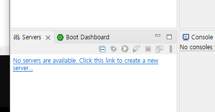  
▲ 하이퍼링크 클릭 or 우클릭 - new server로 톰캣 서버 연동  

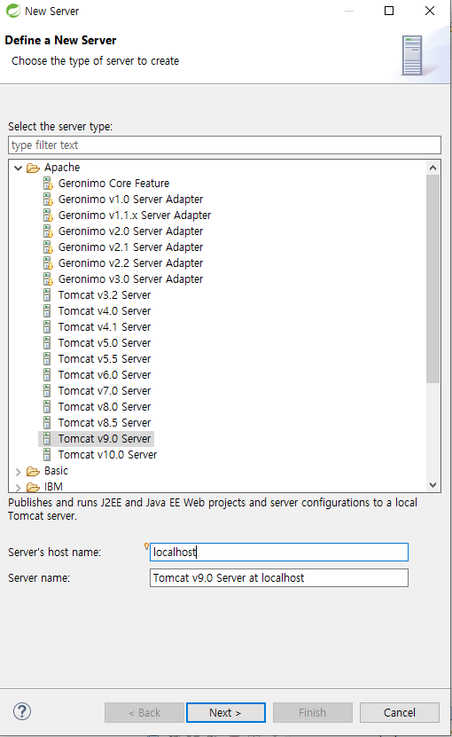  
▲ 포트는 다른 프로그램들과의 충돌을 방지하기 위해 대충 8090으로 변경  

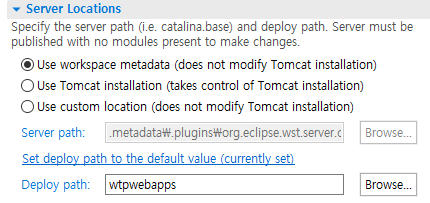  
▲
1. 서버 설정 파일을, 내 workspace에 저장(프로젝트 별로 서버 설정을 별개로 갖게 됨)  
2. 서버 설정 파일을, 서버 본 폴더에 저장(모든 프로젝트가 같은 서버 설정을 갖게 됨)  
3. 서버 설정 파일을, 직접 지정한 경로에 저장  


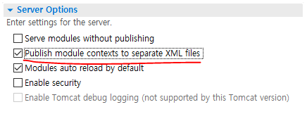  
▲ 위 항목 체크 !!  

Serve modules without publishing :  
설정한 웹 앱 설정이 즉시 적용됨.  

Publish module contexts to separate XML files :  
개발자가 작성한 웹 앱 설정 파일을 외부 xml 파일로 관리할 수 있음.  

Modules auto reload by default :  
변경 내용을 저장하면 서버를 바로 재실행하여 변경 내용을 적용시키도록 함.  

Enable security :  
보안 관리자 활성화  

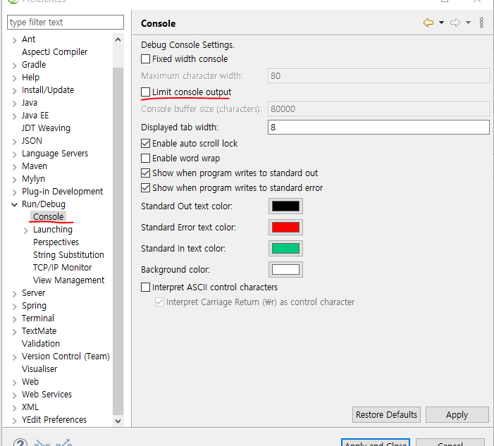  
▲ 서버 로그 메세지 제한 해제(글자 수가 많으면 경고가 나옴)  

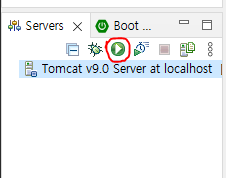  
▲ 서버칸 초록색 재생 버튼을 누르면 서버가 열림.  

이후 localhost:8090에 접속하면 서버가 정상적으로 열린 것을 확인할 수 있음.  
404 페이지가 보이면 제대로 열린 것.  


## STS 프로젝트 생성 및 환경설정  

Spring Legacy Project 내에서 Spring MVC Project를 선택하여 프로젝트 생성  
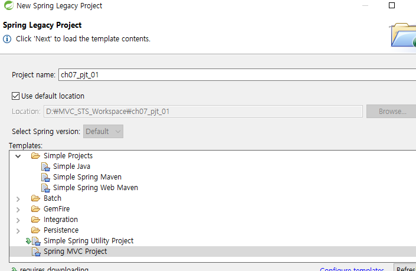  
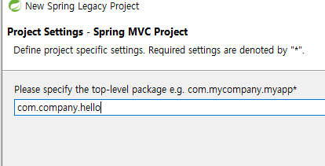  

스프링 프로젝트 작업을 할 때는, Package Explorer보다는 Project Explorer를 사용하는게 프로젝트를 더 상세히 볼 수 있음.  

```
주의사항 : Spring MVC Project가 없을 수 있음.  
지원을 중단한 것으로 보임  

해결방법1 : 
내가 올린 metadata.zip 파일을 받아 작업폴더에 압축을 풀고,
폴더명 앞에 .을 적어줌

해결방법2 : 
https://nirsa.tistory.com/405

1. 위 링크에서 파일을 받음

2. STS를 끈 상태에서
https-content.xml를
작업폴더.metadata.plugins\org.springsource.ide.eclipse.commons.content.core
에 넣고
STS에서 Spring MVC Project 생성

3. 오류 발생시킨 뒤 STS 종료

4. 생성된 프로젝트 폴더 
작업폴더.metadata.sts\content 에
org.springframework.templates.mvc-3.2.2 를 직접 넣어주면 됨 
```

---

### 환경설정  
우리는 Java 11버전, 스프링 5.2.9 버전을 사용할 것이기 때문에 프로젝트 pom.xml에 적혀있는 내용을 수정해줘야함.  

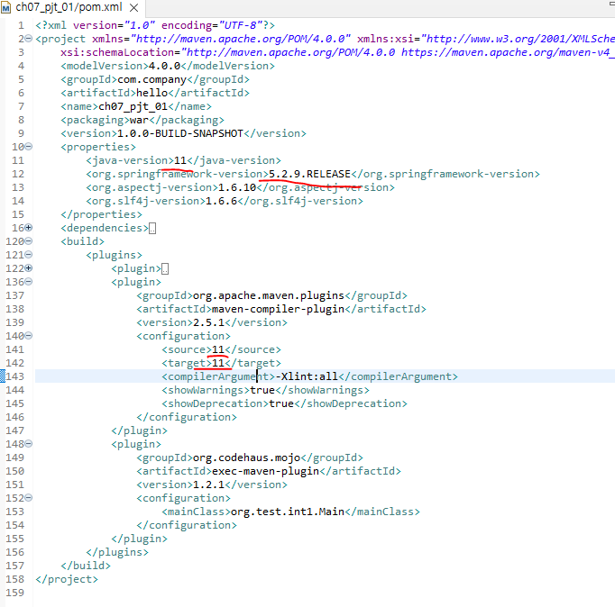  
위 항목들을 똑같이 수정해준 뒤,  
저장하고 Maven - Update Project 수행.  

앞으로 프로젝트를 실행할 때는, project 우클릭 - Run As - Run on Server - 서버 선택 후 실행하도록 함.  

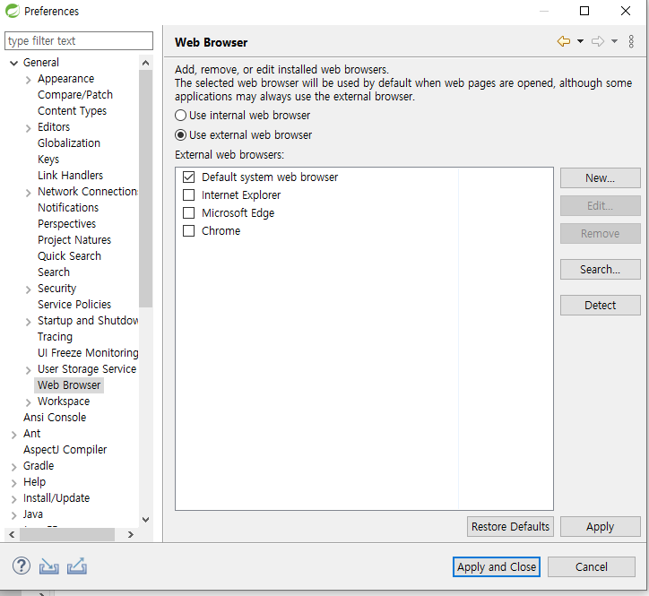  
위 설정으로 서버 실행 후 원하는 브라우저로 웹을 열도록 할 수 있음.   

---

### 한글 filter  
현재 프로젝트를 실행하면 한글이 깨짐.  
이를 해결하기 위해 dispatcher가 내용을 불러오는 과정에 한글이 깨지지 않도록 하는 filter를 추가할 것임.  

src/main/WEB-INF/views/web.xml 파일에 아래 내용을 추가함.  
```xml
<!-- 인코딩 한글 처리 -->
<filter>
    <filter-name>encoding-filter</filter-name>
    <filter-class>org.springframework.web.filter.CharacterEncodingFilter</filter-class>
    <init-param>
        <param-name>encoding</param-name>
        <param-value>UTF-8</param-value>
    </init-param>
</filter>
<filter-mapping>
    <filter-name>encoding-filter</filter-name>
    <url-pattern>/*</url-pattern>
</filter-mapping>
```

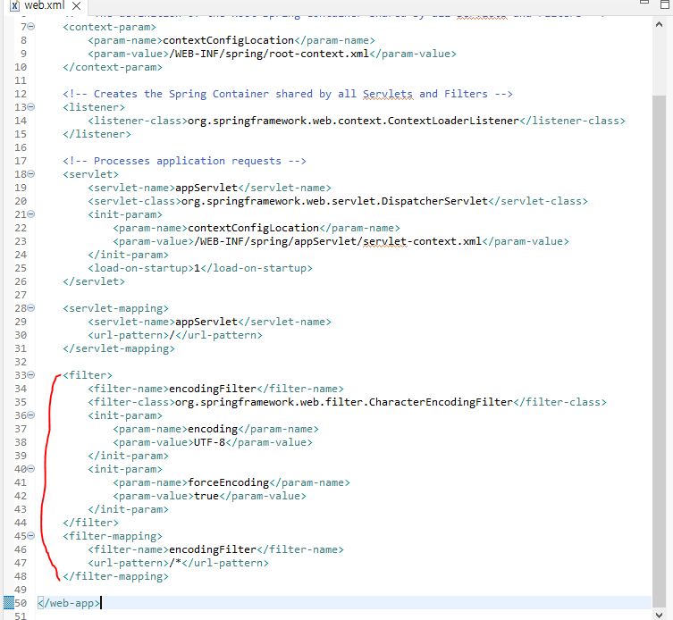  

추가한 후 서버를 실행하면 한글이 정상적으로 출력되는 것을 볼 수 있음.  


- STS 설치 및 환경설정 방법 정리 
1. STS3를 다운로드 후 압축 해제  
2. sts.exe 실행 및 workspace 설정 후 종료  
3. workspace 디렉토리 내 .metadata를 수정하여, Spring MVC Project를 생성할 수 있도록 설정  
4. 다시 sts.exe 실행  
5. window -> preferences 에서 general->workspace, Web-> Css Files, HTML Files, JSP files를 UTF-8로 설정  
6. web.xml 내에 한글처리 filter를 추가 작성  


## 신규 프로젝트 작성 시 서버 설정  
Servers 칸에 있는 Tomcat 아래에 `기존 프로젝트`를 삭제.  
서버 설정 창에 들어가서 아래 Modules 창을 열고, Web Modules 목록에서 기존 프로젝트가 제대로 지워졌는지 확인.  

이후 새로운 프로젝트를 실행했을 때 이상이 없는지 확인.  

