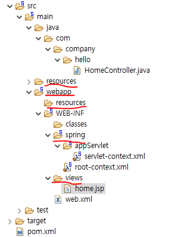
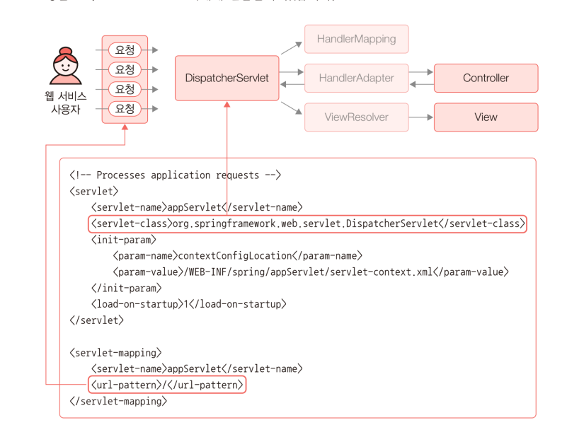
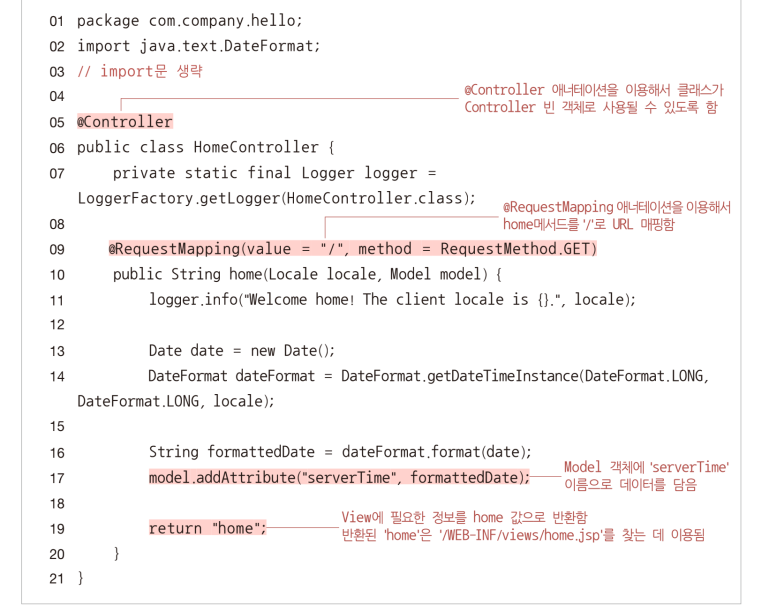
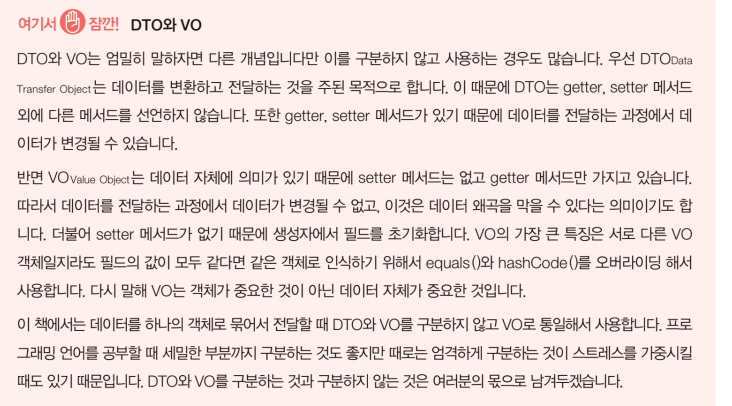
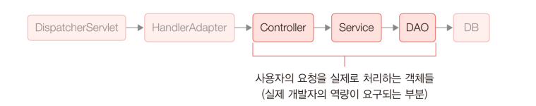

# MVC  
> Model View Controller  
웹 프로그래밍뿐만 아니라 프로그램 전반에 사용되는 디자인 패턴 중 하나.  

MVC를 보완한 MVVM(Model-View-View-Model), MVP(Model-View-Presenter) 등도 존재함.  

장점 : 프레젠테이션 로직과 비즈니스 로직을 분리할 수 있고, 각각의 기능을 모듈화해서 체계적으로 개발할 수 있음.  
유지보수 측에서도 전체적인 구조를 파악하기 수월함.  


- `Model` : 데이터베이스와 밀접한 관게를 가지고, 비즈니스 로직을 담당함.  
DB에 sqlquery를 통해 데이터를 담을 그릇을 보내 가져옴. (DAO)  

- `View` : 클라이언트와 밀접한 관계를 가지고, 비즈니스 로직의 결과를 출력하기 위한 화면 구성을 담당함.  
Model이 가져온 데이터를 통해 HTML file을 만듦.  

- `Controller` : 클라이언트의 요청에 대해 모델과 뷰를 컨트롤함.  
중간에서 명령하는 역할. 요청이 들어오면 Model에 DB요청을 하거나, View에게 file 생성 요청, View로부터 만들어진 file을 보냄  

```
모델은 데이터를 처리하는 영역. 일반적으로 데이터베이스와 연동을 위한 DAO(Data Access Object) 클래스와, 데이터 구조를 표현하는 DO(Data Object), 엔티티 클래스 등으로 구성됨.  
모델은 뷰나 컨트롤러에 독립적인 구조로 데이터베이스 처리를 필요로 하는 여러 애플리케이션에서 공유할 수 있으며 웹 애플리케이션이 아닌 경우에도 사용할 수 있는 형태이다.  

뷰는 화면 구성을 담당하는 영역이다. 뷰에서 데이터를 직접 가져오는 방식은 권장하지않고 주어진 데이터를 출력하는 용도로만 사용하는 것이 바람직하다. 뷰 영역의 구현을 위해 뷰 템플릿 엔진이 사용되며 JSP 역시 이러한 뷰 템플릿 엔진 중 하나다. 컨트롤러로부터 전달받은 데이터를 출력하고 HTML,CSS등을 통해 화면을 디자인한다. 뷰는 기본적으로 모델, 컨트롤러와의 종속성이 없도록 구현해야 한다.  

컨트롤러는 MVC 패턴의 핵심으로 모든 사용자 요청의 중심에 위치한다. 사용자의 요청은 특정 뷰에 바로 전달되지 않고 컨트롤러를 통해야 하며, 컨트롤러는 사용자 요청에 따라 모델을 통해 데이터베이스와 연동하여 데이터를 처리하고 뷰에 전달한다.  
```

## model1과 model2  
웹 애플리케이션을 구현하기 위한 프로그램 설계 방법.  
MVC 패턴을 웹 프로그래밍에 적용한 것.  

model1 설계 방법보다 효율적이고, 세련된 방법이 model2 설계 방법.  
유지보수 측에서 더 효율적이라는 것.  

그러나 model2는 소규모 개발 측에선 너무 과하단 느낌이 있음.  

---

### model1 설계 방법  
JSP와 JavaBeans를 이용하여 웹 애플리케이션을 개발하는 방법.  
주로 소규모 프로젝트 또는 초급 웹 개발자들이 데모 프로젝트를 만드는 데에 사용하는 방법.  

  

> JavaBeans : 웹에서 사용하는 Bean 객체. 데이터를 담을 상자를 class로 구현한 것.  
직렬화(Serializable) 되어있고, 속성들은 private field로 만들고, 생성자는 public, 속성들에 대한 getter setter를 설정되어있음.  

> 장점 : 다양한 파일을 만들지 않고도 HTML 기반의 JSP와 자바빈즈만을 만들어 개발하기 때문에, 개발 속도가 빠른 편임.  

> 단점 : 컨트롤러와 뷰 코드가 JSP에 섞여 있어 유지 보수가 어려움.  
대형 프로젝트 개발 및 유지 보수에는 적합하지 않음.  

---

### model2 설계 방법  
각각의 기능을 모듈화하여 설계하는 방법.  
기능 별로 구분되어 있어서 설계, 유지 보수가 용이함.  

  
위 구조도 명확하게 말하자면 mvc 패턴이라고 말하기는 힘듦.  

>   
    DB에 접근해야 하는 로직은 비즈니스 로직, 이에 대한 결과를 표시하는게 프레젠테이션 로직.  

# Spring MVC  
> 자바 기반 웹 애플리케이션을 개발하기 위한 오픈소스 프레임워크  

기본적으로 MVC 패턴을 따르기 떄문에 model2와 전체적인 구조가 비슷함.  

대략적인 스프링 MVC의 흐름 :  
  
클라이언트 요청 -> Dispatcher Servlet이 받음 -> 적합한 컨트롤러를 찾도록 Handler Mapping에게 전달 ->  
해당 컨트롤러에게 요청해달라고 Handler Adapter에게 요청 -> Controller가 처리한 정보를 응답 -> 응답 결과를 View Resolver에게 처리 결과를 전달 -> 만든 view를 Dispatcher Servlet에 전달 -> ...  

개발자는 Controller, View만 만들면 됨.  

## 스프링 프레임워크의 모듈  
필요할 때 사용할 모듈의 라이브러리를 개발 프로젝트에 가져와 사용하면 됨.  
  

대표적인 몇몇 모듈  
  

## DI와 IoC  

### DI (Dependency Injection 의존성 주입)  

`의존`이란 어떠한 객체가 다른 객체를 이용한다는 것.  
A 객체가 B 객체를 이용한다. -> A 객체가 B 객체에 의존한다.  
 
DI란 외부에서 두 객체 간의 관계를 결정해주는 디자인 패턴.  
의존성 주입이란 필요한(의존하는) 객체를 직접 생성하지 않고, 외부에서 주입하는 방식을 의미함.  
인터페이스를 사이에 둬서 클래스 간 의존 관계가 고정되지 않도록 함.  
대신에 런타임 시에 관계를 동적으로 주입함으로써 유연성을 확보하고 결합도를 낮출 수 있음.  


예를 들어, 다음과 같은 계산기 프로그램이 있다고 하자.  

```java
/*-------------------ICalculator---------------------*/

public interface ICalculator {
	public int doOperation(int firstNum, int secondNum);
}

/*------------------------Cal-------------------------*/

public class CalAdd implements ICalculator {
	@Override
	public int doOperation(int firstNum, int secondNum) {
		return firstNum + secondNum;
	}
}

public class CalSub implements ICalculator {
	@Override
	public int doOperation(int firstNum, int secondNum) {
		return firstNum - secondNum;
	}
}

public class CalMul implements ICalculator {
	@Override
	public int doOperation(int firstNum, int secondNum) {
		return firstNum * secondNum;
	}
}

public class CalDiv implements ICalculator {
	@Override
	public int doOperation(int firstNum, int secondNum) {
		return firstNum / secondNum;
	}
}

/*------------------------MyCalculator-------------------------*/

public class MyCalculator {

	public void calAdd(int fNum, int sNum) {
		ICalculator calculator = new CalAdd();			// CalAdd 객체 생성
		int value = calculator.doOperation(fNum, sNum); // 덧셈 실행
		System.out.println("result : " + value);
	}
	
	public void calSub(int fNum, int sNum) {
		ICalculator calculator = new CalSub();			// CalSub 객체 생성
		int value = calculator.doOperation(fNum, sNum); // 덧셈 실행
		System.out.println("result : " + value);
	}
	
	public void calMul(int fNum, int sNum) {
		ICalculator calculator = new CalMul();			// CalMul 객체 생성
		int value = calculator.doOperation(fNum, sNum); // 덧셈 실행
		System.out.println("result : " + value);
	}
	
	public void calDiv(int fNum, int sNum) {
		ICalculator calculator = new CalDiv();			// CalDiv 객체 생성
		int value = calculator.doOperation(fNum, sNum); // 덧셈 실행
		System.out.println("result : " + value);
	}
	
}
/*------------------------MainClass-------------------------*/
public class MainClass {

	public static void main(String[] args) {
		
		MyCalculator calculator = new MyCalculator();
		calculator.calAdd(10,5);
		calculator.calSub(10,5);
		calculator.calMul(10,5);
		calculator.calDiv(10,5);
	}

}
```

MainClass내에서 MyCalculator 객체를 생성하고,  
또 MyCalculator 내에서 CalAdd,Sub,Mul,Div 객체를 생성하고 있다.  
이 경우에는 한 클래스를 수정하게 되면 결합된 다른 클래스들도 같이 수정해줘야 함.  
즉 클래스 간의 결합도가 높음.  

클래스 간의 결합도를 낮추기 위해 의존성 주입 방법을 사용한다.  

```java

/*------------------------MyCalculator-------------------------*/

public class MyCalculator {
	
	public void calAdd(int fNum, int sNum, CalAdd calAdd) {
		int value = calAdd.doOperation(fNum, sNum); // 덧셈 실행
		System.out.println("result : " + value);
	}
	
	public void calSub(int fNum, int sNum, CalSub calSub) {
		int value = calSub.doOperation(fNum, sNum); // 덧셈 실행
		System.out.println("result : " + value);
	}
	
	public void calMul(int fNum, int sNum, CalMul calMul) {
		int value = calMul.doOperation(fNum, sNum); // 덧셈 실행
		System.out.println("result : " + value);
	}
	
	public void calDiv(int fNum, int sNum, CalDiv calDiv) {
		int value = calDiv.doOperation(fNum, sNum); // 덧셈 실행
		System.out.println("result : " + value);
	}
	
}

/*------------------------MainClass-------------------------*/

public class MainClass {

	public static void main(String[] args) {
		
		MyCalculator calculator = new MyCalculator();
		calculator.calAdd(10,5, new CalAdd());	// MainClass에서 MyCalculator 클래스로 객체를 주입
		calculator.calSub(10,5, new CalSub());
		calculator.calMul(10,5, new CalMul());
		calculator.calDiv(10,5, new CalDiv());

	}

}
```
MainClass에서 MyCalculator 클래스로 객체를 주입하는 방법.  
클래스 간 결합도가 낮아짐. == 의존성이 낮아짐.  

다음은 MyCalculator의 네 가지 메서드를 하나로 줄인 것임.  

```java

/*------------------------MyCalculator-------------------------*/

public class MyCalculator {

	public void cal(int fNum, int sNum, ICalculator cal) {
		int value = cal.doOperation(fNum, sNum);
		System.out.println("result : " + value);
	}
	
}

/*------------------------MainClass-------------------------*/

public class MainClass {

	public static void main(String[] args) {
		
		MyCalculator calculator = new MyCalculator();
		calculator.cal(10,5, new CalAdd());
		calculator.cal(10,5, new CalSub());
		calculator.cal(10,5, new CalMul());
		calculator.cal(10,5, new CalDiv());

	}

}

```

이러한 방법이 의존성 주입임.  
의존성과 결합도를 낮추는 효과가 있고, 유연성을 확보할 수 있음.  

### IoC(Inversion of Control)  
제어의 역전  

프로그램의 제어권을 개발자가 컨트롤하는 것이 아니라, 외부에서 컨트롤하는 방식을 의미함.  
=> 제어의 주체가 개발자에서 Spring으로 바뀐 것.  
Spring이 틀을 정해주고, 그 안에서 개발자가 세부 사항을 정하는 것과 같음.  

실제 Spring 방식과는 다르지만, 위 예시로 들은 계산기 프로그램에 IoC 방식을 적용해보겠음.  

```java

/*-----------CalAssembler---------*/

public class CalAssembler {
	private MyCalculator calculator;
	private CalAdd calAdd;
	private CalSub calSub;
	private CalMul calMul;
	private CalDiv calDiv;
	
	public CalAssembler() {
		calculator = new MyCalculator();
		calAdd = new CalAdd();
		calSub = new CalSub();
		calMul = new CalMul();
		calDiv = new CalDiv();
		
		this.assemble();
	}
	
	public void assemble() {
		calculator.cal(10,5, new CalAdd());
		calculator.cal(10,5, new CalSub());
		calculator.cal(10,5, new CalMul());
		calculator.cal(10,5, new CalDiv());
	}
}

/*------------ MainClass ------------*/

public class MainClass {

	public static void main(String[] args) {
		
		new CalAssembler();
	}
}
```

main() 메서드에서는 CalAssembler 객체만 생성하도록 변경됨.  
CalAssembler에서 객체 선언, 메서드 실행을 모두 하도록 함.  

IoC 컨테이너 : CalAssembler와 같이 객체를 생성하고 조립하는 특별한 공간.  
Bean : IoC 컨테이너의 객체 (재사용 가능)  

즉 스프링의 IoC 컨테이너는 Bean을 생성하고 필요한 곳에 주입(DI)하는 특별한 공간임.  
(개발자가 직접 제어하지 않음. 즉 Spring 위주로 개발하는 것.)  

> 요약  
      


## 컴파일과 빌드  

컴파일 : 코딩한 코드 파일을 바이트코드 파일로 변환하는 과정.  
Java에서 바이트코드 파일은 JVM에 의해 기계어로 바뀌어 컴퓨터에서 실행됨.  

빌드 : 컴파일보다 더 넓은 의미. 라이브러리 다운로드 및 연결, 컴파일, 링크, 패키징 등 애플리케이션 제작에 필요한 전반적인 과정을 뜻함.  
링크 : 서로 다른 파일을 연결해서 메서드 호출 등의 업무가 가능하게 만드는 것.  
패키징 : 구현된 각각의 기능들을 하나로 합쳐서 실행 파일을 만드는 것.  

### 빌드 툴 
빌드 툴에는 Ant, Maven, Gradle이 있음.  
어떠한 모듈을 가져와 사용할 때, 그 모듈을 사용하기 위해 필요한 다른 모듈들을 한꺼번에 가져와서 실행 가능한 상태로 만들어주는 것을 빌드 툴이라고 함.  

Maven vs Gradle  
Maven : 좀 더 쉽고 대중적. 옛날 버전과 호환성이 높음. 충돌이 자주 일어남. https://maven.apache.org/  
Gradle : Maven보다 어렵지만 훨씬 좋음.  

Ant : 과거에 많이 사용했지만, 내부 스크립트가 복잡해서 최근엔 잘 사용하지 않음.  


# Spring Maven Project  

### applicationContext  
- InitSampleData는 `<bean>`을 이용해서 빈을 생성하는 코드.  
- `<bean>`은 id와 class 속성을 가지고 있음.  
id에는 빈을 가리키는 레퍼런스 변수 이름을 명시하고, class에는 클래스 이름을 명시.  
이것은 기존의 자바 파일에서 자바 객체를 생성할 때 사용하는 레퍼런스 변수 및 클래스 이름과 같은 역할을 함.  
- `<property>`의 name 속성에는 필드 이름을 명시하고, 데이터 타입이 배열인 경우 `<array>`와 `<value>`를 이용해서 값을 명시.  
- 자바에서는 개발자가 어떠한 생성자도 명시하지 않으면 컴파일러가 컴파일 단계에서 자동으로 디폴트 생성자를 만듦.  
- IoC 컨테이너에 생성된 빈을 getBean()으로 호출하면 항상 동일한 객체가 반환됨.  
스프링이 기본적으로 객체 범위를 싱글턴으로 관리하기 때문.  
- 싱글턴은 객체를 호출할 때마다 새로 생성하지 않고 기존의 객체를 재활용함.  
개발자가 특별하게 명시하지 않으면 기본적으로 모든 빈은 싱글턴 범위를 가짐.  
- 싱글턴 범위와 반대의 개념도 있는데 이를 프로토타입 범위라고 함.  
프로토타입의 경우 개발자의 설정이 필요한데, 스프링 설정 파일에서 빈을 정의할 때 scope 속성을 명시해주면 됨.  

### bean  
bean을 만들 때, java에서 해당 클래스의 생성자를 호출함.  

bean은 객체를 가져올 때, 기본은 Singleton(같은 걸로 재활용)  
프로토타입을 이용하면, 다른 객체 가져올 수 있음.  
```xml
<bean id="dependencyBean" class="ch04_pjt_02.scope.DependencyBean" scope="prototype">
	<constructor-arg ref="injectionBean" />
```

## 의존 객체 주입  
클래스 생성자 매개변수로 객체를 전달 + applicationContext.xml에서도 `<bean>`의 `<constructor-arg ref="">` 태그 내에 bean을 전달.  
```xml

```

## 의존 객체 자동 주입(오토와이어링)  
xml 파일에 하나하나 적어주는 방법은 수많은 코드 중복을 일으킴.  
Spring에는 자동으로 의존성을 주입하는 기능이 있음.  
<span style="text-decoration:underline">스프링 IoC 컨테이너에 빈을 생성하지 않고도 자동으로 의존 객체를 생성한 후 필요한 곳에 주입함.</span>  


### `@Autowired` 애너테이션을 이용한 방법 (주로 사용함)  
@Resource, @Inject는 거의 안 쓰니까 @Autowired만 잘 알아두면 됨.  

---
#### 기능 추가 방법  
applicationContext.xml 파일 beans 태그에 아래 주소를 추가하면 이 기능을 사용할 수 있음.  
```xml
<beans ...
	여기부터
    xmlns:context="http://www.springframework.org/schema/context"
	xsi:schemaLocation="...
	http://www.springframework.org/schema/context
	http://www.springframework.org/schema/context/spring-context.xsd">
	여기까지

	<context:annotation-config /> <!-- 이것도 추가 -->
```
이를 추가하고 나면, constructor-arg 태그들을 지워줘야 함.  

만약, context:annotation-config />에 빨간 줄이 뜬다면, window-preference에 들어가서 아래와 같이 설정.  
  
Download external resources like referenced DTD, XSD 설정을 체크해야 외부 파일을 받아올 수 있음.  

---

기본 생성자가 없다는 걸 Spring이 인지하고, 알아서 필요한 객체를 주입함.  

그러나 기본 생성자가 있는 경우엔, 기본 생성자를 호출하게 되고  
필요한 객체를 주입받지 못 해서 NullPointerException 예외가 발생하게 됨.  
즉, 먼저 기본 생성자를 호출해보고, 기본 생성자가 없으면 매개변수가 있는 생성자를 찾아 호출함.  

기본 생성자가 있더라도 자동 주입이 되어야 할 생성자에 @Autowired 애노테이션을 적어 따로 지정을 해줄 수 있음.  


자동 주입이 되어야 할 생성자 위에 `@Autowired` 애노테이션을 추가하면, 생성자 매개변수에 필요한 bean을 자동으로 가져옴.  

@Autowired(required=false)로 지정하면, 의존 객체 자동 주입이 필수가 아닌, 필요에 따라서만 주입됨.  
따라서 의존 대상 객체를 못 받아서 발생하는 에러를 피할 수 있음.  


```java
public class ContactSearchService {
				// 기본 생성자
	public ContactSearchService() {
		System.out.println("ContactSearchService의 기본 생성자");
	}

	private ContactDao contactDao;
	
	@Autowired	// 자동 주입이 되어야 할 생성자
	public ContactSearchService(ContactDao contactDao) {
		System.out.println("contactDao: " + contactDao);
		this.contactDao = contactDao;
	}
	...
}
```

 `@Autowired` 애노테이션을 어느 곳에 두느냐에 따라 오토 와이어링 방식이 세 가지로 나뉨.  
 - 필드 주입 : 클래스의 필드에 @Autowired를 사용하는 방식.  
	간단하고 편리하지만, 순환 의존성 문제가 발생할 수 있음.  
	final로 지정할 수 없어 불변 객체를 만들 수 없음.  
	의존 관계가 잘 보이지 않고 복잡해질 수 있음.  
	```java
	class Game {
		@Autowired
		private Weapon w;

		public gameRun() {
			w.fire();
		}
	}
	```

 - 생성자 주입 : 생성자에 @Autowired를 사용하는 방식.  
	일반적으로 권장되는 방식임.  
	생성자가 하나인 경우엔 적지 않아도 됨.  
	참조 객체를 final로 받아 사용할 수 있어서 보다 안전함.  

	```java
	class Game {
		private final Weapon w;
		
		@Autowired
		public Game(Weapon w) {
			this.w = w;
		}

		public gameRun(){
			w.fire();
		}
	}
	```

 - Setter(메서드) 주입 : setter 메서드에 @Autowired를 사용하는 방식.  
	보통 생성자에 과도하게 의존성 주입이 되는 것을 보완하기 위해 사용하거나,  
	의존성이 선택적인 경우에 권장됨.  
	```java
	class Game {
		private Weapon w;
		
		@Autowired
		public setWeapon(Weapon w) {
			this.w = w;
		}
	}
	```
---


### @Resource 애노테이션을 이용한 방법  
@Resource와 @Autowired의 차이점  
@Autowired : 적합한 데이터 타입을 이용해서 의존 객체를 자동으로 주입함.  
	필드, 생성자, 메서드에 사용 가능.  
@Resource : 빈의 이름을 이용해서 의존 객체를 자동으로 주입함.  
	필드, 메서드에만 사용 가능. 
	(자바 자체에서 제공하는 애노테이션. 추가적으로 설치 해줘야함.)  

자바 애노테이션 링크 : https://mvnrepository.com/artifact/javax.annotation/javax.annotation-api  

POM.xml `<dependencies>`태그 내에 추가
```xml
	<dependency>
	    <groupId>javax.annotation</groupId>
	    <artifactId>javax.annotation-api</artifactId>
	    <version>1.3.2</version>
	</dependency>
```

### 만약 필요한 빈이 여러개라면?  
> @Autowired와 @Resource만 사용할 수 있는 @qualified 기능.  
 생성자에는 사용할 수 없음.  

빈을 여러 개 만들어놓는 경우는 빈번히 일어나는데,  
빈을 생성할 때 필요한 빈이 똑같은 걸로 여러 개가 있다면 에러가 발생함.  

이 때, bean에 qualifier 태그와 @qualified 애노테이션을 통해 해결할 수 있음.  
```xml
	<bean id="contactDao1" class="ch05_pjt_01.contact.dao.ContactDao">
		<qualifier value="usedDao" />
	</bean>
	<bean id="contactDao2" class="ch05_pjt_01.contact.dao.ContactDao" />
	<bean id="contactDao3" class="ch05_pjt_01.contact.dao.ContactDao" />
```
```java
public class ContactRegisterService {
	
	@Autowired
	@Qualifier("usedDao")
	private ContactDao contactDao;
	...
}
```


### @Inject 애노테이션을 이용한 방법  
사용 방법은 @Autowired와 동일하지만, required 속성을 지원하지 않음.  
필드, 생성자, 메서드에 사용 가능.  

```xml
<!-- https://mvnrepository.com/artifact/javax.inject/javax.inject -->
<dependency>
    <groupId>javax.inject</groupId>
    <artifactId>javax.inject</artifactId>
    <version>1</version>
</dependency>

```

required 대신에, @Named()에 id값을 전달하면 됨.  

```java
	@Inject
	@Named("contactDao1")
	public ContactRegisterService(ContactDao contactDao) {
		System.out.println("contactDao: " + contactDao);
		this.contactDao = contactDao;
	}
```

```
IoC 컨테이너의 역할은 Bean객체를 생성하고, Bean이 생성될 때 필요한 매개변수를 생성해서 Bean에 주입하는 것.  

@Autowired는 생성자, 필드, 메서드에 사용할 수 있음. 일반적으로 가장 많이 사용하는 방법은 필드에 @Autowired를 명시하는 방법이다.  

@Autowired와 함께 의존 객체 자동 주입 기능을 제공하는 다른 애너테이션으로 @Resource가 있다.  
@Autowired는 데이터 타입을 이용해서, @Resource는 bean 객체의 이름을 이용해서 의존 객체 자동 주입.  

@Resource와 @Inject는 스프링이 아닌 자바에서 제공하는 애너테이션이기 떄문에 관련 모듈을 pom.xml에 설정해야 한다.  

다수의 빈 객체가 있을 경우 <qualifier>와 @Qualifier를 이용한다. 만약 빈의 id와 동일한 이름을 사용한 @Autowired 및 @Resource가 적용된 생성자 또는 멤버가 있다면 <qualifier>와 @Qualifier를 이용하지 않아도 의존 객체가 자동으로 주입된다.  

매개변수 개수가 2개 이상일 때도 의존 객체 자동 주입은 가능하다. 주입 대상 매개변수에 @Qualifier를 적용하면 된다.  
```

## @Configuration을 이용한 빈 생성  
@Configuration 애노테이션을 통해, 해당 자바 파일이 IoC 컨테이너 역할을 대신한다고 명시.  
즉 xml 파일 대신에 java 파일을 사용하는 것임.  
xml, java 둘 중 편한 방식을 선택하면 됨.  
java는 오타를 잡아줘서 더 편할 수 있음.  

예제 파일 : ch06_pjt_01  
우선 @Configuration 애노테이션을 사용할 클래스를 생성함.  
ch06_pjt_01.ems.configuration.MemberConfig.java  

```xml
<bean id="studentDao" class="ch06_pjt_01.ems.member.dao.StudentDao.class" />
```
```xml
<bean id="dev_DBConnectionInfoDev"	class="ch06_pjt_01.ems.member.DBConnectionInfo"> 
<property name="url" value="000.000.000.000" /> 
<property name="userId" value="admin" /> 
<property name="userPw" value="0000" /> </bean>
```
위 xml 코드를 아래와 같이 변환하여 작성  
```java
@Bean
public StudentDao studentDao() {
	return new StudentDao();
}
```
```java
@Bean
public DBConnectionInfo dev_DBConnectionInfoDev() {
	DBConnectionInfo dbConnectionInfo = new DBConnectionInfo();
	dbConnectionInfo.setUrl("000.000.000.000");
	dbConnectionInfo.setUserId("admin");
	dbConnectionInfo.setUserPw("0000");
	return dbConnectionInfo;
}
```

또한 GenericXmlApplicationContext 대신에 AnnotationConfigApplicationContext로 Config 클래스를 받아 IoC 컨테이너를 만듦.  
```java 
GenericXmlApplicationContext ctx = 
		new GenericXmlApplicationContext("classpath:applicationContext.xml");
↓
AnnotationConfigApplicationContext ctx = 
		new AnnotationConfigApplicationContext(MemberConfig.class);
```

이것이 가능한 이유는 GenericXmlApplicationContext와 AnnotationConfigApplicationContext가 GenericApplicationContext를 상속하기 때문임.  

  

Config 파일들을 분리해서 사용할 때, AnnotationConfigApplicationContext에 한꺼번에 넣는 방법이 있고,  
```java
/*--------------MainClassUsingConfig.java----------------*/
AnnotationConfigApplicationContext ctx = 
		new AnnotationConfigApplicationContext(MemberConfig1.class,MemberConfig2.class,MemberConfig3.class);
```

Config 파일 하나에 @Import 애노테이션으로 다른 Config 파일들을 임포트하여, AnnotationConfigApplicationContext에 파일 하나만 넣는 방법이 있음.  

```java
/*--------------MemberConfig1.java-----------------------*/
@Configuration
@Import({MemberConfig2.class, MemberConfig3.class})
public class MemberConfig1 {
	...
	

/*--------------MainClassUsingConfig.java----------------*/
AnnotationConfigApplicationContext ctx = 
		new AnnotationConfigApplicationContext(MemberConfig1.class);
```

```
정리:  
기존의 XML 파일을 애너테이션(@Configuration, @Bean)을 이용한 Java 파일로 만들 수 있다.

본문의 MemberConfig.java는 applicationContext.xml의 역할을 대신할 파일이므로, 프로그램에 필요한 각종 빈 객체를 생성하는 코드를 작성해야 한다.

빈을 생성하는 메서드의 문법 구조는 의외로 간단하다. 메서드 이름은 빈 객체의 id이고 반환되는 데이터 타입은 빈 객체의 타입명이다.

setter 메서드를 이용해서 의존객체를 주입할 때 XML에서는 <property> 태그를 이용했다면, Java 코드에서는 객체 생성 후 생성된 객체의 setter 메서드를 직접 호출한다.

스프링 컨테이너를 초기화하는 클래스로 GenericXmlApplicationContext를 사용했다면, 스프링 컨테이너가 생성될 때 스프링 설정 파일로 Java 파일이 이용되면 AnnotationConfigApplicationContext를 사용해야 한다.

XML 파일을 이용해서 스프링 설정 파일을 제작할 때 하나의 SML 파일에 모든 빈 객체에 대한 설정을 구성하기보다는 가능한 기능 단위로 스프링 설정 파일을 분리하는 것이 좋다.

애너테이션을 이용해서 스프링 설정 파일을 제작할 떄도 다른 Java 파일을 임포트할 수 있는데, 이때 사용되는 애너테이션이 @Import이다.
``` 

여기까지는 옛날 방식.  

---

# STS  
Spring Tool Suit  
- 개발을 좀 더 쉽게 진행할 수 있도록 고안된 스프링을 이용한 IDE  
- STS를 사용하는 방법  
	- 이클립스에 STS 플러그인 설치  
	- 스프링 깃허브에서 단독으로 내려받아 사용  
	(플러그인 설치 시 문제가 발생하는 경우가 있어, 깃허브에서 다운받는 것을 권장함.)  


## 패키지 구조  

참고 사이트 : https://dig06161.github.io/2022/03/28/make-spring-project/  

  

기본적인 코드 작성은 com.company.hello 에 작성하게 된다.  

src/main/webapp 아래에 resources폴더는 우리가 웹 서버를 프로그래밍 하면서 정적 링크를 사용할 경로이다. 예를 들어 이미지 파일들이 될 것이다.  

WEB-INF -> spring 아래의 파일과 폴더들은 웹 서버 상에서는 접근이 불가능한 부분이다. 스프링의 기본적인 설정파일들이 담겨있다.  

web.xml -> 서블릿 설정과 컨텍스트관련 경로 설정을 잡아준다. WAS에서 필요한 Servlet설정들을 명시해주는 부분이다. servlet-context.xml을 가리키고 있음.  

view -> home.jsp는 servlet-context.xml에서 설정한것 같이, 컨트롤러에 URL 요청이 들어오면 리턴되는 jsp 파일들이 저장되는 곳이다.  

/src/test 폴더는 JUnit test에 사용된 코드와 class들이 저장되는 곳이다.  

pom.xml  
Spring은 Maven의 의존성을 통해 버전관리를 하고 원하는 라이브러리를 편하게 다운받을 수 있다. 이런 Maven의 설정에 관한 코드를 pom.xml에 작성한다. 스프링 버전, 자바 버전, 기타 라이브러리 등 모든 버전과 관련된 설정파일은 전부 여기에 작성된다.  

WEB-INF 폴더 내 resources 폴더에 사진을 넣으면, 웹에서 폴더 내 파일들에 접근할 수 있음.  

---

Dispatcher Servlet이 연결되는 구조 :  
  

Dispatcher Servlet 동작 구조 :  
  


---

  
`View Resolver`에게 `WEB-INF/views/` 경로와 `.jsp` 확장자를 설정해줌.  


```xml
<!-- Enables the Spring MVC @Controller programming model -->
<annotation-driven />
<!-- @Controller 애노테이션을 사용할 수 있도록 설정 -->
<!-- 이게 없으면 bean을 생성할 때 자바 파일을 하나하나 연결해줘야됨 -->
```

```xml
<context:component-scan base-package="com.company.hello" />
<!-- 패키지 경로를 설정하여 Spring이 하위 경로를 탐색할 수 있도록 함 -->
<!-- 이게 없으면 아무리 애노테이션을 잘 써놔도 자동으로 탐색할 수 없음 -->
```

---

<h3>여기가 가장 핵심임!!</h3>  

### HomeController.java와 home.jsp  
  

클라이언트가 가장 상위 디렉토리 `/`에 연결을 요청하면, home.jsp를 바탕으로 만들어진 html 파일을 반환하도록 되어있음.  

정확히 말하자면, 연결이 요청되면 home 메서드가 정보를 만들어 반환하고,  
반환된 정보를 통해 ViewResolver가 view를 만들어 dispatcherservlet에게 전달해주고 이를 화면에 뿌리게 됨.  

컨트롤러 내 메서드를 어느 상황에 실행시킬지 정하려면,  
@RequestMapping 애노테이션을 붙이고, 어떤 경로로 요청이 들어왔을 때, 어떤 메서드 방식(GET,POST 등)을 수행할지 정함.  
메서드 방식은 안 적을 수도 있음.  


```java
@Controller
public class HomeController {
	
	private static final Logger logger = LoggerFactory.getLogger(HomeController.class);
	
	/**
	 * Simply selects the home view to render by returning its name.
	 */
	@RequestMapping(value = "/", method = RequestMethod.GET)
	public String home(Locale locale, Model model) {
		logger.info("Welcome home! The client locale is {}.", locale);
		
		Date date = new Date();
		DateFormat dateFormat = DateFormat.getDateTimeInstance(DateFormat.LONG, DateFormat.LONG, locale);
		
		// 날짜값을 String으로 형변환
		String formattedDate = dateFormat.format(date);
		
		// model에 String으로 변환된 날짜값을 서버타임이라는 이름으로 담음
		// model이란 객체는 데이터를 담을 바구니 .addAttribute 메서드를 통해 담음
		model.addAttribute("serverTime", formattedDate );
		
		return "home";
	}
	
}
```
```javascript
<!-- home.jsp -->

<%@ taglib uri="http://java.sun.com/jsp/jstl/core" prefix="c" %>
<%@ page session="false" %>
<html>
<head>
	<title>Home</title>
</head>
<body>
<h1>
	Hello world!  
</h1>
	<!-- HomeController에서 만든 model 안에 있는 serverTime 데이터 -->
<P>  The time on the server is ${serverTime}. </P>
</body>
</html>
```
home() 메서드가 home을 return하면서 home.jsp를 실행함.  
home.jsp는 serverTime 변수를 갖다 쓰고, 최종적으로 html 파일을 만들어서 이 파일을 Client에게 전송하여 화면에 보여줌  
단, 파일이 동적으로 변하지 않고 정적인 화면을 보여줌  
이 요청은 새로고침 할 때마다 수행됨  

리턴할 때, 문자열 "home"을 반환하게 되는데 이는 home.jsp의 파일명을 나타냄  

# 컨트롤러와 jsp 연결 예시  

우선 아래와 같이 컨트롤러 클래스를 하나 만들어줌.  

```java
package com.company.hello.member;

import org.springframework.stereotype.Controller;
import org.springframework.web.bind.annotation.RequestMapping;

@Controller	// 컨트롤러임을 명시
public class MemberController {
	
	@RequestMapping("/signUp")	// 어떤 경우에 이 메서드를 실행할지 명시. /signUp 디렉토리에 연결 요청하면 실행
	public String signUp() {
		
		return "sign_up";		// 연결할 jsp 파일명을 반환.
	}
	
	@RequestMapping("/signIn")
	public String signIn() {
		
		return "sign_in";
	}
}

```
링크에 연결되는 각각의 페이지를 반환할 jsp 파일을 만들어줌  

```jsp
<!-- sign_up.jsp -->
<%@ page language="java" contentType="text/html; charset=UTF-8"
    pageEncoding="UTF-8"%>
<!DOCTYPE html>
<html>
<head>
<meta charset="UTF-8">
<title>회원가입 페이지</title>
</head>
<body>
	<p> 이 페이지는 회원가입을 위한 페이지입니다. </p>
</body>
</html>
```

```jsp
<!-- sign_in.jsp -->
<%@ page language="java" contentType="text/html; charset=UTF-8"
    pageEncoding="UTF-8"%>
<!DOCTYPE html>
<html>
<head>
<meta charset="UTF-8">
<title>로그인 페이지</title>
</head>
<body>
	<p> 이 페이지는 로그인용 페이지입니다. </p>
</body>
</html>
```

기본 페이지 경로 뒤에 signUp, signIn을 입력하여 연결 요청하면, 해당 페이지로 이동.  
즉, jsp 파일들을 통해 만들어진 html을 볼 수 있게 됨.  

---

```
정리

1. STS는 스프링을 이용한 프로그램 개발을 좀더 쉽게 진행할 수 있도록 고안된 프로젝트이다.  

2. pom.xml은 프로젝트에 필요한 라이브러리를 메인 리포지터리에서 다운받기 위한 메이븐 설정 파일이다.

3. web.xml은 웹 서비스의 전반적인 설정을 하는 파일이다. 웹 애플리케이션의 모든 객체를 관리하는 DispatcherServlet 객체를 서블릿으로 등록해주는 코드도 web.xml에 있다.

4. servlet-context.xml은 스프링 설정 역할을 하는 설정 파일이다. 스프링 설정 파일은 클래스로부터 빈 객체를 생성하고 조립하는 역할을 한다.

5. Controller 객체는 클라이언트의 요청을 받아서 사용자의 요청에 부합하는 메서드를 실행한다. 그리고 해당 메서드는 Service와 DAO 등을 이용해서 사용자의 요청에 대한 작업을 진행한다. 메서드의 작업이 완료되면 View 정보를 반환하고, 반환된 정보를 이용해서 JSP 파일이 실행된다. 
```

# 컨트롤러와 jsp 연결 회원가입 예시  

▼ jsp에 값을 입력받을 수 있는 form을 아래와 같이 작성  

```jsp
<%@ page language="java" contentType="text/html; charset=UTF-8"
    pageEncoding="UTF-8"%>
<!DOCTYPE html>
<html>
<head>
<meta charset="UTF-8">
<title>회원가입 페이지</title>
</head>
<body>

	<h3>회원 가입 페이지입니다.</h3>
	<!-- action에 적은 경로로 데이터 전달 -->
	<form action="/hello/signUpConfirm">
		ID : <input type="text" name="m_id"><br/>
		PW : <input type="password" name="m_pw"><br/>
		MAIL : <input type="text" name="m_mail"><br/>
		PHONE : <input type="text" name="m_phone"><br/>
		<input type="submit" value="회원가입">
		<input type="reset" value="취소">
	</form>
</body>
</html>
```

▼ 클라이언트로부터 입력받은 값을 전달받아 처리할 컨트롤러를 아래와 같이 작성  

```java
@Controller	// 컨트롤러임을 명시
public class MemberController {
	
	@Autowired
	private MemberService memberService;

	
	@RequestMapping("/signUp")	// 어떤 경우에 이 메서드를 실행할지 명시. /signUp 디렉토리에 연결 요청하면 실행
	public String signUp() {
		
		return "sign_up";		// 연결할 jsp 파일명을 반환.
	}
	
	@RequestMapping("/signIn")
	public String signIn() {
		
		return "sign_in";
	}
	
		// @RequestParam으로 받아올 때, 원시형 자료형은 에러가 발생할 수 있음.  
		// 때문에 String, Integer같은 클래스로 받아오는 것이 좋음.  
	@RequestMapping("/signUpConfirm")
	public String signUpConfirm(@RequestParam String m_id,
								@RequestParam String m_pw,
								@RequestParam String m_mail,
								@RequestParam String m_phone) {
		
		System.out.println("[MemberController] signUpConfirm()");
		
		System.out.println("m_id : " + m_id());
		System.out.println("m_pw : " + m_pw());
		System.out.println("m_mail : " + m_mail());
		System.out.println("m_phone : " + m_phone());

		return null;
	}
}
```

## 서비스 객체  
▼ 생성 방법  
  
3가지 방법 중 3번째 방법이 가장 보편적임.  

### 첫번째 방법  

```java
public class MemberService {
	
	public int signUpConfirm(MemberVo memberVo) {
		
		System.out.println("[MemberService] signUpConfirm()");
		System.out.println("m_id : " + memberVo.getM_id());
		System.out.println("m_pw : " + memberVo.getM_pw());
		System.out.println("m_mail : " + memberVo.getM_mail());
		System.out.println("m_phone : " + memberVo.getM_phone());
		
		return 0;
	}
}
```
```java
	// MemberController.java에 추가.

@Controller	
public class MemberController {
	
	// new 키워드를 통해 만들기 때문에 의존성이 생김
	private MemberService memberService = new MemberService();
	
	@RequestMapping("/signUp")	
	public String signUp() {
		
		return "sign_up";
	}
	
	@RequestMapping("/signIn")
	public String signIn() {
		
		return "sign_in";
	}
	
	@RequestMapping("/signUpConfirm")
	public String signUpConfirm(MemberVo memberVo) {
		
		System.out.println("[MemberController] signUpConfirm()");
		
		System.out.println("m_id : " + memberVo.getM_id());
		System.out.println("m_pw : " + memberVo.getM_pw());
		System.out.println("m_mail : " + memberVo.getM_mail());
		System.out.println("m_phone : " + memberVo.getM_phone());
		
		
		memberService.signUpConfirm(memberVo);
		return null;
	}
}

```

---

### 두번째 방법  

```xml
<!-- servlet-context.xml에 추가하여 memberService bean 생성 -->
<beans:bean id="memberService" class="com.company.hello.member.service.MemberService" />
```

```java
// MemberController.java에 아래 내용으로 수정
@Autowired
private MemberService memberService;
```

---

### 세번째 방법 (주로 사용)  

MemberService 클래스에 `@Service` or `@Component` or `@Repository` 애노테이션을 달아줌.  
```java
@Service // or @Component or @Repository 애노테이션을 통해 아래 클래스를 Bean으로 만듦
public class MemberService {
	
	public int signUpConfirm(MemberVo memberVo) {
		
		System.out.println("[MemberService] signUpConfirm()");
		System.out.println("m_id : " + memberVo.getM_id());
		System.out.println("m_pw : " + memberVo.getM_pw());
		System.out.println("m_mail : " + memberVo.getM_mail());
		System.out.println("m_phone : " + memberVo.getM_phone());
		
		return 0;
	}
}
```

```java
@Controller	// 컨트롤러임을 명시
public class MemberController {
	
	// @AutoWired 애노테이션으로 의존 객체 자동 주입
	@Autowired
	private MemberService memberService;
	
	@RequestMapping("/signUp")	
	public String signUp() {
		
		return "sign_up";		
	}
	
	@RequestMapping("/signIn")
	public String signIn() {
		
		return "sign_in";
	}
	
	@RequestMapping("/signUpConfirm")
	public String signUpConfirm(MemberVo memberVo) {
		
		System.out.println("[MemberController] signUpConfirm()");
		
		System.out.println("m_id : " + memberVo.getM_id());
		System.out.println("m_pw : " + memberVo.getM_pw());
		System.out.println("m_mail : " + memberVo.getM_mail());
		System.out.println("m_phone : " + memberVo.getM_phone());
		
		
		memberService.signUpConfirm(memberVo);
		return null;
	}
}

```
동작 원리는 아래와 같음.  

  

## DAO 객체  

Member 데이터를 저장할 클래스를 아래와 같이 만듦.  

```java
@Repository
public class MemberDao {
	
	private Map<String, MemberVo> memberDB = new HashMap<String, MemberVo>();
	
	public void insertMember(MemberVo memberVo)
	{
		System.out.println("[MemberDao] insertMember()");
		System.out.println("m_id : " + memberVo.getM_id());
		System.out.println("m_pw : " + memberVo.getM_pw());
		System.out.println("m_mail : " + memberVo.getM_mail());
		System.out.println("m_phone : " + memberVo.getM_phone());
		
		memberDB.put(memberVo.getM_id(), memberVo);
		// 실행 결과를 보기 위해 insertMember와 printAllMember를 함께 실행
		this.printAllMember();
	}
	
	private void printAllMember() {
		System.out.println("[MemberDao] printAllMember()");
		
		Set<String> keys = memberDB.keySet();
		Iterator<String> iterator = keys.iterator();
		
		while(iterator.hasNext()) {
			String key = iterator.next();
			MemberVo memberVo = memberDB.get(key);
			System.out.println("============================");
			System.out.println("m_id : " + memberVo.getM_id());
			System.out.println("m_pw : " + memberVo.getM_pw());
			System.out.println("m_mail : " + memberVo.getM_mail());
			System.out.println("m_phone : " + memberVo.getM_phone());
		}
	}
}

```

MemberService.java에 아래 내용 추가.  

```java
	@Autowired
	private MemberDao memberDao;
```

  
  

#### ch08_pjt_01 작동 방식  

웹 페이지에서 값을 입력하고 submit  
-> /signUpConfirm 경로로 MemberVo에 값을 담아 반환  
-> MemberController의 signUpConfirm 메서드 실행 (MemberVo 데이터 전달)  
-> MemberService의 signUpConfirm 메서드 실행  
-> MemberDao의 insertMember 메서드 실행 (MemberVo 데이터 전달받아 실행됨)  
-> memberDB Map에 MemberVo 데이터가 저장됨  
-> 저장함과 동시에 MemberDao의 printAllMember 메서드를 실행  
-> memberDB 내 모든 값을 출력  