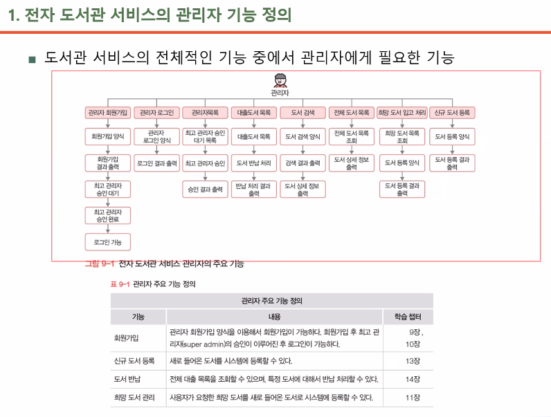
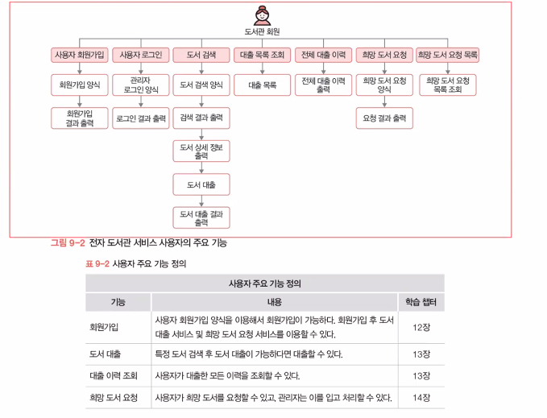
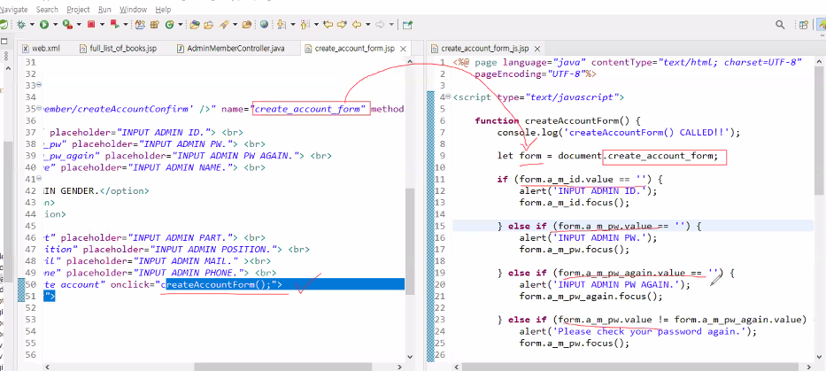
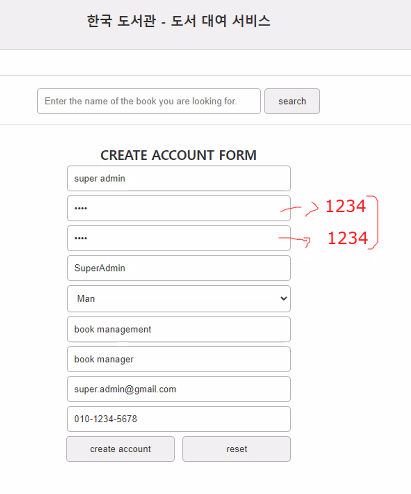
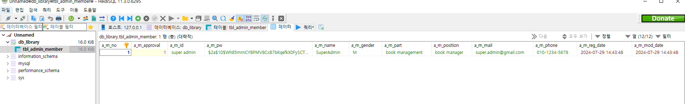

# 전자 도서관 서비스 설계  
관리자 회원가입 기능, DB 연동, 데이터 암호화 기능 구현  

구현할 관리자 기능 목록  
  

구현할 사용자 기능 목록  
  

## 구조  

--- 

### 회원가입 기능  

#### AdminHomeController  

@RequestMapping으로 받은 경로마다 Controller를 다르게 사용하도록 만들어줌.  

```java
package com.office.library.admin;

import org.springframework.stereotype.Controller;
import org.springframework.web.bind.annotation.RequestMapping;
import org.springframework.web.bind.annotation.RequestMethod;

@Controller
@RequestMapping("/admin") // /library/admin <-- AdminHomeController
public class AdminHomeController {
	
	private String nextPage;
	
	public AdminHomeController() {
		this.nextPage = null;
	}
	
	@RequestMapping(value = {"","/"}, method = RequestMethod.GET)	// /library/admin or /library/admin/
	public String home() {
		System.out.println("[AdminHomeController] home()");
		
		this.nextPage = "admin/home";
		return nextPage;
	}
}
```

#### AdminMemberController  

```java
@Controller
@RequestMapping("/admin/member")
public class AdminMemberController {
	
	// view 페이지를 공유하는 멤버 변수
	private String nextPage;
	
	@Autowired
    private AdminMemberService adminMemberService;
	
	public AdminMemberController() {
		this.nextPage = null;
	}

	// 회원가입사이트 요청이 들어오면 회원가입 양식 페이지를 반환  
	@RequestMapping(value = "/createAccountForm", method = RequestMethod.GET)
	public String createAccountForm()
	{
		System.out.println("[AdminMemberController] createAccountForm()");
		this.nextPage = "admin/member/create_account_form";
		
		return this.nextPage;
	}
	
	// 회원가입
	@RequestMapping(value="/createAccountConfirm", method = RequestMethod.POST)
	public String createAccountConfirm(AdminMemberVo adminMemberVo) {
		System.out.println("[AdminMemberController] createAccountConfirm()");
		
		this.nextPage = "admin/member/create_account_ok";
		
		int result = adminMemberService.createAccountConfirm(adminMemberVo);
        if(result <= 0) { this.nextPage = "admin/member/create_account_ng"; }
		
		return this.nextPage;
	}
	
}
```

#### AdminMemberService  

```java
@Service // @Component // @Repository
public class AdminMemberService {
	
	// 결과값을 상수로 지정해놓음으로써, 나중에 코드를 다시 확인할 때 한 눈에 알아볼 수 있도록 함 
	public final static int ADMIN_ACCOUNT_ALREADY_EXIST = 0;
	public final static int ADMIN_ACCOUNT_CREATE_SUCCESS = 1;
	public final static int ADMIN_ACCOUNT_CREATE_FAIL = -1;
	
	@Autowired
	private AdminMemberDao adminMemberDao;
	
	
	// DB에 입력 데이터를 넣기 전에 중복 확인 결과를 반환
    public int createAccountConfirm(AdminMemberVo adminMemberVo) {
        System.out.println("[AdminMemberService] createAccountConfirm()");
        
        boolean isMember = adminMemberDao.isAdminMember(adminMemberVo.getA_m_id());
        
        if(!isMember) {
        int result = adminMemberDao.insertAdminAccount(adminMemberVo);
	        if(result > 0) return ADMIN_ACCOUNT_CREATE_SUCCESS;
	        else {
	        	if(result == 0) return ADMIN_ACCOUNT_ALREADY_EXIST;
	        }
	        return ADMIN_ACCOUNT_CREATE_FAIL;
        }
    }
}
```

#### AdminMemberDao  


- 데이터 추간데 왜 insert 아니고 update 씀?  
jdbcTemplate에는 insert, update, delete 기능들은 모두 update로 이루어짐  
https://stackoverflow.com/questions/38225229/why-there-is-no-insert-in-spring-jdbctemplate  


## jsp 태그 설명  

`<jsp:include page="파일" />` : 지정한 파일을 페이지 내에 추가함.  
워터마크처럼 공통적으로 넣을 내용들을 따로 만들어 추가하는 것.  

```jsp
<jsp:include page="../include/title.jsp" />
```

메서드만 따로 작성하여 포함시킬 수도 있음.  

  

## DB  
MariaDB 10.11.2-winx64 버전  

AUTO_INCREMENT를 사용하면 ORACLE에서의 시퀀스를 더 간편하게 사용할 수 있음.  

시퀀스가 뭔지 기억이 안나요?  

---

  `시퀀스(SEQUENCE)`  
  오라클 데이터베이스에서, 특정 규칙에 맞는 연속 숫자를 생성하는 객체.  
  ```SQL
  CREATE SEQUENCE sequence_name 
  [INCREMENT BY] 
  [START WITH]
  [MAXVALUE n | NOMAXVALUE]
  [MINVALUE n | NOMINVALUE]
  [CYCLE | NOCYCLE]
  [CACHE n | NOCACHE]
  ```

---

DB를 Java로 제어하려면 JDBC가 필요함.  


### JDBC  
Java DataBase Controller  
Java를 통해 DB를 관리할 수 있도록 연결해주는 것.  

JDBC 템플릿을 통해 간편하게 사용할 수 있음.  

`MyBatis`는 JDBC를 좀 더 편하게 쓸 수 있도록 도와줌.  
`JPA`는 더더 편하게 Java 코드만으로 DB를 관리할 수 있음.  

JDBC를 사용하려면 드라이버, DB의 주소, ID, PW가 필요함.  
이를 Maven이라면 pom.xml에 드라이버를, jdbc-context.xml에 접속 관련 정보들을 적어 넣어줘야함.  


우선 Maven 기준으로, pom.xml에 jdbc와 mariadb 템플릿을 아래와 같이 적어 설치하자.  
```xml
		<!-- Spring JDBC -->        
		<dependency>
			<groupId>org.springframework</groupId>
			<artifactId>spring-jdbc</artifactId>
			<version>${org.springframework-version}</version>
		</dependency>
		<!-- mariaDB Driver -->
		<dependency>
			<groupId>org.mariadb.jdbc</groupId>
			<artifactId>mariadb-java-client</artifactId>
			<version>3.1.2</version>
		</dependency>
```

그리고 main/webapp/WEB-INF/spring 에 xml파일을 생성하여 아래와 같은 내용을 넣어줌.  

```xml
<!-- jdbc-context.xml -->
<?xml version="1.0" encoding="UTF-8"?>
<beans xmlns="http://www.springframework.org/schema/beans"
    xmlns:xsi="http://www.w3.org/2001/XMLSchema-instance"
    xmlns:jdbc="http://www.springframework.org/schema/jdbc"
    xmlns:context="http://www.springframework.org/schema/context"
    xmlns:mybatis-spring="http://mybatis.org/schema/mybatis-spring"
    xmlns:tx="http://www.springframework.org/schema/tx"
    xsi:schemaLocation="http://www.springframework.org/schema/jdbc http://www.springframework.org/schema/jdbc/spring-jdbc-4.3.xsd
        http://www.springframework.org/schema/beans http://www.springframework.org/schema/beans/spring-beans.xsd
        http://www.springframework.org/schema/context http://www.springframework.org/schema/context/spring-context-4.3.xsd
        http://www.springframework.org/schema/tx http://www.springframework.org/schema/tx/spring-tx-4.3.xsd">
        
<!-- <context:property-placeholder
location="WEB-INF/spring/property/real.info.properties" /> -->
      
<!-- MariaDB connection 객체 -->
<bean id="dataSource"
class="org.springframework.jdbc.datasource.DriverManagerDataSource">
	<property name="driverClassName" value="org.mariadb.jdbc.Driver" />
	<property name="url" value="jdbc:mariadb://127.0.0.1:3306/db_library" />
	<property name="username" value="root" />
	<property name="password" value="1234" />
</bean>      

<!-- JdbcTemplate 객체 -->
<bean id="jdbcTemplate" class="org.springframework.jdbc.core.JdbcTemplate">
	<property name="dataSource" ref="dataSource" />
</bean>

<!-- TransactionManager 객체 -->
<bean id="transactionManager"
class="org.springframework.jdbc.datasource.DataSourceTransactionManager">
	<property name="dataSource" ref="dataSource" />
</bean>
</beans>
```

작성하고 꼭 Maven Update Project를 해주자!!  

연결을 위한 설정을 한 거임  
그리고 이 파일들을 Spring에서 읽을 수 있도록 web.xml에 경로를 추가해줘야 함.  

```xml
	<context-param>
		<param-name>contextConfigLocation</param-name>
		<param-value>
		/WEB-INF/spring/root-context.xml
		<!-- 아래 내용을 추가해줌 -->
		/WEB-INF/spring/jdbc-context.xml</param-value>
	</context-param>
	
```

### BCryptPasswordEncoder  

스프링 시큐리티(Spring Seurity) 프레임워크에서 제공하는 클래스 중 하나로 비밀번호를 암호화하는 데 사용할 수 있는 메서드를 가진 클래스입니다.  

https://kimvampa.tistory.com/129  

마찬가지로 사용하려면 xml 파일을 추가해줘야함.  

pom.xml에 아래 내용을 추가해줌.  
```xml
		<!-- Spring security -->
		<dependency>
			<groupId>org.springframework.security</groupId>
			<artifactId>spring-security-core</artifactId>
			<version>${org.springframework-version}</version>
		</dependency>
```
main/webapp/WEB-INF/spring 에 xml파일을 생성하여 아래와 같은 내용을 넣어줌.  

```xml
<!-- security-context.xml -->
<?xml version="1.0" encoding="UTF-8"?>
<beans xmlns="http://www.springframework.org/schema/beans"
    xmlns:xsi="http://www.w3.org/2001/XMLSchema-instance"
    xmlns:context="http://www.springframework.org/schema/context"
    xsi:schemaLocation="http://www.springframework.org/schema/beans http://www.springframework.org/schema/beans/spring-beans.xsd
        http://www.springframework.org/schema/context http://www.springframework.org/schema/context/spring-context-4.3.xsd">

	<bean id="bCryptPasswordEncoder"
	class="org.springframework.security.crypto.bcrypt.BCryptPasswordEncoder" />
	
</beans>
```

web.xml에도 파일 경로를 추가해줌.  

```xml
	<context-param>
		<param-name>contextConfigLocation</param-name>
		<param-value>
		/WEB-INF/spring/root-context.xml
		/WEB-INF/spring/jdbc-context.xml
		<!-- 아래에 추가 -->
		/WEB-INF/spring/security-context.xml</param-value>
```

회원가입을 하면 비밀번호가 암호화되어 저장되는 것을 볼 수 있음.  

  

  

---

## 로그인 기능  

AdminMemberController.java  
```java
	@GetMapping("/loginForm")
	public String loginForm() {
		System.out.println("[AdminMemberController] loginForm()");
		
		this.nextPage = "admin/member/login_form";
		return this.nextPage;
	}
	
	@PostMapping("/loginConfirm")
	public String loginConfirm(AdminMemberVo adminMemberVo)
	{
		System.out.println("[AdminMemberController] loginConfirm()");
		
		this.nextPage = "admin/member/login_ok";
		
		AdminMemberVo loggedAdminMemberVo = adminMemberService.loginConfirm(adminMemberVo);
		
		if(loggedAdminMemberVo == null)
		{
			this.nextPage = "admin/member/login_ng";
		}
		
		return this.nextPage;
	}
```

AdminMemberService.java
```java

	// 로그인한 adminMemberVo를 Dao의 selectAdmin으로 넘긴 후, 반환된 값을 loggedAdminMemberVo에 담아 반환
	public AdminMemberVo loginConfirm(AdminMemberVo adminMemberVo) {
		System.out.println("[AdminMemberService] loginConfirm");
		AdminMemberVo loggedAdminMemberVo = adminMemberDao.selectAdmin(adminMemberVo);
		if(loggedAdminMemberVo != null) {
			System.out.println("[AdminMemberService] ADMIN MEMBER LOGIN SUCCESS!");
		}else {
			System.out.println("[AdminMemberService] ADMIN MEMBER LOGIN FAIL!");
		}
		return loggedAdminMemberVo;
	}

```

AdminMemberDao.java  
```java
	public AdminMemberVo selectAdmin(AdminMemberVo adminMemberVo) {
		System.out.println("[AdminMemberDao] selectAdmin");
		
		String sql = "SELECT * FROM tbl_admin_member WHERE a_m_id = ? AND a_m_approval > 0";
		// 딱 한개의 튜플만 가져온다는 보장이 없기 때문에 List로 담아옴.
		List<AdminMemberVo> adminMemberVos = new ArrayList<>();

		try {
			adminMemberVos = jdbcTemplate.query(sql, adminMemberRowMapper, adminMemberVo.getA_m_id());
			if(!passwordEncoder.matches(adminMemberVo.getA_m_pw(), adminMemberVos.get(0).getA_m_pw())) {
				// passwordEncoder.matches : 암호화를 하면서 로그인 정보와, DB에서 select하여 가져온 계정의 비밀번호를 비교하는 메서드
				adminMemberVos.clear();
				// 비밀번호가 맞지 않으면 리스트를 초기화
			}
		} catch(Exception e) {e.printStackTrace();}
		
		return adminMemberVos.size() > 0 ? adminMemberVos.get(0) : null;
		// 비밀번호가 일치하면 select한 계정 리스트의 0번 인덱스 값을, 일치하지 않으면 null을 반환
```

AdminMemberRowMapper.java  
```java
@Component
public class AdminMemberRowMapper implements RowMapper<AdminMemberVo> {
	
		// mapRow가 뭐하는 거냐면, 데이터의 값들을 하나하나 가져오는 메서드임. 
		@Override
		public AdminMemberVo mapRow(ResultSet rs, int rowNum) throws SQLException{
			
			AdminMemberVo adminMemberVo = new AdminMemberVo();
			
			adminMemberVo.setA_m_no(rs.getInt("a_m_no"));
			adminMemberVo.setA_m_approval(rs.getInt("a_m_approval"));
			adminMemberVo.setA_m_id(rs.getString("a_m_id"));
			adminMemberVo.setA_m_pw(rs.getString("a_m_pw"));
			adminMemberVo.setA_m_name(rs.getString("a_m_name"));
			adminMemberVo.setA_m_gender(rs.getString("a_m_gender"));
			adminMemberVo.setA_m_part(rs.getString("a_m_part"));
			adminMemberVo.setA_m_position(rs.getString("a_m_position"));
			adminMemberVo.setA_m_mail(rs.getString("a_m_mail"));
			adminMemberVo.setA_m_phone(rs.getString("a_m_phone"));
			adminMemberVo.setA_m_reg_date(rs.getString("a_m_reg_date"));
			adminMemberVo.setA_m_mod_date(rs.getString("a_m_mod_date"));
			
			return adminMemberVo;
	}
```

---

## 로그인 상태 유지 기능  

원래는 HTTP의 비연결형과 무상태 특성으로 인해, 로그인 상태를 유지할 수 없음.  

비연결형과 무상태 특성  
장점 : 클라이언트의 수많은 요청을 서버 부하 없이 처리할 수 있음.  
단점 : 클라이언트의 요청이 발생할 때마다 서버와 매번 새로운 연결이 생성되기 때문에  
로그인 상태 유지, 장바구니 등의 기능을 구현하기 어려움.  

그럼 어떻게 합니까?  

`쿠키`와 `세션`을 통해 클라이언트와 서버의 연결 상태를 유지해줄 수 있음.  
클라이언트에서 쿠키로 연결 정보를 관리하고, 서버에서 세션으로 연결 정보를 관리함.  

