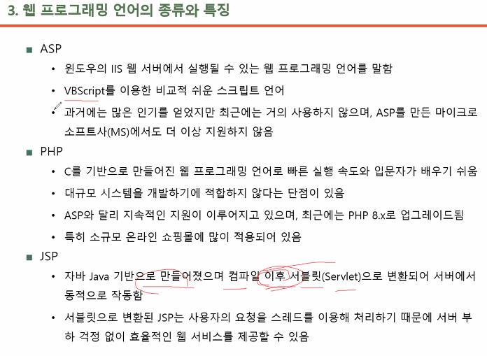

# WWW  
하이퍼 텍스트 : 인터넷에 존재하는 문서와, 문서를 클릭만으로 쉽게 이동할 수 있는 것.  

정적 페이지 : 항상 바뀌지 않고 그대로인 페이지. 말 그대로 웹 문서.  
서버는 변화가 없는 정해진 페이지를 반환함.  

동적 페이지 : 클라이언트의 요청 발생에 따라 항상 변하는 동적 페이지.  
검색, 로그인, 결제 등이 동적 웹 서비스가 필요한 업무.  
이를 구현하기 위해 ASP, PHP, JSP 같은 웹 프로그래밍 언어 등장.  

  

# 웹 서버  
보통 WEB 서버와 WAS(Web Application Server)로 만듦  
WEB 서버는 클라이언트가 요청한 정적 정보를 전달함.(간단한 정보 처리)  
WAS는 DBMS로부터 실시간, 동적 정보를 가져와 가공(조립)하여 전달함(복잡한 정보 처리).  

  

주소/도메인을 통해 웹에 접속, 서버에 있는 file을 요청.  
`/` 뒤에 있는 내용이 file 경로.  

WEB 서버 : 클라이언트의 요청을 가장 먼저 받는 서버.  
요청에 따른 정적 페이지를 응답함.  

WAS는 예를 들어 실시간 날씨 정보를 가져온다 하면, Ajax를 통해 기상청으로부터 실시간 날씨 동적 정보를 가져와 가공하여 Client에게 전달  

WAS가 WEB 역할을 할 수는 있으나, WAS 서버의 부하가 증가할 수 있기 때문에 분리하여 구성함.  
웹 서버 : Apache Server, IIS, Nginx  
웹 애플리케이션 서버 : Tomcat, JBoss, Jeus  

웹을 만들려면 WEB, WAS 서버를 잘 구성하는 것이 중요한데 Spring의 틀을 통해 웹을 제작하기 수월해졌음.  

JAVA는 JVM에서 돌아간다면, WEB-JAVA는 Spring Container에서 돌아감.  

이 file을 만드는 것이, 즉 사용자에게 보여지는 부분을 만드는 것이 Front-end.  
(정적 = front-end, 동적=back-end 인 건 아님.)  

그럼 JSP랑 Spring이랑 뭐가 다른 거임?  
JSP : HTML 문서에 내부적으로 자바 문법을 사용할 수 있게 하는 웹페이지 스크립트 언어.  
Spring Framework : 다양한 개발요소를 빠르게 적용할 수 있게 만들어 놓은 도구  

JSP는 웹 페이지 영역에서 사용되고, Spring은 웹 서비스의 전반적인 환경을 구성함.  
즉 JSP는 Spring을 통해 구죽한 환경의 일부분임.  
<a href="https://velog.io/@asas33/%EC%9B%B9%EA%B0%9C%EB%B0%9C-jsp%EC%99%80-servlet..-%EC%9D%B4%EB%93%A4%EA%B3%BC-spring%EC%82%AC%EC%9D%B4%EC%9D%98-%EA%B4%80%EA%B3%84-%EA%B6%81%EA%B8%88%ED%95%9C%EA%B1%B4-%EB%AA%BB%EC%B0%B8%EC%95%84  ">JSP와 Spring의 차이점</a>  

# 웹서비스의 종류  
웹 서비스는 크게 두 종류로 나뉨.  
`SOAP`와 `REST`  

SOAP(Simple Object Access Protocol)  
XML 기반 메세지 교환을 위한 표준 통신 프로토콜 

REST(Representational State Transfer)  

https://www.techtarget.com/searchapparchitecture/tip/REST-vs-SOAP-Choosing-the-best-web-service#:~:text=Web%20services%20are%20of%20two,such%20as%20HTTP%20and%20SMTP.  

https://aws.amazon.com/ko/compare/the-difference-between-soap-rest/  

---
# 웹서비스 기술 종류  
https://ko.wikipedia.org/wiki/%EC%9C%A0%EB%AA%85%ED%95%9C_%EC%9B%B9%EC%82%AC%EC%9D%B4%ED%8A%B8%EC%97%90_%EC%82%AC%EC%9A%A9%EB%90%98%EB%8A%94_%ED%94%84%EB%A1%9C%EA%B7%B8%EB%9E%98%EB%B0%8D_%EC%96%B8%EC%96%B4%EB%93%A4  

# Front-end  

- Vanilla Javascript  
장점 : 라이브러리나 프레임워크를 사용하지 않기 때문에, 빠르고 호환성이 좋음. 디버깅도 빠름.  
단점 : 간단한 코드도 길어지고, 비효율적임.  

- React  
장점 : 커뮤니티가 방대함. 코드가 직관적이고, 가동성이 좋음.  
단점 : 초기 로딩이 오래걸릴 수 있음.  

- Vue.js  
장점 : 가상 돔(Virtual DOM) 기반 성능 향상,(=변화가 있는 부분만 실제 DOM에 적용하여, 효율적인 렌더링 수행)  
컴포넌트 기반 아키텍처,(=애플리케이션을 작은 재사용 가능한 조각들로 나눌 수 있음. 코드의 가독과 유지보수성 향상)  
양방향 데이터 바인딩(=데이터의 변경 사항, 사용자의 입력이 자동으로 화면에 반영됨.)  
기존 프로젝트에 쉽게 통합할 수 있음(=점진적인 프레임워크. 필요에 따라 기능을 점진적으로 도입할 수 있음).  

단점: 매우 큰 규모의 애플리케이션에서는, 가상 돔 기반 성능에 제약이 있을 수 있음.  
큰 규모의 데이터 처리, 복잡한 상태 관리 등에는 DOM 조작에 대한 추가 비용, 성능 이슈가 발생할 수 있음.   
높은 자바스크립트 번들 크기(=초기 로딩 속도에 영향을 미침)

- Angular  

https://strap.tistory.com/entry/%ED%94%84%EB%A0%88%EC%9E%84%EC%9B%8C%ED%81%AC-React-Vue-Angular-%EC%B0%A8%EC%9D%B4%EC%A0%90

- PWA  

- Canvas

# Back-end  
- Node.js  
V8 Javascript 엔진으로 빌드된 런타임.  
Javascript로 서버 구현을 가능하도록 함.  
단일 스레드의 논 블로킹 IO 이벤트 기반 비동기 방식으로 처리됨.  

장점 : Javascript 언어로 Front-end, Back-end 환경을 모두 구축할 수 있어, 생산성이 높음.  
높은 처리 성능.  
별도의 소프트웨어 없이 동작할 수 있음.  

단점 : 로직이 복잡한 경우, callback hell에 빠질 수 있음.  
단일 스레드이기 때문에, 하나의 작업이 오래 걸릴 경우, 성능이 저하될 수 있음.  
세션을 공유할 경우엔 redis와 같은 부가적인 인프라가 필요함.  

간단한 로직, 빈번한 IO 발생, 비동기 방식에 어울리는 채팅 서비스나 네트워크 스트리밍 서비스에 유용.  

- libuv  
Node.js의 라이브러리 중 하나.  
멀티 스레드 지원. 비동기 I/O를 처리하기 위해 사용할 수 있음.  
단점 : 공유 자원에 여러 스레드가 동시 접근하면, 문제가 발생할 수 있음. (Thread Safe하지 않음.)  

- NPM  

- Cluster.js  

- grunt  

# DB  
- mongoDB  
  
NoSQL, Document 지향 데이터베이스.  
JSON과 유사한 형식인 BSON(Binary JSON)형식으로 데이터를 저장함.  

    Document : 관계형 데이터베이스의 행과 유사함.  
    BSON 형식에 저장도니 필드와 값 쌍으로 구성됨.  
      

장점 : 높은 성능과 확장성 제공  

단점 : 엄격한 트랜잭션 처리를 보장하지 않음.  
모든 용도에 적합하지 않음.  
네이티브 조인을 지원하지 않음.  
대신에 $lookup 연산자를 제공하나, 네이티브 조인에 비해 효율성이 떨어질 수 있음.  

https://colevelup.tistory.com/45  

- PostgreSQL  
객체관계형 DBMS.  
장점 : 기존 데이터 type보다 확장된 형태를 자유롭게 정의할 수 있음.  
상속 기능 제공.  
테이블의 칼럼을, 다차원의 가변적 배열로 정의할 수 있음.  

단점 : MVCC - MGA를 사용하여 동시성 관리를 함. 이로 인해 이전 공간이 재사용될 수 없는 `dead tuple`  
공간으로 두게 됨.  
이러한 현상이 지속될 경우, 공간 부족 및 데이터 IO의 비효율을 유발하여 성능저하의 원인이 됨.  
때문에 주기적으로 `vacuum` 기능을 통해 재사용할 수 있도록 관리해줘야 함.  

MVCC(Multi-Version Concurrency Control) : 튜플을 갱신할 때, 새로운 값으로 재배치하는 것이 아니라,  
새로운 튜플을 추가하고 이전 튜플은 유효 범위를 마킹하여 처리하는 방식.  

- Redis  
(Remote Dictionary Server)  
Python의 Dictionary 구조 (Key, Value)로 비정형 데이터를 저장하고 관리하는 비관계형 DBMS.  
인메모리 데이터 구조(RAM에 데이터를 저장 및 관리하는 방식)를 가진 저장소이다.  

장점 : 속도가 빠름.  
단점 : 서버가 꺼지면 모든 데이터가 사라짐  

https://velog.io/@wpgur4694/Middleware-1  

# Server  

- apache  

- nginx  

- IIS  

- GWS  

