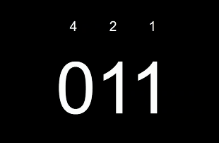

### 이진법  
컴퓨터는 모든 정보를 이진법으로 저장.  

  
2의 0승부 ~~ 2의 n승으로 표현  
각 자리를 비트라고 함.  
8개의 비트는 1 바이트.  

### 선형 검색  
원하는 결과가 나올 때까지 처음부터 끝까지 검색하는 방법.  

정확하지만 비효율적.  

선형 검색은 자료가 정렬되어 있지 않거나 그 어떤 정보도 없어 하나씩 찾아야 하는 경우에 유용합니다.  

정렬은 시간이 오래 걸리고 공간을 더 차지합니다.  
하지만 이 추가적인 과정을 진행하면 여러분이 여러 번 리스트를 검색해야 하거나 매우 큰 리스트를 검색해야 할 경우 시간을 단축할 수 있을 것입니다.