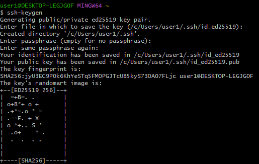

- ssh key  
`ssh-keygen` : ssh 키 생성 명령어  

  

.ssh 폴더에 숨겨진 파일로 생성됨.  

```bash
$ clip < ./id_ed25519.pub
```
`clip` : 선택한 파일을 복사, ctrl+c 하는 기능  

협업을 할 땐, 꼭 pull 한 뒤에 작업할 것.  
또한 내가 작업하는 동안에 새로운 push가 있을 수 있으니, push 직전에도 pull하는 것이 좋음.  

