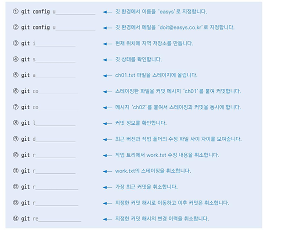

# git 커맨드 명령어  

ctrl+z로 되돌리기 가능  

`git status` : 현재 브랜치, staged, commit 상태 조회  
`git log` : 커밋 로그 조회  
`git log --stat` : 커밋 내역과 함께 로그 조회  
`git log --oneline` : 현재 브랜치 로그를 한 줄로 조회  
`git restore <file>` : staging 되기 전에, 변경 내용을 되돌리는 명령어  
`git reset HEAD` : 최신 커밋을 되돌림  
`git reset --hard <log의 hash>` : 지정한 log로 되돌아가고, 이후 commit들은 삭제  

`touch 파일명` : 파일명만 지정하여 파일 생성  
`rm 파일명` : 해당 파일 삭제  

`pull` : 커밋 내역과 파일을 함께 내려받음  
`fetch` : 커밋 내역만 내려받음  

## ls  
경로 내 파일들을 표시하는 명령어  
옵션을 통해 표시 방식을 지정할 수 있음.  

옵션 종류 :  
<table border="1" cellpadding="10">
    <thead>
        <tr>
            <th>명령</th>
            <th>설명</th>
        </tr>
    </thead>
    <tbody>
        <tr>
            <td>-a</td>
            <td>숨긴 파일, 디렉토리도 표시.</td>
        </tr>
        <tr>
            <td>-l</td>
            <td>상세 정보도 표시.</td>
        </tr>
        <tr>
            <td>-r</td>
            <td>파일의 정렬 순서를 거꾸로 표시.</td>
        </tr>
        <tr>
            <td>-t</td>
            <td>수정 일자 순으로 (내림차순) 표시.</td>
        </tr>
    </tbody>
</table>

## vim의 ex 모드 명령  
vim 파일명 : 파일을 편집하는 모드로 진입  

<table border="1" cellpadding="10">
    <thead>
        <tr>
            <th>명령</th>
            <th>설명</th>
        </tr>
    </thead>
    <tbody>
        <tr>
            <td>:w 또는 :write</td>
            <td>편집하던 문서를 저장</td>
        </tr>
        <tr>
            <td>:q 또는 :quit</td>
            <td>편집기를 종료</td>
        </tr>
        <tr>
            <td>:wq</td>
            <td>편집하던 문서를 저장하고 종료</td>
        </tr>
        <tr>
            <td>q!</td>
            <td>편집하던 문서를 저장하지 않고 종료. .swp 임시파일이 생김</td>
        </tr>
        <tr>
            <td>:wq 파일명</td>
            <td>편집하던 문서를 지정한 이름으로 저장.</td>
        </tr>
    </tbody>
</table>

## cat 명령  

<table border="1" cellpadding="10">
    <thead>
        <tr>
            <th>명령</th>
            <th>기능</th>
        </tr>
    </thead>
    <tbody>
        <tr>
            <td>$ cat file</td>
            <td>file의 내용을 화면에 표시.</td>
        </tr>
        <tr>
            <td>$ cat file(s) > Newfile</td>
            <td>file(s)을 차례로 연결해서 새로운 파일인 Newfile을 생성.</td>
        </tr>
        <tr>
            <td>$ cat file >> file2</td>
            <td>file1의 내용을 file2의 내용 끝에 연결.</td>
        </tr>
    </tbody>
</table>

---

  

1. git config user.name "easys"
2. git config user. "doit@easys.co.kr"
3. git init
4. git status
5. git add ch01.txt
6. git commit -m "ch01"
7. git commit -am "ch02"
8. git log
9. git diff
10. git restore work.txt
11. git restore --staged work.txt
12. git reset HEAD
13. git reset --hard 커밋아이디
14. git revert 커밋아이디  

