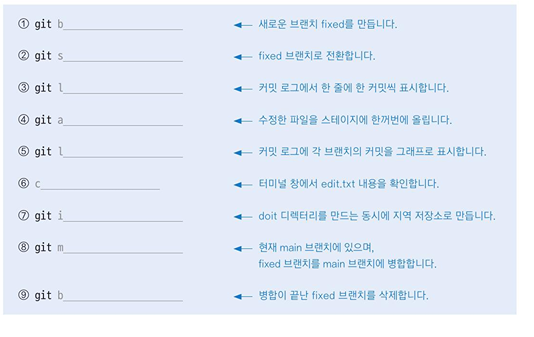

# Branch  
브랜치는 버전, 코드의 복사본, 분기점 등으로 생각할 수 있음.  

main/master 브랜치가 주 분기점.  

개발하면서 고객의 요구사항에 따라 프로그램 형태가 달라질 수 있는데,  
branch를 통해 1안 2안 3안같이 나눌 수 있음.  

`git branch <브랜치명>` : 브랜치 생성  
`git branch` : 현재 브랜치 위치와 브랜치 목록 조회  
`git log --oneline` : 현재 브랜치 로그를 한 줄로 조회  
`git log branches` : branch 마다의 최신 로그를 조회  
`git log --oneline --branches` : 한 줄로 branch별 최신 로그 조회  
`git log --oneline --branches --graph` : 그래프로 한줄로 branch별 최신 로그 조회  
`git log <브랜치명1>..<브랜치명2>` : 브랜치1엔 없는 브랜치2의 commit 로그를 조회  

`git switch <브랜치명>` : 해당 브랜치로 이동  
`git merge <브랜치명>` : 해당 브랜치를 현재 브랜치에 병합  
`git branch -d <브랜치명>` : merge한 브랜치 삭제  
`git branch -D <브랜치명>` : merge하지 않은 브랜치도 삭제가능  

  

1. git branch fixed  
2. git switch fixed  
3. git log --oneline  
4. git add .  
5. git log --graph  
6. cat edit.txt  
7. git init doit  
8. git merge fixed  
9. git branch -d fixed  

