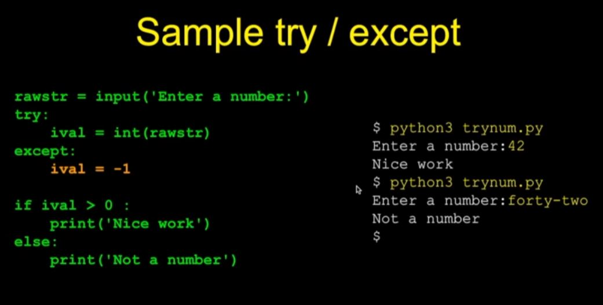
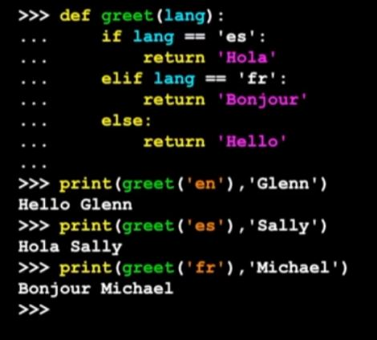
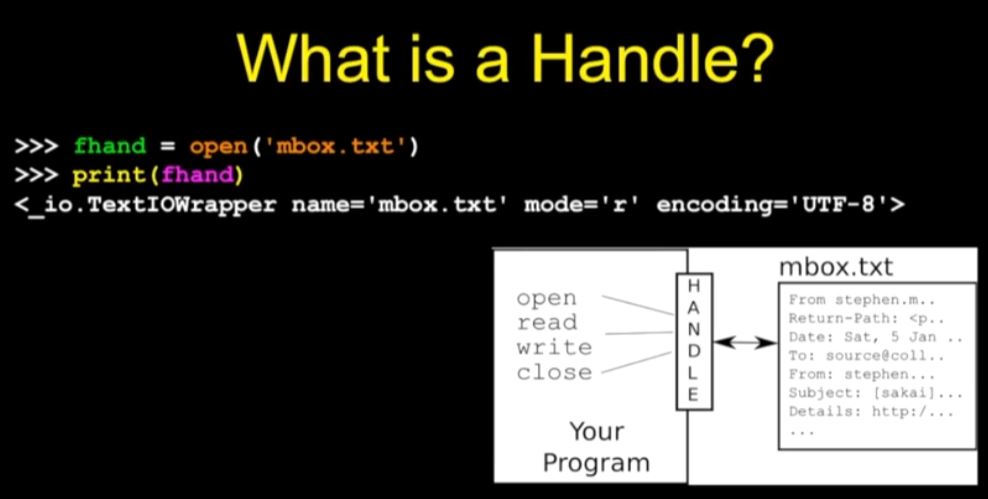
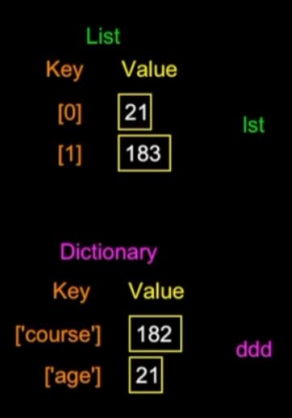
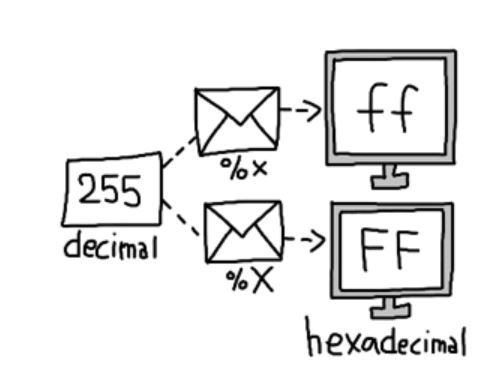

print() - 출력  
type() - 자료형 종류 출력  

format(수, ".nf") - 실수의 소수점 n번째 자리까지 출력.  


type(123) // <class 'int'>  

`파이썬3에선 정수 나눗셈을 해도 소수점 (float) 값을 출력  
단, //로 정수값 출력 가능.`

`input() - ()안에 값을 출력한 후, 사용자의 입력을 기다림.`  
`입력받은 내용을 문자열로 반환함.`

```python
name = input('Who are you? ')
print(`Welcome`, name)
```

파이썬은 {}를 사용x. 
:와 들여쓰기를 사용함.  
```python
x=5
if x>2 :
    print("x는 2보다 크다")
```
else if 는 `elif`로 작성.

`try except`  
오류가 나면 traceback이 뜨며 오류 아래로는 작동되지 않음  
오류가 날만한 문장 앞에 try를 쓰고, except로 오류가 났을 때 원하는 값을 반환하도록 하게 할 수 있음.  
`try 안의 문장은 다시 실행되지 않음!!`  
오류가 난 문장 아래는 모두 건너뜀.
```
    try:
        //위험한 문장
    except:
        //오류가 났을 때 실행할 문장
```



# 함수, 메서드
`def` 함수 정의
```
def 이름(매개변수):
    // 기능
```
호출  
```
함수이름(매개변수)  
```

`max, min` 함수  
가장 큰 / 작은 값을 반환.
```python
big = max('Hello world')    // 'Hello world' 에서 가장 값이 큰 w를 반환, big에 저장
print(big)                  // big을 출력
w                           

tiny = min('Hello world')
print(tiny)
                            // 공백
```
  

---
return문 예시  


# 반복문  
`while, for`  

`break` - 루프에서 벗어나게 함. break 아래 문장들은 실행 X.   
`continue` - 맨 위 문장으로 다시 올라가게 함. continue 아래 문장들은 실행 X.  

```python
# while문
n = 5
while n > 0
    print(n)
    n = n -1
print("Done!")
```

```python
# for문
for i in [5, 4, 3, 2, 1]:
    print(i)
print("Done!")

//

list = ['fighter', 'shooter', 'magician']
for userclass in list:
    print("We have ", userclass)
print("Please select your class")
```

### 상수 `None`
null과 같음. 비어있음을 나타냄.  

### 연산자 `is`, `is not`  
자료형, 값이 같으면 true, 아니면 false  
== 는 값만 같으면 true
```
0 is 0.0 // false
0 == 0.0 // true
```
## 문자열 메서드  

### `len()`  
() 안 문자열 "배열 길이 반환" 함수  

### `.lower()`, `.upper()`
소문자 / 대문자로 변환  

### `dir()`  
사용 가능한 모든 메서드 나열  

### `.find()`  
`앞의 문자열` 내에서 `() 안에 적은 문자열`을 탐색 후 해당 `인덱스 값` 반환  
(해당 문자열이 없으면 `-1`을 반환함.)  

### `.replace()`  
.replace(x,y) 문자열 내에 x를 y로 바꾼 후 반환  

### `.lstrip()` `.rstrip()`, `.strip()`  
왼쪽 공백 제거, 오른쪽 공백 제거, 양쪽 공백 제거  
(문자열 사이 공백은 제거 X.)  

### `.startwith()`  
`앞에 문자열`이 `() 안에 적은 특정 문자열`로 시작하는지 확인 후 bool값 (true of false) 반환.  
(대소문자 구분.)  

# 파일  
### `open()`  
open(파일명, 모드)  
모드 - r : read 읽기. 파일에 영향을 주지 않음.  
    - w : write 쓰기. 파일에 영향을 줌.  

handle(핸들)을 반환함.  
변수에 핸들을 저장하여 사용.  
```
fhand = open('mbox.txt','r')
```

핸들이란? 파일에 접근하는 걸 도와주는 "창구"  
참조변수.  

#### 개행문자 \n  
줄바꿈 문자. 문자 하나로 취급.  

# `컬렉션 (Collection)`

## `배열 (list)`  
순서대로 정리 된 컬렉션.  
데이터 삽입은 항상 배열의 끝에서 일어남.

#### `.append()` 메서드  
배열에 원소를 추가  

#### `in`,`not in` 연산자  
`어떠한 값`이 `배열` 안에 있는지 확인 후 T/F 반환  

#### `.sort()` 메서드  
배열 정렬  

#### `max` `min` `sum` `len`  
배열 내 최댓값  
배열 내 최솟값  
배열 원소들의 합  
배열의 길이  

#### `.split()` 메서드  
문자열을 공백 기준으로 끊어 배열로 반환.  
()안에 기호를 넣어 해당 기호를 기준으로 끊을 수도 있음.  
```python
line = 'first;second;third'
thing = line.split(;)
print(thing)
>>> ['first', 'second', 'third']
```

## `딕셔너리 (Dictionary)`  
리스트와 달리 순서가 없음.  
key라는 것이 존재함. 물건에 포스트잇을 붙이는 것과 같음.  
생성자 <span style = "color:turquoise">dict()</span> 로 생성.  
또는 abc = {} 로도 생성 가능.  

```python
lst = list()
lst.append(21)
lst.append(183)
print(lst)
>>> {21, 183}

ddd = dict()
ddd['course'] = 182
ddd['age'] = 21
print(ddd)
>>> {'course': 182, 'age': 21}
```
#### 리스트와 딕셔너리의 차이점   
리스트는 인덱스와 값 사이에 연결 관계가 있음.  
딕셔너리는 키와 값이 연결됨.  

  

### 연관 배열(Associative Arrays)  
키와 값이 연결되는 개념을 `연관 배열`이라고 함.  
리스트보다 강력하고 유연함.  

#### 다른 이름의 연관 배열  
property maps : Perl / PHP  
hash maps : Java  
property bags : C# /  .Net  

### `.get()` 메서드  

여러 단어의 수를 셀 때, `특정 단어`가 딕셔너리에 존재하는지를 판단한 뒤에,  
존재하면 키의 값을 반환하고, 존재하지 않으면 `지정 값`을 할당하는 메서드.  
괄호 안에 특정 단어와 지정 값을 써넣음.  

.get('word',0)

```python
if word in dictionary:
    value = dictionary[word]
else :
    value = 0

value = dictionary.get(word, 0)

>>> 둘 다 같은 기능을 함.
dictionary에 word가 있을 경우에, word의 값을 반환.  
없을 경우엔 word에 0 값을 할당.
```

딕셔너리는 list로도 반환될 수 있음. (값은 나타나지 않음)  
print list(dictionary)  
.keys()로 키만 반환.  
.values()로 값만 반환.  
.items()로 키와 값 반환.  

## 함수 

#### `sep=()`  ()안 내용으로 구분하여 문자 출력.  
'' 공백으로 할 시엔 붙여서 출력.  
```
print(10, 20, sep=(':'))
>>> 10:20
```
#### `ord()`  
() 안 값을 10진수로 변환 후 반환.  
```
n = ord(input())
>>> 입력받은 값을 10진수로 변환 후 n에 저장
```
#### print 표시  
print('%x'%n)  
n을 16진법으로 표시  
%o : 8진법  
%d : 10진법  

  
